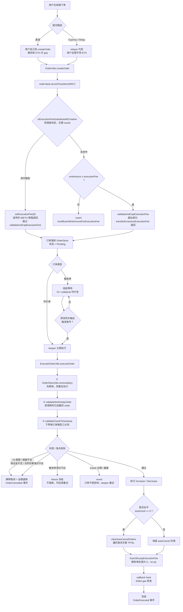
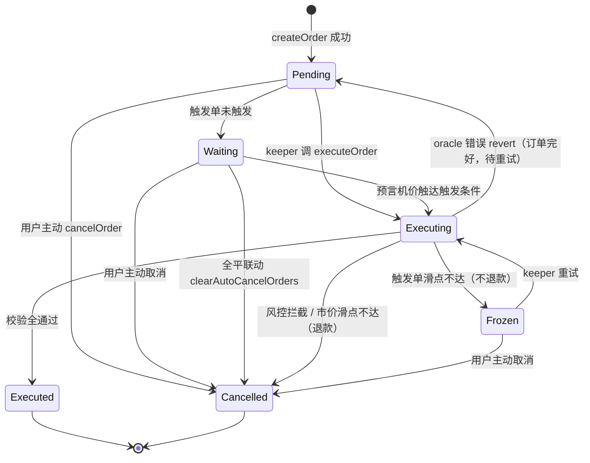

# FX100 Order 订单流程图与需求简介

> 整理日期：2026-07-30
> 来源：Gordon / FX100 Notion 归档文档（66 份）中与 order、pricing、v0.3.1 和审计相关的最新页面
> 用途：给前端 / 测试 / 新人快速建立订单全链路认知

**主要来源文档**：
| 文档 | 贡献内容 |
|---|---|
| `2026-07-02_fx100-trading-guide.zh.md` | 订单类型语义、执行价公式、滑点规则、触发单哨兵语义 |
| `2026-05-31_FX100-Limit-Stop-订单精确账本测试设计规范.md` | 4 类触发单的精确 max/min 触发条件、账本影响 |
| `2026-05-28_Order-模块集成测试完成报告(T26-T32).md` | executeOrder 内部时序、重复执行防护、graceEnd 计算、autoCancel 清理 |
| `2026-07-22_FX100-执行费豁免前移到创建期+免Gas开仓-改造规范(实施版-2026-06-14).md` | createOrder 双阈值豁免分支、BUG-B03、Express/Relay 路径 |
| `2026-07-15_FX100-Oracle-体系设计分析与风险测试规范(2026-07-15).md` | oracle 故障时的 revert vs freeze 语义、时间窗校验 |
| `2026-05-31_FX100-风控边界测试设计规范(2026-05-31).md` | 风控拦截 → 静默取消 + 退款 |
| `2026-06-16_E2E-精确账本测试——手工核对清单.md` | RC1~RC5 风控拦截用例 |
| `2026-06-03_清算保护-UX-—-前端交接文档(2026-06-03-更新).md` | grace 保护期与前端状态机 |
| `2026-07-29_Dynamic-Spread-允许为负+清算-ADL-隔离实施方案.md` | 普通交易允许负 spread、强制平仓隔离（待评审） |
| `2026-07-30_FX100-Zenith-外部审计初步发现核对（4条）.md` | R5-B01 / R5-B02 清算链路新风险 |

---

## 一、订单类型总览

FX100 **没有订单簿**。所有订单最终都以「预言机价 ± 动态点差」成交。触发单只是「条件满足 → 转市价成交」的封装。

| 前端叫法 | 合约枚举 | 方向 | 触发时机 | 可设滑点？ |
|---|---|---|---|---|
| 市价开仓 | `MarketIncrease` | 开仓 | 立即 | ✅ 可 |
| 市价平仓 | `MarketDecrease` | 平仓 | 立即 | ✅ 可 |
| 限价开仓（抄底） | `LimitIncrease` | 开仓 | 价格**跌到**触发价 | ❌ 哨兵 |
| 突破开仓（追涨） | `StopIncrease` | 开仓 | 价格**涨到**触发价 | ❌ 哨兵 |
| 止盈平仓 | `LimitDecrease` | 平仓 | 价格**涨到**触发价（多头） | ❌ 哨兵 |
| 止损平仓 | `StopLossDecrease` | 平仓 | 价格**跌到**触发价（多头） | ❌ 哨兵 |
| 清算 | `Liquidation` | 平仓 | keeper 判定可清算 | — |

### 1.1 精确触发条件（合约口径）

> ⚠️ 交易指南里写的是「预言机 ≤ / ≥ 触发价」的简化表述；**合约实际用的是 oracle 的 min/max 双价**，测试断言必须按下表。

| 订单类型 | 中文 | 多头触发条件 | 空头触发条件 |
|---|---|---|---|
| `LimitIncrease` | 抄底 | `max ≤ triggerPrice` | `min ≥ triggerPrice` |
| `StopIncrease` | 追涨 | `max ≥ triggerPrice` | `min ≤ triggerPrice` |
| `LimitDecrease` | 止盈 | `min ≥ triggerPrice` | `max ≤ triggerPrice` |
| `StopLossDecrease` | 止损 | `min ≤ triggerPrice` | `max ≥ triggerPrice` |

### 1.2 acceptablePrice 规则

```plain
市价单：  acceptablePrice = execPrice · (1 ± slippage)
          开多 / 平空:  · (1 + slippage)   （最差价更高）
          开空 / 平多:  · (1 − slippage)   （最差价更低）

触发单：  恒为哨兵值 = 「接受任何市价」
          开仓:  long → MaxUint256 ,  short → 0
          平仓:  long → 0          ,  short → MaxUint256
```

**两条必须传达给用户的规则**：
1. **触发价 ≠ 成交价上下限**。挂 \$200 限价开多，触发后按市价成交，实际成交价 = 预言机价 ×(1+点差)，**可能略高于 \$200**。这是刻意设计——保证止损单在剧烈行情中一定能成交。
2. **触发单不支持最大滑点**。前端若显示滑点字段，对触发单不生效。

---

## 二、订单全生命周期流程图



---

## 三、创建期（createOrder）需求详解

### 3.1 执行费双阈值豁免

**设计目标**：大额订单**创建时就不收 WETH 执行费**，而不是「先收后退 / 先收后卡死」。

| Key | 单位 | 适用 mode | 状态 |
|---|---|---|---|
| `EXECUTION_FEE_SUBSIDIZE` | USD 1e30 | `isSizeDeltaUsd = true` | 已有，保留不动 |
| `EXECUTION_FEE_SUBSIDIZE_SIZE` | index token 原生单位 | `isSizeDeltaUsd = false` | 新增 per-market key |

```solidity
if (isSizeDeltaUsd) {
    usdThreshold = getUint(executionFeeSubsidizeKey(marketIndex));
    if (usdThreshold == type(uint256).max) return false;   // 关闭态短路
    return sizeDelta >= usdThreshold;
} else {
    sizeThreshold = getUint(executionFeeSubsidizeSizeKey(marketIndex));
    if (sizeThreshold == type(uint256).max) return false;
    return sizeDelta >= sizeThreshold;
}
```

**两个关键设计点**：
- 两个阈值都用**原生单位直接比较**，创建期**不需要 oracle 价格**
- 治理需保证 `sizeThreshold ≈ usdThreshold / 参考价`，否则用户可挑门槛更低的 mode 蹭免费执行

> 🚨 **部署红线**：源码里新 key 默认 `MAX`（关闭），但**部署脚本兜底未完成**——两键缺省 0 = 全量豁免。部署 checklist 必须显式配置两键（对应交接文档 C1）。

### 3.2 BUG-B03 的根因与修复

**改造前**（豁免在执行期）：
```
创建期 validateExecutionFee 不看 size → 大单也被强制预付 WETH
执行期命中补贴 → executionFee 局部变量置 0 → payExecutionFee(0) 首行 return
→ 用户预付的 WETH 既不付 keeper、也不退用户 → 永久卡死 OrderVault
```

**改造后**：豁免前移到创建期，执行期整段 size 判定块**删除**。豁免单的 `order.executionFee()` 本就是 0，不存在残留场景。

### 3.3 keeper 补偿的悬空问题

`executionFee = 0` 意味着执行该订单的 keeper 链上拿不到补偿：

| 路径 | 谁付执行 gas | 结论 |
|---|---|---|
| 直连（用户自发 + 公共 keeper） | 无人补偿 | ⚠️ 大额订单可能挂着不成交 |
| Express（relayer 垫付 WETH） | relayer | 方案 B1，2026-06-15 定稿 |

---

## 四、执行期（executeOrder）需求详解

### 4.1 内部时序（重复执行防护）

```plain
① OrderStoreUtils.remove(key)          ← 第一步就移除
② validateNonEmptyOrder(order)         ← 用调用时已加载的 order 副本

→ 第一次执行后 key 已从 store 移除
→ 第二次 executeOrder(key) 加载到空 order → revert EmptyOrder
```

### 4.2 oracle 时间窗下界三分流

`DecreaseOrderUtils.validateOracleTimestamp` 的下界**按订单类型分流**，三条语义完全不同：

| 订单类型 | 时间窗下界 | 语义 |
|---|---|---|
| 市价单 | `orderUpdatedAtTime` | 常规时效 |
| 限价 / 止损减仓单 | `validFromTime` | 兼防前跑 |
| 清算单 | `max(positionIncreasedAtTime, positionDecreasedAtTime)` | **资金安全守卫**——用户刚补保证金后，keeper 不得用补仓前的旧价清算 |

### 4.3 失败语义三分（前端提示必须区分）

| 失败原因 | 合约行为 | 资金 | 前端应提示 |
|---|---|---|---|
| 风控拦截（OI/储备/保证金/仓位上限） | 静默取消 | ✅ 全额退款 | 「订单已取消，资金已退回」+ 具体原因 |
| 市价单滑点不达 | 取消 | ✅ 退款 | 「实际执行价超出你设的最大滑点」 |
| 触发单滑点不达 | **freeze 冻结** | ❌ 不退款 | 「订单已冻结，可稍后重试」 |
| oracle 过期 / 偏离 / sequencer 故障 | **revert（非 freeze）** | 订单不受影响 | 「价格源暂不可用，稍后自动重试」 |

> oracle 错误在 `OrderHandler.validateNonKeeperError()` 中被识别为**非用户错误**，直接 revert 而非 freeze 订单——订单本身完好，恢复后可继续执行。

### 4.4 风控拦截清单（E2E RC1~RC5）

| 用例 | 拦截条件 | 结果 |
|---|---|---|
| RC1 | `maxOpenInterest` 已满 | OI 不变，退款，零和 |
| RC2 | OI 超 `reserveFactor × poolValue` | OI 停在上限，退款 |
| RC3A | 抵押 < `minCollateralFactor` 要求 | OI=0，退款 |
| RC4 | 单仓超 `MAX_POSITION_SIZE_USD` | 取消 |
| RC5 | `MAX_PNL_FACTOR` 拦截开仓 | ⏸ **待合约实现（vm.skip）** |

### 4.5 全平联动 autoCancel

```plain
MarketDecrease 全平 → sizeInUsd = 0
  → ExecuteOrderUtils 检测 sizeInUsd == 0
  → clearAutoCancelOrders 遍历并取消该仓位的 autoCancel 订单（TP/SL）
验证：再执行已被取消的 slKey → revert EmptyOrder
```

生产常量 `MAX_AUTO_CANCEL_ORDERS = 64`（测试夹具缩水到 2~3，真实上界的批量撤销 gas 可行性仍未验证）。

### 4.6 graceEnd 计算（清算保护期）

```plain
graceEnd = block.timestamp + gracePeriodBase × tierMultiplier / WEI_PRECISION

Tier=0：multiplier = 8e18 ，base = 15s → graceEnd = now + 120s
Tier=1：multiplier = 16e18，base = 15s → graceEnd = now + 240s
```

**三条关键规则**：
- 只在**新开仓**时计时，**加仓不重置也不延长**
- 保护期只限制 **keeper 清算**；用户自己平仓、部分减仓完全不受影响
- 想重新获得完整保护窗口，需**先平仓再重开**（会再产生一次开 / 平仓费）

> ⚠️ `LIQUIDATION_GRACE_PERIOD_BASE` 若配为 0，前端 `hasGrace = false`，所有仓位显示 Safe 且不倒计时。部署必须确认非零。
> ⚠️ **grace 不防 ADL**：`executeAdl` 路径不经 `createLiquidationOrder` 的 graceEnd 检查（交接文档 C14，待 Gordon 确认设计意图）。

---

## 五、定价与执行价需求

### 5.1 执行价公式

```plain
useMax    = (open & long) OR (close & short)
execPrice = useMax ? ceil ( indexAsk · (1 + totalSpread) )
                   : floor( indexBid · (1 − totalSpread) )
```

- 开多 / 平空取 **ask 侧、向上取整**；开空 / 平多取 **bid 侧、向下取整**
- 当前 release 的取整方向对交易者不利。
- **07-29 最新待评审方案**允许普通交易的 Dynamic Spread 为负，因此最终成交价可能优于 oracle；清算 / ADL / 仓位安全校验仍不得使用负 spread。

### 5.2 动态点差三段构成

```plain
rawSpread = constantSpread + depthSpread + skewImpact

当前 release：
totalSpread = max(0, rawSpread)

07-29 最新目标：
普通交易  = clamp(MIN_DYNAMIC_SPREAD, MAX_DYNAMIC_SPREAD, rawSpread)
清算/ADL/安全校验 = max(0, rawSpread)

depthSpread = max( exp(orderSize · k / depth) − 1 , orderSize / depth ) / 100
```

| 分量 | 含义 | 方向 |
|---|---|---|
| 常量点差 | 每市场固定基础点差（如 0.01%） | 恒为正 |
| 深度点差 | 随订单规模增大而增大，小单接近 0 | 恒为正 |
| 偏斜冲击 | 站较轻一侧改善失衡 → **为负（占便宜）**；加剧失衡 → 为正 | 可正可负 |

> 🚨 **depth 缺省 0 时 `getPriceImpactSpread` 短路返回 0 = 价格冲击静默失效**。且 `ask/bidOrderBookDepthKey` 不在 Config allowedBaseKeys，只能 DataStore 直写、无治理事件（交接文档 C11）。
>
> 🚨 **R5-B02（P0）**：`exp` 的指数在调用前没有上限，旧 cap 在 `exp` 之后才执行。低深度市场 + 中等订单即可使清算判定 revert，必须在 `exp` 前封顶。

### 5.3 触发单执行价的账本影响

| 维度 | MarketOrder | Limit/Stop Order |
|---|---|---|
| 执行价格 | 订单**创建时**的 oracle 价 | **触发时**的 oracle 价 |
| `sizeInTokens` | `SIZE / creationPrice` | `SIZE / triggerPrice` |
| PnL 基准 | 关仓时 oracle 价 | `triggerPrice` |
| 等待期 | 无 | 订单挂起，**OI / collateral 均不变** |

---

## 六、需求简介（功能清单）

### 6.1 合约侧已实现

| # | 需求 | 状态 |
|---|---|---|
| R-ORD-01 | 7 类订单（市价开平 + 4 类触发单 + 清算）完整支持 | ✅ |
| R-ORD-02 | 触发单一律按市价成交，acceptablePrice 用哨兵值 | ✅ |
| R-ORD-03 | 市价单支持最大滑点保护，超出则取消退款 | ✅ |
| R-ORD-04 | 执行价 = oracle 价 ± 三段动态点差 | ✅ 当前非负；负 spread 目标方案待评审 |
| R-ORD-05 | 执行费豁免前移到创建期，双阈值（USD + token-size） | ✅ src 已实现 |
| R-ORD-06 | 豁免单误传 WETH 原路退回 cancellationReceiver | ✅ |
| R-ORD-07 | 重复执行防护：先 remove 后 validate | ✅ |
| R-ORD-08 | oracle 时间窗下界按订单类型三分流 | ✅ |
| R-ORD-09 | 全平自动清理 autoCancel 订单（TP/SL） | ✅ |
| R-ORD-10 | 新开仓 15 分钟清算保护期，加仓不重置 | ✅ |
| R-ORD-11 | 风控拦截统一走「静默取消 + 全额退款」 | ✅ |
| R-ORD-12 | oracle 故障走 revert 而非 freeze，订单完好 | ✅ |
| R-ORD-13 | Express / Relay 免 Gas 开仓（relayer 垫付 WETH） | ✅ 方案 B1 |

### 6.2 待办 / 悬空

| # | 事项 | 阻塞点 |
|---|---|---|
| P-01 | 部署脚本两阈值键显式配置兜底 | 缺省 0 = 全量豁免（C1） |
| P-02 | 公共 keeper 对 fee=0 订单的补偿机制 | §四 A/B 方案未定，大单可能挂着不成交 |
| P-03 | `MAX_PNL_FACTOR` 开仓侧拦截 | RC5 待合约实现 |
| P-04 | token 模式超额保证金退款 | R3-B01 待合约 |
| P-05 | `orderBookDepth` 补进 Config 治理路径 | C11 |
| P-06 | `executeAdl` 是否加 grace 检查 | C14 设计意图待确认 |
| P-07 | 64 条 autoCancel 批量撤销的 gas 可行性 | 测试夹具常数缩水，真实上界未验 |
| P-08 | R5-B02 Price Impact 指数无前置上限 | P0，可能阻断清算 |
| P-09 | R5-B01 清算判定忽略 balanceWasImproved 费率档 | 可能高估费用、提前清算 |
| P-10 | R4-B03 minOutputAmount 未接入执行路径 | 内外审计双重确认 |
| P-11 | Dynamic Spread int256 + ADL SecondaryOrderType | 待评审实施 |

### 6.3 前端需求要点

| # | 需求 | 依据 |
|---|---|---|
| F-01 | 下单预览必须显示预计执行价（含点差），不能只显示 oracle 中间价 | 点差使成交价必然略差于中间价 |
| F-02 | 触发单的滑点字段应置灰或隐藏，并提示「触发后按市价成交」 | 滑点仅对市价单生效 |
| F-03 | 触发单方向（限价 vs 突破）按触发价与现价关系**自动判断**，不让用户手选 | 从根源避免设错方向 |
| F-04 | 订单失败提示需区分「取消已退款」/「冻结未退款」/「价格源不可用」三类 | 见 §4.3 |
| F-05 | 保护期倒计时从 `position.graceStart / graceEnd` 实时推导，不单独维护 timer | 见 §4.6 |
| F-06 | 加仓不延长保护期，需在 UI 明示；提供「平仓后重开」的 Roll 入口 | 见 §4.6 |
| F-07 | Pay 栏标「USDC」、Size 栏标「USD」，避免用户混淆 | 见字段计算公式文档 |
| F-08 | 最大杠杆显示留 buffer（如 99.9x），避免 100x 因费用扣除而失败 | 见字段计算公式文档 |
| F-09 | Price Impact 支持正/负值；负值显示 rebate，不能再 floor 为 0 | 07-29 最新文案与实施方案 |

---

## 七、订单状态机



---

## 八、测试关注点速查

| 领域 | 关键断言 | 对应模块文件 |
|---|---|---|
| 触发条件 | 4 类触发单 × 多空 = 8 组 max/min 边界 | `cases/modules/order.md` |
| 执行价 | ceil/floor、四象限 acceptablePrice、普通交易负 spread、强制平仓 floor-at-0 | `cases/modules/spread.md` |
| 执行费 | 双阈值命中 / 未命中、误传 WETH 退回、cap 逻辑 | `cases/modules/execution_fee.md` |
| 时间窗 | 三分流下界，尤其清算单的 `max(inc, dec)` 守卫 | `cases/modules/order.md` |
| autoCancel | 全平联动清理、64 条上限、批量 gas | `cases/modules/autocancel.md` |
| grace | tier 乘法公式、加仓不重置、只限 keeper | `cases/modules/grace.md` |
| 失败语义 | cancel vs freeze vs revert 三分，退款与否 | `cases/modules/order.md` |
| 风控拦截 | RC1~RC5 五条，均需断言零和 | `cases/modules/oi.md` |
| 清算定价安全 | R5-B01 fee tier、R5-B02 exp 前置封顶 | `cases/modules/liquidation.md` |
| 有符号数据链路 | Event / Reader / SDK / Indexer 正确解析 int256 spread | `cases/modules/spread.md` |
