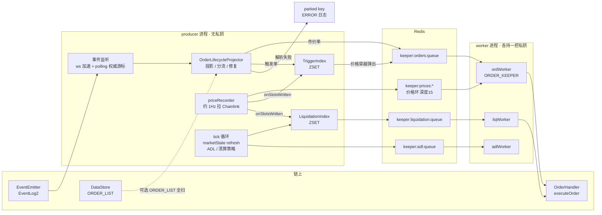
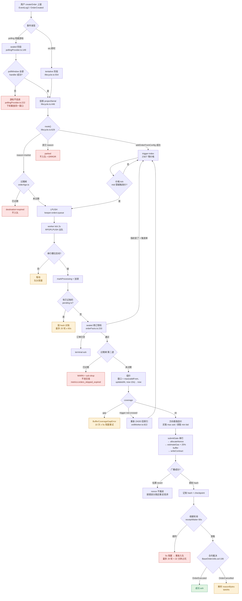
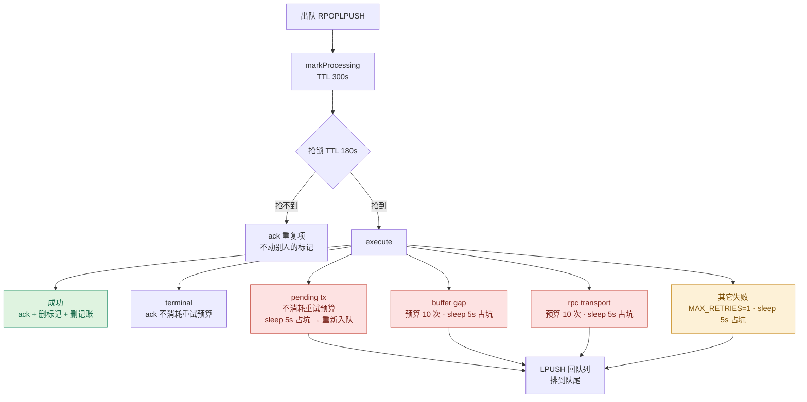
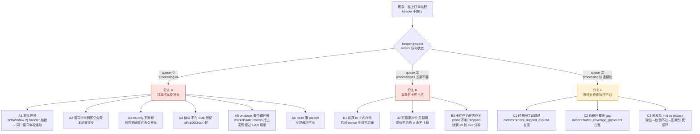

# Keeper 执行流程图与「create 成功 / execute 堆积」故障树

> 日期：2026-09-05 ｜ 被测：`Github/fx100-apps@develop/apps/keeper`，HEAD **`1912f460`**（2026-09-05 08:54）
> 方法：只读源码推导，所有判断标 `文件:行号`；本机 `yarn vitest run` = **52 文件 / 709 用例全 PASS**
> 适用症状：用户 createOrder 3～4s 内成功上链，keeper 的 executeOrder 迟迟不落，链上未执行订单持续堆积
> 注意：本文对应 HEAD `1912f460`。9-03 那份速度/准确率报告基于 `6396362f`，两天内 keeper 进了 14 个提交 / +7434 行，读旧报告时以本文的行号为准

---

## 0. 先看一眼：订单从「上链」到「被执行」要过 8 道关

任何一道关不通，链上订单就会堆积，而且**大多数关卡失败时不产生任何交易**——所以「execute 堆积」不等于「execute 交易卡住」。

| # | 关卡 | 位置 | 不通过的后果 |
|---|---|---|---|
| 1 | 事件发现 | `providers/pollingProvider.ts` / `hybridProvider` / `websocketProvider` | 订单从未进入 keeper，队列是空的 |
| 2 | 生命周期投影 + 分流 | `domain/orders/lifecycle.ts:629-652` | 落 `parked`，不入任何队列 |
| 3 | 市价单过期闸（producer 侧） | `domain/orders/orderAge.ts` | `destination: 'expired'`，不入队 |
| 4 | 触发单索引弹出 | `chain/triggerIndex.ts:243, 278-282` | 挂在 ZSET 里等价格，不入队 |
| 5 | 队列出队 + 串行槽位 | `infra/workerRunner.ts:247, 272` | 排队等待 |
| 6 | sealed 修订预检 + 过期闸（worker 侧） | `domain/orders/orderFacts.ts:233-274`、`ordWorker.ts` 过期闸 | ack-drop，**不发交易** |
| 7 | 组价 + 触发校验 | `ordWorker.ts:352-371`、`chain/minMaxPriceSelector.ts:145-167` | coverage gap 重试 / 重新回索引 |
| 8 | nonce → 估 gas → 广播 → 收据 | `ordWorker.ts:880-899`、`chain/nonceAllocator.ts`、`chain/receiptWaiter.ts` | 交易卡内存池，**后续 nonce 全堵** |

---

## 1. 进程与队列拓扑



要点：

- **producer 无私钥**，只做发现、投影、索引、策略；所有上链写操作在 worker。
- **worker 严格串行**：`inFlight` 布尔量保证一次只处理一条（`workerRunner.ts:247, 253-256`）。吞吐 = 1 ÷ 单条耗时。
- 扩容只能加分片，且**每分片必须一把独立私钥**；同一把私钥跑两个进程会撞 nonce（`chain/submitGate.ts` 的边界说明）。

---

## 2. 主链路：OrderCreated → executeOrder



---

## 3. worker 单条目状态机（占坑时长是关键）

串行槽位被占多久，直接决定队列排不排得动。



**三个预算共用同一段阻塞式退避**（`infra/workerRunner.ts:534` 的 `await sleep(delay)`），而这一句发生在 `inFlight = true` 期间——**整条队列停摆，不只是这一条**：

| 情形 | 预算 | 单次退避 | 最坏占坑 |
|---|---|---|---|
| pending tx 未出收据 | 20 轮 `KEEPER_TX_RECONCILE_MAX_ATTEMPTS` | 60s 收据 + 5s sleep | **≈22 分钟** |
| 价格环覆盖不到窗口 | 10 | 5s | 50s |
| RPC 传输故障 | 10 | 5s | 50s |
| 其它 | `MAX_RETRIES=1` | 5s | 5s |

而且退避睡醒后是 `LPUSH` 回队列头、消费端 `RPOPLPUSH` 从尾取——**该条目本来就排到队尾了**，这段 sleep 对它自己毫无意义，纯粹是拿整条队列陪绑。

---

## 4. 故障树：create 成功但 execute 堆积

先用一个观察把 12 条路径切成三支。执行 `yarn keeper:inspect`，看 `orders` 行：



### 分支 A — 订单根本没进来（队列是空的）

| ID | 机制 | 代码 | 日志/指标特征 |
|---|---|---|---|
| A1 | **游标停滞**：一个窗口内任一 handler 抛错，`committed=false` → `if (!committed) return`，游标不前进，下一轮重放同一窗口 | `pollingProvider.ts:222` + 耐久性闸注释 | 反复出现同一个 `Catch-up X..Y` 区间 |
| A2 | 窗口超 provider 的返回条数上限 → 自适应折半；折到 `MIN_BLOCK_RANGE` 仍失败则抛出，本轮零提交 | `pollingProvider.ts:205-223` | `window X..Y failed; narrowing to N blocks` |
| A3 | 只配了 wss、没配 http → websocket-only 模式**无游标、无回填**，断连期间的事件永久丢失 | `providers/index.ts` 模式选择 | 启动时的 websocket-only 警告 |
| A4 | fork 链 ID 不在 SDK 登记 → `isFx100Chain` 为假 → 合约地址/市场表解析失败 | `chain/fx100.ts` | 地址解析类报错 |
| A5 | **producer 事件循环争抢**：`scheduleTick` 是跑完再排下一次，refresh 提速反而让它跑得更频繁，与订单扫描抢同一个事件循环 | `producer.ts:992-1017` | 见下方「已归档的生产事故」 |
| A6 | `route()` 三个出口的第三个：市场解析不出 → 落 `parked` key，不入任何队列 | `lifecycle.ts:645-651` | `order projection parked`（ERROR） |

### 分支 B — 单条目卡死，占着唯一的串行槽位

这一支最符合「execute 交易卡住了很久」的字面描述。

**核心事实：这条链路上没有任何费率补价或替换逻辑。** ordWorker / transactionReceipt / wallet 三处都 grep 过，没有 `maxFeePerGas` 覆写、没有 speed-up、没有 replacement。广播时费率完全交给 viem 的 EIP-1559 自动选取（`ordWorker.ts:890-899`），而 `submitAndWaitForTransaction` **明确不重发**——收据超时只把 hash 记账，后续队列轮次去对账。

于是一笔定价偏低的 executeOrder：

1. 挂在内存池 nonce N 上，**永远不会自己涨价**；
2. 客户端 nonce 分配器（`chain/nonceAllocator.ts`，**无条件启用**，不看 preconf 开关）让后续每笔拿 N+1、N+2……全部排在它后面等它先上链；
3. 每轮占满 60s 收据超时 + 5s 阻塞 sleep，最多 20 轮 ≈ **22 分钟**；
4. `probeTransaction` 只识别「链上查无此 hash」（被丢弃）→ 连续 3 轮才判死。**卡住但仍在内存池的 tx 不算 dropped**，会把 20 轮烧满。

一笔卡单 = 该分片 ~22 分钟只在反复等它，同时它后面的 nonce 全部堵死。

> nonce 分配器另有一条自愈路径：本地计数超前链上 > `MAX_LOCAL_ADVANCE = 4` 时，打 `local nonce ran too far ahead of chain` 警告并回退到链上计数（`nonceAllocator.ts:83-95`）。所以「被丢弃」的场景能自愈，「卡住不动」的场景不能。

### 分支 C — 进得来，但执行不成

| ID | 机制 | 代码 | 指标 |
|---|---|---|---|
| C1 | **过期闸主动跳过**：市价单超过 `REQUEST_EXPIRATION_TIME` 后，keeper 本地判死、**不发交易**。这些单既不执行也不取消，永远躺在链上锁着托管资金 | `orderAge.ts`、ordWorker 过期闸 | `keeper:metrics:orders_skipped_expired` |
| C2 | 价格环覆盖不到订单的时间窗 → 10 次 × 5s 阻塞重试后 ack-drop | `ordWorker.ts:382-394` | `keeper:metrics:buffer_coverage_gap:event` |
| C3 | **触发单 mid vs bid/ask 裂缝**：索引按 `mid = (min+max)/2` 弹出，worker 按方向标量（买 ask / 卖 bid）校验。价格在触发价附近震荡时，Limit 类会「弹出→校验不过→回索引」每个价格 tick 循环一次，持续占用串行槽位 | `producer.ts:1309`、`ordWorker.ts:822-825` | `trigger not crossed in window — re-indexed` 高频 |

只有 C1 会造成「链上订单单调累积且永不消失」——因为过期市价单没有任何自动清理路径。

---

## 5. 已归档的生产事故：同一症状的确诊案例

`9e67efd5`（#98，2026-09-05 03:22 合入）的提交信息记录了一次生产回归，症状与本文主题完全一致：

| | 事故前 | 事故中 | 回滚后 |
|---|---|---|---|
| enqueue→execute 转化率 | 6.5% | **0.84%** | — |
| 执行量 | ~21/min | **~1.5/min** | ~23/min |

机制（对应上文 **A5 → C1** 的级联）：

1. market-state 换独立 RPC + `KEEPER_STATE_POSITIONS_READ_CONCURRENCY` 4→8，refresh 从 186.6s 提速到 52.8s；
2. 但 `scheduleTick` 是**跑完再排下一次**，真实节拍 = `duration + interval`，所以 3.5 倍提速变成了 **2.2 倍更频繁**（~217s → ~100s）；
3. 每轮是 **8 万仓位**的 Redis + CPU 工作，**和订单扫描在同一个进程的事件循环里**——独立 RPC 配额帮不上忙，因为争抢的是事件循环不是端点；
4. 订单扫描 ~86s → ~126s，越过 **`REQUEST_EXPIRATION_TIME = 120s`** 的悬崖 → **订单在被发现之前就已经过期**；
5. 过期闸主动跳过 → 链上堆积。

回滚后 3 分钟内恢复到 ~23/min，反向确认了因果。

**#98 只加了 `KEEPER_PRODUCER_MIN_CADENCE_MS` 这个护栏，而且默认 0 是彻底的 no-op**（`producer.ts:1010-1017`）。不设这个值，上述机制原样还在。

---

## 6. 诊断动作

### 第一步：分支归属

```bash
cd apps/keeper && yarn keeper:inspect
```

| inspect 观察 | 归属 |
|---|---|
| `orders` queue≈0 且 processing≈0 | 分支 A |
| `orders` queue 深、`processing=1` 长期不变 | 分支 B |
| `orders_skipped_expired` 在涨 | C1 |
| `buffer_coverage_gap:event` 在涨 | C2 |
| 价格环 `newest=` 的 age 很大 | priceRecorder 停了或变慢 |
| 区块游标 `block=` 长时间不动 | A1 / A2 |

### 第二步：日志关键词

```bash
journalctl -u 'fx100-keeper@order*' --since '-30m' | grep -E 'still pending|nonce ran too far|REQUEST_EXPIRATION_TIME|rpc transport failure|projection parked|narrowing to'
```

| 命中 | 结论 |
|---|---|
| `submitted transaction still pending` + 同一 hash 的 `reconcileAttempts` 递增 | **分支 B 确诊** |
| `local nonce ran too far ahead of chain` | 有 tx 被丢弃过，自愈路径被触发 |
| `order past REQUEST_EXPIRATION_TIME` | **C1 确诊** |
| `order projection parked` | A6 |
| `window ... narrowing to N blocks` | A2 |

### 第三步：分支 B 的链上确认

```bash
cast tx <STUCK_HASH> nonce --rpc-url $RPC
```

```bash
cast nonce <ORDER_KEEPER_ADDRESS> --block latest --rpc-url $RPC
```

两者相等 → 就是它堵在队首，后面全在等。再比对它的 `maxFeePerGas` 与当前 base fee。

---

## 7. 处置要点

- **重启 keeper 解决不了分支 B**：nonce 从链上读，卡住的那笔还在内存池里，重启后新 tx 照样排在它后面。只能对着那个 nonce 发一笔更高费率的替换交易（同地址自转 0 ETH）。该操作涉及 keeper 私钥，需人工执行。
- **C1 的存量僵尸单不会自愈**：过期市价单没有自动清理路径，需要单独走取消流程把托管资金放出来。
- **如果这套跑在 fx-api-1**：先确认 #98 记录的那次回滚有没有被重新推上去——`KEEPER_STATE_POSITIONS_READ_CONCURRENCY` 是否又回到 8、market-state 是否又挂了独立 RPC，以及 `KEEPER_PRODUCER_MIN_CADENCE_MS` 是否仍为默认 0。

---

## 8. 结构性成因（不是本次事故，但是它的土壤）

1. **单点串行**：一个 worker 进程一次一条，任何一条卡住就是整条队列卡住。没有并行槽位、没有优先级、没有慢条目隔离。
2. **阻塞式退避**：三套重试预算共用 `workerRunner.ts:534` 那句占坑 sleep，把「单条目的问题」放大成「全队列的问题」。
3. **没有费率补价**：广播后完全被动，一笔定价失误就是终局。
4. **producer 单进程混装**：发现、投影、价格录入、marketState 全扫、策略计算挤在一个事件循环里，任何一块变重都会挤压订单发现——这正是 #98 事故的根因。
5. **全链路无时延指标**：`keeper:metrics:*` 只有计数器，heartbeat 只有 attempts/failures，没有 P50/P95、没有分段耗时、没有队列深度时间序列。事故只能靠日志时间戳反推。
