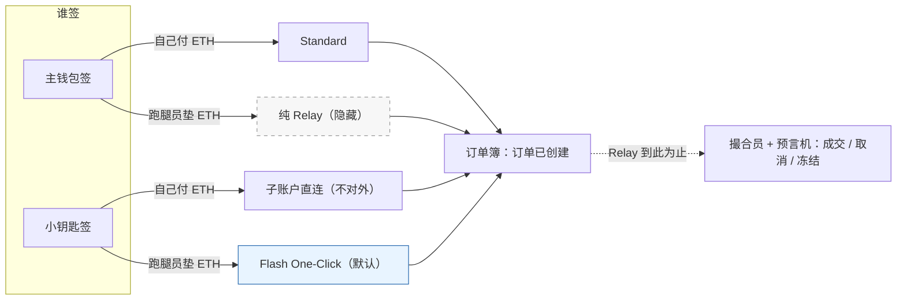
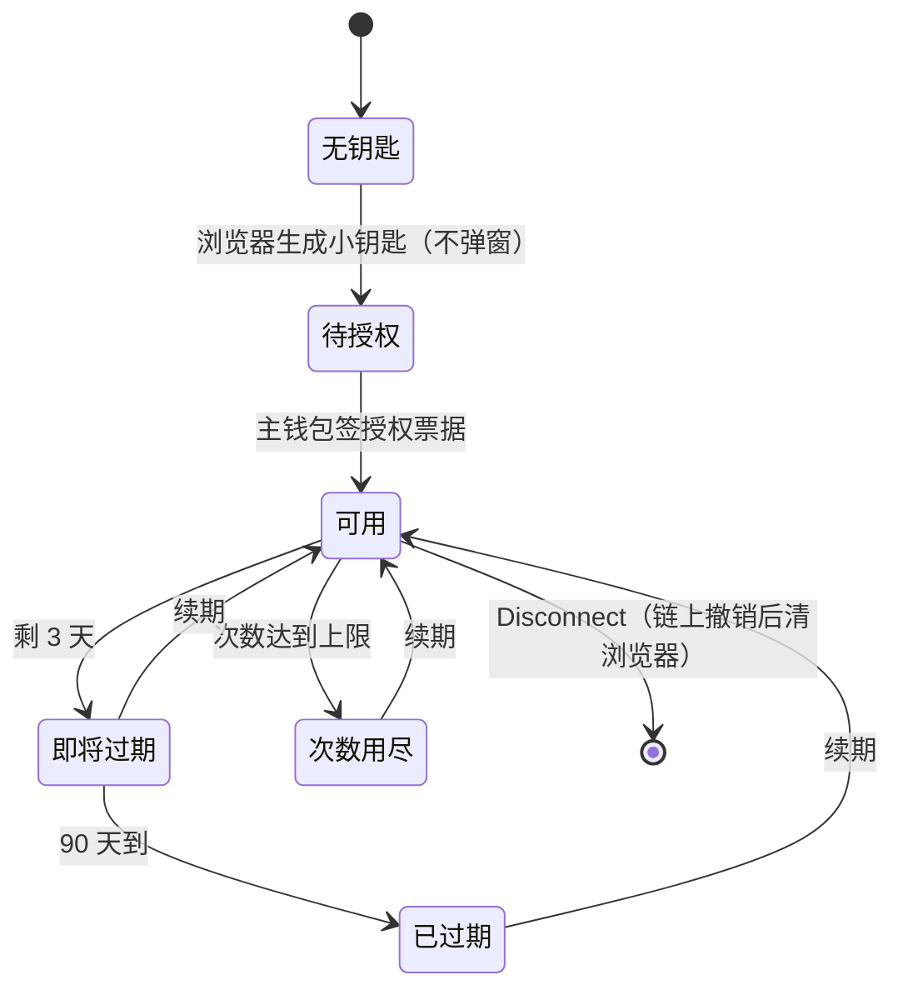
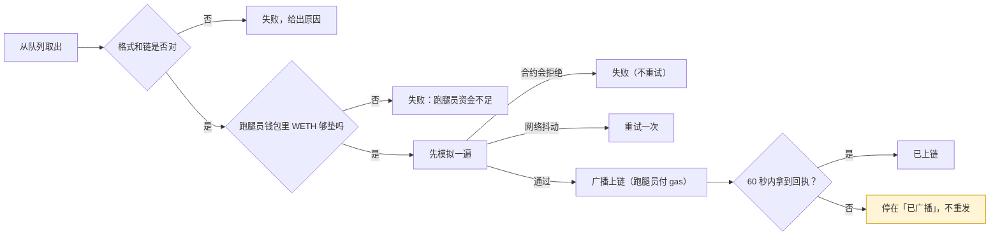
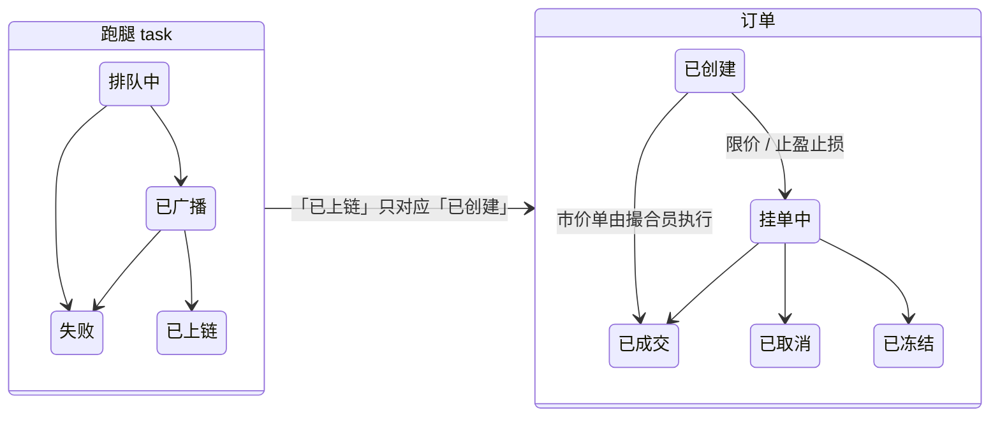

# 专项 · Relay ① 业务说明（给产品、运营、管理同学）

> 对象：FX100 v0.3.2 的 Relay / Gasless / Flash One-Click（一键交易）功能
> 面向：不写代码的产品 / 运营 / 管理 / 新人。本册不出现需求编号、用例编号和源码路径，可以直接转给外部同事
> 状态：2026-09-10；功能在代码里已经存在，但**尚未在目标测试环境验收**，现阶段不能对外开放（原因见「现在能不能上」）
> 基线：合约 v0.3.2、前端与 Keeper develop 分支（2026-09-09，CURRENT 已登记到 `3bc42814`）；详细锚点在 ③
>
> **分册导航**（一份专项三册，按顺序读）
>
> | 册 | 文件 | 给谁 | 装什么 |
> |---|---|---|---|
> | ① 本册 | 专项-Relay-①业务说明 | 产品 / 运营 / 管理 / 新人 | 它是什么、用户怎么用、后台每一步在做什么、会出什么问题、上线前核对什么 |
> | ② | [专项-Relay-②原理篇](<专项-Relay-②原理篇.md>) | 想弄懂实现机制的人 | 合约 / 前端 / Keeper 三层各自做了什么、边界陷阱、术语 |
> | ③ | [专项-Relay-③需求与分析](<专项-Relay-③需求与分析.md>) | 测试 / 开发 / 安全 | 需求点唯一汇总、功能边界、逻辑流转图、安全 / 速度 / 压力分析、怎么测 |

---

## 一分钟看懂

- **Relay 是什么**：平时链上下单，每一步都要自己发交易、自己付 ETH 当手续费（gas）。Relay 把它改成：你对一张「委托单」签个字，交给一个跑腿员替你送进合约；跑腿的 gas 由跑腿员先垫，事后按实际花费折成 USDC 从你账上扣。**你全程不需要持有 ETH。**
- **Flash One-Click（一键交易）是什么**：Relay 解决了「不用 ETH」，但每张委托单还要主钱包签一次。一键交易让你先用主钱包授权一把浏览器里的「小钥匙」，之后每张委托单由小钥匙自动签，主钱包不再弹窗。小钥匙**只能下单、改单、撤单，不能把钱转走**，90 天过期、有次数上限、随时可以收回。
- **用户看到什么**：设置里只有两种模式，Standard（每次弹窗）和 Flash One-Click（默认，稳态不弹窗）。
- **代价**：每笔一键动作付一次跑腿费（USDC，通常几分钱），签名时会授权一个上限（0.5～25 USDC），实扣不超过上限。第一次开启要签两次，第一单可能再签一次 USDC 授权，之后才是真正的零弹窗。
- **最重要的一条边界**：**Relay 只负责把订单送进订单簿，不负责成交。** 「Relay 成功」「订单已创建」「订单已成交」是三个状态；成交由撮合员拿预言机价格另做，和 Standard 模式完全一样。
- **现在能不能上**：**不能。** 前端还没跟上 v0.3.2 合约的一个新字段（授权票据里的槽位名），主测环境的链 ID 不在前端名单里，两个已登记的资金安全缺口没修，一键交易同意书里「密钥绝不能转走资金」的承诺与缺口矛盾。安全团队的最高优先级是：**修好缺口、改掉文案之前不开放一键交易。**
- **最怕什么**：一是小钥匙泄漏后被人拿去当跑腿员，反复从主账户抽 USDC；二是 Keeper 的「演练模式」开关忘了关，任务显示已提交其实从没上链；三是前端和 Keeper 用的队列名字不一致，任务永远「处理中」且没有任何报错。

## 几个词

| 词 | 意思 |
|---|---|
| Relay / Gasless / Express | 同一件事的三个叫法：用户签字，别人代发交易，用户不付 ETH |
| Flash | 产品名，泛指 Relay 家族；对外只有 Flash One-Click |
| 一键交易 / 1CT / 小钥匙 / session key / 子账户 | 同一件事：浏览器里一把权限受限的钥匙，替主钱包签委托单 |
| 跑腿员 Relayer | 替你广播交易、垫 gas、收跑腿费的一方。本项目由 Keeper 程序里的一个进程担任 |
| 撮合员 Order Keeper | 订单进了订单簿之后，带着预言机价格去成交的一方。和跑腿员是同一个程序的两个进程、两个职责 |
| 委托单 | 你签了名的下单 / 改单 / 撤单请求，技术上叫 EIP-712 签名 |
| 授权票据 | 主钱包签给小钥匙的授权书：有效期 90 天、次数上限；随第一张委托单一起上链 |
| 跑腿费 Relay Fee | 付给跑腿员的 USDC，按实际 gas 折算，不超过你签的上限 |
| 执行费 | 付给撮合员的费用，用 WETH 计。Relay 下由跑腿员先垫，再折进跑腿费向你收 |
| 补贴 | 订单规模达到市场设的门槛就免执行费。门槛默认是 0，**不显式配置就是全场免费** |
| 槽位 | v0.3.2 起每个主钱包最多 4 把小钥匙，各占一个命名槽位（本意是一台设备一个） |
| task | 提交后拿到的凭据，用来查跑腿进度；四个状态：排队中 / 已广播 / 已上链 / 失败 |
| fork | 把链上此刻状态复制一份来预演；tx-fork 是主测环境 |

## 一张图：谁签、谁付 gas、走哪个门、到哪为止

四个门最后都汇到同一个订单簿。走哪个门只改变「怎么签、谁代发、收不收跑腿费」，不改变订单类型、价格、仓位和风控规则。

| 角色 | 干什么 | 钱是谁的 |
|---|---|---|
| 主钱包 | 订单主人；提供抵押品、付跑腿费、签授权票据 | 抵押品和仓位永远属于它 |
| 小钥匙 | 替主钱包签每一张委托单 | 不持币，只签字 |
| 跑腿员 | 广播、垫 gas 和执行费、收跑腿费 | 先垫后收，收的是主账户的 USDC |
| 撮合员 | 带预言机价格执行订单 | 不碰用户资金 |

---

## 用户旅程：按场景讲

### 场景 1：第一次开启一键交易

| | 内容 |
|---|---|
| 你做什么 | 在交易页点「Enable Trading」，勾选条款，签两次：① 一段风险确认文字；② 一张授权票据。中间浏览器会自己生成小钥匙，不弹窗 |
| 系统做什么 | 小钥匙加密后存在你的浏览器里；授权票据也先存在浏览器里，**不发链上交易**，等你第一张委托单送出时一起上链 |
| 你会看到什么 | 弹窗关闭，按钮变回正常下单；**不会自动帮你把刚才填的单子下出去**，要再点一次 |
| 常见误会 | 文案说「只签一次」，实际首次两次，第一单可能再多一次 USDC 授权；换一台设备要重新做一遍，且会占一个新槽位 |

### 场景 2：日常开仓

| | 内容 |
|---|---|
| 你做什么 | 填单，看一眼「Relay fee (est.)」，点下单 |
| 系统做什么 | 每 30 秒刷新一次跑腿费报价；先查你的 USDC 够不够「抵押品 + 跑腿费上限」；第一单若授权额度不够会弹一次 USDC 授权签名（5 分钟内有效）；小钥匙自动签委托单；送到后台队列；跑腿员广播；合约验签、扣抵押品、建单、收跑腿费 |
| 你会看到什么 | 按钮变「提交中」不可再点；随后状态依次是 签名 → 已受理 → 已广播 → 已上链；通常几秒到十几秒。之后订单簿里出现你的订单，成交要再等撮合员（和 Standard 一样） |
| 关键点 | 页面上的跑腿费是**估算**，实扣按链上实际花费，且不超过你签的上限；「已上链」≠「已成交」 |

### 场景 3：撤单、改单、一键全撤

| | 内容 |
|---|---|
| 你做什么 | 在订单列表点撤销 / 修改，或点「Cancel All」 |
| 系统做什么 | 一次签名产生一张委托单；全撤把多笔打成一个包，一次跑腿费、要么全撤要么全不撤。撤单不需要跑腿员垫执行费 |
| 你会看到什么 | 撤单提示从「Cancel Submitted」原地升级为「Order Canceled」或明确错误，不会静默消失 |
| 关键点 | 市价单要过了系统设的过期时间才允许撤；限价、止盈止损随时可撤可改；市价单不能改 |

### 场景 4：USDC 不够付跑腿费

| | 内容 |
|---|---|
| 你会看到什么 | 「Insufficient USDC for Relay Fee」和一个「Switch to Standard」按钮 |
| 系统做什么 | 判断口径是「USDC 余额 < 本次业务金额 + 跑腿费上限」；点 Max 时会先扣掉跑腿费上限，再多留 1 USDC 给以后平仓用 |
| 你做什么 | 要么补 USDC，要么点切换到 Standard；切换后填好的单子保留，但**不会自动帮你发出去**，要再确认一次 |
| 关键点 | 平仓比开仓宽松：宁可让跑腿员白跑一次，也不把没有 ETH 的人困在平不了仓的处境；跑腿费上限最低 0.5 USDC，所以钱包里至少要有这么多才能用一键交易 |

### 场景 5：到期与续期

| | 内容 |
|---|---|
| 你会看到什么 | 剩 3 天时设置页提示「即将过期」；到期或次数用完后交易页按钮变成「Reconnect to trade」 |
| 你做什么 | 点续期，主钱包再签一张授权票据 |
| 系统做什么 | 新票据随下一张委托单上链；次数上限 = 已用次数 + 100 万（等于不限） |
| 关键点 | 没有「后台自动续签」，必须你点；过期不会丢钱，只是小钥匙不能再用 |

### 场景 6：断开、换设备

| | 内容 |
|---|---|
| 你做什么 | 设置页点「Disconnect」，二次确认 |
| 系统做什么 | 主钱包发**一笔链上交易**撤销小钥匙，成功后才清掉浏览器里的钥匙。这是整个一键交易生命周期里唯一一笔你自己发的链上交易 |
| 关键点 | 断开不会收回你给合约的 USDC 授权额度；断开后同一钱包再开启会继承以前的使用次数；换设备是新占一个槽位，4 个槽位满了就开不了，目前页面上没有释放槽位的入口 |

### 场景 7：出错时你会看到什么

| 提示 | 意思 | 你能做什么 |
|---|---|---|
| Insufficient USDC for Relay Fee | USDC 不够付跑腿费 | 补钱或切 Standard |
| Relay fee quote is unavailable | 报价拿不到（预言机价格读不到） | 稍后重试或切 Standard |
| …exceeds the Flash limit | 跑腿费估算超过 25 USDC 上限（gas 太贵） | 切 Standard |
| …exceeds the network cap | 超过治理设的单笔上限 | 切 Standard，等 gas 回落 |
| Gas prices moved while this was being signed | 你在钱包前犹豫时 gas 涨了 | 重新下单 |
| The order signature expired | 委托单 30 分钟内没送到 | 重新下单 |
| The Flash session has expired | 小钥匙过期 | 续期 |
| Relay task timed out | 3 分钟内没等到结果 | 先查订单列表，别急着重下（链上可能已成功） |
| Wrong network / Wrong wallet account | 中途换了链或账户 | 切回来重新下单 |

---

## 每一步：后台在做什么 / 可能出什么问题 / 核对什么

### 第 0 步：环境准入（能不能在目标环境跑）

| | 内容 |
|---|---|
| 做什么 | 合约地址与目标部署一致；前端补上 v0.3.2 的槽位字段并把主测链加进名单；Keeper 关掉演练模式、钱包里有 ETH 和 WETH 并授权；前端与 Keeper 用同一个队列前缀和链 ID |
| 可能出问题 | 前端没跟上槽位字段 → 一键交易的授权全部不兼容；链不在名单 → 页面直接判不可用；演练模式没关 → 假成功；队列名字不一致 → 永远处理中且不报错 |
| 核对什么 | Keeper 启动日志显示演练模式已关；心跳里 ETH / WETH 余额非零；前端设置页能看到 Flash One-Click 可选 |

### 第 1 步：首次开启

| | 内容 |
|---|---|
| 做什么 | 风险确认签名 → 生成小钥匙 → 签授权票据 → 关弹窗、不自动下单 |
| 可能出问题 | 用户以为只签一次；设置页里能跳过风险确认先签票据，回到交易页又要求补签；手机端点了没有弹窗；反复换设备 4 次占满槽位 |
| 核对什么 | 设置页显示会话状态「可用」、剩余天数、已用次数；此时链上还没有这把钥匙（要等第一单） |

### 第 2 步：报价与余额门

| | 内容 |
|---|---|
| 做什么 | 每 30 秒读链上三个费率参数和预言机价格，算出「显示值」和「签名上限」两个数；余额不够就拦下 |
| 可能出问题 | 余额刚好卡在「上限 + 1 USDC」以内时 Max 算出 0，按钮当前**直接没反应**（已登记缺陷）；gas 太贵时上限超 25 USDC，一键交易整体不可用；报价异常和余额不足混成一个提示 |
| 核对什么 | 页面「Relay fee (est.)」有数；余额不足时提示与「切 Standard」按钮同时出现 |

### 第 3 步：签名与提交

| | 内容 |
|---|---|
| 做什么 | 需要时签一次 USDC 授权（5 分钟内有效）→ 小钥匙签委托单（30 分钟内有效）→ 送出前再核一次费用上限 → 送到后台 → 拿到 task 凭据 → 每 2 秒查一次，最多 3 分钟 |
| 可能出问题 | 在钱包前犹豫太久 gas 涨了要重来；后台队列不可用时报错而不是假成功；中途换链或换账户会被拦下 |
| 核对什么 | 按钮变「提交中」且不可重复点；状态从「已受理」开始往后走 |

### 第 4 步：跑腿员广播

| | 内容 |
|---|---|
| 做什么 | 取出 → 校验 → 检查自己钱包够不够垫 → 模拟 → 广播 → 等回执 |
| 可能出问题 | 跑腿员没 WETH 或没授权 → 所有开仓被拦；ETH 耗尽 → 广播失败；演练模式没关 → 假成功；回执超过 60 秒就停在「已广播」不再管；一段时间没人交易后价格记录过期，所有一键订单都会被拒 |
| 核对什么 | Keeper 日志里有「已广播」和交易哈希；心跳里的双余额；「跑腿员资金不足」计数不涨 |

### 第 5 步：合约执行

| | 内容 |
|---|---|
| 做什么 | 一笔交易里依次：功能开关 → 执行 USDC 授权 → 验链、验期限、验币种、验没用过、验签名 → 验小钥匙（首单顺便注册槽位、次数加一）→ 扣抵押品、建单 → 按实际 gas 算跑腿费从主账户转给跑腿员。任一步失败全部回滚，什么都不扣 |
| 可能出问题 | 跑腿员是任何人都能当（无白名单）；小钥匙没设有效期就一次也用不了；补贴门槛没配就是全场免费；治理上限设 0 表示不限（和补贴门槛的极性相反）；撤销小钥匙不释放槽位、不清历史次数 |
| 核对什么 | 链上有「跑腿费已付」事件，金额不超过你签的上限；订单主人是主钱包，不是跑腿员也不是小钥匙；小钥匙的已用次数 +1（一个包里几条腿就 +几） |

### 第 6 步：成交与状态

| | 内容 |
|---|---|
| 做什么 | 撮合员扫到新订单，带预言机价格执行；这一步不看订单是不是 Relay 来的 |
| 可能出问题 | 用户把「已上链」当成「已成交」；前端 3 分钟超时显示失败但链上之后成功了，没有自动对账；1 小时后凭据过期查不到 |
| 核对什么 | 订单列表里的最终状态；成交价、仓位、盈亏与 Standard 模式下同样的单子一致 |

### 第 7 步：续期、断开与槽位

| | 内容 |
|---|---|
| 做什么 | 续期 = 再签一张票据随下一单上链；断开 = 主钱包发一笔链上交易撤销，成功后清浏览器 |
| 可能出问题 | 页面每个钱包只管一把钥匙，没有 4 槽的查看 / 释放 / 全部撤销界面；断开不收回 USDC 授权额度；两台设备同时授权时后一张失败要重签 |
| 核对什么 | 断开后用旧钥匙下单必须被拒绝且不扣费；设置页显示的剩余天数、已用次数与链上一致 |

---

## 数据怎么变：几个例子

以下是按合约公式和当前配置推导的示例，不是实测（唯一实测点：一笔 100 美元 DOGE 开仓的垫付执行费约占治理上限的 76%）。假设 gas 价 0.01 gwei、ETH 2,500 美元。

| 场景 | 动作前 | 动作 | 动作后 |
|---|---|---|---|
| 报价（免执行费的单） | 页面读到费率参数和价格 | 显示估算 | 显示约 **$0.05**；签名上限被钳到最低 **0.50 USDC** |
| 报价（需垫执行费的单） | 同上 | 显示估算 | 显示约 **$0.16**；签名上限仍 0.50 USDC；但垫付额 + gas 可能已经超过治理设的单笔上限，会被拒绝 → 说明样例上限偏紧，要实测 |
| 实扣 | 上限 0.50 USDC | 链上按实际 gas 结算 | 实扣约 **0.04 USDC**，不是先扣 0.50 再退 |
| 点 Max | 余额 1,000 USDC，上限 0.5 | Max | 可投 1,000 − 0.5 − 1 = **998.5 USDC** |
| 点 Max（余额很少） | 余额 1.48 / 1.50 USDC | Max | 都是 **0**（要超过 1.5 才有），当前按钮没反应 |
| 余额门 | 抵押 100，上限 0.5，余额 100.4 | 点开仓 | 拦下：Insufficient USDC for Relay Fee；余额 100.5 放行 |
| 首单计数 | 已用 0 次 | 开仓 + 止盈 + 止损一个包 | 已用 **3** 次（按腿数），一次跑腿费 |
| 一键全撤 | 5 笔挂单 | 一个包 | 已用 +5；一次跑腿费；不垫执行费 |
| 续期 | 已用 3 次 | 再签票据 | 新上限 = 3 + 1,000,000 |
| 三个超时 | 广播后 | 回执 61 秒才到 | task 停在「已广播」；页面 3 分钟后显示超时；链上其实成功；1 小时后凭据过期 |

---

## 风险清单（用人话）

| 风险 | 后果 | 怎么防 / 现状 |
|---|---|---|
| 小钥匙泄漏后自己当跑腿员抽钱 | 抬高 gas 报价、签个大上限，反复把主账户 USDC 转给自己；唯一兜底是治理上限，设 0 时无限 | 合约接上「子账户专属上限」；修好前不开放一键交易 |
| 大额执行费 + 自控回调套现 | 退款流向攻击者 | Relay 路径接上已有的封顶 |
| 免执行费的单谎报执行费套自动补 gas | 主账户 WETH 被按谎报额报销 | 合约清零谎报字段 |
| 同意书写「密钥绝不能转走资金」 | 与上面三条矛盾，误导用户 | 立即删除绝对化文案 |
| Keeper 演练模式忘了关 | 任务显示已提交，链上什么都没发生 | 启动日志核对；第一笔真实交易跑通即证明 |
| 前端与 Keeper 的队列前缀 / 链 ID / Redis 不一致 | 任务永远处理中，没有任何报错 | 起前逐项核对一致 |
| 跑腿员钱包没 WETH 或没授权 | 所有开仓被拦 | 心跳看双余额；上线清单 |
| 治理单笔上限太紧 | gas 涨 1.3 倍全部开仓失败 | 实测后调整 |
| 补贴门槛没配 | 全场免执行费，协议全额承担 | 上线清单强制显式配置 |
| 一段时间没人交易 | 价格记录过期，所有一键订单被拒 | 确认 Keeper 的价格刷新开着 |
| 用户看到超时以为失败，重复下单 | 可能重复开仓 | 先查订单列表再重下；前端有提交锁 |
| 4 个槽位被换设备占满 | 开不了一键交易，页面没有释放入口 | 补槽位管理界面 |
| Keeper 单机部署、私钥明文 | 进程挂 = 一键交易全停；泄漏即失去跑腿员资金 | 冗余部署与密钥管理 |

---

## 现在能不能上 / 上线前核对表（可打印）

**结论：不能，四个条件全满足前不开放一键交易。** ① 前端跟上 v0.3.2 槽位字段并把目标链加进名单；② 两个资金安全缺口修复并复测；③ 删除「绝不能转走资金」文案；④ 目标环境跑通第一笔真实一键交易。

| 项 | 核对什么 | 谁 |
|---|---|---|
| 合约 | 两个 Relay 合约地址与目标部署一致；抵押品 Token = USDC；治理单笔上限已显式配置且实测不拒绝正常单；每个市场的补贴门槛显式配置 | 合约 / 运维 |
| 安全 | 两个缺口修复并复测；同意书删除绝对化文案；跑腿员是否白名单、子账户是否最小权限、费用硬顶三项有裁决 | 产品 / 安全 |
| 前端 | 补槽位字段；目标链进名单；总开关打开；Max 为 0 时按钮有提示 | 前端 |
| Keeper | 演练模式关闭；跑腿员钱包 ETH / WETH 余额与授权；跑腿员私钥独立；价格刷新开启；与前端同队列前缀 / 链 ID / Redis | Keeper / 运维 |
| 联调 | 第一笔真实一键开仓跑通并计时；Standard 与一键交易下同样的单子结果一致；断开后旧钥匙被拒 | 测试 |
| 监控 | 心跳双余额、资金不足与拒绝计数、队列深度、按凭据配对的分段耗时 | 运维 |

---

## 想看更多

- 机制怎么实现、每层的边界陷阱、术语表：[专项-Relay-②原理篇](<专项-Relay-②原理篇.md>)
- 需求点清单、功能边界参数、流转图、安全 / 速度 / 压力分析、怎么测：[专项-Relay-③需求与分析](<专项-Relay-③需求与分析.md>)
