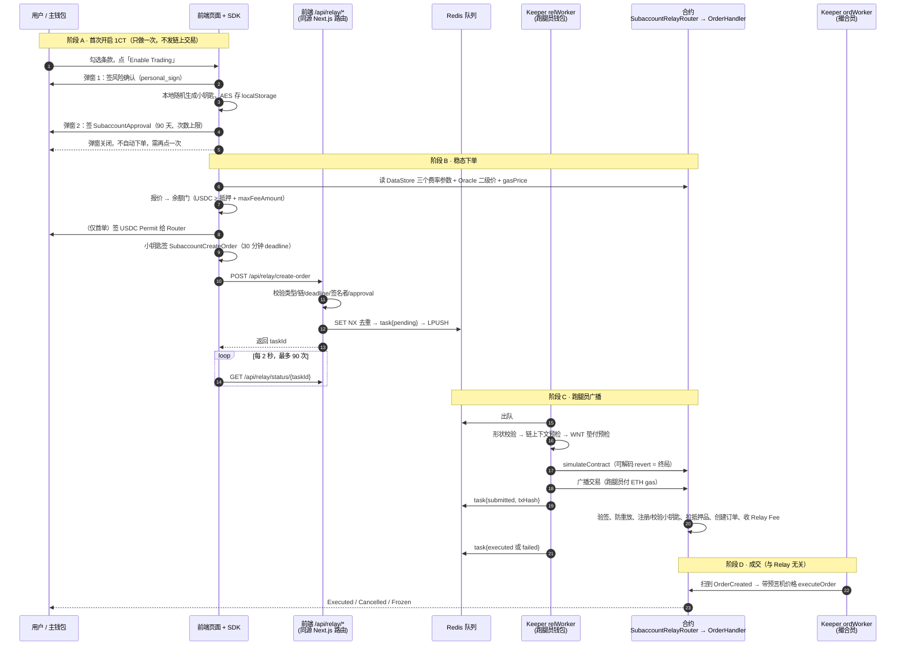

# 专项 · Relay ② 原理篇：合约 · 前端 · Keeper 各做了什么

> 文档性质：源码解读 + 既有文档汇总，面向第一次接触 Relay 的读者。它不替代安全审计、测试结果或环境准入结论。
>
> 基线以 [`Docs/contract-releases/CURRENT.json`](../contract-releases/CURRENT.json) 为唯一事实源。本文源码锚点对应：合约 `fx100-contracts@release-v0.3.2`（commit `13880f2`）、前端与 Keeper `fx100-apps@develop`（commit `b4331c15`，2026-09-09）。develop 是移动分支，引用行号时以该 commit 为准。CURRENT 于 2026-09-09 晚间把前端 head 前进到 `3bc42814`（3 个提交只改 reports 缺口扫描、钱包 chain-resync guard、Sentry 脱敏，未触及 relay / Flash / Keeper 任何文件，`git diff --name-only b4331c15..3bc42814` 已核对），本册 `b4331c15` 的行号锚点对 relay 文件仍逐行有效，可视同 `3bc42814`。
>
> 阅读路线：只想弄懂「它是什么、怎么跑」看 §1～§4；想知道每一层具体做了什么看 §5～§7；要写用例或排查问题看 §8～§10；生词看 §11。
>
> **分册导航**（一份专项三册，按顺序读）
>
> | 册 | 文件 | 给谁 | 装什么 |
> |---|---|---|---|
> | ① | [专项-Relay-①业务说明](<专项-Relay-①业务说明.md>) | 产品 / 运营 / 管理 / 新人 | 它是什么、用户怎么用、后台每一步在做什么、会出什么问题、上线前核对什么 |
> | ② 本册 | 专项-Relay-②原理篇 | 想弄懂实现机制的人 | 合约 / 前端 / Keeper 三层各自做了什么、边界陷阱、术语；不立需求编号 |
> | ③ | [专项-Relay-③需求与分析](<专项-Relay-③需求与分析.md>) | 测试 / 开发 / 安全 | 需求点唯一汇总（RQ-RELAY-01～49）、功能边界、逻辑流转图、安全 / 速度 / 压力分析、怎么测 |
>
> 锚点之后的漂移（2026-09-09 核对 origin）：`apps/keeper` 源码在 develop 与 staging 完全一致（最新代码提交均为 `2ae852e8`，staging 仅多一条只改 `IMPLEMENTATION.md` 的文档提交）。当天三条 relay 相关的**前端**修复只在 staging：`e0b14929` 修 Flash 模式重复计执行费（删 `useCreateOrder.ts` 52 行）、`41dbbb27` 翻译 relay 余额不足报错、`b36943a6` 改 Relay Fee 上限文案；它们影响 §6.5 的执行费口径与 §6.6 的文案，develop 合入前本文不改。

---

## 1. 一句话说清楚

**Relay = 你签字，别人替你跑腿上链。**

平时在链上下单，每一步都要自己发交易：钱包弹窗确认、自己付 ETH 当 gas。Relay 把这件事改成：你用钱包对一张「委托单」离线签名，把签名交给一个跑腿员（Relayer），跑腿员替你把委托单送进合约。跑腿的 gas 由跑腿员先垫，事后按实际消耗折算成 USDC 从你账上扣。你全程不需要持有 ETH。

**Flash One-Click（1CT）= 在 Relay 之上再配一把「小钥匙」。**

Relay 解决了「不用 ETH」，但每张委托单还是要主钱包签一次。1CT 让你先用主钱包授权一把浏览器里随机生成的「小钥匙」（技术名：session key / subaccount / 子账户），之后每张委托单由小钥匙自动签，主钱包不再弹窗。这把小钥匙只能下单、改单、撤单，不能把钱转走，有有效期和次数上限，随时可以在链上收回。

类比：普通模式像每次刷卡都输密码；Relay 像把卡交给柜员代刷但每次仍要你签字；1CT 像开通了小额免密，额度和期限你定，随时可关。

**最重要的一条边界：Relay 只负责「把订单送进交易所」，不负责「成交」。** Relay 成功只表示订单已经写进链上订单簿；真正成交仍由独立的 Order Keeper 拿着预言机价格去执行。所以「Relay 成功」「订单已创建」「订单已成交」是三个不同的状态，后面会反复强调。

---

## 2. 四个角色，先分清谁是谁

| 角色 | 代码里叫什么 | 干什么 | 钱是谁的 |
|---|---|---|---|
| 主钱包 | `account` | 订单的主人。提供抵押品、付 Relay Fee、签授权 | 抵押品和仓位永远属于它 |
| 小钥匙 | `subaccount` / session key | 只在 1CT 路径出现。替主钱包签每一张委托单 | 不持币，只签字 |
| 跑腿员 | Relayer，链上是 `msg.sender`；本项目由 Keeper 的 `relWorker` 钱包担任 | 广播交易、垫付 gas 和执行费、收 Relay Fee | 先垫后收，收的是主账户的 USDC |
| 撮合员 | Order Keeper，调用 `OrderHandler.executeOrder` | 订单创建后，带着预言机价格真正执行 | 不碰用户资金，从订单执行费里拿补偿 |

一个容易混的点：跑腿员和撮合员在本项目里都由 `apps/keeper` 这个程序承担，但它们是两个不同的进程（`relWorker` 和 `ordWorker`）、两个不同的职责、两个不同的阶段。测试和排障时不能把它们混成一个。

---

## 3. 三条提交路径，产品只露两条

代码里定义了三种模式，用户在设置页只能看到其中两种。

| 模式 | 代码值 | 谁签动作 | 谁发链上交易 | 合约入口 | 用户要 ETH 吗 | 每次都弹钱包吗 | Relay Fee | 1CT 次数计数 |
|---|---|---|---|---|---|---|---|---|
| Standard | `standard` | 主钱包签链上交易 | 主钱包自己 | `ExchangeRouter` | 要 | 每次都弹 | 无 | 无 |
| Relay / Gasless（隐藏） | `flash` | 主钱包签 EIP-712 委托单 | 跑腿员 | `RelayRouter` | 不要 | 每次都弹（签委托单） | 有 | 无 |
| Flash One-Click（默认） | `1ct` | 小钥匙签 EIP-712 委托单 | 跑腿员 | `SubaccountRelayRouter` | 不要 | 稳态不弹 | 有 | 有 |

三点说明：

- 「Relay / Gasless」这张卡片在设置页被注释掉了（`FlashSettings.tsx` 第 384～394 行），产品决定只露 Standard 和 Flash One-Click。但浏览器里若残留旧的 `flash` 值，仍会走这条隐藏路径，形成「页面没有选中卡片、实际却在走 Relay」的僵尸状态，见 §9。
- 三条路径只改变「怎么签名、谁代发、走哪个合约门、收不收跑腿费」。订单类型、价格、仓位、风控规则完全一样。同样的输入，三条路径的仓位和盈亏结果应当一致。
- 跨路径操作同一个订单是正常功能：Standard 建的挂单可以用 1CT 撤，1CT 开的仓可以切回 Standard 平。订单归属不会因为路径变化而改变。

---

## 4. 一笔 1CT 订单的完整旅程

先看图，再看编号步骤。



### 4.1 阶段 A：首次开启（一次性，两次钱包签名，零链上交易）

1. 用户在交易页点「Enable Trading」，勾选条款。弹窗由 `EstablishConnectionModal.tsx` 驱动。
2. **弹窗 1**：主钱包用 `personal_sign` 签一段风险确认文本。版本号 `2026-07-29`（`lib/flash/consent.ts`），同一钱包同一版本只签一次，版本升级才重签。
3. **不弹窗**：浏览器用 `generatePrivateKey()` 随机生成小钥匙（`packages/sdk/src/flash/subaccountCrypto.ts`），用 AES 加密后存进 localStorage 的 `fx100:subaccounts`，按 `chainId:owner` 分开存。AES 的口令是主钱包的公开地址，代码注释明确写了这是「故意的弱加密」，安全靠的是小钥匙权限受限、会过期、可撤销，不靠这层加密。
4. **弹窗 2**：主钱包签一张 `SubaccountApproval` 授权票据（`lib/flash/signFlashApproval.ts`）：有效期 90 天，次数上限 = 链上已用次数 + 1,000,000，票据的 deadline 等于有效期终点。
5. 弹窗关闭。**这张票据此时还在浏览器里，没有上链。** 它会跟着第一张委托单一起送进合约，由合约在同一笔交易里验签并注册小钥匙。
6. 弹窗关闭后不会自动提交之前填好的订单，用户要再点一次下单按钮。

所以「仅需签名一次」这句文案不准确：首次至少两次主钱包签名，首单还可能多一次 Permit。稳态之后才是真正的免弹窗。

### 4.2 阶段 B：稳态下单（前端）

7. 前端每 30 秒刷新一次 Relay Fee 报价（`hooks/trade/useFlashRelayFee.ts`）：读 DataStore 的 `RELAY_FEE_BASE_GAS_LIMIT`、`RELAY_FEE_MULTIPLIER_FACTOR`、`MAX_RELAY_SWAP_WNT_CAP` 三个参数（60 秒缓存），读 Oracle 的 WNT 与 USDC 二级价（不缓存），读当前 gasPrice。
8. 余额门：`USDC 余额 < 抵押品 + maxFeeAmount` 就拦下，显示「Insufficient USDC for Relay Fee」和「Switch to Standard」按钮。等号放行。
9. 如果主钱包对 `Router` 合约的 USDC 授权额度不够，弹一次 EIP-2612 Permit 签名，额度 `MAX_UINT256`，签名 5 分钟内有效。授权到位后以后不再弹。注意授权对象是基础 `Router`，不是 `RelayRouter`。
10. 组装 `relayParams`：8 字节随机 `userNonce`、`deadline = 现在 + 30 分钟`、`desChainId = 当前链`、`feeToken = USDC`、`maxFeeAmount = 报价上限`。
11. 小钥匙对 `SubaccountCreateOrder` 做 EIP-712 签名（`packages/sdk/src/relay/signing.ts`）。签完立即本地 recover 一次，确认签名者就是小钥匙，再检查 deadline 没在用户犹豫期间过掉。
12. 送出前再复查一次费用天花板（`lib/orders/relayFeeCapGuard.ts`）：因为 `maxFeeAmount` 已经签死，但合约按广播时的 gasPrice 收费，中间隔着用户在钱包前犹豫的时间。
13. `POST /api/relay/create-order`。这是前端自己的同源 Next.js 路由，不是 Gelato，也不是独立的 relay 服务器。路由做六项校验（类型白名单、链白名单、relay deadline、permit 合法性、EIP-712 恢复签名者、approval 有效性），然后用 Redis `SET NX` 以 `account:userNonce` 做 30 分钟去重，写 task 文档（1 小时 TTL），`LPUSH` 进队列，返回 `taskId`。
14. 前端每 2 秒查一次 `/api/relay/status/{taskId}`，最多 90 次（3 分钟）。超时显示超时，不显示成功。网络抖动继续轮询。

### 4.3 阶段 C：跑腿员广播（Keeper relWorker）

15. `relWorker` 每 250 毫秒出队一次。出队后先查 task 是否已推进过（防崩溃重放），再做形状校验（缺字段直接丢弃不重试）。
16. 链上下文预检（`domain/relay/context.ts`）：队列项 chainId、签名里的 `desChainId`、签名格式、approval 里的 subaccount 与 payload 一致。任一不符直接 `failed`，不重试。这里故意不检查 deadline，留给合约模拟去判。
17. WNT 垫付预检（`domain/relay/funding.ts`）：跑腿员钱包的 WNT 余额和对 `Router` 的授权额度都要 ≥ 本单需垫付的执行费。不足则 `failed`，错误码 `RelayerExecutionFeeFundingInsufficient`。撤单不需要垫付。
18. `simulateContract`。任何可解码的合约 revert 都是终局（签名负载不可变，重试没有意义）；传输类错误最多再试 1 次（`MAX_RETRIES = 1`）。
19. 广播，跑腿员钱包付 ETH gas，gas 上限按估算加 25% buffer。写 `submitted{txHash}`。等回执最多 60 秒，成功写 `executed`，失败写 `failed`。回执超时只记 warn，保持 `submitted` 不重发，也没有后续对账。

### 4.4 阶段 D：合约执行（同一笔原子交易）

20. `withRelay` 修饰符：记录起始 gas → 检查该 Router 的 gasless 功能开关 → 执行用户附带的 Permit（失败被 `catch` 吞掉，靠后续 `transferFrom` 兜底）→ 清零本次垫付计数。
21. `_validateCall`：`desChainId == block.chainid` → `block.timestamp ≤ deadline` → 全局 `COLLATERAL_TOKEN` 已配置且 `feeToken` 等于它 → 该 digest 从未用过 → 签名恢复出的地址等于小钥匙。
22. 子账户校验：subaccount 功能开关 → integrationId 未被熔断 → 若 approval 签名非空则验主钱包签名并注册槽位、更新有效期和次数上限、approval nonce 加一 → 次数先加后校验（过期或超上限则整笔回滚）。
23. `_createOrder`：判断执行费是否被协议补贴；非补贴且执行费非零时，从跑腿员钱包拉 WNT 进 OrderVault 并计入垫付；开仓单从主账户拉抵押品进 OrderVault；调用 `OrderHandler.createOrder`，发出 `OrderCreated`。
24. `_payRelayFee`：按实际消耗 gas + 固定基数 + calldata 折算，加上垫付的执行费，用预言机价格换成 USDC，从主账户转给跑腿员，发出 `RelayFeePaid`。实际扣款不会超过用户签的 `maxFeeAmount`，也不是「先扣上限再退差」。

任一步失败，Permit、digest、订单、approval nonce、次数、资金全部一起回滚。

### 4.5 阶段 E：成交（与 Relay 无关）

25. Keeper 的 `order-ingest` 扫到 `OrderCreated`。市价单进普通队列，限价/触发单进触发索引。
26. `ordWorker` 带着预言机价格调用 `OrderHandler.executeOrder`。这一步不看订单是不是 Relay 来的，市价单一样受 `REQUEST_EXPIRATION_TIME` 过期门约束。
27. 最终状态是 Executed、Cancelled 或 Frozen。前端的「Relay Tx Executed」只对应第 24 步完成，不对应这一步。

---

## 5. 合约层做了什么

### 5.1 五个文件、四个门

Relay 代码集中在 `src/router/relay/`（注意源码在 `src/` 不是 `contracts/`）：

| 文件 | 一句话 |
|---|---|
| `IRelayUtils.sol` | 五个数据结构：`FeeParams`、`TokenPermit`、`RelayParams`、`UpdateOrderParams`、`BatchParams` |
| `RelayUtils.sol` | EIP-712 的 typehash、domain、digest 计算、签名恢复 |
| `BaseRelayRouter.sol` | 两条路径共用的 `withRelay`、校验、防重放、资产划转、订单转发、收费 |
| `RelayRouter.sol` | 主钱包逐单签名的入口：`createOrder` / `updateOrder` / `cancelOrder` / `batch` |
| `SubaccountRelayRouter.sol` | 小钥匙签名的入口：同上四个，外加 `removeSubaccount` / `removeSlot` |

配套的 `src/subaccount/SubaccountUtils.sol` 管槽位、有效期、次数；`src/router/SubaccountRouter.sol` 是小钥匙自己发交易付 gas 的非 Relay 入口。

把「谁签」和「谁付 gas」两两组合，正好四个门：

| | 自己付 gas | 免 gas（跑腿员付） |
|---|---|---|
| 主钱包签 | `ExchangeRouter`（Standard） | `RelayRouter`（Gasless） |
| 小钥匙签 | `SubaccountRouter`（带自动补 gas） | `SubaccountRelayRouter`（Flash One-Click） |

四个门最后都汇到同一个 `OrderHandler`。代码里没有 `1CT`、`Flash`、`Gelato` 这些词：一键交易的实现名叫 subaccount，Gelato 只剩两行继承自 GMX 的注释。

### 5.2 签名怎么防伪、防重放

- **EIP-712 domain**：`name = Fx100RelayRouter`、`version = 1`、`chainId = 当前链`、`verifyingContract = 当前 Router 地址`。所以签名不能跨链复用，也不能在 `RelayRouter` 和 `SubaccountRelayRouter` 之间互换。`version = 1` 是签名协议版本，不是合约版本 v0.3.2。
- **防重放靠 digest 一次性表**：`BaseRelayRouter.digests[digest]`，同一个签名摘要第二次提交直接 `InvalidUserDigest`。`relayParams.userNonce` 只是掺进摘要里的随机盐，合约从不存储、不比较、不要求递增。
- **唯一的真 nonce** 是 `subaccountApprovalNonces[account]`：授权票据的 nonce 必须严格等于链上值，成功后加一。它按主账户共享，不按槽位分开。
- **三个时间边界**都是 `block.timestamp > 截止值` 才失败，刚好等于截止值仍有效：relay deadline、approval deadline、小钥匙 expiresAt。
- **Minified 兼容**：直接验签失败时，再把摘要包成 `Minified(bytes32 digest)` 验一次，给只能显示短摘要的钱包用。
- **只支持 EOA 的 ECDSA 签名**，没有 ERC-1271，智能合约钱包不能用 Relay。
- **1CT 首单的签名顺序**：主账户先签 Permit、再签授权票据，最后由小钥匙签动作。动作哈希绑定完整票据（含票据签名本身），所以小钥匙的签名必须最后生成。票据里 `maxAllowedCount = 0`、`expiresAt = 0` 表示「不修改」而不是「设为 0」；`shouldAdd = false` 不等于撤销。两个 Router 都有只读的 `get*Digest` 函数，让客户端拿到与链上完全一致的待签摘要。逐函数细节见 [Relay 合约代码流程与函数说明](<合约文档/Relay合约代码流程与函数说明.md>)。

### 5.3 小钥匙的五道锁

| 锁 | 合约事实 | 位置 |
|---|---|---|
| 只能下单 | 四个入口只有 create / update / cancel / batch，全部共用一个 `SUBACCOUNT_ORDER_ACTION`。没有 claim、提现、任意调用 | `SubaccountRelayRouter.sol` |
| 收款人必须是主账户 | 开仓单 `receiver` 必须等于主账户，`cancellationReceiver` 只能是零或主账户 | `SubaccountUtils.validateCreateOrderParams` |
| 有效期 | `block.timestamp > expiresAt` 即过期。默认值 0，所以不设过期时间的小钥匙一次也用不了 | `SubaccountUtils._validateSubaccountActionCountAndExpiresAt` |
| 次数上限 | 计数只增不减，先加后比，`count > maxCount` 才拒绝。batch 一次加 N 条腿的数量 | 同上 |
| 可撤销 | 主钱包签名调 `removeSubaccount`（清地址、不释放槽位）或 `removeSlot`（真正释放） | `SubaccountUtils.sol` |

**v0.3.2 的槽位模型**：每个主账户固定 4 个命名槽位（`MAX_SUBACCOUNT_SLOTS = 4`），槽位名是任意字符串（空串也算）。同名槽位重复授权会覆盖旧地址，同一个地址不能占两个槽位，4 槽全满再加就 `MaxSubaccountSlotsExceeded`。`removeSubaccount` 只把地址清零、槽位仍算占用，要 `removeSlot` 才腾出名额。两者都不清该地址的历史计数和有效期，同一地址再次授权会继承旧值。

### 5.4 费用：两种费、一个公式、三道帽子

**两种费不能混：**

| 费 | 币种 | 谁先付 | 最终去向 |
|---|---|---|---|
| 订单执行费 execution fee | WNT（WETH） | 非补贴时由跑腿员垫付进 OrderVault | 给未来执行订单的撮合员，多退给用户 |
| Relay Fee | 全局抵押品 Token（当前 USDC） | 主账户在交易结尾付 | 给跑腿员，补偿它的 gas 和垫付的执行费 |

**Relay Fee 公式**（`BaseRelayRouter._payRelayFee`）：

```text
relayGasLimit = 实际消耗 gas + RELAY_FEE_BASE_GAS_LIMIT + calldataGas
nativeFee     = ceil(relayGasLimit × tx.gasprice × 倍率 / 1e30) + 垫付的执行费
feeAmount     = ceil(nativeFee × WNT 二级价.max / feeToken 二级价.min)
```

两次向上取整，都偏向跑腿员。名字里的 `SWAP` 是 GMX 遗留命名，合约里没有任何兑换，只是用预言机价格比换算后直接 `transferFrom`。

**三道帽子**：

| 帽子 | 谁定 | 单位 | 超了怎样 | 用户能自救吗 |
|---|---|---|---|---|
| `MAX_RELAY_SWAP_WNT_CAP` | 治理，DataStore | WNT wei | 合约 `MaxRelaySwapWntCapExceeded` | 不能，只能切 Standard |
| `fee.maxFeeAmount` | 用户签在委托单里 | USDC | 合约 `InsufficientRelayFee` | 能，重签更高上限 |
| 前端 25 USDC 常量 | 前端代码 | USDC | 前端拒签，不上链 | 不能 |

部署脚本强制 `MAX_RELAY_SWAP_WNT_CAP` 必填，样例值 0.00005 WNT。前端实测一笔 100 美元 DOGE 单的垫付执行费约占该帽子的 76%，这个帽子并不宽。极性要记住：`cap = 0` 表示不设限，与执行费补贴阈值「MAX = 关闭」正好相反。

**执行费补贴**：每个市场有两个阈值 `EXECUTION_FEE_SUBSIDIZE`（USD 口径）和 `EXECUTION_FEE_SUBSIDIZE_SIZE`（token 口径），订单 size 达到阈值就在创建期免执行费，跑腿员也就不用垫付。阈值默认值 0，意味着**不显式写入 `type(uint256).max` 就是全场免执行费**；部署脚本目前没有写这两个键。

### 5.5 开关与权限

- 两个功能开关：`GASLESS_FEATURE_DISABLED(router地址)` 关整条 Relay，`SUBACCOUNT_FEATURE_DISABLED(router地址)` 关小钥匙。CONFIG_KEEPER 可即时关停。
- 三个 Router 部署时都拿到 `CONTROLLER`（才能调 OrderHandler 和写 DataStore）和 `ROUTER_PLUGIN`（才能通过 `Router.pluginTransfer` 从用户钱包拉币）。
- **跑腿员没有任何角色要求**。四个状态写入口只有 `nonReentrant withRelay`，没有白名单。任何地址拿到合法签名都能广播并收 Relay Fee。`Role.sol` 里也不存在 `RELAY_KEEPER`。安全边界 100% 由签名和 digest 一次性表承担。
- `IS_RELAY_FEE_EXCLUDED(msg.sender)` 是唯一和跑腿员身份挂钩的开关，命中就不收费、也不发 `RelayFeePaid` 事件；它不影响放行。

---

## 6. 前端 + SDK 做了什么

### 6.1 模式怎么定、路径怎么选

用户偏好存在 localStorage 的 `fx100:flash:mode`，默认值 `1ct`。真正决定走哪条路的是三重门（`state/derived/flash.ts`）：

1. 构建期开关 `NEXT_PUBLIC_FLASH_ENABLED === 'true'`，默认关。
2. 当前链在 SDK 支持列表里（dev 列表：8453、84532、99917、99918）。
3. 当前链配置了非零的 `RelayRouter` 地址。

三个都满足且偏好不是 `standard`，`shouldUseFlash` 才为真。再加上「本地有当前链、当前钱包的小钥匙」，才是 `isOneClickTradingActive`。任一不满足就静默回到 Standard，但**不会改写本地保存的偏好值**，所以可能出现「选中态是 1CT、实际在走 Standard」。

**目前 Flash 只在 84532 和 99917 两条链上可用**：8453 和 99918 的地址表里根本没有 `RelayRouter`。CURRENT 登记的 tx-fork（99911）不在 SDK 列表里，页面会判 Flash 不可用，Relay 入口也会拒绝该 chainId。

### 6.2 每个动作在哪里分叉

| 动作 | 分叉点 | Flash 分支 |
|---|---|---|
| 开仓 / 加仓 | `useCreateOrder.ts` | `submitFlashOrder`，带 TP/SL 时 `submitFlashBatchOrder` |
| 平仓 / 减仓 | `useCreateDecreaseOrder.ts` | `submitFlashDecreaseOrder` |
| 撤单 | `useCancelOrder.ts` | 单笔 `submitFlashCancel`，多笔 `submitFlashBatchCancel`（一次签名一个 task） |
| 改单 | `useUpdateOrder.ts` | `submitFlashUpdate`；TP/SL 换零费单时退化为 create + cancel 原子 batch |
| 设 TP/SL | `PositionTPSLDialog.tsx` | `submitFlashDecreaseOrder` 系列 |
| 增减保证金 | `usePositionAdjust.ts` | 按方向走开仓或减仓的 Flash 助手 |
| LP 领取 | `useLPVault.ts` | 没有 Flash 分支，永远钱包自付 gas |

每个 `submitFlash*.ts` 里还有一层二选一：`isOneClickTradingActive` 为真用小钥匙签 `subaccountRelay*`，否则用主钱包签 `relay*`。

主按钮有三态门（`useFlashOrderGate.ts`）：没有小钥匙或缺授权显示「Enable Trading」进设置流程；过期或次数用尽显示「Reconnect to trade」进续期；都正常才真正下单。

### 6.3 小钥匙的一生

| 阶段 | 做法 |
|---|---|
| 生成 | 随机私钥，AES 加密（口令 = 公开地址），存 localStorage `fx100:subaccounts` |
| Stay connected | 默认开。关掉后数据迁到 sessionStorage，关 tab 即清 |
| 状态机 | `needs-session` / `needs-approval` / `active` / `expiring-soon`（剩 3 天内）/ `expired` / `limit-reached` |
| 续期 | 重新签一张 approval，次数上限 = 链上已用 + 1,000,000。已签未上链的续期按「链上值与本地值取大」判有效，否则会把本该带续期上链的那一单误拒 |
| 后台对账 | 15 秒轮询 `Reader.getSubaccountInfo`，60 秒心跳，approval nonce 落后链上就清本地 |
| 本地回收 | approval 过期 + 24 小时后清；没有 approval 的孤儿钥匙 100 天后清 |
| 断开 | 设置页「Disconnect」是二次确认后主钱包发一笔 `SubaccountRouter.removeSubaccount` 链上交易，回执成功才清本地。这是整个 1CT 生命周期里唯一一笔主钱包自己发的链上交易 |
| 紧急页 | `/emergency` 可逐个撤 ERC20 授权和链上子账户 |

前端从不设置 auto top-up 和 integrationId，两者分别保持 0 和零值。

### 6.4 签名与提交

- SDK 定义 9 组 EIP-712 类型（4 种动作 × 有无小钥匙，外加 `SubaccountApproval`），`relayParams` 以哈希形式嵌入订单签名，签名时 `signature` 字段必须是 `0x` 占位。
- approval 的 nonce 必须从服务端 `/api/relay/nonce` 取，不能用钱包客户端读：钱包可能连着 fork，而跑腿员执行的是 relay 链，读错链会在模拟时报 `InvalidSubaccountApprovalNonce`。
- 四个端点：`/api/relay/create-order`、`cancel-order`、`update-order`、`batch`；状态四态 `pending / submitted / executed / failed`。
- **失败即终局**：签名负载不可变，任何 revert 都要用新的 `userNonce` 重签，前端永不自动重试同一负载。重试前先按 taskId 查原任务，避免重复下单。
- 「Order Tracking」偏好默认关。关闭时靠可原地升级的 toast 显示签名、任务、交易、订单四段状态；开启才显示完整弹窗。Standard 撤单曾经卡在「Cancel Submitted」不升级（OC-26），现在两条路径共用 `cancelWithLifecycle.ts`，最终态一致。

### 6.5 费用报价与 USDC 余额门

前端把合约公式逐行镜像了一遍（`lib/relay/feeMath.ts`、`feeEstimate.ts`），但算出两个数：

| 数 | 用途 | calldata 假设 | 系数 | 边界 |
|---|---|---|---|---|
| `displayFeeAmount` | 页面显示「Relay fee (est.) ~$x.xxxx」 | 4,000 字节 | 1.2× | 最低显示 0.01 USDC |
| `maxFeeAmount` | 签进委托单的授权上限 | 50,000 字节 | 3× | 最低 0.5 USDC，最高 25 USDC |

动作 gas 假设：开仓 1,500,000、每条 TP/SL 边单 +300,000、撤单 900,000、改单 1,000,000。撤单和改单曾因假设偏低在生产上撞过 `InsufficientRelayFee`，后来上调到现在的值。

0.5 USDC 这个下限的副作用要记住：因为余额门把上限当成余额需求，**它实际就是任何 Flash 动作的最低 USDC 余额门槛**。

余额门的判定顺序是刻意的（`feeEstimate.ts`）：先判天花板超限，再判报价不可用或加载中，再判余额，最后才返回软警告。这样软警告不会盖住「余额确实不够」。

**平仓例外**：退出类动作对「估算不准」放行、对「余额确实不够」拦截（`isRelayFeeExitBlocked`）。理由是宁可让跑腿员白跑一次，也不能把没有 ETH 的用户困在平不了仓的处境。

**Max 按钮预留 1 USDC**（2026-08-10 需求）：开仓、加仓、追加保证金点 Max 时，先扣掉本次签名的 `maxFeeAmount`，再额外留 1 USDC。结果为 0 时按钮当前直接无响应、不置灰、不清旧值，这是已登记的交互 GAP。2026-09-06 在 v0.3.1 部署上的实测还看到三条静态分析没有的观察：按钮此时显示「Enter Amount」这类误导性中性提示（`INVALID_PAY_AMOUNT` 路径）；切到 Standard 后提示与切换按钮一起消失，而 Standard 仍减 1 USDC，死区变成 `0 < B ≤ 1 USDC`；移动端开仓面板没有任何切换出口。见 [Relay 余额门与 Max 死区实测补充](<../../TestCase/E2E/versions/v0.3.2/Relay余额门与Max死区-实测补充-(v0.3.2).md>)。

余额不足分两种文案：余额本来够、只是被 Relay 预留挤掉，报 `INSUFFICIENT_RELAY_FEE`；余额本身不够，报 `INSUFFICIENT_BALANCE`。

### 6.6 用户会看到的错误

| 场景 | 文案 |
|---|---|
| USDC 不够付跑腿费 | Insufficient USDC for Relay Fee + Switch to Standard |
| 报价拿不到 | Relay fee quote is unavailable. Please retry or switch to Standard mode. |
| 超过 25 USDC 保险丝 | The estimated relay fee for this action exceeds the Flash limit… |
| 超过治理 WNT 帽子 | …exceeds the network cap for Flash mode… |
| 签名后 gas 涨了 | Gas prices moved while this was being signed… |
| 委托单过期 | The order signature expired before it reached the relay. Please place the order again. |
| 小钥匙过期 | The Flash session has expired. Please re-authorize Flash in settings. |
| 钱包换链或换账户 | Wrong network / Wrong wallet account |
| 轮询超时 | Relay task timed out |

---

## 7. Keeper 做了什么

### 7.1 跑腿员是 relWorker，但 HTTP 入口不在 Keeper

Keeper 进程不监听端口。签名负载的 HTTP 入口在前端的 Vercel 路由，Keeper 只通过共享 Redis 消费队列。Redis 键带 `版本:链ID:` 前缀：队列 `keeper:relay:queue`，去重 `keeper:relay:dedup:<account:userNonce>`（1800 秒），task 文档 `keeper:relay:task:<taskId>`（只带版本不带链，3600 秒）。旧的 `relayServer.ts` 已删除。

### 7.2 relWorker 的处理链

出队 → task 已推进则 ack 跳过 → 形状校验 → 链上下文预检 → WNT 垫付预检 → `simulateContract` → 广播 → 等回执。

- 校验失败的负载直接丢弃不重试。
- 可解码的 revert 一律终局 `failed`，并映射成用户文案（例如 7 条 Subaccount 类错误统一提示「重新授权 Flash」）。文案里禁止出现 network、fetch、timeout 这些词，否则会被前端的通用错误解析吞掉。
- 传输类错误最多重试 1 次，5 秒后。重试耗尽时把仍是 `pending` 的 task 降级为 `failed`，已推进的绝不降级。
- 回执超时 60 秒后保持 `submitted` 不重发，没有自动对账。
- `KEEPER_DRY_RUN` 默认 `true`：不显式设成 `false`，relWorker 会把 task 直接标成 `submitted` 却从不上链。这是 fork 上最隐蔽的「看起来成功了」。

### 7.3 钱包与资金

- 私钥来自 `RELAY_KEEPER_PRIVATE_KEY(S)`，回退到 `KEEPER_PRIVATE_KEY(S)`。回退共用会带来跨进程 nonce 冲突。
- 需要 ETH 付 gas，需要 WNT 垫付执行费，并且必须 `WNT.approve(Router, MAX)`，授权对象是基础 `Router`。WNT 永不自动补充，心跳每 5 分钟上报 ETH 和 WNT 双余额。
- **不需要任何链上角色**。代码注释明确写了「relay 提交由用户的 EIP-712 签名把关，不由 keeper 角色把关」。

### 7.4 Relay 来的订单怎么执行

完全不区分。`OrderCreated` 事件里没有 `isRelay`、`subaccount`、`srcChainId` 这些字段，订单一上链 Keeper 就分不出、也不需要分出它是怎么来的。执行走 `order-ingest → ordWorker` 的普通流水线，市价单一样受 `REQUEST_EXPIRATION_TIME` 过期门约束，触发单一样进价格索引。

Keeper **不用执行费判断值不值得执行**：解析出 `executionFee` 后从不比较、从不设阈值，补贴单（执行费为 0）照常执行。也不读 `EXECUTION_FEE_SUBSIDIZE` 两个键。

### 7.5 recorded price 刷新是 Relay 的生命线

合约收 Relay Fee 时要读 WNT 和 USDC 的二级价：优先 Chainlink feed，没有 feed 就读 `latestRecordedPrices`，且必须在 `MAX_RECORDED_PRICE_AGE` 内，否则 revert `EmptySecondaryPrice` 或 `MaxPriceAgeExceeded`。`latestRecordedPrices` 只在真实成交时顺带写入，所以一个安静一段时间的部署会让**所有** gasless 订单开始 revert。Keeper 的 producer 检测过期并入队，ordWorker 调用 `AdlHandler.refreshLatestRecordedPrices` 刷新，这是 Keeper 里唯一因 Relay 而存在的非 relWorker 子系统。fork 上 gasprice 为 0 时这个问题会被掩盖。

### 7.6 取消

Flash 取消由 relWorker 广播 `cancelOrder`，不需要垫付 WNT。Standard 取消 Keeper 完全不参与，用户自己发交易，Keeper 只在事件流里看到 `OrderCancelled` 后清理索引。市价单过期时 Keeper 也不发取消交易，只丢弃并计数，链上取消由 `OrderHandler._handleOrderError` 完成。

---

## 8. 边界与陷阱速查

### 8.1 合约层

| 事实 | 后果 |
|---|---|
| 跑腿员无白名单 | 任何持有合法签名的人都能广播并收 Relay Fee；「服务路由」和「合约权限」要分开测 |
| `userNonce` 不落盘 | 同 nonce 不同负载会得到不同 digest，链上照样放行；但前端队列按 `account:userNonce` 去重 30 分钟，可能把新负载吞成旧 task |
| 小钥匙 `expiresAt` 默认 0 | 不设有效期就一次也用不了；前端总是设 90 天 |
| 补贴阈值默认 0 | 不显式写 MAX 就是全场免执行费 |
| `MAX_RELAY_SWAP_WNT_CAP = 0` 表示不设限 | 与补贴键极性相反，运维记忆点 |
| `removeSubaccount` 不释放槽位 | 反复换槽名会耗尽 4 槽；`removeSlot` 才腾位 |
| `removeSubaccount` / `removeSlot` 不清历史计数 | 同地址再授权继承旧计数和有效期 |
| approval 里的 `integrationId` 签了但不写 | 只能经 `SubaccountRouter.setIntegrationId` 设置 |
| Relay 路径 `shouldCapMaxExecutionFee` 固定 false | 见 §9 的 R8-B21 |
| `MAX_RELAY_FEE_SWAP_USD_FOR_SUBACCOUNT` 已声明未读取 | 见 §9 的 R8-B02 |
| 不支持 ERC-1271 | 合约钱包不能用 Relay |
| Relay 没有 claim 入口 | 领取类操作只能走 `ExchangeRouter` 自付 gas |
| 市价单不可 update | 由 OrderHandler 拒绝，与路径无关 |

### 8.2 前端 + SDK

| 事实 | 后果 |
|---|---|
| SDK 的 `SubaccountApproval` 类型、EIP-712 schema、ABI 都没有 v0.3.2 新增的 `string slot` | 1CT 首次授权和续期的 digest 与 calldata 都不兼容 v0.3.2 合约，**P0 GAP** |
| 前端 SDK 的 Reader ABI 里没有 `slot`、`isSlotActive`、`getSubaccountSlots`（`packages/sdk/src/abis/fx100/Reader.ts` 全文均无），仍是 v0.3.1 的 ABI；v0.3.2 的 `SubaccountInfo` 在 `isAuthorized` 之后插入了 `slot` 与 `isSlotActive` | 在 v0.3.2 上 `getSubaccountInfo` 的返回值解码必然不匹配，会话状态机、nonce 路由、紧急页都读它；具体表现（报错还是错位）待 v0.3.2 环境验证 |
| 紧急页读 `subaccountListKey`（`useEmergencyRevoke.ts` 第 5、55 行） | v0.3.2 的 `FX100Keys.sol` 已删除 `SUBACCOUNT_LIST`（v0.3.1 有 2 处，v0.3.2 为 0），紧急页在 v0.3.2 上列不出任何子账户 |
| Flash 只在 84532 / 99917 可用 | tx-fork 99911 页面判不可用，Relay 入口也拒绝 |
| relay deadline 30 分钟、Permit 5 分钟 | 旧批准稿建议 deadline 5～10 分钟，待裁决 DEC-TRADE-004；README 写 Permit 约 1 小时是过期文档 |
| 签名上限 3×、0.5～25 USDC | 旧批准稿是 10 USDC 硬顶 + 超 2 USDC 二次确认，待裁决 DEC-TRADE-005 |
| Max 结果为 0 时按钮无响应 | `B ≤ C + 1 USDC` 形成确定性死区，P0 |
| 轮询 3 分钟超时 ≠ 链上失败 | 服务端 task 1 小时、跑腿员回执 60 秒、前端 3 分钟是三个概念；超时后没有自动对账 |
| 小钥匙弱加密 | XSS 或浏览器存储泄漏可取得可用钥匙，「已加密」不能当安全结论 |
| Disconnect 只调 `removeSubaccount` | 不释放槽位、不清历史字段、不撤 Router 的 USDC 授权 |
| 旧 `flash` 本地值 | 走隐藏的 direct Relay，页面无选中卡片，待裁决 DEC-TRADE-001 |
| 每个 `(chainId, owner)` 只管一把钥匙 | 没有 4 槽的查看、覆盖、`removeSlot`、`revokeAll` 界面，待裁决 DEC-TRADE-006 |
| 设置页「已开启」不查 consent | 设置页显示已开启，回交易页仍要求补签 |
| 移动端有 setup 按钮但没渲染弹窗 | `/m/trade` 新用户点了没有后续 |
| Gelato 客户端仍在 SDK 里 | 死代码，`sendFlashTransaction` 无调用点，两个 Gelato Router 地址全是零 |

### 8.3 Keeper

| 事实 | 后果 |
|---|---|
| `KEEPER_DRY_RUN` 默认 true | task 标 `submitted` 却从不上链 |
| 前端与 Keeper 的 `KEYSPACE_VERSION`、chainId、Redis 实例必须一致 | 不一致则 task 永远 `pending`，无任何报错 |
| 跑腿员钱包需 ETH + WNT + `approve(Router)` | 缺 WNT 时所有开仓单被 `RelayerExecutionFeeFundingInsufficient` 拦下 |
| 99918 没有 RelayRouter 地址 | relWorker 启动即崩，不是静默 |
| `KEEPER_CHAIN_ID` 未设默认 84532，未知链回落 Base Sepolia 配置 | 「看起来在跑、其实链不对」 |
| recorded price 过期 | 所有 gasless 单 revert `EmptySecondaryPrice(WNT)` |
| 回执超时保持 `submitted` 不重发、无对账 | 需要人工按 txHash 查 |
| `RELAY` 回退共用 `KEEPER_PRIVATE_KEY` | 跨进程 nonce 冲突 |
| 每次 `relWorker` 只有一条 drain loop | 与 ordWorker 的双循环不同 |

---

## 9. 已登记的安全缺口与待裁决项

这些是静态代码结论，不是链上执行结果；正式状态以 [results.md](../../TestCase/E2E/versions/v0.3.2/results.md) 为准。

| 编号 | 一句话 | 状态 |
|---|---|---|
| R8-B02（P0） | 子账户专属 Relay Fee USD 帽子只声明未接入，恶意或被盗的小钥匙可以自任跑腿员、抬高 gasPrice、用自己签的上限反复把主账户 USDC 转给自己 | REPORTED，有 Foundry 复现测试 |
| R8-B21（P1） | Relay 路径固定关闭执行费封顶，小钥匙可用大额执行费 + 自控 callback 套取主账户资金 | REPORTED |
| 文案冲突 | 1CT 同意书写「这把钥匙永远不能提取或转移你的资金」，与上两条直接矛盾 | 修复前不得对外承诺 |
| DEC-TRADE-001 | 旧 `flash` 本地值迁到 Standard 还是 1CT | 待裁决 |
| DEC-TRADE-004 | relay deadline 30 分钟 vs 旧稿 5～10 分钟 | 待裁决 |
| DEC-TRADE-005 | 签名上限 25 USDC vs 旧稿 10 USDC + 二次确认 | 待裁决 |
| DEC-TRADE-006 | 4 槽还是 1 槽；是否加 `revokeAll`；[槽位上限设计讨论](<需求文档/2026-08-16_子账户槽位数量上限（MAX_SUBACCOUNT_SLOTS）设计讨论.md>)给出 A/B/C 三案 | 待裁决 |
| 最小权限偏差 | 初始批准稿要求子账户默认只授权 Create，Update/Cancel 手动开启；当前四个动作共用一个 actionType | 未被后续明确撤销 |

---

## 10. 测试与准入现状（2026-09-09）

| 层 | 现状 |
|---|---|
| 合约 | 三个 Foundry 文件共 18 条在 v0.3.2 checkout 全部通过（Relay 开仓 8、子账户 Relay 开仓 3、槽位 7）。未覆盖：免费跑腿员路径、倍率非 0、Minified 回退、digest 重放、deadline 和 chainId 边界、calldata 超长、小钥匙过期和次数越界、integrationId 熔断、功能开关、auto top-up |
| 前端 | vitest 覆盖费用引擎、Permit、轮询、签名校验、7 条提交助手的 cap 守卫（结构性测试遍历所有 `submitFlash*.ts`）、撤单生命周期；Playwright 有真钱包 smoke（建连接 → 开 50 美元 BTC 多单 → 轮询到 executed → 平仓）和 relay API 契约测试；`packages/sdk` 自身零测试是刻意策略 |
| Keeper | 单测覆盖 classify、context、funding、taskStore、queueKeys、gasPolicy、nonceAllocator 等零件；`relWorker.executeRelay` 主流程没有集成测试；没有任何测试断言「Relay 创建的订单被 ordWorker 执行」 |
| 版本用例 | v0.3.2 Trade 矩阵登记 43 条 RELAY/FLASH 用例（CT 18、XT 6、FT 19 前缀族），results.md 尚无任何一条结果；SCN-B32-03/04 为 NOT_RUN |
| 准入 | `admissionScope["tx-fork:frontend"]` 为 NOT_READY，明确写着「FT/XT 与 Relay/Flash 等 C-2」；tx-fork 合约层 READY 只覆盖 A 节读检，不含 Relay |

要把 Relay/1CT 在目标环境跑起来，至少同时满足：`RelayRouter` 与 `SubaccountRelayRouter` 地址、bytecode、ABI 与 CURRENT 一致；Relay API 可达且用当前 chainId；跑腿员钱包有 ETH、WNT、`approve(Router)`；SDK 的 EIP-712 schema 补上 `slot`；tx-fork 的 chainId 进入 SDK 链表、地址表和 Relay 入口白名单；`KEEPER_DRY_RUN=false`。

---

## 11. 小白术语表

| 词 | 意思 |
|---|---|
| Relay / Gasless / Express | 同一件事的三个叫法：用户离线签名，别人代发交易，用户不付 ETH |
| Flash | 产品名，泛指 Relay 家族；当前对外只有 Flash One-Click |
| 1CT / One-Click / session key / subaccount / 子账户 / 小钥匙 | 同一件事：浏览器里一把受限的私钥，替主钱包签委托单 |
| Relayer / 跑腿员 / relWorker | 广播 Relay 交易、垫 gas、收 Relay Fee 的一方 |
| Order Keeper / 撮合员 / ordWorker | 订单创建后带预言机价格去执行的一方 |
| EIP-712 | 一种「结构化签名」标准，钱包能把要签的字段一条条显示给你看 |
| digest | 签名内容的摘要，合约用它做「用过即作废」 |
| userNonce | 委托单里的随机数，只为让两张一样的委托单摘要不同 |
| approval nonce | 授权票据的顺序号，链上严格递增，旧票据自动失效 |
| Permit（EIP-2612） | 用签名代替一笔 approve 交易，给合约划扣 USDC 的额度 |
| execution fee / 执行费 | 付给撮合员的 WNT，Relay 路径下由跑腿员先垫 |
| Relay Fee / 跑腿费 | 付给跑腿员的 USDC，按实际 gas 折算，不超过你签的上限 |
| maxFeeAmount | 你签在委托单里的跑腿费上限 |
| WNT / WETH | 包装成 ERC20 的 ETH，合约内部统一用它 |
| DataStore | 合约的参数仓库，所有费率、开关、槽位都存这里 |
| 槽位 slot | v0.3.2 每个主账户最多 4 把小钥匙，每把挂在一个命名槽位下 |
| task / taskId | 前端提交后拿到的凭据，用来查跑腿进度；四态 pending / submitted / executed / failed |
| OrderCreated / Executed / Cancelled / Frozen | 订单在链上的四个状态；Relay 只负责走到 OrderCreated |

---

## 12. 延伸阅读与实现核对入口

**工作区已有的两份细文档**（本文是它们的入门版，细节以它们为准）：

- [Relay 合约代码流程与函数说明](合约文档/Relay合约代码流程与函数说明.md)：合约层逐函数说明、费用公式、v0.3.2 变化、GAP 与 18 条测试
- [v0.3.2 前端 Trade：两种产品模式与三条技术提交路径](<../../TestCase/E2E/versions/v0.3.2/Standard-Relay-Flash-OneClick-(v0.3.2).md>)：前端模式切换规则、动作覆盖、费用与余额门的精确函数、异常恢复、22 项 GAP、测试设计清单

**需求与设计来源**：

- [Express Mode 架构分析（2026-06-10，v0.2.1 批准稿）](../V0.3.1/需求文档/2026-06-10_FX100-Express-Mode-架构分析-前端指南-产品风控-测试规格.md)：FX100 与 GMX 的对比、双轨 Relayer 设计
- [执行费豁免前移到创建期 + 免 Gas 开仓（实施版）](<../V0.3.1/需求文档/2026-07-22_FX100-执行费豁免前移到创建期+免Gas开仓-改造规范(实施版-2026-06-14).md>)：跑腿员垫付 WETH 的 B1 方案定案、补贴阈值、`MAX_RELAY_SWAP_WNT_CAP` 极性
- [Flash 模式产品说明 + 安全评审（2026-07-26）](../V0.3.1/需求文档/2026-07-26_flash-mode-security-review.md)：随机 key、90 天、去 1 小时锁的推导；注意其中 §1.1 描述的确定性派生已被随机 key 取代
- [Flash 1CT 命名会话密钥最终方案](需求文档/2026-07-20_FX100-Flash-1CT-Named-Agent-最终方案.md)：4 槽命名模型的产品来源
- [子账户槽位数量上限设计讨论](<需求文档/2026-08-16_子账户槽位数量上限（MAX_SUBACCOUNT_SLOTS）设计讨论.md>)
- [USDC 不够时如何发起 relay](需求文档/2026-08-10_USDC不够时如何发起relay.md)：Max 预留 1 USDC 与切 Standard 的验收口径
- [Bug 注册表 R8-B02 / R8-B21](<需求文档/2026-08-12_Bug-注册表（R1~R8，含Zenith专题）.md>)
- [Trade 需求来源与冲突台账](<../../TestCase/E2E/versions/v0.3.2/Trade-需求来源与冲突台账-(v0.3.2).md>)：DEC-TRADE-001/004/005/006
- [Keeper 代码分析报告 §3.5 中继](../keeper/2026-08-23_Keeper代码分析报告（fx100-apps@develop）.md)

**实现核对入口**（按本文引用的 commit）：

| 主题 | 路径 |
|---|---|
| 合约 Relay | `src/router/relay/{IRelayUtils,RelayUtils,BaseRelayRouter,RelayRouter,SubaccountRelayRouter}.sol` |
| 合约子账户 | `src/subaccount/SubaccountUtils.sol`、`src/router/SubaccountRouter.sol` |
| 合约参数键与错误 | `src/constants/FX100Keys.sol`、`src/error/FxErrors.sol` |
| 合约测试 | `test/integration/{RelayCreateOrder,SubaccountRelayCreateOrder,SubaccountSlots}.t.sol` |
| 部署配置 | `ignition/modules/Fx100Execution.ts`、`Fx100Role.ts`、`scripts/configureGeneral.ts` |
| SDK 签名与协议 | `packages/sdk/src/relay/{eip712,signing,relayParams,subaccountApproval,keeperClient,queueProtocol,validateSignedRelay}.ts` |
| SDK 小钥匙 | `packages/sdk/src/flash/subaccountCrypto.ts` |
| 前端模式与门 | `apps/fx-base-app/src/state/ui/flash.ts`、`state/derived/flash.ts`、`hooks/trade/useFlashOrderGate.ts` |
| 前端会话 | `hooks/account/{useSubaccountSession,useFlashSessionStatus}.ts`、`lib/flash/{signFlashApproval,consent,sessionPrune}.ts` |
| 前端提交助手 | `lib/orders/submitFlash*.ts`、`relayFeeCapGuard.ts`、`resolveSubaccountApproval.ts` |
| 前端费用 | `lib/relay/{feeEstimate,feeMath,permit,pollRelayTask}.ts`、`lib/relay/README.md` |
| 前端 HTTP 入口 | `apps/fx-base-app/src/app/api/relay/{create-order,cancel-order,update-order,batch,status,nonce}/route.ts`、`lib/relay/{ingress,queue}.ts` |
| Keeper 跑腿员 | `apps/keeper/src/entrypoints/relWorker.ts`、`domain/relay/{classify,context,funding,taskStore}.ts` |
| Keeper 价格刷新 | `apps/keeper/src/domain/prices/recordedPriceRefresh.ts`、`entrypoints/producer.ts` |
| Keeper 链配置 | `apps/keeper/src/chain/{wallet,chainConfig,env}.ts`、`packages/sdk/src/configs/{contracts,chains,keyspace}.ts` |
