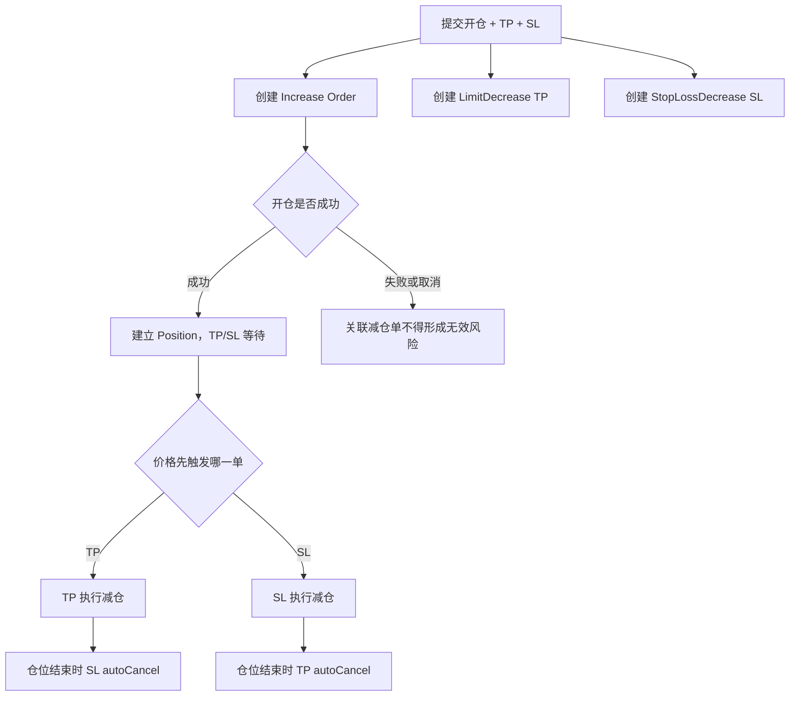
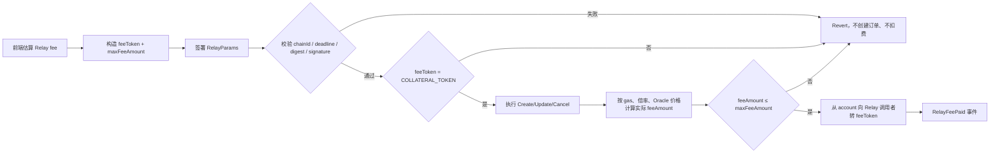

# v0.3.2 订单类型与交易流程

## 1. 用户概念与合约订单的映射

| 前端功能 | 开/减仓 | 合约 OrderType | 触发逻辑 |
|---|---|---|---|
| Market 开多/开空/加仓 | Increase | `MarketIncrease` | 无 trigger；尽快由 Keeper 执行 |
| Limit 开多 | Increase long | `LimitIncrease` | Oracle max ≤ triggerPrice |
| Limit 开空 | Increase short | `LimitIncrease` | Oracle min ≥ triggerPrice |
| 突破追多 | Increase long | `StopIncrease` | Oracle max ≥ triggerPrice |
| 破位追空 | Increase short | `StopIncrease` | Oracle min ≤ triggerPrice |
| Market 部分/全部平仓 | Decrease | `MarketDecrease` | 无 trigger；尽快执行 |
| 多头 TP | Decrease long | `LimitDecrease` | Oracle min ≥ triggerPrice |
| 空头 TP | Decrease short | `LimitDecrease` | Oracle max ≤ triggerPrice |
| 多头 SL | Decrease long | `StopLossDecrease` | Oracle min ≤ triggerPrice |
| 空头 SL | Decrease short | `StopLossDecrease` | Oracle max ≥ triggerPrice |
| 清算 | Decrease | `Liquidation` | 仓位满足可清算条件 |
| ADL | Decrease + secondary | 原订单上下文 + `Adl` | 满足 ADL 条件，由 ADL Keeper 执行 |

### 1.1 订单类型测试子模块

订单类型必须单独形成一组测试，不以“某条交易脚本执行成功”代替类型覆盖。每种类型至少验证：创建参数、触发前状态、边界触发、执行价格、订单终态、仓位/余额变化和前端显示名称。

| 类型测试 ID | 前端业务类型 | 合约类型 | 方向数据集 | 核心测试目的 |
|---|---|---|---|---|
| 类型组 01 | Market 开仓/加仓 | `MarketIncrease` | long、short | 无 trigger；acceptablePrice 四象限；成功、滑点取消和冻结语义 |
| 类型组 02 | Limit 开仓 | `LimitIncrease` | long、short | 更有利价格触发；触发前保持 Open；触发后仍需满足 acceptablePrice |
| 类型组 03 | Stop/突破开仓 | `StopIncrease` | long、short | 突破/破位方向正确；不得被前端错标为 Limit |
| 类型组 04 | Market 减仓/平仓 | `MarketDecrease` | long、short；部分、全部 | Reduce-only；`minOutputAmount`；完整平仓取整和资金账本 |
| 类型组 05 | Take Profit | `LimitDecrease` | long、short | TP 方向、触发边界、超量截断、兄弟单 autoCancel |
| 类型组 06 | Stop Loss | `StopLossDecrease` | long、short | SL 方向、acceptablePrice、Frozen/重试、兄弟单 autoCancel |
| 类型组 07 | Liquidation | `Liquidation` | long、short | 可清算判定、负点差归零、手续费档位、残值和历史类型 |
| 类型组 08 | ADL 风险处置 | `SecondaryOrderType.Adl` | long、short | ADL 条件、选仓、负点差归零；不得显示为用户普通平仓 |

### 1.2 订单类型通用断言

每一个类型组数据集都必须核对：

1. 页面选中的业务类型与最终 payload 的 `orderType` 一致。
2. `isLong`、`sizeDelta`、`isSizeDeltaUsd`、`triggerPrice`、`acceptablePrice`、`validFromTime` 与用例数据一致。
3. 触发条件未满足时订单仍存在，仓位和用户余额不发生错误变化。
4. 触发条件等号成立时，按该类型规定的 Oracle min/max 边界判断。
5. 触发成立但 acceptablePrice 不满足时，终态和原因符合合约规则。
6. 执行成功后 Order Store、事件、Reader、Position、OI 和余额差分一致。
7. Open Orders、Order History 和交易通知显示同一个订单类型，不允许类型错标。
8. 编辑订单跨越当前价时，不得在用户不知情的情况下改变订单类型或触发语义。

### 1.3 订单类型最小组合矩阵

| 维度 | 必须覆盖的值 |
|---|---|
| 仓位方向 | long、short |
| 仓位动作 | increase、decrease |
| 执行方式 | market、limit、stop、liquidation、ADL |
| 价格边界 | 未达到、差 1 最小单位、等于、越过 1 最小单位 |
| acceptablePrice | 等号、最小有利偏差、最小不利越界 |
| 订单操作 | create、update、cancel、execute、freeze、retry、autoCancel |
| 技术提交路径 | Standard、Relay/Gasless、Flash One-Click/1CT；产品 UI 只公开 Standard 与 1CT |
| 规模口径 | USD、Token；Mock Token 按运行时 decimals |
| 仓位结果 | 新开、加仓、部分减仓、全部平仓、无仓位变化 |

## 2. Market 与 Limit 的区别

| 项目 | Market | Limit/Stop |
|---|---|---|
| 用户意图 | 尽快成交 | 到指定市场条件后再成交 |
| `triggerPrice` | 不作为触发条件 | 必填且决定方向条件 |
| `validFromTime` | 不阻塞市场单 | 到达前禁止执行 |
| `acceptablePrice` | 必须有价格保护 | 同样必须满足；触发不代表一定成交 |
| 未执行时表现 | 应短暂等待 Keeper | 可以长期 Open，并允许改撤 |
| 主要风险 | 滑点、价格影响、Keeper/Oracle 延迟 | 条件方向错误、跨价改型、触发后 acceptablePrice 不可满足 |

## 3. TP/SL 的本质

TP/SL 不是单独的仓位字段，而是围绕已有或即将创建的仓位生成的 Reduce-only Decrease Orders：

- TP 通常映射为 `LimitDecrease`。
- SL 映射为 `StopLossDecrease`。
- 开仓附带 TP/SL 时，前端可能在一个用户动作中批量创建主订单和两个减仓订单。
- TP/SL 的 size 应与目标仓位语义一致；加仓、部分减仓、全部平仓后必须明确残单如何处理。
- `autoCancel=true` 时，仓位结束后相关残单应被自动清理。



## 4. 两种产品模式、三条技术提交路径

| 技术提交路径 | 动作 signer | 链上 `tx.from` / 外层入口 | 用户体验与约束 |
|---|---|---|---|
| Standard | 主钱包签链上交易 | 主钱包 / `ExchangeRouter` | 每个链上动作通常弹钱包；用户支付原生 Gas；不收 Relay Fee |
| Relay/Gasless（内部 mode=`flash`） | 主钱包逐动作签 EIP-712 | 任意持有有效 payload 的 caller / `RelayRouter` | 用户不付原生 Gas、支付 Relay Fee；没有 1CT session 计数；当前设置页选择卡隐藏 |
| Flash One-Click/1CT | session key 签动作；主钱包签独立风险 consent、approval 及首次必要 Permit | 任意持有有效 payload 的 caller / `SubaccountRelayRouter` | 建连后稳态无逐动作钱包弹窗；受命名 `slot`、expiry、action count 和撤权约束 |

产品模式选择器当前只公开 **Standard** 和 **Flash One-Click/1CT** 两张卡；direct Relay 是仍可由内部 `mode=flash` 触发的隐藏技术路径，不是第三张用户可见产品卡。旧持久化状态仍可能读出 `flash`，因此必须覆盖旧状态迁移/回显，不能让用户停在“没有任何卡选中”的僵尸状态。

direct Relay 不是第三种公开产品模式，而是 direct Relay 与 1CT 共用的代发基础设施之一。两类 Relay Router 的外部 relay 函数均没有 `onlyKeeper`；任何拿到有效签名 payload 的 caller 都可广播，并由该次 `msg.sender` 收取 Relay Fee。三条路径最终都进入同一 `OrderHandler`，不得改变 OrderType、经济 `account` 或成交规则；允许差异仅包括 signer、外层 Router、`tx.from`、Relay Fee、Relay task 和 1CT action count。

v0.3.2 合约要求 `SubaccountApproval` 包含命名 `slot`，但 CURRENT 固定前端的类型、typed data 与 ABI 尚未完整包含该字段，因此当前 1CT 功能层应标为 `GAP`，版本前端准入另保持 `NOT_READY`；不能因为 UI 可选就判定可用。完整切换、会话、动作和缺口见 [Standard-Relay-Flash-OneClick-(v0.3.2).md](<专项-Relay/Standard-Relay-Flash-OneClick-(v0.3.2).md>)。

### 4.1 1CT 会话、同意和权限边界

| 功能点 | v0.3.2 目标/合约语义 | CURRENT 前端实现与判定 |
|---|---|---|
| Consent 分层 | 钱包连接展示 Terms/Privacy；1CT 建连另做一次、按版本记录的风险确认 | 风险 consent 版本为 `2026-07-29`，按 owner 保存且独立于 Stay connected；但建连弹窗仍强制 Terms/Privacy 勾选，Settings 又可绕过 consent 先生成 key/签 approval，和严格“授权前先风险确认”口径冲突 |
| Session key | 应为独立随机密钥，不由钱包签名可预测派生 | 浏览器本地随机生成；本地加密口令仅为公开 owner 地址，不能视为强静态加密保护 |
| 持久化 | 用户可选择是否跨浏览器会话保留 | `Stay connected` 默认开启：开时 localStorage，关时 sessionStorage，切换会迁移现有密钥 |
| 授权窗口 | approval 到期或计数耗尽后不可继续使用 | 活跃前端策略为 `expiresAt = now + 90 天`，`maxAllowedCount = 当前链上 count + 1,000,000`；这是前端策略，不是合约常量。SDK 中仍有未走活跃路径的 7 天/90 次/1 小时旧默认，不能拿来验收当前流程 |
| 签名 deadline | 每一种签名按自己的用途失效，不能把 approval expiry 当成单笔动作 deadline | CURRENT 活跃 helper 的单笔 create/update/cancel/batch action deadline 约为 30 分钟；Permit deadline 约为 1 小时；approval deadline 使用 90 天 `expiresAt` |
| 闲置锁 | 需求若要求离开/闲置自动锁，必须有可观察机制 | 当前 1 小时 away/idle lock 未挂载，没有此行为；页面离开 1 小时后不应预期自动锁 |
| 过期/计数边界 | 合约在 `timestamp > expiresAt` 或 `nextCount > maxAllowedCount` 时拒绝，等号可用 | 前端用 `>=` 提前判失效，保守少用一个边界；提前 3 天只提示手动 Renew，没有自动重签 |
| Action scope | 只授权合约显式允许的会话动作 | create、update、cancel、batch 共用一个 `SUBACCOUNT_ORDER_ACTION`；不能分别授权“只创建”或“只撤单”，batch 的 count 增量等于其中 create+update+cancel 子项总数。Liquidation、ADL、Funding/Oracle 更新不在 1CT session action scope |
| 槽位与撤权 | 最多 4 个命名 slot；释放容量必须清空 slot | 空 slot 名和零 subaccount 当前也可被写入结构，但零地址不能通过后续 action signer 校验；同名活跃 slot 可替换，不同活跃 slot 的重复非零地址会拒绝，第 5 个唯一活跃 slot 会拒绝。过期不会释放。`removeSubaccount` 只把地址清零但保留 slot/active；`removeSlot` 才清空并释放。找不到地址时前者仍可发出 `slotIndex=4`/空 slot 事件，后者静默 no-op。无 `revokeAll`；CURRENT UI Disconnect 由主钱包直调 `removeSubaccount`，既非 gasless，也不释放容量 |

Trade 建连正常顺序应是：风险 consent → 随机 session key → 主钱包 approval/必要 Permit → 后续 session action。当前 Trade 弹窗完成建连后会关闭，用户需再次点击原交易提交；不得自动补发先前动作，也不得在建连失败或过期时静默降级到 Standard。

## 5. Relay fee 流程与功能点

Relay fee 属于 Relay/Gasless 与 Flash One-Click/1CT 请求，不属于 Standard，也不属于订单本身。请求通过 `RelayParams.fee` 携带：

| 字段 | 合约规则 | 前端要求 |
|---|---|---|
| `feeToken` | 必须等于 DataStore 的全局 `COLLATERAL_TOKEN`；未配置时 `EmptyToken`，不一致时 `UnexpectedRelayFeeToken` | 固定使用当前部署的抵押品代币，不允许用户选择其他 fee token |
| `maxFeeAmount` | 实际计算的 `feeAmount` 不得超过上限，否则 `InsufficientRelayFee` | 报价后设置用户可接受上限，并在签名前展示最大值 |

支付流程：



实际费用以 gas 使用量、基础 gas、calldata gas、`RELAY_FEE_MULTIPLIER_FACTOR`、额外 relay execution fee，以及 WNT/feeToken 的 Oracle 价格换算，并向上取整。`MAX_RELAY_SWAP_WNT_CAP` 非零时还需满足 native fee 上限。

合约侧可按下列关系理解，最终逐项取整以源码为准：

```text
relayGasLimit = 实际 relay 调用 gas + RELAY_BASE_GAS + calldataGas
nativeFee = ceil(relayGasLimit × tx.gasprice × multiplier) + relayExecutionFee
feeAmount = ceil(nativeFee × WNT.max / feeToken.min)

必须同时满足：
feeAmount <= 签名 maxFeeAmount
nativeFee <= MAX_RELAY_SWAP_WNT_CAP（该 cap 非零时）
calldata length <= 50,000 bytes
```

`maxFeeAmount` 只是 cap：合约直接从 account 拉取实际 `feeAmount` 给本次 Relay caller，不会先拉 `maxFeeAmount`，也没有 `maxFeeAmount - feeAmount` 的退款。由于 caller 未受 Keeper 白名单限制，必须用另一普通地址提交一份尚未使用且仍有效的 payload，验证权限来自签名/nonce/count/deadline，而不是服务端身份；成功接收 Relay Fee 的也是实际 `msg.sender`。

CURRENT 前端的展示估算和签名 cap 不是同一个数：展示估算按约 4 KB calldata、1.2 倍并设 0.01 USDC 最小值；签名 cap 按 50 KB、3 倍、0.5 USDC 最小值，并有 25 USDC 绝对上限。签名前会重新取新报价；报价加载中、不可用、余额不足、超过 cap 必须分别显示，不能统一伪装成余额不足。

### 5.1 USDC Max 与 Switch to Standard

v0.3.2 以 CURRENT 实际功能为唯一口径：Relay/1CT 的 USDC `Max` 先预留当次 signed `maxFeeAmount`，再额外预留 1 USDC。建议适用面收口为 `MarketIncrease`、`LimitIncrease`、`StopIncrease` 的 open/add、long/short，以及 Adjust Margin Deposit。Close 的 100% 是仓位全量，Withdraw 的 Max 是风险上限，二者不扣额外 `U`，但 Relay fee-only 余额门仍需成立。

CURRENT 的功能边界如下，验收按同一口径记录：

- 对同一 6 位 USDC 作为 pay/fee token，精确式为 `MaxBudget = B>C+U ? B−C−U : 0`，其中 `C=maxFeeAmount`、`U=1_000_000 raw=1 USDC`。覆盖 `C+U−1/= /+1 raw`；当 `C=0.5U` 时，1.48U 和 1.50U 都得到 0，1.500001U 才得到 1 raw。
- Pay/Size Max 算得 0 后当前直接 return，不置灰、不清旧值、不提示，形成确定性“点击无反应”区；这必须作为前端 GAP 和 P0 回归，不得只断言函数返回 0。
- 固定 `1_000_000` 的函数没有 mode/token/decimals 参数，Standard 也会扣。当前可达 fee/pay token 是 6 位 USDC；index token 的 6/8/18 位只影响 size 换算，不改变 USDC reserve。只有未来把 pay/fee/collateral token 扩展为非 6 位时，才会触发固定 raw 单位错配，届时必须从 token metadata 推导。
- Deposit 100% 是 `min(riskMax, max(B−C−U,0))`；要分 wallet-bound/risk-bound。手填和 25%/50%/75% 不使用同一额外 `U` 规则，不能拿它们替代 Max 用例。
- `Switch to Standard` 当前只设置模式且不自动提交：market、方向、类型、单位、杠杆、价格、TP/SL、slippage 及手填金额不变；仍选中的 Max/百分比会因 `C→0` 自动重算。再次提交必须由用户点击，并走主钱包→`ExchangeRouter`。
- 当前切换按钮只在 confirmed insufficient 分支出现。loading/unavailable 不复用该文案；超过 25 USDC 的 cap 错误当前被折叠为 unavailable，需单独留证。

完整公式、适用范围、零值死区、精度与报价状态表见 [Standard-Relay-Flash-OneClick-(v0.3.2).md](<专项-Relay/Standard-Relay-Flash-OneClick-(v0.3.2).md#721-relay1ct-max-计算>)。

### 5.2 Execution Fee 的垫付与最终退款

- Standard 由用户在创建/更新时预存 WNT；Relay family 的非补贴 create/update 由 Relay caller 先垫 WNT 到 OrderVault，随后这笔完整 execution fee 被计入 `nativeFee`，通过 Relay Fee 换算成 feeToken 向 account 收取。
- 订单以后执行、冻结、Keeper 错误取消或 auto-cancel 时，实际 Keeper 只拿 gas 对应的 Execution Fee；但用户主动 `cancelOrder` 会把 `order.account` 作为该费用接收者，Relay cancel 的 caller 只通过 Relay Fee 获得代发补偿。多余 WNT 解包为原生币，先尝试交给 callback，未处理则按执行/取消的 refund receiver 退款。
- 执行使用 `order.receiver`；取消优先用非零 `cancellationReceiver`，否则回退 `receiver`。CURRENT Relay create 设置 receiver=用户、cancellationReceiver=0、callback=0，因此多余部分最终以原生币退给用户，不退给 Relay caller，也不会自动换回 USDC。
- 若 update 触发 execution-fee subsidy，OrderHandler 会把旧 fee 加本次实际收到的 WNT 直接发给 receiver；Relay helper 在该分支不会按 `executionFeeIncrease` 垫入 WNT，不能套用正常 Keeper 实耗退款断言。
- Relay Fee 已包含 caller 垫付的完整 execution fee 时，费用总账不得再把 Order 上的 executionFee 当作第二次 feeToken 用户扣款。

Relay fee 必测功能点：

1. `COLLATERAL_TOKEN` 未配置：调用回退，不创建/更新/取消订单，不扣 fee。
2. `feeToken = COLLATERAL_TOKEN`：请求成功，事件和双方余额差分等于实际 `feeAmount`。
3. `feeToken` 为其他 token 或零地址：明确回退且不扣 fee。
4. 实际 fee 等于 `maxFeeAmount`：成功；高于上限最小单位：回退。
5. Relay fee 排除地址：不扣费，并核对订单业务动作仍按规则执行。
6. native fee 为 0：允许事件记录 feeAmount=0，不应错误转账。
7. gas multiplier 为 0 时按 1e30 默认倍率处理；非零时按配置计算。
8. 超过 `MAX_RELAY_SWAP_WNT_CAP` 或 calldata 超过 50,000 bytes：回退且业务动作原子失败。
9. Oracle 价格 min/max 选取和向上取整正确，不能只断言“余额减少”。
10. Standard、Relay/Gasless 与 1CT 使用相同参数：仓位经济结果一致；Relay Fee 只出现在后两条 Relay family 路径。

## 6. 创建、更新、取消、执行与冻结

1. **创建**：校验 feature flag、市场、参数、权限、资金与 execution fee，写入 Order Store 并发出 OrderCreated。
2. **更新**：只能修改允许字段；更新时间应变化；不得破坏 orderType、acceptablePrice 哨兵或 Reduce-only 语义。
3. **取消**：校验所有权及功能开关，删除订单并按规则返还资金/执行费。
4. **执行**：Keeper 提交 Oracle 数据；检查 validFrom、trigger、acceptablePrice、市场和仓位约束，再更新仓位与账本。
5. **冻结**：对不应直接取消、需要后续重试的错误保留订单并标记 frozen；页面必须给用户明确状态。

Relay 提交还要叠加以下任务状态，但不得替代 Order 生命周期：

```text
pending（后端入队）
→ submitted（已广播，已有 txHash）
→ executed（Relay Router 交易回执成功）
或 failed（广播/回执/链上执行失败）

executed(create) → OrderCreated/Open → 后续 Order Keeper → Executed/Cancelled/Frozen
```

CURRENT 下单 helper 在只拿到 `taskId` 时就把本地 submission state 置为 `success`；这个 success 只能解释为“入队成功”，不能展示为链上成功。Keeper 等待回执默认约 60 秒；超时可让服务端任务继续停在 `submitted`，且没有完整的 submitted 自动对账/重广播流程。任务记录默认约 1 小时 TTL；已经进入较后状态的任务再次出队会被确认而不重跑。前端约每 2 秒轮询、最多 90 次后只形成约 3 分钟的本地 timeout/failed 展示，不会自动修改服务端或链上状态。重复点击前必须先用 `txHash`、事件和 Store 对账，避免重复创建；Relay task 的 `executed` 绝不能直接显示为订单已成交。

## 7. 必测边界

- Trigger 前一最小单位、等于、后一最小单位。
- AcceptablePrice 等号和最小不利越界。
- validFrom 前、等于、后。
- 多/空 × Increase/Decrease 四象限。
- 创建后修改规模、修改价格跨越现价、取消、冻结后重试。
- TP/SL 合法方向、反向、相等、0、超精度。
- 部分平仓后 TP/SL 超量、全平后残单、清算/ADL 后残单。
