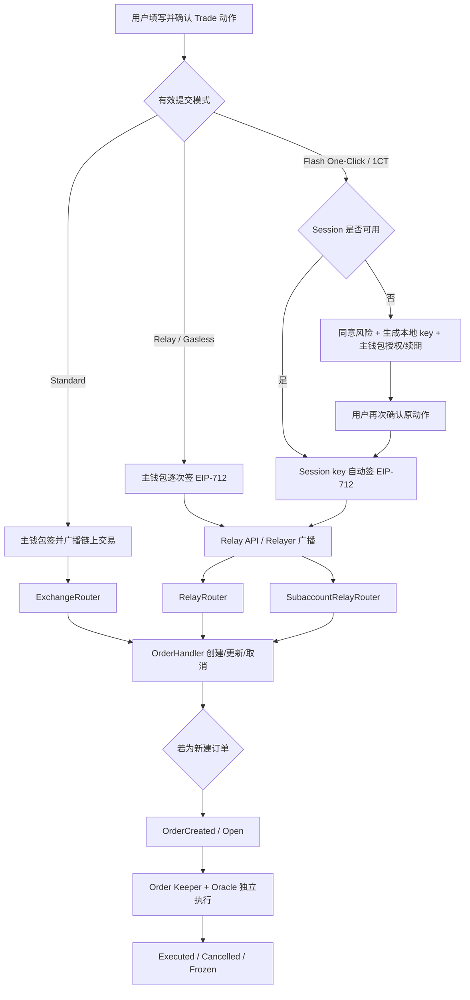

# v0.3.2 前端 Trade：两种产品模式与三条技术提交路径

> 基线以 [`Docs/contract-releases/CURRENT.json`](../../../contract-releases/CURRENT.json) 为唯一事实源。需求点编号（RQ-RELAY-01～49）与安全 / 速度 / 压力分析见 [专项-Relay-③需求与分析](<专项-Relay-③需求与分析.md>)；③ 的状态列引用本文，本文 §10 的 GAP 解除条件仍以本文为准。本文同时描述产品应有行为与 CURRENT 登记前端的静态实现现状；“源码存在”不等于已经在 v0.3.2 环境验收通过。需求先后关系、已覆盖旧口径和待决项统一见 [Trade 需求来源与冲突台账](<../Trade-需求来源与冲突台账-(v0.3.2).md>)。

## 1. 结论先行

产品层只有 **Standard** 与 **Flash One-Click/1CT** 两种用户可选模式；实现与测试层必须区分三条**技术提交路径**，不能把 direct Relay 与 One-Click 合并成同一条链路：

| 模式 | 用户动作由谁签名 | 链上交易由谁发送 | 外层入口 | 用户体验 | Relay Fee | 1CT action count |
|---|---|---|---|---|---|---|
| Standard | 主钱包签链上交易 | 主钱包 | `ExchangeRouter` | 每次操作均有钱包交易确认，并支付原生 Gas | 无 | 无 |
| Relay / Gasless（遗留代码值 `flash`，非公开产品模式） | 主钱包逐次签 EIP-712 请求 | 任意持有合法 payload 的调用者；正常产品路径为 Relayer 服务钱包 | `RelayRouter` | 用户不付原生 Gas，但每次操作仍需钱包签名；当前无公开模式卡 | 有 | 无 |
| Flash One-Click / 1CT（代码值 `1ct`） | 本地 session/subaccount key 自动签 EIP-712 请求；主钱包只负责同意、授权、续期或必要的 Permit | Relayer 服务钱包 | `SubaccountRelayRouter` | Session 可用后，普通交易不再逐笔弹主钱包 | 有 | 有 |

三条技术提交路径只改变“订单动作如何签名、由谁代发、走哪个 Router、是否收 Relay Fee”。它们不改变 OrderType、`marketIndex`、价格、仓位和风险规则。创建成功后，普通订单仍进入同一个 `OrderHandler`；后续是否触发、由 Order Keeper 何时执行、最终是 `Executed`、`Cancelled` 还是 `Frozen`，不由提交路径决定。

当前前端/合约还有六个必须在测试结论中显式保留的事实：

1. 代码状态仍定义 `standard | flash | 1ct`，但 2026-06-22 与 2026-07-23 的后续产品决定均明确最终用户只看到 **Standard** 与 **Flash One-Click**；直接 Relay/Gasless 的 `flash` 卡片隐藏是预期产品形态，不是待恢复的第三选项。未解决的是历史 `flash` 本地值仍可能形成无对应选中卡片的 zombie mode。
2. v0.3.2 合约的 `SubaccountApproval` 已强制包含 `string slot`，但 CURRENT 前端 SDK、EIP-712 类型、持久化结构和 ABI 仍缺少 `slot`。因此当前 1CT 首次授权/续期的 digest 与 calldata 均不能视为兼容 v0.3.2；功能层记 **GAP**，CURRENT 准入另保持 **NOT_READY**，不能因旧链路或静态页面可见而判 PASS。
3. CURRENT 登记的 tx-fork chainId 不在当前 SDK 的 supported chain 列表中：页面的 `isFlashAvailable` 会返回 false，Relay ingress 也会拒绝该 chainId。该环境未完成适配前不能执行 v0.3.2 Relay/1CT 的 FT/XT 回归。
4. 桌面 Trade 表单渲染了 1CT setup/renew 弹窗；移动端 `MobileOrderPanel` 虽复用同一个 CTA handler，却没有渲染该弹窗。移动主入口当前总开关关闭，但直接进入 `/m/trade` 时该潜伏路径仍存在：新用户触发“开启交易”后没有可见后续流程。
5. v0.3.2 虽声明并允许配置 `MAX_RELAY_FEE_SWAP_USD_FOR_SUBACCOUNT`，实际收费路径没有读取它；恶意或被盗 session 可自任 Relayer、操纵 gas price 与自己签署的 `maxFeeAmount`，把 Relay Fee 从主账户转给自己。全局 WNT cap 只是在非零且正确配置时限制单次规模，不能替代子账户专属 USD cap。
6. Relay create/update 调用 `OrderHandler` 时把 `shouldCapMaxExecutionFee` 固定为 `false`；若 1CT payload 允许非空 callback，恶意 session 可结合大额 execution fee 和自控 callback 套取主账户资金。当前前端通常传零 callback 只是 UI 缓解，不是合约安全边界。
7. 6 月初始批准稿要求 Relay caller 通过 Keeper 白名单，但 v0.3.2 两个 Relay Router 的外部入口没有该 ACL；任何地址拿到有效 payload 都可提交，并成为 `RelayFeePaid.keeper` 与 Relay Fee 接收方。是否接受 permissionless 模型仍需产品/安全裁决。
8. 初始批准稿要求子账户默认只授权 Create、Update/Cancel 手动开启；当前 create/update/cancel/batch 全部共用一个 `SUBACCOUNT_ORDER_ACTION`。这是一项尚未被后续明确撤销的最小权限偏差。
9. 当前 1CT 风险签名文案仍声称交易密钥绝不会移动资金，与第 5、6 项已知资金转移路径直接冲突；安全缺口修复和文案复核前，不得据此对外承诺或开放 1CT。

## 2. 术语边界

本文固定使用以下口径：

- **Relay**：主钱包逐次签名、Relayer 代发的 Gasless 模式，对应前端内部代码值 `flash` 和合约 `RelayRouter`。
- **Flash One-Click / 1CT**：Relay 基础设施上的子账户会话模式，对应代码值 `1ct` 和合约 `SubaccountRelayRouter`。
- **Flash family**：只有在泛指 Relay 与 1CT 共用的快速提交基础设施时才使用“Flash”总称。
- **Relayer 服务钱包**：广播 Relay Router 交易并成为链上 `tx.from` 的服务钱包。
- **Order Keeper**：在订单创建之后，携带 Oracle 数据调用 `OrderHandler.executeOrder` 的执行者。它与“Relay 请求的代发者”是不同职责，即使某一部署复用同一运营主体也不能在测试中混成一个阶段。

“Gasless”只表示用户不需要用自己的钱包支付该次链上交易的原生 Gas；用户仍会通过全局抵押品 Token 支付 Relay Fee，也仍会承担订单本身适用的交易费用。

## 3. 当前页面入口与可用性

### 3.1 页面入口

模式设置位于 Settings 的 **Flash Trading / Trading Preferences** 区域：

- Standard 卡片：文案为“每笔交易需要钱包签名”。
- Flash One-Click 卡片：文案为“通过会话密钥自动签名，无需每次弹出钱包确认”。
- Relay/Gasless 卡片：代码和文案仍存在，但按后续产品决定不向用户渲染；只保留内部链路与遗留状态迁移测试。
- Standard 模式下，Trade 表单底部显示“切换到一键交易”的快捷入口。
- 1CT 模式下不显示额外状态 chip；主 CTA 自己承担“开启交易 / 重新连接 / 正常下单”的状态切换。
- Settings 内的 session 状态当前只看 key、approval、expiry 和 count，不看 consent；因此可能在 Settings 显示“已开启”，回到 Trade 后又要求补签 consent。这是展示与提交门禁不一致，不应解释为第二个 session。

用户模式偏好保存在 localStorage 的 `fx100:flash:mode`，当前默认值为 `1ct`；读取层没有对历史 JSON 值做完整运行时枚举校验。Session 则按 `(chainId, owner)` 分开保存：切换钱包或网络后，模式偏好可能仍是 1CT，但新组合必须使用自己的 session 和链上授权，不能复用上一账户或上一链的签名。

### 3.2 生效条件

当前实现只有同时满足以下条件，非 Standard 路径才会生效：

1. 构建期开关 `NEXT_PUBLIC_FLASH_ENABLED=true`；默认值为关闭。
2. 当前链属于前端支持的合约网络。
3. 当前链配置了非零 `RelayRouter`。
4. 用户偏好不是 `standard`。

任一条件不满足时，`shouldUseFlash=false`，实际提交回到 Standard；设置页会禁用非 Standard 选项或隐藏整个 Flash 区域。这里的“回到 Standard”只改变**有效提交路径**，不保证同步改写本地保存的偏好值。

当前可用性判断只检查 `RelayRouter`，没有同时证明 `SubaccountRelayRouter`、Relay API/Keeper 服务和 v0.3.2 ABI 均可用。测试不能只看 1CT 按钮未禁用就下“功能可用”结论，必须把以下四项作为联合准入：

- `RelayRouter` 与 `SubaccountRelayRouter` 地址、bytecode、ABI/selector 与 CURRENT 目标合约一致；
- Relay API 可达，且请求使用当前 chainId；
- Relayer 钱包具备广播 Gas、WNT execution fee 库存和所需角色；
- 前端 SDK 的 EIP-712 schema 与 v0.3.2 合约完全一致，尤其包含 `slot`。

此外，CURRENT 登记的目标 tx-fork 必须先被加入 SDK 合约链配置、地址配置和 Relay ingress 白名单。只让钱包能连接该 RPC 不足以启用 Relay/1CT。

## 4. 模式切换规则

模式切换是“选择下一次提交使用的路径”，不是交易动作。点击模式卡片本身必须满足：

- 不弹钱包签名；
- 不发送链上交易；
- 不创建、更新、取消或执行订单；
- 不自动提交当前已填写的表单；
- 不撤销现有 1CT session；
- 不改变已经创建的 Order、Position、orderKey 或经济账户。

### 4.1 切换状态表

| 切换 | 页面应发生什么 | 页面不得发生什么 |
|---|---|---|
| Standard → 1CT，尚无可用 session | 保存 1CT 偏好；主 CTA 变为“开启交易”；点击后打开引导弹窗 | 不应在选择模式时自动签名，也不应把当前订单直接提交 |
| Standard → 1CT，已有同链同账户有效 session | 保存偏好；后续动作直接使用 session key | 不重新生成 key、不重复主钱包授权 |
| 1CT → Standard | 后续动作改走 `ExchangeRouter`；现有 session 保留，可稍后切回 | 不等同于 revoke，不删除本地 key，不撤销链上授权 |
| 1CT session 过期或次数用尽 | 主 CTA 改为“重新连接以交易”，动作被拦截并进入续期 | 不静默降级成 Standard 后自动提交 |
| Relay Fee 不足 → 点击“切换到标准模式” | 切到 Standard；手工输入原样保留，仍选中的 Max/百分比草稿按 Standard 可用额重新计算 | 不自动发送 Standard 交易；必须由用户再次确认 |
| 任务已提交后再切换模式 | 只影响下一次新动作；继续追踪旧 task/tx/order | 不取消、不重发、不用新模式覆盖旧任务状态 |
| 切换账户或网络 | 读取新 `(chainId, owner)` 的 session 状态；必要时提示重新设置 | 不把旧账户的 session signer、permit、approval 或 action count 带到新上下文 |

v0.3.2 按 CURRENT 实际功能统一为：市场、long/short、订单类型、数量单位、抵押品、杠杆、Limit/Stop 价格、TP/SL 和滑点保持不变；用户手填金额保持原值；仍处于 Max/25%/50%/75% 选择态的派生金额允许按新模式余额规则重新计算。Order Max 从 `B>C+U ? B−C−U : 0` 重算为 `B>U ? B−U : 0`；Deposit 的百分比/Max 草稿也随 `maxFeeAmount` 归零而重算。这里的“保留”不能再写成所有数值逐字节不变。无论是否重算，切换动作都不得签名、创建 task、发交易或自动提交；若重算后的值不合法，必须明确重新校验并提示。

当前 Session 面板只在 1CT 被选中时显示。用户切到 Standard 后链上授权仍存在，但“断开”入口也随面板隐藏；如果要撤权必须先切回 1CT。验收时应确认产品是否接受该交互，至少不能让用户误以为“切到 Standard = 已撤销授权”。

### 4.2 direct Relay 与遗留 `flash` 值的处理

浏览器旧数据或调试代码仍可能把本地模式值设成 `flash`。这种状态会走 direct Relay 路径，但设置页没有对应的已选卡片。后续需求已经明确**不恢复第三张公开卡片**；验收必须覆盖并消除“页面无选中项但实际走 Relay”的 zombie mode。

仍待裁决的是迁移目标：迁到 Standard 最保守但恢复逐笔链上交易；迁到 1CT 符合产品默认，但必须显式完成 setup 且不得自动提交。裁决前不得静默选择其中一个。

## 5. 三条完整提交链路



### 5.1 Standard

1. 前端校验钱包连接、账户、网络、市场、订单字段、余额、allowance、execution fee 和风控条件。
2. 前端构造 `ExchangeRouter` 单调用或 multicall；主钱包确认并广播链上交易。
3. 前端先追踪用户交易哈希和 receipt，再用事件/Reader 获取 orderKey 与链上 Order。
4. Market Order 继续等待 Order Keeper 执行；Limit/Stop/TP/SL 创建成功后进入 Open 状态并等待触发。
5. 用户支付自己的原生 Gas；该路径不构造 `RelayParams`，不产生 `relayTaskId`、Relay Fee 或 subaccount action count。

### 5.2 Relay / Gasless

1. 前端在签名前获取 Relay Fee 报价、检查 feeToken/余额，并准备必要的 ERC-2612 Permit。
2. 主钱包对本次 create、update、cancel 或 batch 的完整 EIP-712 消息签名。每一个新的用户动作都要重新签；它不是 One-Click。
3. 签名消息绑定 `account`、业务参数、随机 `userNonce`、`deadline`、目标 chainId、Router domain、feeToken 和 `maxFeeAmount`。当前动作 deadline 为签名前约 30 分钟；这是实现现状，与初始批准稿的推荐 5 分钟/不超 10 分钟存在未裁决冲突，见 DEC-TRADE-004。
4. 前端把签名 payload 发送给 Relay API，得到 `relayTaskId`；Relay 服务校验、模拟并由 Relayer 钱包广播到 `RelayRouter`。
5. 链上 `tx.from` 是 Relayer 钱包，订单经济 `account` 仍是用户主账户，不能写成 Relayer。
6. Relay Router 校验签名、chainId、deadline、digest 防重放、feeToken 和费用上限，再调用同一个 `OrderHandler`。
7. v0.3.2 合约没有 `onlyKeeper` / Relayer 白名单：后端 Relay API 是正常产品入口，但链上任何地址只要持有合法 payload 都可广播，并由 `msg.sender` 收取 Relay Fee。测试必须把“服务路由”与“合约权限”分开。

### 5.3 Flash One-Click / 1CT

1CT 在 Relay 基础上把“每次由主钱包签业务动作”替换为“本地 session key 签业务动作”。链上交易仍由 Relayer 广播，`tx.from` 仍不是 subaccount。

首次设置按以下顺序进行：

1. 用户连接主钱包时完成 Terms/Privacy 披露；它与 1CT 风险同意是两个阶段。
2. 用户主动点击“开启一键交易”。若当前 risk-consent 版本尚未留证，主钱包 `personal_sign` 一份会话密钥风险确认；同一 owner、同一版本后续可复用，版本变化才重签。
3. 浏览器本地生成随机 session 私钥，不由钱包签名派生，这一步没有钱包弹窗。
4. 主钱包签一次 `SubaccountApproval` EIP-712 授权。
5. 弹窗关闭，但**不自动提交**之前的订单；用户必须再次点击原交易 CTA。
6. 首次真正使用 Relay 时，如 Router allowance 尚不足，可能再弹一次 USDC Permit 签名；Permit/allowance 可复用后，普通动作才达到无逐笔主钱包弹窗的体验。

CURRENT 的 `EstablishConnectionModal` 虽在源码注释中写明 Terms/Privacy 已于连接钱包阶段处理，实际仍放置并强制勾选 Terms/Privacy；Settings 又允许在不检查 consent 时先生成 key/签 approval，只在 Trade 提交门再次拦截。两处都属于最终同意分层需求的实现漂移，不能反向写成产品规范。

因此当前中文文案“仅需签名一次”不是完整的首次体验：第一次至少可能出现 consent `personal_sign` 与 `SubaccountApproval` 两次主钱包签名，首次交易再可能出现一次 Permit。准确承诺应是“完成一次性设置与必要 Permit 后，稳态交易无需逐笔主钱包确认”。

当前前端授权策略为：

- 有效期 90 天；不足 3 天时显示“即将过期”。
- 每次授权/续期把累计 `maxAllowedCount` 设置为链上已用次数再加 1,000,000；这是前端策略，不是合约固定常量。
- 2026-07-23 已明确移除“页面隐藏/闲置 1 小时后强制锁定”；遗留 guard 文件未挂载，不能再按旧评审开头的 1h 规则设计期望。
- 状态包括 `needs-session`、`needs-approval`、`active`、`expiring-soon`、`expired`、`limit-reached`。
- 已签但尚未随下一笔动作上链的续期，会使用“链上值与待提交授权的较大值”作为有效上限，保证下一笔动作能够携带并激活续期。
- create/update/cancel 每一项计一次 action；batch 的 action count 按批内 `create + update + cancel` 项数增加，不是按“一次点击 / 一个 task”固定加 1。

| Session 状态 | 含义 | Trade 主 CTA 行为 |
|---|---|---|
| `needs-session` | 本地没有当前链/owner 的 session key | 进入 setup，不提交订单 |
| `needs-approval` | key 已生成，但既无待提交 approval，也无有效链上注册 | 继续/重做 approval setup |
| `active` | 时间与 count 均可用 | consent 也有效时直接以 session 签动作；consent 缺失/版本旧则只补 consent |
| `expiring-soon` | 距有效期不足 3 天但尚未到期 | 仍可交易；Settings 提示提前续期 |
| `expired` | 前端判定时间已到 | 主 CTA 改为 renew，续期完成前不提交 |
| `limit-reached` | 前端判定 action count 已到上限 | 主 CTA 改为 renew，续期完成前不提交 |

v0.3.2 合约授权还要求：

- `slot`：大小写敏感的原始命名字符串；授权 EIP-712、hash 和 calldata 必须全部包含同一个值。
- 最多 4 个 active slot；同名 slot 可替换其 subaccount，同一个非零 subaccount 不能同时占多个 slot。
- `removeSubaccount` 只清空该地址的授权映射，不释放 active slot；必须调用 `removeSlot` 才真正释放名额。若前端每次重建都换新 slot，会在多次断开/重建后耗尽四槽。
- 合约没有禁止空字符串 slot，也没有 slot 长度上限；空字符串当前会作为真实命名槽写入。产品若要求可读且非空，需要另加前端/合约约束。
- `removeSubaccount` 不清该地址的 expiry、maxAllowedCount、actionCount 等按地址存储的历史字段；同一地址以后被重新授权时必须核对是否继承旧计数和限制，不能把“撤授权”写成“删除全部历史”。
- approval nonce 按 owner 全局共享，而不是每个 slot 独立；两个槽位并发签授权时，后一笔可能因旧 nonce 失败，必须刷新后重签。
- `expiresAt`、`maxAllowedCount`、`actionType`、approval nonce、`desChainId`、`deadline`、`integrationId` 均须与签名和链上状态一致。
- 合约在 `block.timestamp > expiresAt` 时才判过期，且只在 `newCount > maxAllowedCount` 时拒绝；所以“恰好到期秒”和“恰好达到最大计数”在合约层仍有效。当前前端在两个等号点已经按过期/耗尽处理，属于保守一格差异，边界用例必须分别记录 UI 与合约结果。
- 设计上，subaccount 创建订单时 receiver/cancellationReceiver 等应受主账户约束，session 只能执行获批的订单动作；但这不能写成当前版本已保证“无法转移主账户资金”，因为下文两项 Relay Fee/execution fee cap 漏接线仍形成已知资金安全 GAP。

### 5.4 Session 保存、退出与撤销

| 功能 | 当前行为 | 测试要求 |
|---|---|---|
| Stay connected 开启 | 默认开启；session 数据存 `localStorage`，浏览器重启后保留 | 刷新/重启后只复用同链同 owner 的有效 session |
| Stay connected 关闭 | session 数据迁到 `sessionStorage`，关闭 tab 后清除 | 不残留到 localStorage；重新打开需设置 |
| 切到 Standard | 只切模式，不撤权 | 再切回 1CT 时，有效 session 可复用 |
| Disconnect/断开一键交易 | 主钱包调用 `SubaccountRouter.removeSubaccount`，receipt 成功后再清本地状态；当前动作不会释放命名 slot，也不会清该地址的 action 历史字段 | 用户拒签或链上失败时不得先删本地状态并伪装撤权成功；另查 slot 是否仍占位及地址复用后的计数 |
| 过期/次数用尽 | 阻断 1CT 动作，提示续签 | 不自动用失效 key 提交，也不静默改走 Standard |

Session 私钥虽以 AES 字符串保存，但当前解密口令是公开的 owner 地址。这只能避免明文展示，不能抵御浏览器存储泄漏；安全性主要依赖“trade-only 权限、有效期、action count、链/账户绑定和链上可撤销”。因此需要测试 XSS/本地存储清理、账户切换和撤权后的旧 key 重放，而不能把“已加密”当作充分安全结论。

## 6. 支持的 Trade 动作

CURRENT 前端为以下动作接入了 Standard 与 Relay family 分支。这里的“已接入”仅说明代码存在；1CT 的 v0.3.2 `slot` GAP 解除前，不能据此判定 1CT 端到端可用。当前所有 1CT 订单动作共用 `SUBACCOUNT_ORDER_ACTION`，并非 Create/Update/Cancel 分项授权。

| 功能动作 | Standard | Relay / 1CT 设计 | 批量与计数要求 |
|---|---|---|---|
| Market / Limit / Stop 开仓、加仓 | `ExchangeRouter` create/multicall | Relay create；1CT 为 subaccount relay create | 附加 TP/SL 时可组成 batch |
| 开仓同时创建 TP/SL | 同一 multicall 创建主单和保护单 | 一个 relay batch、一份业务签名、一个 task、一笔 Relay Fee | 1CT action count 按实际 create legs 数累计 |
| Market 部分/全部平仓 | Standard `MarketDecrease` | Relay/Subaccount relay create decrease order | 创建后仍由 Order Keeper 执行 |
| Limit 减仓、TP、SL | Standard trigger decrease | Relay/Subaccount relay create | OrderCreated 只表示保护单已生效，不表示已成交 |
| 为现有仓位新增 TP/SL | multicall 批量创建 | relay batch 创建一个或两个保护单 | action count 按实际腿数累计 |
| 更新挂单 | Standard update；特定 TP/SL 可走 cancel+create 替换 | relay update 或原子的 relay cancel+create batch | batch 内每个 update/cancel/create 分别计数 |
| 取消单笔订单 | Standard cancel | relay cancel | 取消动作也收 Relay Fee，但不新增 execution fee；Market Order 需超过请求过期时间才允许取消 |
| Cancel All / 多单撤销 | Standard multicall | 一个 relay batch、一个 task、一个 Relay Fee；当前入口排除 Market Order 和暂停取消的订单，但缺少共享 1CT setup/renew gate | action count 增加实际取消的订单数；无 session 时不得悄悄退成直接 Relay |
| 调整杠杆 | 通过 Increase/Decrease 改 size | Relay create Increase/Decrease | 仍受 OI、容量、最大仓位和杠杆限制 |
| 增加/提取保证金 | 通过 sizeDelta=0 的 Increase/Decrease | Relay create Increase/Decrease | 仍需核对 Funding、费用与清算安全边界 |
| Protection Roll / Close & Reopen | 先 Market Close，再按产品流程 Reopen | Relay family 代码可参与；当前快捷入口缺少共享 1CT setup/renew gate | 两阶段分别追踪，不能只平仓不重开，也不能用失效 session 提交 |

用户可创建的 OrderType 是 Market/Limit/Stop Increase 与 Market/Limit/StopLoss Decrease 六种；Liquidation 不是用户模式。Market Order 不可正常 update，且只有超过 `REQUEST_EXPIRATION_TIME` 后才可取消；Limit、Stop、TP、SL 才是常规更新/撤销对象。Relay batch 固定按 create → update → cancel 的顺序执行，任一腿失败整笔回滚；“一个 task/一笔 Relay Fee”不能被误解为非原子或只计一次 1CT action。

提交路径不能绕过订单业务校验。相同 market、方向、OrderType、size、价格、collateral 和滑点输入，三条技术提交路径的 Order/Position/OI/Funding/PnL 经济结果应一致；允许差异仅限签名主体、外层 Router、`tx.from`、Relay Fee、task 状态和 1CT action count。

跨模式管理同一对象也是正式功能：例如用 Standard 创建 Limit Order 后可用 Relay/1CT 更新或取消；也可用 Relay 创建仓位后切到 Standard 平仓。无论如何，order `account`、orderKey 所有权和 position key 均不得因模式改变。

## 7. Gas、Execution Fee、Relay Fee 与 Permit

### 7.1 费用责任

| 项目 | Standard | Relay / 1CT |
|---|---|---|
| 链上交易 Gas | 主钱包以原生 Token 支付 | Relayer 钱包支付 |
| Order execution fee | 用户在 Standard 提交链路中提供；满足 subsidy 条件时可为 0 | 非 subsidy 时由 Relayer 先把 WNT execution fee 送入 OrderVault |
| Relay Fee | 不适用 | 按 Relay 调用实际 Gas、配置倍率、calldata、Relayer 垫付的 execution fee 和 Oracle 换价，从用户 feeToken 收取 |
| feeToken | 不适用 | 必须等于 DataStore 全局 `COLLATERAL_TOKEN`；当前前端使用链默认 USDC/6 decimals，不提供用户自由选择 |

Relay/1CT 中的 `Order.numbers.executionFee` 仍是订单字段，但对应 WNT 由 Relayer 先行垫付，并计入 Relay Fee 的 native fee。页面可以分别解释“订单需要的 execution fee”和“预计 Relay Fee”，但总支付与余额差分不得把同一笔垫付费用重复计为两次独立用户支出。

非补贴 create/update 的完整资金流是：Relayer 先从自身向 OrderVault 转 WNT→Router 再按 Oracle 价格从用户收 feeToken 补偿“实际 Relay gas + 垫付 execution fee”→Order Keeper 执行/取消时按实际 gas 取 execution fee，剩余 WNT 通常 unwrap 为 native 退给 order receiver/cancellationReceiver。因此用户可以没有 native/WNT，但账本需同时对拍 feeToken 扣款和 native 退款；补贴 update 直接退 WNT 的分支不得与正常 unwrap 分支混用。`maxFeeAmount` 只是当次签名上限，不是先扣上限再退差额。

### 7.2 前端报价与余额门

除已经确认的 Max 两级预留公式外，以下费率、cap 和异常分类数值是 **CURRENT 实现现状**；仍待产品/风控裁决的项目以冲突台账为准：

- 每 30 秒刷新 Relay Fee 报价，签名后、发给 Keeper 前再用最新链上配置和 Oracle 价格复查上限。
- `displayFeeAmount` 用于页面估算；`maxFeeAmount` 是 EIP-712 签名的授权上限；`RelayFeePaid.feeAmount` 才是实际扣款，三者不得混为一个数。
- 展示估算使用 1.2× buffer 且最低显示 0.01 USDC；签名上限使用 3×安全倍率、最低 0.5 USDC、最高 25 USDC。上限较大不代表实际扣这么多；初始批准稿的 10 USDC 硬顶和超过 2 USDC 二次确认尚未被新产品决定正式替代，见 DEC-TRADE-005。
- shared gate 对报价 loading、不可用、余额未知和已确认不足都返回 blocked；Increase Order、Update Order、Protection Roll/Close-Reopen 会消费完整 blocked，多个 Close/Margin/Leverage/TP-SL/Cancel 入口却只消费 insufficient。后者在 loading/unavailable 时 UI 可继续点，但提交 helper 仍需 fresh quote；必须按动作分别留证，不能写成统一行为。
- 已确认 `USDC balance < businessAmount + maxFeeAmount` 时，精确显示 `Insufficient USDC for Relay Fee` 与 `Switch to Standard`；等号允许。产品处理是提示用户改走 Standard，不自动切换、不自动提交；用户点击切换并再次确认 CTA 后才走 Standard。
- v0.3.2 Relay/1CT Max 的唯一口径是：先预留本次 signed `maxFeeAmount`，再额外预留 1 USDC。

#### 7.2.1 Relay/1CT Max 计算

对同一 6 位 USDC 同时作为 payToken 和 feeToken 的情形，定义：

- `B`：钱包 USDC 余额，raw unit；
- `C`：当前链、当前 feeToken、当前动作 fresh quote 的 signed `maxFeeAmount`；
- `U = 1_000_000 raw = 1 USDC`；
- `S = B > C ? B − C : 0`。

CURRENT 的精确函数不是近似值：

```text
MaxBudget = S > U ? S − U : 0
          = B > C + U ? B − C − U : 0
```

这里是严格大于：`B = C + U` 仍得到 0，只有 `B = C + U + 1 raw` 才得到 1 raw。`C` 当前至少为 0.5 USDC，因此当 cap 命中下限时，Max 要得到正数必须满足 `B > 1.5 USDC`。例如 `B=1,000`、`C=0.5` 时 Max 为 `998.5 USDC`；`B=1.48`、`C=0.5` 时 `S=0.98≤1`，Max 为 0。

| `B` 相对 `C+U` | CURRENT MaxBudget | 当前页面表现 | 建议验收 |
|---|---:|---|---|
| `B<C` | 0 | spendable 先钳为 0 | Max 禁用或显示明确原因；不得沿用旧输入 |
| `B=C` | 0 | 同上 | 覆盖 signed cap 等号，但没有业务可投金额 |
| `C<B<C+U` | 0 | Pay/Size handler 直接 return | 不得“点击无反应”；显示需至少保留 `C+U` |
| `B=C+U−1 raw` | 0 | 确定性死区 | 与截图场景同类，P0 回归 |
| `B=C+U` | 0 | 严格等号仍为 0 | 等号边界单独断言 |
| `B=C+U+1 raw` | 1 raw | 进入格式化/精度链 | 页面值、payload 和舍入不得变成超余额 |
| `B≫C+U` | `B−C−U` | 正常 Max | signed cap、额外 `U` 和业务金额三段可解释 |

当前 Pay/Size 两条 Max handler 在结果为 0 时直接返回，不清空既有值、不置灰、也不提示；空输入看起来是“没反应”，已有输入则可能保留一个并非本次 Max 的旧值。这是明确的前端交互 GAP，不能把计算为 0 本身误报成随机故障。

pay 模式直接把 `MaxBudget` 作为提交预算；gross-up 模式从该预算反推净抵押，使抵押加 Position Fee 不超过预算；size 模式先按 payToken `minPrice`、token decimals、杠杆和 Position Fee 反推可下单 size。三种输入模式都必须以同一个 raw budget 为起点并独立验证取整。

#### 7.2.2 功能适用范围与越界行为

建议把功能边界固定为 Relay family 的所有 Increase 类订单——`MarketIncrease`、`LimitIncrease`、`StopIncrease`，open/add、long/short，桌面/移动端的 pay、gross-up、size——以及 Adjust Margin 的 Deposit。direct Relay 没有独立公开模式卡，但隐藏 `mode=flash` 与 1CT 共用 Max 计算；至少各取一条技术路径证据。以下行为不能混为一个断言：

| 场景 | 建议的功能边界 | CURRENT 可达/结构行为 |
|---|---|---|
| Relay/1CT，payToken=feeToken=6 位 USDC | `B−C−U`，严格门槛如上 | 符合 |
| Standard | 不预留 Relay cap 或 Relay 专用 `U` | 仍固定减 `1_000_000 raw`，属于作用域泄漏 |
| Relay/1CT，payToken≠feeToken | payToken Max 不减 USDC cap/`U`；另以 feeToken 余额核对 `C` | 当前公开 UI 不支持；强制走 helper 时 `C=0`，仍从 payToken 减 `1_000_000 raw` |
| payToken 为 8 位 / 18 位非 USDC | 不得把 1,000,000 raw 称为 1 USDC | 当前公开 UI 不支持；结构探针会分别只减 `0.01 token` / `10^-12 token` |
| quote 的 chain/token 与当前表单不匹配 | 不得复用旧 `C`；等待匹配的新报价 | `C=0`，Max 仍继续固定减 raw reserve |

因此 `1_000_000 raw` 只能在“当前动作确实以 6 位 USDC 作为同一 pay/fee token”的边界内解释为 1 USDC。当前 Mock index token 的 6/8/18 位只影响 size-token 换算，不改变 USDC reserve；不要把 index token decimals 当成 pay/fee token 支持证据。若未来 USDC decimals 或 feeToken 配置变化，reserve 应由运行时 token metadata 推导；不要把固定 raw 值施加到任意 Mock Token。

#### 7.2.3 Deposit、百分比与切换

Deposit 还受仓位风险上限 `riskMax` 约束，CURRENT 的 100% 点击值为：

```text
depositMax = min(riskMax, max(B − C − U, 0))
```

必须各做 wallet-bound（钱包侧更小）与 risk-bound（仓位风险上限更小）样本。手工输入当前最多可到 `min(riskMax, B−C)`；25%/50%/75% 也从未扣额外 `U` 的值计算。因此“额外留 1 USDC”是 Max 按钮规则，不是所有 Deposit 提交的全局不变量。Margin gate 又把运行时 collateral raw amount 直接当 6 位 USDC 与 `C` 相加；非 USDC/非 6 位 collateral 必须单独测试单位错配。

从 Relay/1CT 切到 Standard 时 `C` 变为 0。若 Max/百分比仍处于选中态，Order 与 Deposit 都会自动重算；手工输入则不变。切换动作本身必须保持零签名、零 task、零交易；用户再次点击 Standard CTA 后，证据应为主钱包→`ExchangeRouter`、零 `RelayFeePaid` 且只创建一笔目标 Order。

Withdraw Max 与 Order/Deposit 的钱包 Max 不是同一公式。CURRENT 先计算链上清算 floor（同时包含 factor 与 absolute `minCollateralUsd` 来源），增加 25% Max-fill 余量并向上取整，再与 Position action threshold 取较高值：

```text
bufferedLiquidationFloor = liquidationFloor + ceil(liquidationFloor × 2500 / 10000)
requiredUsd = max(actionThresholdUsd, bufferedLiquidationFloor)
maintenanceCeiling = max(equityUsd − requiredUsd, 0)
leverageCeiling = max(settledMarginUsd − ceil(sizeInUsd × 10000 / maxLeverageBps), 0)
withdrawMaxUsd = min(maintenanceCeiling, leverageCeiling)
```

最后再按 collateral price 与 decimals 向风险侧换算为可提交 raw amount。必须分别构造 factor floor 主导、absolute floor 主导、maintenance-bound、leverage-bound 和两 ceiling 等号样本，并覆盖 25% 向上取整的相邻 raw 值。Withdraw 金额本身不扣 Relay 专用 `U`，因此同一仓位快照在 Standard 与 1CT 下应完全相同；1CT 仅额外执行 fee-only 的 `maxFeeAmount` 余额门。切换模式不得改变已计算的 Withdraw Max，也不得自动提交。对应原子用例为 `FT-RELAY-MAX-028`。

#### 7.2.4 余额门与报价状态

令 `Q` 为本次动作实际需要从 feeToken 余额占用的业务金额，gate 的三点边界是 `B_fee=Q+C−1 / Q+C / Q+C+1 raw`：只有第一档为 confirmed insufficient，等号和加 1 通过。`B_fee<Q` 是业务余额不足，不能显示成 Relay Fee 不足；`Q≤B_fee<Q+C` 才显示 Relay 专用不足提示。

loading、balance loading、balance unavailable、quote unavailable 和 `maxFeeAmount>25 USDC` 必须与 confirmed insufficient 分开。CURRENT 超过 25 USDC 的专用错误会被 quote hook 折叠成 `unavailable`；只有 insufficient 分支显示 `Switch to Standard`。所有分支都要断言签名/task/tx/Order 为零，或明确记录某些 action consumer 的 fail-open UI 与 submit-time fresh-quote 拒绝。

当前页面 tooltip 写“实际费用不超过此估算”，但展示值是 `displayFeeAmount`，真正的硬上限是签名里的 `maxFeeAmount`，两者不同。正确验收口径是：实际扣费按链上消耗结算，通常接近展示估算，且必须不超过用户签署的最大费用上限；不能拿展示值当合约保证上限。

### 7.3 Permit

Relay Router 通过底层 `Router.pluginTransfer` 拉取 collateral 与 Relay Fee，因此前端可能需要 ERC-2612 Permit：

- owner 必须是用户主账户，spender 必须是 `Router`。
- 当前前端按需签 `MAX_UINT256` Permit，签名 deadline 5 分钟（`lib/relay/permit.ts:145` = 300 秒，2026-09-10 按 `b4331c15` 核对；`lib/relay/README.md` 与 SDK `configs/flash.ts` 的「约 1 小时」常量无引用、已过期），并只在内存里缓存可用 Permit/allowance。
- create 的 Permit 覆盖 `initialCollateralAmount + maxFeeAmount`；fee-only 动作至少要覆盖 `maxFeeAmount`。
- Permit 被纳入 Relay payload 的签名哈希；错误 owner/spender 必须拒绝。合约会捕获 token 的 Permit 调用失败，所以若既有 allowance 已足够，Permit 本身失败后业务仍可能继续。
- Permit 签名成功不等于订单已提交；后续 EIP-712、Keeper 或链上失败仍必须显示真实失败状态。
- 1CT 的“无逐笔钱包弹窗”应表述为 setup 与首次必要 Permit 完成后的稳态体验。
- 切到 Standard、断开 1CT 或删除浏览器 session 都不会撤销 `Router` 的 ERC-20 allowance；当前签的是 `MAX_UINT256`，其信任边界包含所有被治理授予 `ROUTER_PLUGIN` 的合约，前端应单独说明和提供 allowance 管理入口。

完整 Relay Fee 合约公式与边界见 [02-订单类型与交易流程.md](../02-订单类型与交易流程.md#5-relay-fee-流程与功能点)。

### 7.4 1CT 费用权限的当前安全边界

1CT session 自己签署的 `maxFeeAmount` 不是可信的“主账户确认额度”，因此合约必须另有独立上限。v0.3.2 当前存在两条不同的未修复风险：

1. **Relay Fee cap 漏接线**：`MAX_RELAY_FEE_SWAP_USD_FOR_SUBACCOUNT` 已声明且可配置，但 `_payRelayFee` 不读取它；调用者又是 Relay Fee 的收款人。恶意/泄漏的 session 可自任 Relayer、抬高 gas price 并签较大 `maxFeeAmount`，从主账户扣 feeToken 给自己。
2. **Execution Fee callback cap 漏接线**：Relay create/update 共用路径向 `OrderHandler` 传 `shouldCapMaxExecutionFee=false`。恶意 session 若构造非空 callback 与大额 execution fee，可通过 callback 退款路径套取主账户资金。

`MAX_RELAY_SWAP_WNT_CAP` 非零时能限制一次 Relay 调用的 native fee，但它是全局 WNT cap，不按 subaccount 身份限制、为 0 时跳过、也不能阻止重复小额调用。因此不能把它当成上述两个专属保护已经实现。前端当前创建订单时通常把 callback 设为零、并限制签署的费用上限，这些是有价值的 UI 缓解，但不能代替合约对任意合法签名 payload 的强制约束。

安全验收必须以 [v0.3.2 Bug 注册表 R8-B02 与 R8-B21](../../需求文档/2026-08-12_Bug-注册表（R1~R8，含Zenith专题）.md#r8-b02) 为依据：分别覆盖全局 WNT cap 为 0/非 0、子账户专属 USD cap、恶意 gas price、重复调用、非空 callback、大额 execution fee 和主账户/攻击者余额守恒。

## 8. Relay task 与 Order 生命周期必须分开

### 8.1 Standard 状态链

```text
wallet signing → tx pending → receipt success/revert → OrderCreated → Open/Executed/Cancelled/Frozen
```

### 8.2 Relay / 1CT 状态链

```text
EIP-712 signing → relay task accepted → pending/submitted → executed|failed
                                               ↓
                                      txHash → OrderCreated
                                               ↓
                                  Open/Executed/Cancelled/Frozen
```

前端当前每 2 秒轮询 Relay task，最多 90 次，约 3 分钟。短暂网络错误会继续轮询；超时必须显示超时而不是成功。

“Order Tracking”偏好当前默认关闭：关闭时主要通过可更新 toast 呈现 signing/task/tx/order 状态，开启后才展示完整跟踪 Modal。两种展示都必须绑定同一个 taskId、txHash 与 orderKey，不能因 Modal 未打开而省略终态追踪。

Relay API 返回 taskId 时，CURRENT 前端会先把本地 `submissionState` 记为 success；这只表示“请求已受理”，不是链上成功。前端约 3 分钟轮询超时、Relayer 等 receipt 约 60 秒、服务端 task TTL 约 1 小时是三个不同概念；当前 submitted+txHash 超时后缺自动 receipt reconciler，所以“最终必然自动收敛”不能作为已实现结论。

Standard 取消与 1CT 取消必须给出同等终态反馈：同一 toast 从 `Cancel Submitted` 升级为 `Order Canceled` 或准确错误，不能永久停在 waiting；钱包签名/确认超过 8 秒时 toast 不得提前消失；一般风险警告、amber 说明与真正 error 需有可区分的层级。

状态语义：

- Relay `executed`：Relayer 广播的 Router 交易已成功执行。
- `OrderCreated`：订单已写入 Order Store。
- Limit/Stop/TP/SL 的“Order Active”：挂单已生效，仍未成交。
- Market Order 的 `FILLED`：Order Keeper 已完成执行并更新仓位。
- `Cancelled`：订单被用户取消或执行阶段按规则取消；需展示原因。
- `Frozen`：订单仍存在并等待处理/重试，不能伪装为取消或成交。

因此 Relay task `executed` 绝不等于 Limit/Stop 已成交，也不必然等于 Market Order 已 `FILLED`。测试必须同时保存 `relayTaskId`、relay txHash、orderKey 和最终订单/仓位状态。

## 9. 异常、恢复与防重复

| 异常 | 前端预期 | 关键不变量 |
|---|---|---|
| 用户拒绝 consent、approval、Permit 或逐次 Relay 签名 | 结束 loading，显示可理解的拒签提示，可重新发起 | 无链上订单、无 Relay Fee、无假成功 |
| 钱包账户或网络在异步准备期间切换 | 最终签名前再次校验并中止 | 不使用旧 account/chain 的签名或 permit |
| session 不存在/未授权 | CTA 进入 setup | 不把业务动作发送给 Keeper |
| session 过期/次数用尽 | CTA 进入 renew | 续期成功前不提交业务动作 |
| approval nonce 已旧 | 提示重新授权 | 不无限重试同一旧签名 |
| Relay Fee 报价不可用或超过前端 25 USDC cap | 阻断并建议重试/切 Standard | 不签一个未知或无界的费用上限 |
| feeToken 余额不足 | 提示并提供切 Standard | 不发必然 `ERC20InsufficientBalance` 的请求 |
| Relay API 4xx/5xx 或 payload 校验失败 | 显示真实错误，允许用户修正后新建请求 | 不生成本地假 orderKey |
| Relayer 模拟或上链 revert | task 标记 failed，并展示可识别的 revert 原因 | 不把 API 已接收当链上成功 |
| Relay task 轮询超时 | 显示超时并保留可追查 taskId | 重试前先核对原 task，避免重复下单 |
| Indexer 延迟 | 继续用 tx/event/Reader 判断链上事实，并提示同步中 | 不把历史列表暂未刷新当成链上失败 |

同一正在处理的开仓提交应受前端 submission lock 保护。第一次点击必须同步占用锁，不能等 React 下一次渲染后才禁用；桌面双击/连点/Enter 和移动端连续 tap 都只能产生一次逻辑请求。CTA 从 preflight、Permit/EIP-712 签名、Relay API pending 到 task accepted 但尚无 `txHash` 期间保持禁用并显示提交中；不能把后端队列去重或链上重放失败当作前端防重复。CURRENT 在 `useSubmissionLock` 中使用同步 ref，并在同一 submission 的 `txHash` 到达前继续持锁；主开仓按钮原子验证见 `FT-RELAY-SUBMIT-029`。提交状态弹窗自身的重复点击、Retry、关闭重开与重复回调另保留 `FT-RELAY-SUBMIT-030` 用例位，待核对实际可达交互后细化，不与主 CTA 用例混写。重试还必须区分：

- 原 task 状态未知：先按 taskId 查询，不能直接再签一份新订单。
- 原 task 已明确终态失败：使用新的 `userNonce`、deadline 和签名发起新请求。
- 原 task 已成功创建订单但订单尚未成交：继续追踪该 orderKey，不得重复创建。

链上重放保护记录的是完整 EIP-712 digest：完全相同签名再次提交会失败；相同 `userNonce` 配不同 payload 会得到不同 digest。当前 Relay 队列却以 `(account, userNonce)` 做 30 分钟去重，因此“同 nonce、不同 payload”可能在 API 层拿到旧 task；测试要同时覆盖链上 digest 规则和队列幂等键，不能只验证随机 nonce 碰撞概率低。

Relay task 的服务端 TTL 当前为 1 小时；前端约 3 分钟轮询超时只是客户端停止等待，不等于服务端任务或链上交易失败。Relayer 广播后若等待 receipt 超时，会保留 `submitted + txHash` 而不是自动重发；当前 `MAX_RETRIES=1`，即首次尝试后最多再自动重试一次，并且只针对传输/RPC/不可解码错误，已解码的确定性合约 revert 直接终止。恢复操作必须优先用 taskId、txHash 和 receipt 查明原动作。

## 10. v0.3.2 当前实现 GAP

| 优先级 | GAP | 影响 | 解除条件 |
|---|---|---|---|
| P0 | 前端 `SubaccountApproval` 类型、EIP-712 schema、hash ABI、持久化结构和 Router ABI 均缺 v0.3.2 的 `slot` | 1CT 首次授权/续期签名 digest 与 calldata selector/tuple 不兼容目标合约 | SDK/App/Keeper 全链路补 `slot`；与合约 digest 对拍；首次授权、续期、create/update/cancel/batch 均在 v0.3.2 环境通过 |
| P0 | CURRENT 目标 tx-fork chainId 不在当前 SDK supported chain 列表，Relay ingress 同样拒绝 | 页面强制判 Flash unavailable，Relay/1CT FT/XT 无法在目标环境执行 | 增加该环境的 chain/address 配置及 ingress 支持，按 CURRENT 部署读回 Router 后重跑准入 |
| P0 | 页面显示 1CT 只由通用 `RelayRouter` 可用性驱动，未完整验证 `SubaccountRelayRouter` 与 schema 兼容 | 可能出现“按钮可选但提交必失败” | 1CT 单独检查 Router、ABI/版本和后端能力，失败时禁用并给原因 |
| P0 | Terms/Privacy 与 1CT 风险 consent 的实际 UI 未按最终需求分层，Settings 又可绕过 consent 先签 approval | 用户重复确认或出现“Settings 已开启、Trade 仍未 ready” | 钱包连接阶段处理 Terms/Privacy；1CT modal 只做 owner+version 风险 `personal_sign`；Settings/Trade 共用 readiness；通过 FT-FLASH-CONSENT-006 |
| P0 | 1CT consent 仍声称 key “can never withdraw or move your funds” | 与 R8-B02/R8-B21 可复现资金转移路径直接矛盾，属误导安全承诺 | 修复强制 cap 并删除绝对化文案；安全/法务复核；通过 FT-FLASH-RISK-007 |
| P0 | `MAX_RELAY_FEE_SWAP_USD_FOR_SUBACCOUNT` 已声明但收费路径未读取，session 可自任 Relayer 并把 Relay Fee 支给自己（R8-B02） | 恶意或泄漏 session 可利用 gas price、自己签署的费用上限和重复调用转移主账户 feeToken | 合约强制子账户专属 USD cap；覆盖 cap 为 0/边界/越界、恶意 gas price、重复调用和余额守恒；完成安全复测 |
| P1 | Relay create/update 固定 `shouldCapMaxExecutionFee=false`，非空 callback 可绕过子账户 execution fee 封顶（R8-B21） | 恶意 session 可用大额 execution fee 与自控 callback 套取主账户资金 | Subaccount Relay 按 callback 情况强制 cap 或禁止不安全 callback；覆盖 create/update/batch 和退款路径 |
| P1 | 公开 UI 已按最终产品决定隐藏 direct Relay 卡，但历史 `flash` 本地值仍会走该路径 | 页面可能没有任何选中卡，但实际继续 direct Relay，形成 zombie mode | 不恢复第三张公开卡；按 DEC-TRADE-001 选定迁移目标，并覆盖旧 localStorage 升级 |
| P1 | 前端当前每 `(chainId, owner)` 只管理一个本地 session，未提供 v0.3.2 四个命名 slot 的查看、选择、替换、`removeSlot` 或 `revokeAll` UI；Disconnect 只调用 `removeSubaccount` | 多设备/多槽无法完整管理；反复换 slot 会耗尽四槽；90 天长授权缺少可发现/可覆盖/可全部撤销的安全前提 | 按 DEC-TRADE-006 确定产品槽数；增加槽位管理、旧设备覆盖、真正释放和全部退出能力；覆盖旧 key 重放、共享 nonce 并发与 Reader 回显 |
| P1 | Session 私钥用公开 owner 地址作为 AES 输入，默认长期存在 localStorage；默认授权期和动作上限又较大 | XSS、恶意扩展或浏览器 profile 泄漏可取得可用 session，不能把“已加密”视为安全存储 | 强化密钥存储与 CSP/XSS 防护；缩短/可配授权范围；提供清晰撤权与异常 session 监控 |
| P1 | 移动端 Trade 表单调用 1CT setup CTA，但没有渲染 setup/renew modal；当前主入口关闭但 `/m/trade` 潜伏路径仍可达 | 移动端新用户点击后无可见流程，无法建立 session | 移动端渲染同一弹窗并完成真实设备 setup、拒签、续期与返回表单测试 |
| P1 | Cancel All 与 Protection Roll 快捷入口未使用共享 1CT setup/renew gate | 无 config 时可能退成主钱包 direct Relay；过期/次数耗尽时可能发送必失败的 session 请求 | 两个入口接入同一 gate；覆盖无 session、过期、limit-reached 和有效 session |
| P1 | Settings 的“已开启”状态不检查 consent，而 Trade 提交门检查 | 用户刚在 Settings 完成授权仍可能回到 Trade 再看到“开启交易” | Settings 和 Trade 使用同一 readiness 模型，或明确显示“授权完成/待同意”两个状态 |
| P1 | 首次设置文案称“仅需签名一次”，实际为 consent + approval，首单还可能有 Permit | 用户对钱包弹窗次数预期错误，容易中途拒签 | 文案拆分一次性步骤与稳态体验；逐阶段显示进度和失败恢复 |
| P1 | Relay Fee tooltip 把展示估算误写成实际扣费上限 | 用户误以为 `displayFeeAmount` 是硬上限 | 改为实际按链上消耗结算且不超过签署的 `maxFeeAmount`，并在签名前可查看上限 |
| P1 | Max 的 `B−C−U` 主公式已确认，但固定 `1_000_000 raw` 仍泄漏到 Standard；未来开放非同一 feeToken 或非 6 位 payToken 时也会错用 raw 单位 | Standard 少报可用额；未来 Token 扩展会产生错误经济含义；旧 quote/Token 切换可能留下错误 Max | 将 reserve 收口到 Relay family + 当前 6 位 USDC pay/feeToken；其他 Token 用运行时 decimals 与独立 feeToken gate；通过 FT-RELAY-USDC-015、FT-RELAY-MAX-018 |
| P0 | `B≤C+U` 时 Order Pay/Size Max handler 直接 return，不置灰、不清旧值、不提示 | cap floor=0.5U 时形成最小 1.5U 的确定性无响应区；用户可能误把旧输入当 Max | 覆盖 `C+U−1/= /+1 raw`；0 结果显示明确原因并清除 Max 标记/旧值；通过 FT-RELAY-USDC-015 |
| P1 | Deposit 把 runtime collateral raw amount 当 6 位 USDC 传入 fee gate；不同动作对 loading/unavailable 又分别 fail-open/fail-closed | 非 6 位抵押物比较单位错误；相同报价异常在不同入口表现不一致 | 统一 amount 单位与 gate 消费；保留紧急退出策略时也必须在 submit 前安全失败；通过 FT-RELAY-MAX-018/020 |
| P2 | 切到 Standard 后 session/revoke 面板隐藏，但授权仍有效 | 用户可能误认为已断开，且撤权入口不易发现 | 在 Standard 下提供“管理/撤销已有一键授权”入口或明确引导 |
| P2 | 切到 Standard、断开 session 或清浏览器数据都不会撤销 `Router` 的 `MAX_UINT256` Token allowance | 用户可能误认为所有权限已解除；风险边界仍包含获批 Router plugins | 单独展示并管理 allowance；撤销流程和文案明确区分 session 授权与 ERC-20 allowance |
| P2 | 非支持链上保存的 1CT 偏好不会改写，页面也没有清晰显示“有效路径已回退 Standard” | 选中态与实际路由可能不一致 | 单独展示偏好模式与有效模式，或在不可用时显式切换并告知 |
| P1 | 构建期开关和 Router 地址通过不代表 Relay API、Relayer 资金/角色、Oracle 和 Keeper 就绪 | 运行时才暴露失败 | 将依赖健康检查纳入环境准入和页面可用性提示 |

这些 GAP 是静态代码对照结论，不是链上执行结果；正式状态仍按 [results.md](../../../../TestCase/E2E/versions/v0.3.2/results.md) 的执行证据登记。

## 11. 测试设计清单

以下为功能点级验收清单。正式自动化或手工执行时，应映射到 [Trade-测试用例矩阵.md](../../../../TestCase/E2E/versions/v0.3.2/Trade-测试用例矩阵.md) 中的 FT/XT Case ID，并补齐六字段与推导值。

### 11.1 模式入口与切换

1. feature flag 关、unsupported chain、RelayRouter 为零、SubaccountRelayRouter 为零、Relay API 不可用分别验证页面可用性和实际路由。
2. 首次默认 1CT、历史 Standard、历史 `flash` 三种本地值分别刷新页面，检查选中态与实际路径一致。
3. 切换模式本身不产生签名、请求、交易、Relay task 或订单。
4. 公开页面在 Standard 与 1CT 之间来回切换后，非派生字段与手填金额保持；Max/百分比草稿按新模式重算；切到 Standard 后必须二次确认。direct Relay 通过受控 hidden-mode/SDK 路径测，不要从页面寻找第三张卡。
5. 在签名中、task pending、Order Open 三个阶段切换模式，原动作不取消、不重发，下一次动作使用新模式。
6. 桌面与移动端分别完成首次 setup、续期、拒签、切回 Standard；不能用桌面证据替代移动端入口。
7. Settings 建立 session 后未签 consent、已经签 consent 两组分别回 Trade，检查状态和 CTA 一致。

### 11.2 路由、身份与经济一致性

1. Standard：断言主钱包为 `tx.from`、外层 `to=ExchangeRouter`、无 relayTaskId/RelayFeePaid/action count。
2. Relay：断言主钱包为 EIP-712 signer、Relayer 为 `tx.from`、`to=RelayRouter`、经济 account 为主钱包。
3. 1CT：断言 session key 为动作 signer、主钱包为 approval signer、Relayer 为 `tx.from`、`to=SubaccountRelayRouter`、经济 account 为主钱包。
4. 使用相同业务参数成对/成组执行三条技术路径，除路由、签名、Relay Fee、task 和 action count 外，Order、Position、OI 与最终账本一致。
5. 跨模式更新、取消、减仓和平仓，所有权与 orderKey/position key 不漂移。

### 11.3 1CT 生命周期

1. consent 未签、版本相同、版本升级；逐步拒绝 consent/approval/Permit。
2. 新 key、已有未上链 approval、已注册 session、续期待随下一单上链。
3. expiry 前 1 秒、等于、后 1 秒；action count 为 `N−1`、`N`、`N+1`。
4. 单动作与 batch 多腿的 count 增量；一个 task/一笔 fee 不得误断言 count 只加 1。
5. approval nonce 重放、错误 chainId、错误 subaccount、错误 actionType、错误/空 slot、同名替换、第五槽与 removeSlot。
6. 大小写不同 slot、同名替换、重复 subaccount、`removeSubaccount` 不释放槽与 `removeSlot` 释放槽；两个 slot 共享 owner nonce 的并发竞争。
7. 合约 expiry/count 等号仍有效、前端等号已阻断的保守差异。
8. Stay connected 开/关、刷新、关闭 tab、浏览器重启、切 owner、切 chain、显式 revoke 成功/失败和旧 key 重放。
9. Cancel All 和 Protection Roll 分别覆盖无 session、过期、次数耗尽和有效 session，断言不得绕过 gate 或静默改用 direct Relay。
10. 恶意 session 自任 Relayer，覆盖专属 USD cap 未接线、全局 WNT cap 为 0/非 0、高 gas price、重复调用与主账户/调用者余额差分。
11. create/update/batch 构造非空 callback 与过大 execution fee，断言子账户专属封顶不能因 Relay 路径的 `shouldCapMaxExecutionFee=false` 被绕过。

### 11.4 动作覆盖

至少覆盖 Market/Limit/Stop 开仓，long/short，加仓，Market 部分/全部平仓，TP/SL，调整保证金，调整杠杆，更新，单笔取消和 Cancel All。每个动作均核对：

- 页面输入与预览；
- 实际 payload、签名 schema 与精度；
- task、tx、Router、orderKey；
- Relay Fee/Permit/余额；
- Order/Position/OI/Funding/费用最终结果；
- 页面刷新后的最终状态。

### 11.5 费用与异常边界

1. Relay/1CT Max 按 `B>C+U ? B−C−U : 0`；覆盖 `C+U−1/= /+1 raw`，并在 cap floor=0.5U 时覆盖 1.48/1.50/1.500001 USDC 等代表值及“点击无反应/旧值残留”。
2. display estimate、signed max、actual `RelayFeePaid` 三值分别核对；覆盖 0.01 显示下限、0.5 授权下限、25 USDC 上限。
3. Market/Limit/Stop Increase 的 open/add、long/short、pay/gross-up/size，以及 Deposit 的 wallet-bound/risk-bound 分组覆盖；Standard、payToken≠feeToken、8/18 位 Token 做作用域反例。
4. Deposit 对比 Max、手填等号和 25%/50%/75%；切 Standard 对比手填保持与派生金额重算。
5. `Q−1/Q/Q+C−1/Q+C/Q+C+1 raw` 区分业务余额不足、Relay Fee 不足和等号通过；仅 confirmed insufficient 使用对应英文提示。
6. loading、balance unavailable、quote unavailable、超过 25 USDC cap 分开；不得复用 insufficient 文案或产生不可解释的 task/tx。
7. 报价刷新期间 gas/Oracle/config 变化，最终 fresh cap 复查阻断过期报价。
8. Relay fee 与 execution fee 不重复扣款；subsidized 与非 subsidized 订单分别核对。
9. API 超时、模拟失败、链上 revert、任务轮询超时、Order Keeper 延迟、Oracle 失败、Indexer 延迟分层制造并验证恢复。
10. 完全相同签名重放，以及相同 `userNonce`、不同 payload 的队列去重冲突；重试不得返回错误旧 task 或重复建单。
11. Permit 首次签署、已有 allowance、过期 Permit、错误 spender、Permit 调用失败但 allowance 足够，以及断开 1CT 后 allowance 仍存在。
12. Withdraw Max 按 25% 清算余量、maintenance ceiling 与 leverage ceiling 的较小值计算；相同仓位快照下 Standard/1CT 金额必须相同，1CT 仅增加 fee-only 余额门，执行证据归入 `FT-RELAY-MAX-028`。
13. 模式与 Max 交叉执行 `FT-RELAY-MODE-023`、`FT-RELAY-LEGACY-024`、`FT-RELAY-MAX-025/026`、`FT-RELAY-QUOTE-027`：覆盖 1CT 联合准入、隐藏 direct Relay 遗留状态、`B=C+U` 零值迁移及迟到报价污染；模式切换期间已提交 task 必须按原 signer、Router 与 payload 独立完成，证据归入 `XT-ORD-MODE-001`。
14. 1CT 开仓执行 `FT-RELAY-SUBMIT-029`：第一次点击与同一事件循环内的第二次输入必须由同步锁隔离；在 preflight、签名、Relay API pending 和 task accepted/no-txHash 各阶段注入连点，最终只能存在一次业务签名、一次 Relay 请求、一个 task、一笔 tx 和一笔主订单。
15. 提交状态弹窗保留 `FT-RELAY-SUBMIT-030`：先核对弹窗中所有提交/Retry 入口、关闭重开和状态回调，再拆分 pending、明确失败与成功三态；细化前不得以主 CTA 的防连点结果代替弹窗验证。

## 12. 最小证据

三条技术提交路径对比用例至少保存：

- 模式选择前后截图、feature flag/链/Router 可用性；
- 表单切换前后的全部字段快照；
- 钱包弹窗次数和签名类型（链上交易、personal_sign、approval、Permit、业务 EIP-712）；
- EIP-712 domain、primaryType、关键 message 字段与 recovered signer；
- `relayTaskId`、Relay task 状态、外层 txHash、`tx.from`、`tx.to`；
- orderKey、Order Store、事件、Reader、Position、OI、余额与费用差分；
- 1CT slot、expiresAt、maxAllowedCount、actionCount、approval nonce 和 revoke 后状态；
- 失败时的页面提示、服务返回码、revert selector、是否产生订单/扣费及重试结果。

## 13. 实现核对入口

以下路径按 CURRENT 登记的前端/SDK/Keeper head 解读：

| 主题 | 代码入口 |
|---|---|
| 三态偏好和默认值 | `apps/fx-base-app/src/state/ui/flash.ts` |
| feature/chain/Router 生效门 | `apps/fx-base-app/src/state/derived/flash.ts` |
| 设置页与隐藏 Relay 卡片 | `apps/fx-base-app/src/components/features/settings/FlashSettings.tsx` |
| 主 CTA setup/renew gate | `apps/fx-base-app/src/hooks/trade/useFlashOrderGate.ts` |
| 开仓 CTA 同步提交锁与禁用态 | `apps/fx-base-app/src/hooks/trade/useSubmissionLock.ts`、`apps/fx-base-app/src/lib/orders/submissionLock.ts`、`apps/fx-base-app/src/components/features/trade/order-form/SubmitButton.tsx` |
| 提交状态弹窗与 Retry | `apps/fx-base-app/src/components/features/trade/OrderTrackingModal.tsx`、`apps/fx-base-app/src/hooks/trade/useOrderFormController.ts` |
| 1CT 引导与 consent | `apps/fx-base-app/src/components/features/trade/order-form/EstablishConnectionModal.tsx` |
| Session 创建、保存、续期和撤销 | `apps/fx-base-app/src/hooks/account/useSubaccountSession.ts`、`useFlashSessionStatus.ts` |
| Relay create/update/cancel/batch | `apps/fx-base-app/src/lib/orders/submitFlash*.ts` |
| Relay Fee 报价、余额门、Max 与切换 | `apps/fx-base-app/src/lib/relay/feeEstimate.ts`、`apps/fx-base-app/src/state/derived/order.ts`、`useFlashRelayFee.ts`、`useOrderFormController.ts`、`PositionMarginDialog.tsx`、`RelayFeeRow.tsx` |
| Relay task 轮询 | `apps/fx-base-app/src/lib/relay/pollRelayTask.ts` |
| SDK EIP-712 与 payload | `packages/sdk/src/relay/` |
| v0.3.2 Relay/子账户合约 | `src/router/relay/`、`src/subaccount/SubaccountUtils.sol` |
| 已确认 Relay 安全缺口 | `Docs/v0.3.2/需求文档/2026-08-12_Bug-注册表（R1~R8，含Zenith专题）.md` 的 R8-B02、R8-B21 |
