# 专项 · Relay ③ 需求与分析（给测试、开发、安全）

> 对象：FX100 v0.3.2 的 Relay / Gasless / Flash One-Click（1CT）/ 子账户功能，横跨合约、前端 + SDK、Keeper 三层
> 面向：测试 / 开发 / 安全。本册是这一专项的**需求唯一汇总**，需求点编号 `RQ-RELAY-NN` 只在本册定义与维护
> 基线：[`CURRENT.json`](../../../contract-releases/CURRENT.json) 为唯一事实源；源码锚点 合约 `fx100-contracts@release-v0.3.2`（`13880f2`）、前端与 Keeper `fx100-apps@develop`（`b4331c15`，2026-09-09）
> 状态：2026-09-10；矩阵登记 60 条用例，**全部 NOT_RUN**；`tx-fork:frontend` 准入 NOT_READY
> 锚点之后的漂移（2026-09-09 核对 origin）：CURRENT 于 2026-09-09 晚间把前端 head 前进到 `3bc42814`（3 个提交只改 reports 缺口扫描、钱包 chain-resync guard、Sentry 脱敏，未触及 relay / Flash / Keeper 任何文件，`git diff --name-only b4331c15..3bc42814` 已核对），本册 `b4331c15` 的行号锚点对 relay 文件仍逐行有效，可视同 `3bc42814`。 另，`apps/keeper` 源码在 develop 与 staging 完全一致；当天三条 relay 相关的**前端**修复只在 staging（`e0b14929` 修 Flash 重复计执行费、`41dbbb27` 余额不足文案翻译、`b36943a6` 上限文案），develop 合入前本册不改
>
> **分册导航**（一份专项三册，按顺序读）
>
> | 册 | 文件 | 给谁 | 装什么 |
> |---|---|---|---|
> | ① | [专项-Relay-①业务说明](<专项-Relay-①业务说明.md>) | 产品 / 运营 / 管理 / 新人 | 它是什么、用户怎么用、后台每一步在做什么、会出什么问题、上线前核对什么 |
> | ② | [专项-Relay-②原理篇](<专项-Relay-②原理篇.md>) | 想弄懂实现机制的人 | 合约 / 前端 / Keeper 三层各自做了什么、边界陷阱、术语 |
> | ③ 本册 | 专项-Relay-③需求与分析 | 测试 / 开发 / 安全 | 需求点唯一汇总、功能边界、逻辑流转图、安全 / 速度 / 压力分析、怎么测 |
>
> **唯一性约定**：五类事项各有唯一登记处，本册只引用不复制：
>
> | 事项 | 唯一登记处 |
> |---|---|
> | 需求点（来源、状态、对应用例） | 本册「需求点唯一汇总」 |
> | 用例 ID 与六字段（含本轮新增 18 条） | [Trade 测试用例矩阵 §5-C](<../../../../TestCase/E2E/versions/v0.3.2/Trade-测试用例矩阵.md>)（60 条）；本册只做分组引用 |
> | 需求冲突与裁决（DEC-TRADE-xxx） | [Trade 需求来源与冲突台账](<../Trade-需求来源与冲突台账-(v0.3.2).md>) |
> | 缺陷（R8-Bxx） | [Bug 注册表](<../../需求文档/2026-08-12_Bug-注册表（R1~R8，含Zenith专题）.md>) |
> | 执行结果 | [results.md](<../../../../TestCase/E2E/versions/v0.3.2/results.md>) |
> | 合约逐函数说明 | [Relay 合约代码流程与函数说明](<Relay合约代码流程与函数说明.md>) |
> | 前端三条路径与 Max 精确公式；22 项 GAP 的解除条件 | [Standard-Relay-Flash-OneClick (v0.3.2)](<Standard-Relay-Flash-OneClick-(v0.3.2).md>)（RQ 状态列引用它，解除条件以它为准） |
> | 单条用例展开稿 | 矩阵 `cases/` 子目录，如 [FT-RELAY-011](<../../../../TestCase/E2E/versions/v0.3.2/cases/FT-RELAY-011.md>) |
> | 实测证据（真实部署上的活样本） | [Relay 余额门与 Max 死区实测补充](<Relay余额门与Max死区-实测补充-(v0.3.2).md>)、`TestCase/E2E/manual-runs/`、`bugs/v0.3.1/BUG-FE-MAXRESERVE-025` |
>
> 图例：实线 = 正常流转；虚线 = 异步或后台；红色节点 = 会 revert / 拒绝；黄色 = 待裁决或 GAP。

---

## 1. 需求点唯一汇总（RQ-RELAY-01～49）

状态取值：`已实现` / `已实现·漂移`（功能在，但与需求有偏差）/ `GAP`（需求有、实现缺）/ `待裁决`（DEC-TRADE 编号）/ `缺口`（安全缺陷 R8 编号）/ `不做`。对应用例列只写 ID，六字段见矩阵。

### A · 基础设施与费用

| RQ | 需求点 | 来源 | 状态 | 对应用例 |
|---|---|---|---|---|
| RQ-RELAY-01 | 用户离线 EIP-712 签名，第三方代发，用户不持 ETH | [06-10 Express Mode 批准稿](<../../../V0.3.1/需求文档/2026-06-10_FX100-Express-Mode-架构分析-前端指南-产品风控-测试规格.md>) | 已实现 | CT-RELAY-AUTH-014、XT-RELAY-010、XT-FLASH-004 |
| RQ-RELAY-02 | 跑腿费以全局抵押品 Token 计价，按实际 gas + 固定基数 + calldata + 倍率折算，两次向上取整，不超过用户签的 `maxFeeAmount`；v0.3.2 起 `feeToken` 必须等于 `COLLATERAL_TOKEN` | 06-10；[01 代码变化 §7](<../../../contract-releases/v0.3.2/01-代码变化分析.md>) | 已实现 | CT-RELAY-001/002/003/005/006/009 |
| RQ-RELAY-03 | 治理级单笔 WNT 上限 `MAX_RELAY_SWAP_WNT_CAP`；`cap = 0` 表示不设限；部署脚本必填 | [06-14 执行费豁免 + B1 §十](<../../../V0.3.1/需求文档/2026-07-22_FX100-执行费豁免前移到创建期+免Gas开仓-改造规范(实施版-2026-06-14).md>) | 已实现（极性与补贴键相反） | CT-RELAY-007、XT-RELAY-LOAD-003 |
| RQ-RELAY-04 | calldata ≤ 50,000 字节 | 06-10 | 已实现 | CT-RELAY-008、XT-RELAY-LOAD-002 |
| RQ-RELAY-05 | 白名单跑腿员免收跑腿费；gasless / subaccount 两个功能熔断开关 | 06-10 | 已实现 | CT-RELAY-004、CT-RELAY-OPS-001 |
| RQ-RELAY-06 | 非补贴订单的 WNT 执行费由跑腿员垫付进 OrderVault，折进跑腿费向用户收回；执行期多退部分以原生币退给用户 `receiver` | 06-15 B1 定案 | 已实现 | XT-RELAY-010 |
| RQ-RELAY-07 | Relay create/update 对执行费封顶，防跑腿员被迫垫付过多 | 06-15 B1 风控 | 缺口 R8-B21（固定 `shouldCapMaxExecutionFee=false`） | CT-RELAY-013 |
| RQ-RELAY-08 | 执行费补贴在创建期按 USD / token 双阈值判定；两键缺省 0 = 全场免费，上线 checklist 必须显式配置 | 06-14 §五、§十 | 合约已实现；部署脚本项未完成 | XT-RELAY-010（补贴 update 分支）；部署核对见 02 手册 |
| RQ-RELAY-09 | batch 原子执行，固定 create → update → cancel，任一腿失败整批回滚，只收一次跑腿费 | 06-10 | 已实现 | CT-RELAY-BATCH-017 |
| RQ-RELAY-10 | 防重放：digest 一次性、relay deadline、`desChainId`、approval nonce 严格递增 | 06-10 | 已实现 | CT-RELAY-AUTH-014、CT-RELAY-SEC-005 |
| RQ-RELAY-11 | 跑腿员须通过 `isKeeper` 白名单 | 06-10 | 待裁决 DEC-TRADE-002（CURRENT 无 ACL） | CT-RELAY-AUTH-014 |
| RQ-RELAY-12 | Relay 动作 deadline 推荐 5 分钟、UI 不超 10 分钟 | 06-10 | 待裁决 DEC-TRADE-004（CURRENT 30 分钟） | XT-RELAY-LOAD-004 |
| RQ-RELAY-13 | Relay 失败必须有明确提示；relay 取消必须可用；签名慢不应导致过期 | [07-02](<../../../V0.3.1/需求文档/2026-07-02_relay-cancel交易会失败.md>)、[07-21 FE-45](<../../../V0.3.1/需求文档/2026-07-21_Standard-relay-oracle-签慢过期分析-FE-45.md>)、[07-22](<../../../V0.3.1/需求文档/2026-07-22_relay失败以及失败后的提示.md>) | 已实现（30 分钟 deadline + 错误码映射） | FT-RELAY-QUOTE-020、XT-RELAY-PERF-003 |
| RQ-RELAY-14 | Market 单超过 `REQUEST_EXPIRATION_TIME` 后可经 Standard / Relay 取消 | [OC-23](<../../需求文档/2026-08-04_OC-23-market-单永远无法取消，保证金被无限锁定（合约支持，是前端把入口关掉了）.md>) | 已实现 | 矩阵 B4；CT-RELAY-BATCH-017 |

### B · 子账户与会话

| RQ | 需求点 | 来源 | 状态 | 对应用例 |
|---|---|---|---|---|
| RQ-RELAY-15 | 小钥匙只能 create / update / cancel / batch；`receiver` 钉主账户，`cancellationReceiver` 只能是零或主账户；有效期 + 次数双限；链上可撤 | 06-10 | 已实现 | CT-FLASH-SCOPE-008、XT-FLASH-002 |
| RQ-RELAY-16 | 子账户默认只授权 CREATE，UPDATE / CANCEL 手动开启 | 06-10 | 待裁决 DEC-TRADE-003（四个动作共用一个 actionType） | CT-FLASH-SCOPE-008 |
| RQ-RELAY-17 | 随机本地 key、90 天、次数 = 链上已用 + 1,000,000、去 1 小时闲置锁、Stay connected 默认开 | [07-23 Flash 1CT 学 HL 优化](<../../../V0.3.1/需求文档/2026-07-23_Flash-1CT学HL优化-随机key与隐形默认交互.md>)（Closed） | 已实现 | FT-FLASH-SESSION-005 |
| RQ-RELAY-18 | 命名槽（设备名）、同名覆盖、槽位上限、`removeSlot`、`revokeAll`、Reader 枚举、「我的交易设备」管理 UI | [07-20 Named Agent 最终方案](<../../需求文档/2026-07-20_FX100-Flash-1CT-Named-Agent-最终方案.md>) | 合约 4 槽 / `removeSlot` / `getSubaccountSlots` 已实现；`revokeAll` 与管理 UI GAP；槽数待裁决 DEC-TRADE-006 | XT-FLASH-002、FT-FLASH-003 |
| RQ-RELAY-19 | v0.3.2 `SubaccountApproval` 含 `string slot`，旧签名失效；前端 / SDK / Keeper 同步 typed data、ABI、持久化 | [01 代码变化 §5](<../../../contract-releases/v0.3.2/01-代码变化分析.md>) | 合约已实现；前端 **GAP P0**（SDK 无 `slot`，Reader ABI 仍为 v0.3.1，紧急页读的 `SUBACCOUNT_LIST` 已删除） | FT-FLASH-003、FT-RELAY-MODE-023 |
| RQ-RELAY-20 | `SUBACCOUNT_LIST` 删除，v0.3.1 授权升级后失效；迁移 / 重授权流程与用户通知由产品定 | [06 准入 C-1](<../../../contract-releases/v0.3.2/06-测试影响与准入结论.md>) | 待定 | SCN-B32-08③ |
| RQ-RELAY-21 | Terms/Privacy 在连接钱包阶段；开启 1CT 前单独做版本化风险 `personal_sign`；同 owner 同版本续期不重签 | [07-28 同意与风险披露](<../../../V0.3.1/需求文档/2026-07-28_FX100-Flash-1CT-同意与风险披露(给前端+合规).md>)（Closed） | 已实现·漂移（弹窗仍强制勾 Terms；Settings 可绕过 consent） | FT-FLASH-CONSENT-006 |
| RQ-RELAY-22 | 风险文案必须真实，不得承诺「密钥绝不能移动资金」 | 台账 §4.1 P0 | GAP（与 R8-B02 / B21 矛盾） | FT-FLASH-RISK-007 |
| RQ-RELAY-23 | 到期前 3 天提示，用户主动续期；「到期前自动重签」只是 backlog，不做后台静默签名 | [08-11](<../../需求文档/2026-08-11_subaccount-90天到期前可以自动重新签.md>)（Open/Low） | 提示已实现；自动重签不做 | FT-FLASH-SESSION-005 |
| RQ-RELAY-24 | 断开 1CT = 主钱包链上 `removeSubaccount` 成功后再清本地；拒签或失败不得伪装成功 | 07-23；版本文档 §5.4 | 已实现（不释放槽位、不清历史计数、不撤 Router 的 USDC 授权） | XT-FLASH-SEC-008、XT-FLASH-002 |
| RQ-RELAY-25 | 上线只允许 1 个槽位是否可行（常量改 1 / 前端同名覆盖 / 改可配置三案） | [08-16 槽位上限讨论](<../../需求文档/2026-08-16_子账户槽位数量上限（MAX_SUBACCOUNT_SLOTS）设计讨论.md>) | 待裁决 DEC-TRADE-006；测试固定按 4 | XT-FLASH-002 |

### C · 前端体验与模式

| RQ | 需求点 | 来源 | 状态 | 对应用例 |
|---|---|---|---|---|
| RQ-RELAY-26 | 用户只看到 Standard 与 Flash One-Click，默认 One-Click；纯 Relay 不是第三个公开模式 | 06-22 express 前端策略；07-23 | 已实现；历史 `flash` 值的迁移待裁决 DEC-TRADE-001 | FT-RELAY-LEGACY-024、XT-ORD-MODE-001 |
| RQ-RELAY-27 | feature flag / 支持链 / RelayRouter 三重门任一不满足回到 Standard；偏好模式与实际模式可解释 | 版本文档 §3.2 | 已实现·漂移（回退时不改写本地偏好） | FT-RELAY-MODE-023 |
| RQ-RELAY-28 | 主按钮「Enable Trading」→「Establish Connection」轻量弹窗，成功后不自动下单；Standard 旁显示「切换到一键交易」；即将过期只在 Settings 提示 | 07-23（Closed） | 已实现 | FT-FLASH-SESSION-005、FT-RELAY-SUBMIT-029 |
| RQ-RELAY-29 | USDC 不够：Max 先预留本次 signed `maxFeeAmount` 再留 1 USDC；余额 < 业务金额 + cap 时显示 `Insufficient USDC for Relay Fee` + `Switch to Standard`；切换不自动提交、手填值保留、派生值重算 | [08-10 USDC 不够时如何发起 relay](<../../需求文档/2026-08-10_USDC不够时如何发起relay.md>)（Closed）；台账 §3 | 已实现（Max 为 0 时按钮无响应，GAP P0；2026-09-06 于 v0.3.1 部署实测复现，并补三条观察：按钮显示误导性「Enter Amount」、切 Standard 后提示与出口一起消失且 Standard 仍减 1 USDC、移动端无切换出口，见 [实测补充](<Relay余额门与Max死区-实测补充-(v0.3.2).md>)） | FT-RELAY-USDC-015/016、FT-RELAY-MAX-018/019/025/026/028、FT-RELAY-SWITCH-022、FT-RELAY-QUOTE-027 |
| RQ-RELAY-30 | 报价三值分离：显示值 1.2×、签名上限 3×（0.5～25 USDC）、实扣 `RelayFeePaid`；签名后送出前再复查 | 版本文档 §7.2 | 已实现；旧稿 10 USDC 硬顶 + 超 2 USDC 二次确认待裁决 DEC-TRADE-005 | FT-RELAY-CAP-021、FT-RELAY-QUOTE-020、FT-RELAY-011 |
| RQ-RELAY-31 | Relay task 与 Order 生命周期分离；task `executed` ≠ 成交；轮询 3 分钟超时要显示超时 | 版本文档 §8 | 已实现（超时后无自动对账） | XT-RELAY-PERF-003 |
| RQ-RELAY-32 | 提交锁：第一次点击同步占锁，取得 txHash 前不可重复提交 | 版本文档 §9 | 已实现 | FT-RELAY-SUBMIT-029/030 |
| RQ-RELAY-33 | Standard 撤单 toast 与 Flash 一样能原地升级到终态 | [OC-26](<../../需求文档/2026-08-04_OC-26-标准钱包路径取消订单永远卡在-Cancel-Submitted（Flash-路径正常）.md>)（Closed） | 已实现 | 回归挂 SCN-018 |
| RQ-RELAY-34 | Order Status 跟踪弹窗默认关闭 | [OC-24](<../../需求文档/2026-08-04_OC-24-Settings-的-Order-Status-建议默认关闭（对齐-HL-的一键成交体验）.md>) | 已实现 | 无专用用例 |
| RQ-RELAY-35 | 移动端能完成 setup / renew | 台账 §4.1 P1 | GAP（handler 在、弹窗未渲染） | 无（登记 GAP） |
| RQ-RELAY-36 | 关闭并重新开仓、Cancel All 走共享的 1CT setup / renew 门 | 版本文档 §6 | GAP | FT-FLASH-ROLL-009～011/013、XT-FLASH-ROLL-012、CT-RELAY-BATCH-017 |

### D · 安全

| RQ | 需求点 | 来源 | 状态 | 对应用例 |
|---|---|---|---|---|
| RQ-RELAY-37 | 子账户专属跑腿费 USD 上限生效，小钥匙自任跑腿员也不能抽主账户 USDC | Zenith #2 / R8-B02 | 缺口 P0（键已声明未读取） | CT-RELAY-012 |
| RQ-RELAY-38 | 非空 callback 的子账户订单执行费封顶 | Zenith #21 / R8-B21 | 缺口 P1 | CT-RELAY-013 |
| RQ-RELAY-39 | 是否保留 Minified 精简签名回退（Ledger 兼容） | Zenith #5 / R8-B05 | 待裁决（GMX 继承设计） | CT-RELAY-SEC-001 |
| RQ-RELAY-40 | 子账户订单的 `uiFeeReceiver` 钉主账户 | Zenith #24 / R8-B24 | 缺口 P2（`MAX_UI_FEE_FACTOR = 0` 时休眠） | CT-RELAY-SEC-002 |
| RQ-RELAY-41 | 豁免单的 auto top-up 只按实际消耗报销 | Zenith #26 / R8-B26 | 缺口 P1（`SubaccountRouter` 路径） | CT-RELAY-SEC-003 |
| RQ-RELAY-42 | approval 里签的 `integrationId` 必须写入生效 | Zenith #27 / R8-B27 | 缺口 P1 | CT-RELAY-SEC-004 |
| RQ-RELAY-43 | 小钥匙静态弱加密可接受；安全靠只能下单、过期、次数、可撤销四道锁；撤销后旧 key 立即不可用 | [07-26 Flash 安全评审](<../../../V0.3.1/需求文档/2026-07-26_flash-mode-security-review.md>) | 已实现 / 接受 | XT-FLASH-SEC-008 |
| RQ-RELAY-44 | Permit 只授权给 `Router`；Permit 失败静默由 allowance 兜底；Permit 签名不落盘 | 版本文档 §7.3 | 已实现 | XT-RELAY-SEC-006 |

### E · 运维、性能与准入

| RQ | 需求点 | 来源 | 状态 | 对应用例 |
|---|---|---|---|---|
| RQ-RELAY-45 | relay 服务纳入监控与备份，含 RPC、gas 监控 | [08-10 Dev 中心化服务监控和备份](<../../需求文档/2026-08-10_Dev中心化服务的监控和备份.md>) | GAP（Keeper 无任何时延指标） | XT-RELAY-PERF-001 |
| RQ-RELAY-46 | 大量跑腿员为大量用户代付的规模化场景 | [07-30 业务测试总览 §十一](<../../需求文档/2026-07-30_业务测试总览（面向业务评审）.md>) | 未覆盖 | XT-RELAY-LOAD-001～006 |
| RQ-RELAY-47 | Keeper 定时刷新 `latestRecordedPrices`，保证跑腿费取价不过期 | [08-01 Recorded Price Keeper](<../../需求文档/2026-08-01_Recorded-Price-Keeper-定时刷新-latestRecordedPrices（给Keeper工程师）.md>) | 已实现 | XT-RELAY-LOAD-006 |
| RQ-RELAY-48 | `tx-fork:frontend` 准入依赖 C-2：前端 / SDK 切 v0.3.2 ABI、签名服务新 EIP-712 域 | 06 准入 §0、C-2 | NOT_READY | FT-RELAY-MODE-023 |
| RQ-RELAY-49 | Keeper 单机 systemd、私钥明文 env、无多实例冗余 | [08-17 中心化风险盘点](<../../需求文档/2026-08-17_FX100-中心化风险全量盘点（合约角色+链下基础设施+外部依赖）.md>) | 风险登记 | XT-RELAY-LOAD-005 |

---

## 2. 功能边界

### 2.1 在 Relay 之内、之外

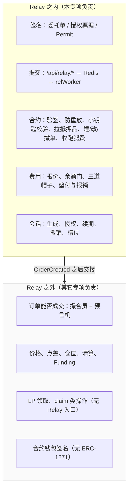

### 2.2 支持的动作

| 动作 | Standard | Relay / 1CT | 备注 |
|---|---|---|---|
| Market / Limit / Stop 开仓、加仓 | `ExchangeRouter` multicall | relay create；附 TP/SL 时一个 batch | 1CT 计数按腿数 |
| 市价平仓、减仓、TP/SL | multicall | relay create（decrease） | 平仓对估算类异常放行，对余额不足拦截 |
| 更新挂单 | update | relay update；TP/SL 换零费单退化为 create + cancel 原子 batch | Market 单不可 update |
| 取消单笔 / Cancel All | cancel / multicall | relay cancel / batch | 取消不垫 WNT；Market 单须过 `REQUEST_EXPIRATION_TIME` |
| 增减保证金、调杠杆 | 借 Increase / Decrease | 同左 | |
| 关闭并重新开仓 | 两腿 | 两个 relay task，计数 +2 | 快捷入口未接共享 gate（GAP） |
| LP 领取 / claim | 钱包自付 gas | **无** | |
| 授权 / 续期小钥匙 | — | 离线签票据，随首单上链 | 不发独立交易 |
| 断开小钥匙 | 主钱包发 `SubaccountRouter.removeSubaccount` | — | 唯一一笔主钱包自发的链上交易 |

### 2.3 可用范围（链 / 环境）

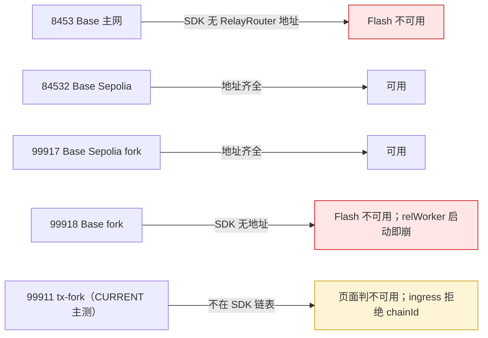

前端三重门：`NEXT_PUBLIC_FLASH_ENABLED === 'true'` → 链在 SDK 支持列表 → `RelayRouter` 地址非零。任一不满足静默回到 Standard，但**不改写**本地偏好。

### 2.4 时间与数额参数一览

| 参数 | 值 | 定义处 | 备注 |
|---|---|---|---|
| Relay 动作 deadline | 30 分钟 | `submitFlash*.ts` | 旧稿 5～10 分钟待裁决 DEC-TRADE-004 |
| Permit deadline | 5 分钟 | `lib/relay/permit.ts:145` | 台账 §6 与 README 写「约 1 小时」已过期，以代码为准 |
| 授权票据有效期 / deadline | 90 天 / 等于有效期终点 | `signFlashApproval.ts` | |
| 次数上限 | 链上已用 + 1,000,000 | 同上 | 累计上限，不是每期额度 |
| 即将过期提示 | 剩 3 天 | `useFlashSessionStatus.ts` | |
| 报价刷新 | 30 秒 | `useFlashRelayFee.ts` | DataStore 参数 60 秒缓存，Oracle 价不缓存 |
| 前端轮询 | 2 秒 × 90 次 = 3 分钟 | `pollRelayTask.ts` | |
| 去重键 TTL | 1800 秒 | `lib/relay/queue.ts` | 键 = `account:userNonce` |
| task 文档 TTL | 3600 秒 | 同上 | 只带版本前缀，不带链 |
| relWorker 出队周期 | 250 毫秒 | `KEEPER_RELAY_QUEUE_INTERVAL_MS` | 单条 drain loop，串行 |
| 回执等待 | 60 秒 | `getTxReceiptTimeoutMs` | 超时保持 `submitted` 不重发 |
| 传输类重试 | 1 次，5 秒后 | `MAX_RETRIES` / `RETRY_DELAY_MS` | 可解码 revert 一律终局 |
| gas buffer | +25% | `gasPolicy.ts` | 源于 1217/1217 out-of-gas 事故 |
| 显示费下限 / 签名上限区间 | 0.01 / 0.5～25 USDC | `feeEstimate.ts` | 0.5 USDC 即最低余额门槛 |
| Max 额外预留 | 1 USDC | `MAX_USDC_RESERVE_AMOUNT` | 只在 Relay family 的 Increase / Deposit |
| 治理 WNT 帽子样例 | 0.00005 WNT = 5e13 wei | `general.sample.json` | 一笔 100 美元 DOGE 单的垫付执行费占 76% |
| calldata 上限 | 50,000 字节 | `BaseRelayRouter.sol` | |
| 槽位数 | 4 | `SubaccountUtils.sol:33` | 编译期常量 |

### 2.5 费用与计数推导样例

假设 gasPrice = 0.01 gwei、ETH = 2,500 USD、USDC 二级价 = 1、开仓动作 gas 假设 1,500,000、`RELAY_FEE_BASE_GAS_LIMIT` = 30,000、倍率未设（1×）。除「76%」为实测点外均为推导。

| 场景 | 推导 |
|---|---|
| 报价（补贴单） | 典型 calldata 4,000 字节 → calldataGas = 4,000×10 + 125²/512 + 125×3 ≈ 40,405；relayGasLimit ≈ 1,570,405 → nativeFee ≈ 1.57e13 wei ≈ 0.039 USD；显示 ≈ 0.039×1.2 ≈ ~$0.047；上限口径用最大 calldata（gas ≈ 509,460）→ 0.051 × 3 ≈ 0.15 → 钳到 0.50 USDC |
| 报价（非补贴单） | 加垫付执行费 3.78e13 wei ≈ 0.0945 USD：显示 ≈ ~$0.16；上限 ≈ 0.44 → 仍钳到 0.50；治理帽子：1.57e13 + 3.78e13 ≈ 5.35e13 wei **> 5e13 样例帽子** → `MaxRelaySwapWntCapExceeded`。样例帽子对非补贴单偏紧，XT-RELAY-LOAD-003 实测阈值 |
| 实扣 | `RelayFeePaid.feeAmount` ≈ 0.04 USDC（补贴单），`≤ maxFeeAmount`，不是先扣上限再退 |
| Max | `B > C + U ? B − C − U : 0`：B=1,000、C=0.5 → 998.5；B=1.48 / 1.50 / 1.500001 → 0 |
| 余额门 | `balance < collateral + maxFeeAmount`：抵押 100、上限 0.5、余额 100.4 → 拦；100.5 等号放行 |
| 计数 | 开仓 + TP + SL 一个 batch → `actionCount += 3`；Cancel All 5 腿 → +5；续期后上限 = 已用 + 1,000,000，`approvalNonce + 1` |

---

## 3. 逻辑流转（图）

### 3.1 四个门与三条路径

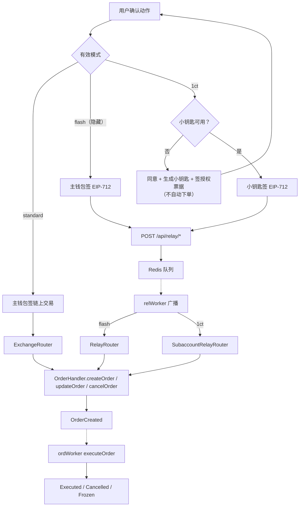

代码里定义 `standard | flash | 1ct` 三种模式，设置页只渲染前后两种（`FlashSettings.tsx` 第 384～394 行注释掉了 `flash` 卡片）；残留的 `flash` 本地值仍会走 `RelayRouter`（DEC-TRADE-001）。`submitFlash*.ts` 内按 `isOneClickTradingActive` 二选一：小钥匙签 `subaccountRelay*`，否则主钱包签 `relay*`。

### 3.2 小钥匙（session）状态机

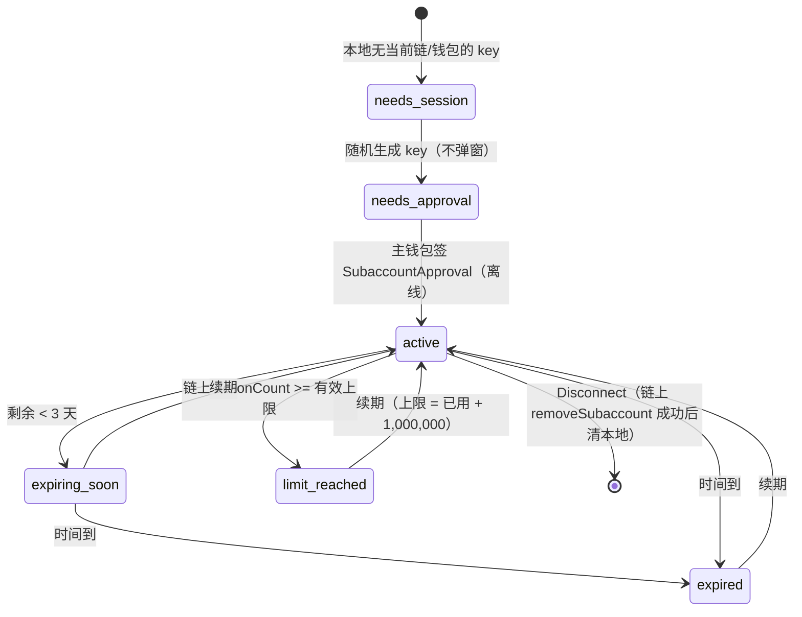

前端判定用「链上值与本地已签票据取大」（`useFlashSessionStatus.ts` effective bounds），否则会拒掉本该带续期上链的那一单。合约侧只有两条锁：`block.timestamp > expiresAt` 过期；`count > maxCount` 超限（等号都仍有效）。前端在等号上提前一格按失效处理，边界用例要分别记录 UI 与合约结果。授权票据是离线签名，随首单进入 `SubaccountRelayRouter._handleSubaccountApproval`，同一笔交易里验签并注册槽位；票据 `deadline = expiresAt`、`nonce` 来自 `/api/relay/nonce`（relay RPC，不是钱包客户端）。

### 3.3 前端余额门决策树

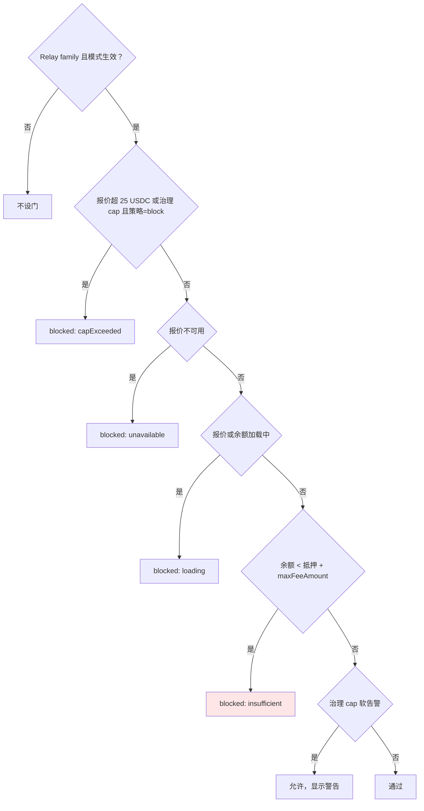

顺序刻意：软告警排在余额判断之后返回，否则 `capExceeded` 会盖住 `insufficient`。退出类动作（平仓、提保证金）用 `isRelayFeeExitBlocked`：只对 `insufficient` 与硬 `capExceeded` 拦截。三值口径：`displayFeeAmount`（典型 calldata × 1.2，≥ 0.01）、`maxFeeAmount`（最大 calldata × 3，钳 0.5～25）、`RelayFeePaid.feeAmount`（实扣）。送出前 `assertRelayFeeCapFresh` 用 fresh 输入重算，防用户犹豫期间 gas 变化。

### 3.4 提交与 Relay task 状态

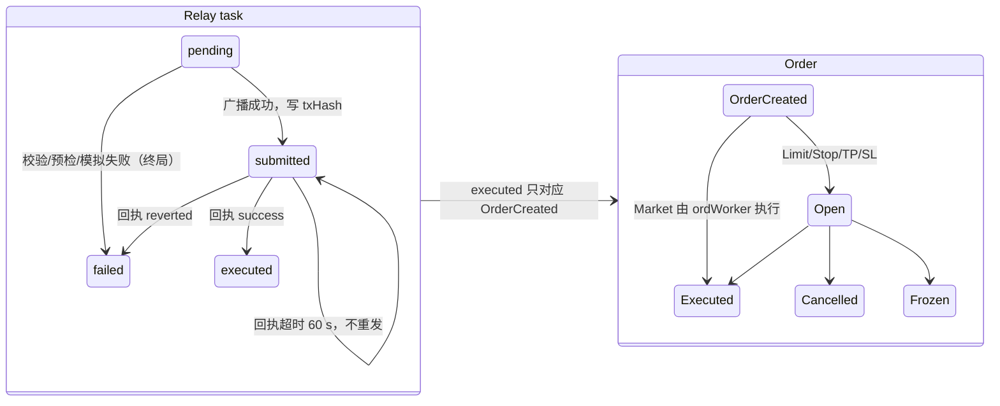

ingress（`lib/relay/ingress.ts`）六项校验：类型白名单、`isContractsChain(chainId, true)`、relay deadline、permit 合法性（spender 必须是 `Router`）、EIP-712 恢复签名者、approval 有效性；然后 `SET NX` 以 `account:userNonce` 去重 1800 秒、`SETEX` task 3600 秒、`LPUSH`。失败即终局：签名负载不可变，任何 revert 都要用新 `userNonce` 重签；重试前先按 taskId 查原任务。前端 3 分钟轮询超时、跑腿员 60 秒回执超时、服务端 1 小时 TTL 是三个概念，超时后没有自动对账。

### 3.5 Keeper relWorker 处理管线

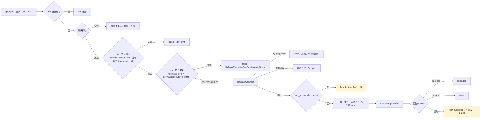

relWorker 不验签、不断言链上角色（注释：relay 提交由用户 EIP-712 签名把关）；私钥 `RELAY_KEEPER_PRIVATE_KEY(S)` 回退到 `KEEPER_PRIVATE_KEY(S)`；需要 ETH、WNT 与 `WNT.approve(Router)`。可解码 revert 一律终局的原因：签名负载不可变，重试没有意义。Relay 创建的订单由 `order-ingest → ordWorker` 普通流水线执行，`OrderCreated` 里没有 `isRelay` / `subaccount` 字段，Keeper 不区分来源，也不用执行费判断值不值得执行。

### 3.6 合约校验链（`withRelay`）

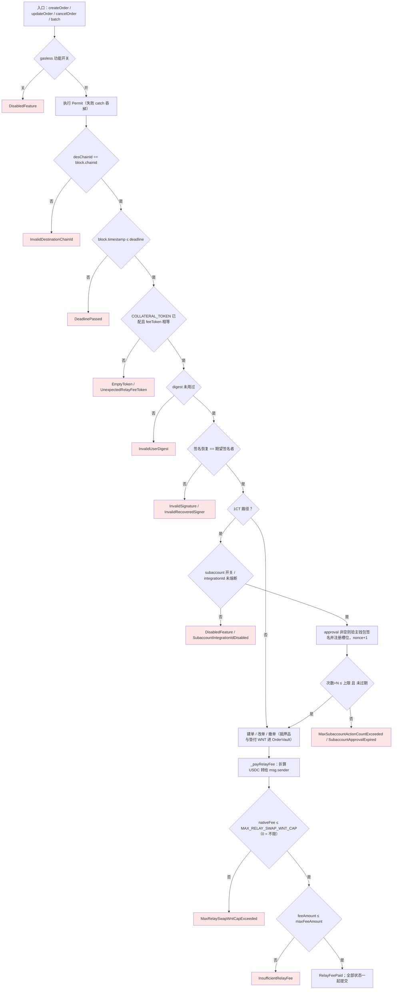

任一步失败整笔回滚：Permit、digest 标记、订单、approval nonce、次数、资金全部撤销，所以**失败的 digest 可以重用**。`userNonce` 合约不存不比，只是摘要里的随机盐；真 nonce 只有 `subaccountApprovalNonces[account]`。三个时间边界都是 `>` 才失败，等号仍有效。跑腿员无白名单、无角色，安全边界由签名 + digest 一次性表承担。

跑腿费公式（`BaseRelayRouter._payRelayFee`）：

```text
relayGasLimit = 实际消耗 gas + RELAY_FEE_BASE_GAS_LIMIT + calldataGas
nativeFee     = ceil(relayGasLimit × tx.gasprice × 倍率 / 1e30) + 垫付的执行费
feeAmount     = ceil(nativeFee × WNT 二级价.max / feeToken 二级价.min)
```

三道帽子：治理 `MAX_RELAY_SWAP_WNT_CAP`（用户只能切 Standard）、用户签的 `maxFeeAmount`（可重签更高）、前端 25 USDC 常量（拒签不上链）。补贴阈值 `EXECUTION_FEE_SUBSIDIZE(_SIZE)` 默认 0 = 全场免费，须显式写 `type(uint256).max` 才关闭。

### 3.7 槽位模型（v0.3.2）

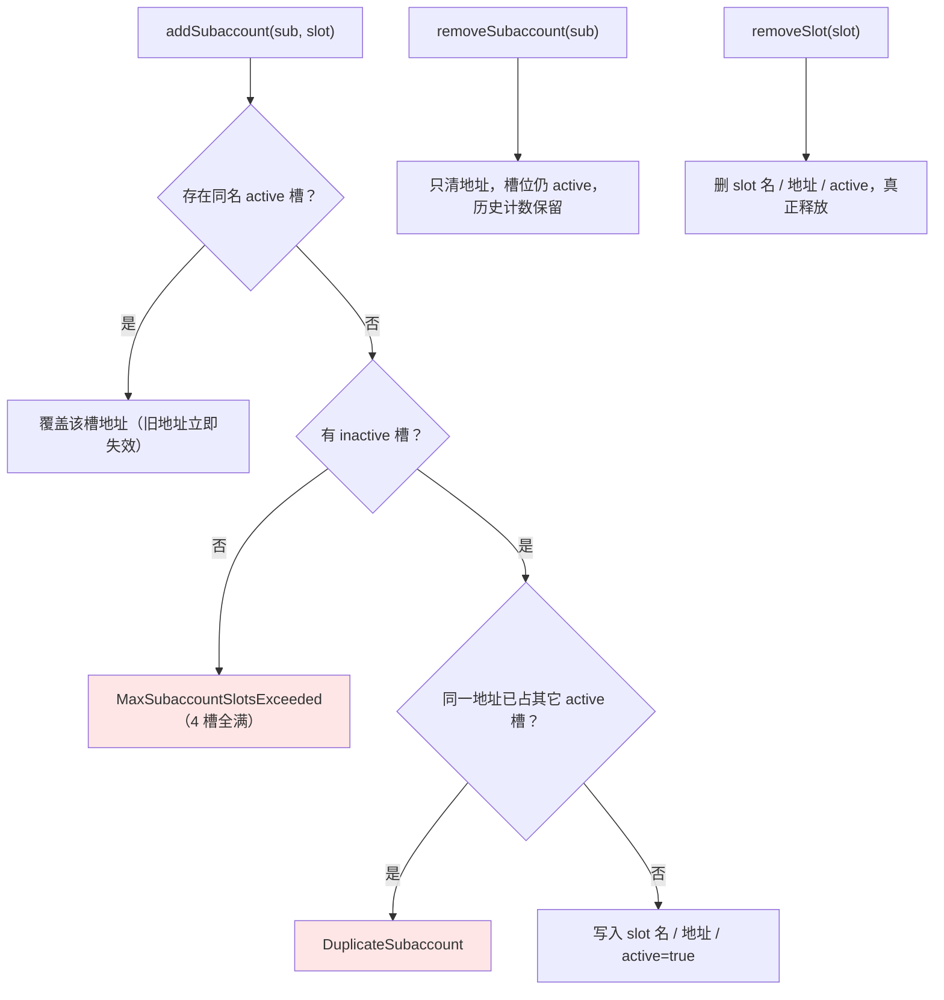

前端每个 `(chainId, owner)` 只管一把钥匙，Disconnect 只调 `SubaccountRouter.removeSubaccount`（主钱包发的唯一一笔链上交易）；没有 4 槽的查看 / 覆盖 / `removeSlot` / `revokeAll` 界面；断开不撤 `Router` 的 USDC allowance。SDK 的 `SubaccountApproval` 类型、EIP-712 schema、Reader ABI 均无 `slot`（P0 GAP），紧急页读的 `SUBACCOUNT_LIST` 在 v0.3.2 已删除。

---

## 4. 安全分析

### 4.1 攻击树

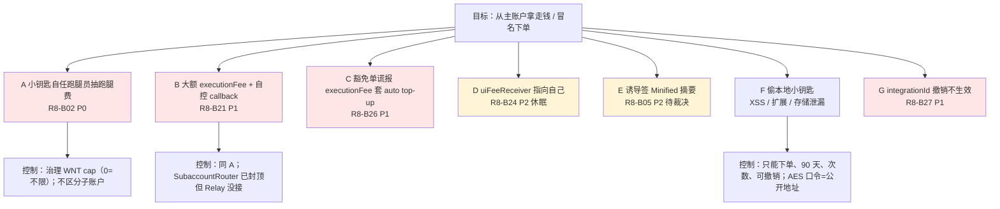

### 4.2 威胁表

| 路径 | 前提 | 攻击一句话 | 现有控制与缺口 | 用例 |
|---|---|---|---|---|
| A | 小钥匙泄漏或用户自己作恶 | 自己当跑腿员，抬 `tx.gasprice`，签大 `maxFeeAmount`，反复把 USDC 转给自己 | 只有全局 WNT cap；`MAX_RELAY_FEE_SWAP_USD_FOR_SUBACCOUNT` 声明未读取 | CT-RELAY-012 |
| B | 同 A | 建单填大额 `executionFee` + 自己的 callback，退款流向 callback | Relay 路径 `shouldCapMaxExecutionFee=false` | CT-RELAY-013 |
| C | 主账户设了 auto top-up，补贴开启 | 走 `SubaccountRouter` 提交豁免单并谎报执行费 | `OrderUtils` 只清订单里的费，不清 calldata 的 | CT-RELAY-SEC-003 |
| D | 协议开启 UI 手续费 | `uiFeeReceiver` 填自己 | `validateCreateOrderParams` 不检查该字段 | CT-RELAY-SEC-002 |
| E | 受害者对裸摘要签名 | 拿精简签名替受害者提 `receiver` 为自己的减仓单 | GMX 继承；`RelayRouter` 不钉 receiver | CT-RELAY-SEC-001 |
| F | 浏览器被注入或存储被读 | 解密 localStorage 的 key 后异地签单 | 四道锁；撤销后立即失效；撤销前可用 | XT-FLASH-SEC-008 |
| G | 集成方被禁用 | 签新 `integrationId` 票据 | `handleSubaccountApproval` 不写入 | CT-RELAY-SEC-004 |
| 重放 / 跨链 / 跨 Router | 拿到旧签名 | 重提同一 digest、换链、换 Router | digest 一次性 + `desChainId` + domain 含 Router 地址 | CT-RELAY-AUTH-014 |
| approval nonce 竞争 | 两台设备同时授权 | 两张同 nonce 票据 | 严格递增，后一张失败回滚 | CT-RELAY-SEC-005 |
| Permit 抢跑 | 有人先替你提交 permit | Permit 已消费 | `try/catch` 吞掉，allowance 兜底 | XT-RELAY-SEC-006 |
| 去重键碰撞 | 同 nonce 不同 payload | 后一张被吞成前一张 task | 8 字节随机 nonce；30 分钟去重 | XT-RELAY-SEC-007 |
| 任意跑腿员 | 拿到合法 payload | 抢先广播并收跑腿费 | 无白名单；只能拿到用户签好的费用 | CT-RELAY-AUTH-014、DEC-TRADE-002 |

### 4.3 裁决与文案要求

- 1CT 同意书「这把钥匙永远不能提取或转移你的资金」与路径 A / B 矛盾。台账 §7 最高优先级：修复 R8-B02 / B21 前不开放 1CT，删除绝对化文案。
- 三个待裁决共同决定权限边界：DEC-TRADE-002（跑腿员白名单）、DEC-TRADE-003（子账户最小动作授权）、DEC-TRADE-005（费用硬顶）。
- 90 天长授权只有在「可发现、可覆盖、可全部撤销」的管理面到位后才算安全前提（DEC-TRADE-006）。

### 4.4 基础设施风险

| 风险 | 事实 | 影响 |
|---|---|---|
| 单点跑腿员 | 一个 `relWorker`、一把钱包、单条串行 drain loop；systemd 单机 | 进程挂 = Flash 停摆 |
| 私钥明文 env | `RELAY_KEEPER_PRIVATE_KEY` 明文；回退共用 `KEEPER_PRIVATE_KEY` | 泄漏即失去资金；共用会 nonce 冲突 |
| Redis 单实例 / Upstash 配额 | 前端与 Keeper 靠同一 Redis 衔接；曾出现每日 500,000 请求超限 | 队列不通时 task 永远 pending |
| `DRY_RUN` 默认 true | 未显式设 false 即假成功 | fork 上最隐蔽 |
| recorded price 过期 | 无 feed 的 token 靠 `latestRecordedPrices` | 所有 gasless 单 revert |
| 无时延指标 | 只有 4 个计数器 | 无法感知退化 |

---

## 5. 速度分析

### 5.1 时延链路

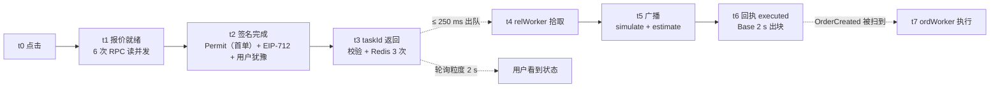

### 5.2 预算（典型值，Base 2 秒出块 + 80 毫秒 RTT）

| 段 | 依据 | 典型 |
|---|---|---|
| t1 报价 | 6 次 RPC 读并发，DataStore 参数 60 秒缓存 | 0.3～1 秒 |
| t2 签名 | 小钥匙本地签毫秒级；Permit 需弹窗 | 0.1 秒（稳态）/ 用户决定（首单） |
| t3 API | 验签 + `SET NX` + `SETEX` + `LPUSH` | 0.2～0.6 秒（Vercel 冷启动 +1～2 秒） |
| t4 拾取 | 250 毫秒轮询 + fastDrain | 0～0.25 秒 |
| t5 广播 | simulate + estimate + 广播 | 0.3～0.5 秒 |
| t6 回执 | 出块 + 确认 | 2～2.5 秒（上限 60 秒） |
| **t3→t6 Relay 段** | keeper 速度报告 §1.3「中继 ≈ 2.7～3.5 秒」 | **≈ 2.7～3.5 秒** |
| t6→t7 成交 | 市价单（ws）≈ 3～5 秒，与 Standard 相同 | 3～5 秒 |
| 用户感知 | 轮询 2 秒粒度 | +0～2 秒 |
| **端到端** | 合计 | **≈ 7～12 秒；建议 P95 ≤ 15 秒作为回归基线，不是产品 SLA** |

对比 Standard：少了 t3～t5 约 0.5～1.3 秒，但多了钱包弹窗和自付 gas；t6 之后两者完全相同。

### 5.3 会拖慢的因素

| 因素 | 表现 | 边界 |
|---|---|---|
| 队列积压 | t4 变成排队，单实例串行每笔约 2.5～3 秒 | 约 60 笔即超过用户 3 分钟耐心，约 600 笔逼近 30 分钟 deadline |
| 回执慢 | 60 秒后保持 `submitted`，前端 3 分钟显示超时 | 链上可能之后成功 |
| 报价不可用 | 表单阻断 | Oracle 二级价读失败 |
| 用户犹豫 | 签名后 gas 变化 | 送出前复查，可能要求重试 |

### 5.4 可测性缺口

Keeper 没有任何时延指标（`keeper:metrics:*` 只有 4 个计数器，心跳只有 attempts / failures / lastFailureTs）。量化速度的最低成本方案：配对 ingress 写 task 的 `updatedAt`、relWorker 日志的 `submitted` / `executed` 时间戳与链上区块时间，按 taskId 得分段耗时。RQ-RELAY-45 在此之前无法闭环。

---

## 6. 压力分析

### 6.1 瓶颈与资源模型

| 资源 | 模型 | 耗尽时 |
|---|---|---|
| relWorker 吞吐 | 单 drain loop 串行：出队 → 模拟 → 广播 → **等回执** → 下一条 | 约 20～30 笔/分钟；超过即排队 |
| 跑腿员 ETH | 每笔 gas ≈ 估算 × 1.25；跑腿费只以 USDC 报销，ETH 不自动补 | 余额 0 → 广播失败 → 重试 1 次 → failed |
| 跑腿员 WNT | 每笔非补贴开仓垫执行费；取消与补贴单不垫 | 预检拦下 |
| 跑腿员 nonce | 客户端分配，本地最多推进 4；`submitGate` 每把私钥一个 | `replacement transaction underpriced` |
| Redis | 每笔 ingress 3 次 + 轮询每 2 秒 1 次 + relWorker 每 250 毫秒 1 次 | Upstash 超限 → ingress 500、relWorker 报错循环 |
| 治理 WNT cap | 一笔 100 美元 DOGE 单占 76% | gas 涨约 1.3 倍即全部开仓被拒 |
| 25 USDC 保险丝 | 签名上限 = 最大 calldata × 3 | gas 尖峰前端拒签 |

### 6.2 积压推导

单实例每笔 ≈ 回执 2～2.5 秒 + 模拟广播 0.3～0.5 秒 ≈ 2.5～3 秒。deadline 1800 秒 → 队列第 600～720 笔之后轮到时已过期，模拟阶段 `DeadlinePassed` → `failed`（终局，不扣费）。用户侧第 3 分钟就看到超时，任务仍在队列里。**约 60 笔**是体验上限，**约 600 笔**是任务大面积失败的上限，两者都不损失资金。

### 6.3 退化路径

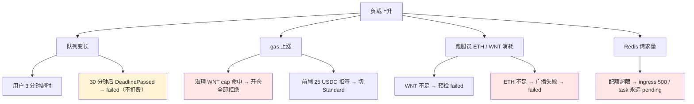

退化时的三条不变量，也是压力用例的核心断言：任何失败不扣跑腿费；不创建半个订单；不重复广播（task 状态短路 + 执行锁）。

---

## 7. 我们怎么测（60 条，全部 NOT_RUN）

### 7.1 用例总览（RQ ↔ 用例）

60 条用例全部登记在 Trade 测试用例矩阵 §5-C（原有 42 条 + XT-ORD-MODE-001 + 本轮新增 18 条），六字段与期望推导以矩阵为准，本册只按主题分组引用。

| 主题 | 已有用例 | 新增用例 |
|---|---|---|
| 费用公式与帽子 | CT-RELAY-001～009、FT-RELAY-011、FT-RELAY-CAP-021 | XT-RELAY-LOAD-002/003 |
| 路径、身份与经济一致 | XT-RELAY-010、XT-FLASH-004、XT-ORD-MODE-001、CT-RELAY-AUTH-014 | — |
| batch 与 Cancel All | CT-RELAY-BATCH-017 | XT-RELAY-LOAD-002 |
| 小钥匙生命周期 | FT-FLASH-SESSION-005、CONSENT-006、RISK-007、CT-FLASH-SCOPE-008、XT-FLASH-002、FT-FLASH-003 | CT-RELAY-SEC-004/005、XT-FLASH-SEC-008 |
| USDC 余额门与 Max | FT-RELAY-USDC-015/016、MAX-018/019/025/026/028、SWITCH-022、QUOTE-020/027 | — |
| 模式与准入 | FT-RELAY-MODE-023、FT-RELAY-LEGACY-024 | CT-RELAY-OPS-001 |
| 提交锁 | FT-RELAY-SUBMIT-029/030 | — |
| 关闭并重新开仓 | FT-FLASH-ROLL-009/010/011/013、XT-FLASH-ROLL-012 | — |
| 安全 | CT-RELAY-012、CT-RELAY-013 | CT-RELAY-SEC-001/002/003、XT-RELAY-SEC-006/007 |
| 速度 | — | XT-RELAY-PERF-001/002/003 |
| 压力 | — | XT-RELAY-LOAD-001/004/005/006 |
| 场景级（跨版本共享） | SCN-053～060（S06）、SCN-018/019（S02）、SCN-B32-03/04/08 | — |

新增 18 条（安全与开关 9、速度 3、压力 6）：P0 2 / P1 13 / P2 3。

### 7.2 执行批次与前提

| 批次 | 用例 | 环境前提 |
|---|---|---|
| R-1 合约层 | CT-RELAY-001～009、AUTH-014、BATCH-017、012、013、SEC-001～005、OPS-001、CT-FLASH-SCOPE-008 | tx-fork v0.3.2 合约层 READY；Relay RPC 直提；Foundry 复现件可先行 |
| R-2 联合准入 | FT-RELAY-MODE-023、FT-RELAY-LEGACY-024、FT-FLASH-003 | 前端切 v0.3.2 ABI + `slot`；tx-fork 进 SDK 链表 + 地址表 + ingress 白名单 |
| R-3 路径与经济 | XT-RELAY-010、XT-FLASH-004、XT-ORD-MODE-001、XT-FLASH-002 | R-2 通过；relWorker live（`DRY_RUN=false`，ETH + WNT + approve Router） |
| R-4 会话与安全 | FT-FLASH-SESSION-005、CONSENT-006、RISK-007、XT-FLASH-SEC-008、XT-RELAY-SEC-006/007 | 同 R-3 |
| R-5 费用与 Max | FT-RELAY-USDC-015/016、MAX-018/019/025/026/028、SWITCH-022、QUOTE-020/027、CAP-021、FT-RELAY-011、SUBMIT-029/030 | 同 R-3 + state instrumentation |
| R-6 关闭并重新开仓 | FT-FLASH-ROLL-009～013、XT-FLASH-ROLL-012 | 同 R-3 + 到期仓位 fixture |
| R-7 速度 | XT-RELAY-PERF-001～003 | R-3 + 日志时间戳采集 + 可控出块 |
| R-8 压力 | XT-RELAY-LOAD-001～006 | R-3 + 花名册 N 账户 + Admin RPC 设 gasprice + 本机 Redis + 时间推进 |

测试账户余额准备（来自实测补充 §四）：跑 Flash 且要用 Max 时 USDC 建议 ≥ 20（免受 cap 波动干扰）、ETH 可为 0；跑 Standard 需 ETH ≥ 0.001（约 20 笔含一次 approve）；复现 Max 死区用 Flash 1.48 / 1.50 / 1.500001 USDC 与 Standard ≤ 1.0；复现 signed-cap 门用 < 0.5 USDC。现场三种「卡住」的判别（提交前跑腿费不足 / 点 Max 死区 / 提交后 keeper 跳单）见 ① 场景 7。

### 7.3 最小证据

每条写链用例至少保存：模式与三重门状态；钱包弹窗次数与签名类型；EIP-712 domain、primaryType、关键字段与 recovered signer；`relayTaskId`、task 状态序列与 `updatedAt`、外层 txHash、`tx.from/to`；orderKey、`OrderCreated`、Reader、Position、OI、余额差分、`RelayFeePaid.feeAmount` 与 `maxFeeAmount`；1CT 的 slot、`expiresAt`、`maxAllowedCount`、`actionCount`、approval nonce；失败时的页面文案、HTTP 码、revert selector、是否扣费与重试结果。速度类另存各段时间戳原始值。

---

## 8. 准入与当前状态（2026-09-10）

| 项 | 状态 |
|---|---|
| `admissionScope["tx-fork:contract"]` | READY_FOR_SYSTEM_TEST（A 节读检），Relay 合约层用例可在 tx-fork 直提执行 |
| `admissionScope["tx-fork:frontend"]` | NOT_READY，等 C-2（前端 / SDK 切 v0.3.2 ABI、签名服务新 EIP-712 域）；tx-fork 99911 不在 SDK 链表 |
| results.md | 60 条 RELAY/FLASH 用例全部 NOT_RUN |
| SCN-B32-03 / 04 | NOT_RUN（全局键写入 + 新 Relay 签名服务；4 槽 Reader + 新旧 EIP-712 出签） |
| 合约 Foundry | 3 个文件 18 条在 v0.3.2 checkout 通过；R8-B02 已有复现测试 |
| 前端测试 | vitest 覆盖费用引擎、Permit、轮询、签名校验、7 条提交助手的 cap 守卫、撤单生命周期；Playwright 真钱包 smoke；`packages/sdk` 零测试为刻意策略 |
| Keeper 测试 | 覆盖 classify / context / funding / taskStore / queueKeys / gasPolicy / nonceAllocator 零件；`relWorker.executeRelay` 主流程无集成测试；无「Relay 建单被 ordWorker 执行」的端到端断言 |

要让 Relay / 1CT 在目标环境跑起来，须同时满足：`RelayRouter` 与 `SubaccountRelayRouter` 地址、bytecode、ABI 与 CURRENT 一致；Relay API 可达且用当前 chainId；跑腿员钱包有 ETH、WNT、`approve(Router)`；SDK 的 EIP-712 schema 补上 `slot`；tx-fork 的 chainId 进入 SDK 链表、地址表与 ingress 白名单；`KEEPER_DRY_RUN=false`；前端与 Keeper 的 `KEYSPACE_VERSION`、chainId、Redis 实例一致。上线前核对表（可打印）在 ①。

---

## 9. 来源索引

- 合约：[Relay 合约代码流程与函数说明](<Relay合约代码流程与函数说明.md>)；[01 代码变化分析](<../../../contract-releases/v0.3.2/01-代码变化分析.md>)；[03 合约功能说明 §3.10](<../../../contract-releases/v0.3.2/03-合约功能说明.md>)；[06 测试影响与准入结论](<../../../contract-releases/v0.3.2/06-测试影响与准入结论.md>)
- 前端：[Standard-Relay-Flash-OneClick (v0.3.2)](<Standard-Relay-Flash-OneClick-(v0.3.2).md>)；[Trade 测试用例矩阵 §5-C](<../../../../TestCase/E2E/versions/v0.3.2/Trade-测试用例矩阵.md>)；[Trade 需求来源与冲突台账](<../Trade-需求来源与冲突台账-(v0.3.2).md>)
- Keeper：[Keeper 代码分析报告 §3.5](<../../../keeper/2026-08-23_Keeper代码分析报告（fx100-apps@develop）.md>)；[Keeper 执行速度 / 效率 / 准确率分析](<../../../keeper/2026-09-03_Keeper执行速度-效率-准确率分析.md>)
- 需求原文：「需求点唯一汇总」各行的来源列
- 缺陷：[Bug 注册表 R8-B02 / B05 / B21 / B24 / B26 / B27](<../../需求文档/2026-08-12_Bug-注册表（R1~R8，含Zenith专题）.md>)；[Zenith 审计发现全量镜像](<../../需求文档/2026-08-12_Zenith-审计发现全量镜像（GitHub-Issues同步，30条原文）.md>)
- 实现核对入口：合约 `src/router/relay/*`、`src/subaccount/SubaccountUtils.sol`、`src/router/SubaccountRouter.sol`、`test/integration/{RelayCreateOrder,SubaccountRelayCreateOrder,SubaccountSlots}.t.sol`；SDK `packages/sdk/src/relay/*`、`packages/sdk/src/flash/subaccountCrypto.ts`；前端 `apps/fx-base-app/src/{state/ui/flash.ts,state/derived/flash.ts,hooks/trade/useFlashOrderGate.ts,hooks/account/useSubaccountSession.ts,hooks/account/useFlashSessionStatus.ts,lib/flash/*,lib/orders/submitFlash*.ts,lib/orders/relayFeeCapGuard.ts,lib/relay/*,app/api/relay/*}`；Keeper `apps/keeper/src/entrypoints/relWorker.ts`、`apps/keeper/src/domain/relay/*`、`apps/keeper/src/domain/prices/recordedPriceRefresh.ts`
