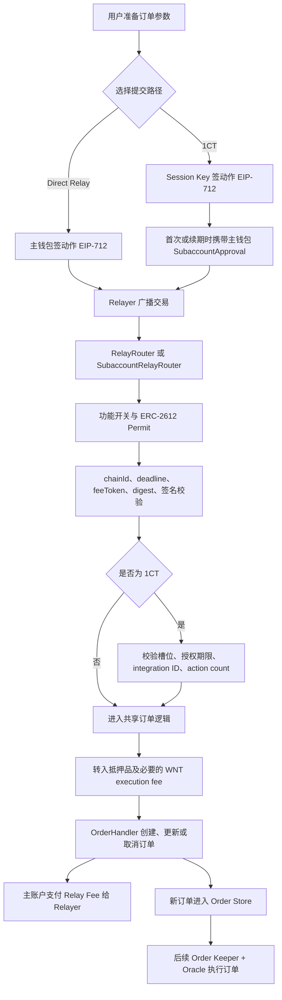

# FX100 v0.3.2 Relay 合约代码流程与函数说明

> 文档性质：源码解读与调用链说明，不替代安全审计、测试结果或环境准入结论。
>
> 版本基线以 [`Docs/contract-releases/CURRENT.json`](../../contract-releases/CURRENT.json) 为唯一事实源。本文是 **v0.3.2 源码快照**，源码锚点对应 `release/v0.3.2`、commit `13880f2416918f4fed3fea86d7f1023084a3ce0d`。
>
> 本文是合约层的逐函数详解层。入门与三层机制见 [专项-Relay-②原理篇](<../专项-Relay-②原理篇.md>)，需求点（RQ-RELAY-01～49）与安全 / 速度 / 压力分析见 [专项-Relay-③需求与分析](<../专项-Relay-③需求与分析.md>)；两册引用本文、不复述。

## 1. 结论先行

Relay 是一层“**用户离线签名，第三方代发链上交易**”的订单提交基础设施，主要解决用户不直接支付原生 Gas 的问题。

它不是撮合器，也不是订单执行器。Relay 调用成功通常只表示订单已经被创建、更新或取消；新建订单仍需后续由独立的 Order Keeper 携带 Oracle 价格调用 `OrderHandler.executeOrder`，才会真正影响仓位。

v0.3.2 有两条 Relay 路径：

| 路径 | 动作签名者 | 链上 `tx.from` | 订单及资金归属 | 外层入口 |
| --- | --- | --- | --- | --- |
| Direct Relay / Gasless | 主账户钱包 | Relayer | 主账户 `account` | `RelayRouter` |
| Subaccount Relay / 1CT | Session Key / `subaccount` | Relayer | 主账户 `account` | `SubaccountRelayRouter` |

无论走哪一条路径：

- 订单的经济所有者都是主账户 `account`；
- 抵押品及 Relay Fee 从主账户扣除；
- 外部广播者 `msg.sender` 支付本次链上 Gas，并接收 Relay Fee；
- 新订单最终都进入同一个 `OrderHandler`。

## 2. 代码地图

| 文件 | 主要职责 |
| --- | --- |
| [`RelayRouter.sol`](../../../Github/fx100-contracts@release-v0.3.2/src/router/relay/RelayRouter.sol#L16) | 主账户逐动作签名的 Direct Relay 入口。 |
| [`SubaccountRelayRouter.sol`](../../../Github/fx100-contracts@release-v0.3.2/src/router/relay/SubaccountRelayRouter.sol#L20) | Session Key / 1CT 入口，增加子账户授权、期限和次数控制。 |
| [`BaseRelayRouter.sol`](../../../Github/fx100-contracts@release-v0.3.2/src/router/relay/BaseRelayRouter.sol#L31) | 两条 Relay 共用的 Permit、验签、防重放、资产转移、订单转发和收费逻辑。 |
| [`RelayUtils.sol`](../../../Github/fx100-contracts@release-v0.3.2/src/router/relay/RelayUtils.sol#L32) | EIP-712 typehash、结构哈希、digest 和 ECDSA 签名恢复。 |
| [`IRelayUtils.sol`](../../../Github/fx100-contracts@release-v0.3.2/src/router/relay/IRelayUtils.sol#L7) | Relay 调用使用的数据结构。 |
| [`SubaccountUtils.sol`](../../../Github/fx100-contracts@release-v0.3.2/src/subaccount/SubaccountUtils.sol#L12) | 子账户槽位、授权期限、动作次数和 integration ID 校验。 |
| [`Router.sol`](../../../Github/fx100-contracts@release-v0.3.2/src/router/Router.sol#L26) | 经 `pluginTransfer` 使用 ERC-20 allowance 转移用户或 Relayer 的资产。 |
| [`OrderHandler.sol`](../../../Github/fx100-contracts@release-v0.3.2/src/exchange/OrderHandler.sol#L62) | 创建、更新、取消和后续执行订单。 |

部署时，两个 Relay Router 都会获得 `CONTROLLER` 和 `ROUTER_PLUGIN` 角色，因此它们可以调用受控的 `OrderHandler`，也可以通过中央 `Router.pluginTransfer` 执行 `transferFrom`。外部 Relayer 自身不需要这两个角色。

## 3. 四个关键身份

Relay 代码中最容易混淆的是以下四种身份：

| 身份 | 代码表示 | 职责 |
| --- | --- | --- |
| 主账户 | `account` | 订单 owner；提供抵押品；支付 Relay Fee；签 Direct Relay 或 Session 授权。 |
| Session Key | `subaccount` | 仅在 1CT 路径中签署具体订单动作。 |
| Relayer | `msg.sender` | 广播 Relay Router 交易；支付链上 Gas；必要时先垫 WNT execution fee；接收 Relay Fee。 |
| Order Keeper | `OrderHandler.executeOrder` 的调用者 | 在订单创建后携带 Oracle 数据真正执行订单。 |

`SubaccountRelayRouter` 不会调用 `SubaccountRouter` 合约。它直接复用 `SubaccountUtils` 做授权检查，然后直接调用与 Direct Relay 相同的 `OrderHandler`。`SubaccountRouter` 是 Session Key 自己发送链上交易时使用的另一条非 Relay 路径。

## 4. 总体调用流程



### 4.1 链上执行顺序

每个状态写入口均使用 `nonReentrant` 和 [`withRelay`](../../../Github/fx100-contracts@release-v0.3.2/src/router/relay/BaseRelayRouter.sol#L44)，真实执行顺序如下：

1. 进入重入保护并记录 `startingGas`。
2. 检查当前 Relay Router 的 Gasless 功能开关。
3. 尝试执行主账户提供的 ERC-2612 Permit。
4. 清零本次调用的 `relayExecutionFee` 累加器。
5. 计算当前动作的 EIP-712 `structHash` 和最终 digest。
6. 校验目标链、deadline、feeToken、防重放状态和动作签名。
7. 1CT 路径处理可选的主账户授权，并校验 Session 权限、期限和次数。
8. 执行 create、update、cancel 或 batch。
9. 根据实际 Gas 和 Relayer 垫付的 execution fee 计算 Relay Fee。
10. 从主账户把实际 Relay Fee 转给本次 `msg.sender`。

虽然 Permit 在最外层动作签名校验之前执行，但整个 Relay 调用仍是同一笔原子交易。后续任何一步失败，Permit、digest、订单、授权 nonce、action count 和资金变化都会一起回滚。

## 5. Relay 调用参数

参数结构定义在 [`IRelayUtils.sol`](../../../Github/fx100-contracts@release-v0.3.2/src/router/relay/IRelayUtils.sol#L7)。

### 5.1 `FeeParams`

```solidity
struct FeeParams {
    address feeToken;
    uint256 maxFeeAmount;
}
```

- `feeToken`：支付 Relay Fee 的 ERC-20 Token；v0.3.2 强制等于 DataStore 全局 `COLLATERAL_TOKEN`。
- `maxFeeAmount`：用户签署的本次最高授权金额，不是预扣金额。

### 5.2 `TokenPermit`

保存一份完整的 ERC-2612 Permit：owner、spender、value、deadline、`v/r/s` 和 token 地址。

Router 会强制：

- `permit.owner == account`；
- `permit.spender == address(router)`。

对 Token 的 `permit()` 调用使用空 `catch` 捕获失败。因此 Permit 过期或签名错误不会在这里单独终止流程；如果账户之前已有足够 allowance，后续操作仍可能成功，否则真正的 `transferFrom` 会失败并回滚整笔交易。

### 5.3 `RelayParams`

```solidity
struct RelayParams {
    TokenPermit[] tokenPermits;
    FeeParams fee;
    uint256 userNonce;
    uint256 deadline;
    bytes signature;
    uint256 desChainId;
}
```

除最外层 `signature` 自身外，Permit、费用、`userNonce`、deadline 和目标 chainId 都被纳入动作签名哈希。

### 5.4 `UpdateOrderParams`

包含订单 key、新 size、size 单位类型、acceptable price、trigger price、最小输出、生效时间、auto-cancel 和新增 execution fee。

### 5.5 `BatchParams`

```solidity
struct BatchParams {
    CreateOrderParams[] createOrderParamsList;
    UpdateOrderParams[] updateOrderParamsList;
    bytes32[] cancelOrderKeys;
}
```

批次固定按照“全部 create → 全部 update → 全部 cancel”执行。任意一腿失败，整批回滚；成功时只返回新建订单的 key 数组。

## 6. EIP-712、签名与防重放

### 6.1 Domain

[`RelayUtils.getDomainSeparator`](../../../Github/fx100-contracts@release-v0.3.2/src/router/relay/RelayUtils.sol#L106) 使用：

```text
name              = Fx100RelayRouter
version           = 1
chainId           = block.chainid
verifyingContract = address(this)
```

因此：

- 不同链之间的签名不能复用；
- `RelayRouter` 和 `SubaccountRelayRouter` 的签名不能互换；
- EIP-712 domain 的 `version` 是签名协议版本 `1`，不要把它误解为合约发布版本 v0.3.2。

### 6.2 签名恢复

[`RelayUtils.validateSignature`](../../../Github/fx100-contracts@release-v0.3.2/src/router/relay/RelayUtils.sol#L122) 先尝试恢复普通 EIP-712 digest；如果恢复地址不匹配，再尝试同一 domain 下的 `Minified(bytes32 digest)` 包装格式。

当前仅支持 ECDSA 地址恢复，没有 ERC-1271 合约钱包签名路径。

### 6.3 两类 nonce 的区别

`RelayParams.userNonce` 只参与动作哈希，没有账户级的存储、递增或顺序校验。真正的链上防重放依赖 [`digests[digest]`](../../../Github/fx100-contracts@release-v0.3.2/src/router/relay/BaseRelayRouter.sol#L37)：

- 完全相同的 digest 再次提交会失败；
- 相同 `userNonce` 配不同 payload，会产生不同 digest，链上仍允许使用。

1CT 的 `SubaccountApproval.nonce` 不同。它必须严格等于 [`subaccountApprovalNonces[account]`](../../../Github/fx100-contracts@release-v0.3.2/src/router/relay/SubaccountRelayRouter.sol#L240)，成功后加一。该 nonce 按主账户共享，不按 slot 或 subaccount 分开。

### 6.4 时间边界

Relay deadline、主账户 approval deadline、Session expiry 都使用 `block.timestamp > deadline` 或 `> expiresAt` 才判失败，因此刚好等于截止值时仍有效。

## 7. `RelayRouter` 函数

`RelayRouter` 对应主钱包逐动作签名的 Direct Relay。四个状态写入口都没有 `onlyKeeper` 或 Relayer 白名单修饰器；任何地址只要持有有效 payload 都可以提交，并成为该次 Relay Fee 的接收方。

### 7.1 `createOrder`

位置：[`RelayRouter.createOrder`](../../../Github/fx100-contracts@release-v0.3.2/src/router/relay/RelayRouter.sol#L37)

流程：

1. 对完整订单参数和 `RelayParams` 计算 digest。
2. 预期签名者为主账户 `account`。
3. 调用共享 `_createOrder(account, params)`。
4. 返回新建的 `orderKey`。

### 7.2 `updateOrder`

位置：[`RelayRouter.updateOrder`](../../../Github/fx100-contracts@release-v0.3.2/src/router/relay/RelayRouter.sol#L48)

流程：

1. 主账户签署新订单参数。
2. 共享逻辑读取已有订单。
3. 检查订单非空且 `order.account == account`。
4. 必要时由 Relayer 追加 WNT execution fee。
5. 调用 `OrderHandler.updateOrder`。

Market Order 是否可更新由 `OrderHandler` 继续判断；当前 Handler 会拒绝更新 Market Order。

### 7.3 `cancelOrder`

位置：[`RelayRouter.cancelOrder`](../../../Github/fx100-contracts@release-v0.3.2/src/router/relay/RelayRouter.sol#L59)

根据主账户签署的 order key 校验订单存在及所有权，然后调用 `OrderHandler.cancelOrder`。Handler 负责删除订单并按照订单类型处理抵押品和 execution fee 的退款。

### 7.4 `batch`

位置：[`RelayRouter.batch`](../../../Github/fx100-contracts@release-v0.3.2/src/router/relay/RelayRouter.sol#L26)

主账户对完整批次签名。一笔 batch：

- 至少包含一个动作；
- 固定顺序为 create → update → cancel；
- 整批原子执行；
- 只产生一次外层 Relay Fee 结算；
- 返回所有 create 动作生成的 order key。

### 7.5 Digest getter

只读函数：

- [`getCreateOrderDigest`](../../../Github/fx100-contracts@release-v0.3.2/src/router/relay/RelayRouter.sol#L70)
- [`getBatchDigest`](../../../Github/fx100-contracts@release-v0.3.2/src/router/relay/RelayRouter.sol#L78)
- [`getUpdateOrderDigest`](../../../Github/fx100-contracts@release-v0.3.2/src/router/relay/RelayRouter.sol#L86)
- [`getCancelOrderDigest`](../../../Github/fx100-contracts@release-v0.3.2/src/router/relay/RelayRouter.sol#L94)

这些函数不修改状态，用于客户端取得与链上完全一致的待签 digest。

## 8. `SubaccountRelayRouter` 函数

1CT 路径在共享 Relay 流程之外增加 Session 授权检查。外层订单动作签名者是 `subaccount`，但 `account` 仍是订单 owner 和资金来源。

### 8.1 `createOrder`

位置：[`SubaccountRelayRouter.createOrder`](../../../Github/fx100-contracts@release-v0.3.2/src/router/relay/SubaccountRelayRouter.sol#L59)

额外校验：

- 动作签名者必须是传入的 `subaccount`；
- `receiver` 必须等于主账户；
- `cancellationReceiver` 只能是零地址或主账户；
- Session 必须存在于 active slot；
- Session 未过期且动作次数没有超过上限；
- 成功后订单 action count 增加 1。

这些 receiver 限制防止 Session 把订单输出或取消退款直接重定向到任意地址。

### 8.2 `updateOrder` / `cancelOrder`

位置：

- [`updateOrder`](../../../Github/fx100-contracts@release-v0.3.2/src/router/relay/SubaccountRelayRouter.sol#L76)
- [`cancelOrder`](../../../Github/fx100-contracts@release-v0.3.2/src/router/relay/SubaccountRelayRouter.sol#L92)

两者均由 Session Key 签动作，授权次数增加 1；共享基类仍会检查目标订单属于传入的主账户。

### 8.3 `batch`

位置：[`SubaccountRelayRouter.batch`](../../../Github/fx100-contracts@release-v0.3.2/src/router/relay/SubaccountRelayRouter.sol#L37)

在任何订单腿真正执行前，先计算：

```text
actionsCount = create.length + update.length + cancel.length
```

Session 使用次数按批内实际腿数累计，而不是按“一次点击”“一个 task”或“一笔链上交易”固定增加 1。后续任意一腿失败时，计数也随整笔交易一起回滚。

### 8.4 `removeSubaccount`

位置：[`removeSubaccount`](../../../Github/fx100-contracts@release-v0.3.2/src/router/relay/SubaccountRelayRouter.sol#L107)

该动作由主账户签名，不由被撤销的 Session Key 签名。它会清空匹配槽位中的 subaccount 地址，但保留 slot 名和 active 状态，所以不会释放四槽额度。

### 8.5 `removeSlot`

位置：[`removeSlot`](../../../Github/fx100-contracts@release-v0.3.2/src/router/relay/SubaccountRelayRouter.sol#L118)

同样由主账户签名，但会删除 slot 名、subaccount 地址和 active 标记，真正释放槽位。

`removeSubaccount` 和 `removeSlot` 都不调用订单 action 计数逻辑，因此不增加 `SUBACCOUNT_ORDER_ACTION` count。

### 8.6 Digest getter

只读函数包括：

- [`getSubaccountApprovalDigest`](../../../Github/fx100-contracts@release-v0.3.2/src/router/relay/SubaccountRelayRouter.sol#L129)
- [`getCreateOrderDigest`](../../../Github/fx100-contracts@release-v0.3.2/src/router/relay/SubaccountRelayRouter.sol#L137)
- [`getBatchDigest`](../../../Github/fx100-contracts@release-v0.3.2/src/router/relay/SubaccountRelayRouter.sol#L149)
- [`getUpdateOrderDigest`](../../../Github/fx100-contracts@release-v0.3.2/src/router/relay/SubaccountRelayRouter.sol#L161)
- [`getCancelOrderDigest`](../../../Github/fx100-contracts@release-v0.3.2/src/router/relay/SubaccountRelayRouter.sol#L173)
- [`getRemoveSubaccountDigest`](../../../Github/fx100-contracts@release-v0.3.2/src/router/relay/SubaccountRelayRouter.sol#L185)
- [`getRemoveSlotDigest`](../../../Github/fx100-contracts@release-v0.3.2/src/router/relay/SubaccountRelayRouter.sol#L193)

## 9. 1CT 授权流程

`SubaccountApproval` 定义于 [`SubaccountUtils.sol`](../../../Github/fx100-contracts@release-v0.3.2/src/subaccount/SubaccountUtils.sol#L12)：

```solidity
struct SubaccountApproval {
    address subaccount;
    string slot;
    bool shouldAdd;
    uint256 expiresAt;
    uint256 maxAllowedCount;
    bytes32 actionType;
    uint256 nonce;
    uint256 desChainId;
    uint256 deadline;
    bytes32 integrationId;
    bytes signature;
}
```

### 9.1 首次或续期签名顺序

如果需要 Permit 和新的 Session 授权，典型离线准备顺序为：

1. 主账户签 ERC-2612 Permit。
2. 主账户签 `SubaccountApproval`。
3. 把主账户授权签名填入 `subaccountApproval.signature`。
4. Session Key 对最外层 create、update、cancel 或 batch 签名。

最外层 Session 动作哈希会绑定完整的 `SubaccountApproval`，包括主账户授权签名 bytes，因此 Session 动作签名应最后生成。

已有授权且 allowance 足够时，`subaccountApproval.signature` 和 `tokenPermits` 都可以为空，只需要 Session Key 签署本次业务动作。

### 9.2 `_handleSubaccountApproval`

位置：[`SubaccountRelayRouter._handleSubaccountApproval`](../../../Github/fx100-contracts@release-v0.3.2/src/router/relay/SubaccountRelayRouter.sol#L219)

- 签名为空：不修改授权，直接沿用链上已有状态。
- 签名非空：检查 subaccount、chainId、deadline 和严格 nonce，再验证主账户签名。
- `maxAllowedCount > 0` 时才更新次数上限。
- `expiresAt > 0` 时才更新授权期限。
- `shouldAdd == true` 时添加或替换命名 slot。
- `shouldAdd == false` 不表示自动撤销 Session。

`integrationId` 被纳入主账户授权 digest，但当前 approval handler 不会写入它。动作执行时校验的是此前通过其他入口存入 DataStore 的 `(account, subaccount)` integration ID。

### 9.3 槽位和使用次数

[`SubaccountUtils`](../../../Github/fx100-contracts@release-v0.3.2/src/subaccount/SubaccountUtils.sol#L32) 的主要规则：

- `MAX_SUBACCOUNT_SLOTS = 4`；
- 同名 active slot 的 `addSubaccount` 会更新该槽位；
- 新 slot 使用第一个 inactive 槽位；
- 同一非零 subaccount 不能同时占多个 active slot；
- `removeSubaccount` 只清地址；
- `removeSlot` 才完整删除并释放；
- 先递增 action count，再校验 expiry 和 max count；失败时原子回滚；
- 只有 `count > maxCount` 才失败，因此 `count == maxCount` 仍允许；
- 只有 `block.timestamp > expiresAt` 才过期。

## 10. `BaseRelayRouter` 共享函数

### 10.1 `_batch`

位置：[`BaseRelayRouter._batch`](../../../Github/fx100-contracts@release-v0.3.2/src/router/relay/BaseRelayRouter.sol#L69)

拒绝空批次，按 create → update → cancel 顺序调用下面三个共享函数。

### 10.2 `_createOrder`

位置：[`BaseRelayRouter._createOrder`](../../../Github/fx100-contracts@release-v0.3.2/src/router/relay/BaseRelayRouter.sol#L92)

1. 根据 market、size 和 size 单位判断 execution fee 是否由协议补贴。
2. 补贴时强制把内存参数中的 `executionFee` 设为 0。
3. 非补贴且 execution fee 非零时，从 Relayer 向 `OrderVault` 转 WNT。
4. Increase Order 且抵押品非零时，从主账户向 `OrderVault` 转 collateral token。
5. 调用：

```solidity
orderHandler.createOrder(account, params, false);
```

这里的 `false` 表示不启用 `shouldCapMaxExecutionFee`。

### 10.3 `_updateOrder`

位置：[`BaseRelayRouter._updateOrder`](../../../Github/fx100-contracts@release-v0.3.2/src/router/relay/BaseRelayRouter.sol#L113)

1. 从 Order Store 读取订单。
2. 拒绝空订单。
3. 检查订单 owner 等于 `account`。
4. 非补贴且 `executionFeeIncrease != 0` 时，由 Relayer 向 OrderVault 转 WNT。
5. 调用 `OrderHandler.updateOrder(..., false)`。

`executionFeeIncrease` 不作为单独数值传给 Handler；Handler 通过 OrderVault 本次新收到的 WNT balance delta 识别追加金额。

### 10.4 `_cancelOrder`

位置：[`BaseRelayRouter._cancelOrder`](../../../Github/fx100-contracts@release-v0.3.2/src/router/relay/BaseRelayRouter.sol#L146)

检查订单存在且属于传入账户，再调用 `OrderHandler.cancelOrder`。

### 10.5 `_handleTokenPermits`

位置：[`BaseRelayRouter._handleTokenPermits`](../../../Github/fx100-contracts@release-v0.3.2/src/router/relay/BaseRelayRouter.sol#L169)

验证 Permit owner/spender 并尝试执行 Token Permit。Permit 调用失败被捕获，但后续资产转移仍会按实际 allowance 和余额判定。

### 10.6 `_validateCall` / `_validateDigest`

位置：

- [`_validateCall`](../../../Github/fx100-contracts@release-v0.3.2/src/router/relay/BaseRelayRouter.sol#L189)
- [`_validateDigest`](../../../Github/fx100-contracts@release-v0.3.2/src/router/relay/BaseRelayRouter.sol#L213)

依次校验：

1. 目标 chainId；
2. Relay deadline；
3. 全局 collateral token 已配置；
4. feeToken 等于全局 collateral token；
5. digest 尚未使用；
6. digest 的签名者等于预期账户或 Session Key。

### 10.7 `_payRelayFee`

位置：[`BaseRelayRouter._payRelayFee`](../../../Github/fx100-contracts@release-v0.3.2/src/router/relay/BaseRelayRouter.sol#L221)

负责计算实际费用、检查签名上限、转账并发出 `RelayFeePaid`。

如果 `msg.sender` 被配置为 fee-excluded，函数直接返回，不收费且不发 `RelayFeePaid`。普通调用即使实际费用为 0，仍会发出金额为 0 的事件。

### 10.8 `_getCalldataGas`

位置：[`BaseRelayRouter._getCalldataGas`](../../../Github/fx100-contracts@release-v0.3.2/src/router/relay/BaseRelayRouter.sol#L268)

```text
calldataGas = calldataLength × 10
             + memoryWords² / 512
             + memoryWords × 3
```

calldata 超过 50,000 bytes 时回滚。

## 11. Relay Fee 与 execution fee

### 11.1 两种费用不能混淆

| 费用 | Token | 谁先支付 | 最终用途 |
| --- | --- | --- | --- |
| Order execution fee | WNT | 非补贴时由 Relayer 垫付到 OrderVault | 留给未来执行订单的 Order Keeper。 |
| Relay Fee | 全局 collateral token | 当前调用结尾由主账户支付 | 偿还 Relayer 的本次 Gas 和已垫 execution fee。 |

### 11.2 计算公式

```text
gasUsed = startingGas - gasleft()

relayGasLimit =
    gasUsed
  + RELAY_FEE_BASE_GAS_LIMIT
  + calldataGas(msg.data.length)

nativeFee =
    ceil(relayGasLimit × tx.gasprice × relayFeeMultiplier / 1e30)
  + relayExecutionFee

feeAmount =
    ceil(
      nativeFee
      × secondaryPrice(WNT).max
      / secondaryPrice(feeToken).min
    )
```

之后依次检查：

1. 如果 `MAX_RELAY_SWAP_WNT_CAP != 0`，要求 `nativeFee <= cap`。
2. 要求 `feeAmount <= fee.maxFeeAmount`。
3. 通过中央 Router 执行：

```text
pluginTransfer(feeToken, account, msg.sender, feeAmount)
```

4. 发出：

```solidity
RelayFeePaid(account, msg.sender, feeToken, feeAmount, gasUsed)
```

价格转换使用 WNT 的 secondary max price 和 fee token 的 secondary min price，并向上取整；这是偏保护 Relayer 的换算方向。

`maxFeeAmount` 是用户签署的硬上限，不会先扣除上限再退款。实际扣款只发生在调用末尾。

## 12. 订单创建不等于成交

两条 Relay 路径最终都调用：

- [`OrderHandler.createOrder`](../../../Github/fx100-contracts@release-v0.3.2/src/exchange/OrderHandler.sol#L62)
- [`OrderHandler.updateOrder`](../../../Github/fx100-contracts@release-v0.3.2/src/exchange/OrderHandler.sol#L109)
- [`OrderHandler.cancelOrder`](../../../Github/fx100-contracts@release-v0.3.2/src/exchange/OrderHandler.sol#L204)

创建订单时，Handler 生成 key、写入 Order Store 并发出 `OrderCreated`。真正成交由：

[`OrderHandler.executeOrder`](../../../Github/fx100-contracts@release-v0.3.2/src/exchange/OrderHandler.sol#L259)

完成。该函数要求 `onlyOrderKeeper`，并通过 `withOraclePrices` 设置本次执行使用的价格。

因此状态语义应严格区分：

- Relay Router 交易成功：代发交易执行成功；
- `OrderCreated`：订单已进入链上订单存储；
- Limit / Stop / TP / SL Active：挂单已生效但未成交；
- `OrderHandler.executeOrder` 成功：订单真正执行并更新仓位。

## 13. v0.3.2 的 Relay 变化

相对 v0.3.1，主要变化集中在以下三处。

### 13.1 Relay Fee Token 强约束

[`BaseRelayRouter._validateCall`](../../../Github/fx100-contracts@release-v0.3.2/src/router/relay/BaseRelayRouter.sol#L198) 新增：

- DataStore 全局 `COLLATERAL_TOKEN` 不能为零地址；
- `relayParams.fee.feeToken` 必须等于该全局 Token。

合约没有把 Relay Fee Token 硬编码为 USDC；实际 Token 由全局配置决定。

### 13.2 命名 slot 进入 EIP-712

`SubaccountApproval` 新增 `string slot`。对应 [`SUBACCOUNT_APPROVAL_TYPEHASH`](../../../Github/fx100-contracts@release-v0.3.2/src/router/relay/RelayUtils.sol#L90) 和 calldata tuple 均发生变化。

因此旧版不含 `slot` 的授权签名不能在 v0.3.2 中继续使用，需要重新生成 typed data 和签名。

### 13.3 四槽模型与 `removeSlot`

旧的子账户列表被四个命名槽位替代，并新增按 slot 完整删除的 Relay 入口。`removeSubaccount` 与 `removeSlot` 的语义不同，客户端不能把两者当成相同的 revoke 操作。

## 14. 当前实现边界与已登记 GAP

以下是源码现状，不应描述成已经解决的安全能力。

### 14.1 Relay 外部入口没有 Relayer ACL

`RelayRouter` 和 `SubaccountRelayRouter` 的状态写入口没有 `onlyKeeper`。任何地址持有有效签名 payload 都可以提交，并成为该次 `RelayFeePaid.keeper` 和 Relay Fee 接收者。

这不代表任意地址可以伪造订单；动作仍需有效的主账户或 Session 签名。但合法 payload 的持有者可以竞争广播。

### 14.2 子账户专属 Relay Fee USD cap 未接入

`MAX_RELAY_FEE_SWAP_USD_FOR_SUBACCOUNT` 虽然在 [`FX100Keys.sol`](../../../Github/fx100-contracts@release-v0.3.2/src/constants/FX100Keys.sol#L393) 中声明并允许配置，但当前 `_payRelayFee` 没有读取该值；实际收费只检查全局 `MAX_RELAY_SWAP_WNT_CAP`。

### 14.3 Relay 路径固定关闭最大 execution fee cap

`_createOrder` 和 `_updateOrder` 都固定向 Handler 传入：

```solidity
shouldCapMaxExecutionFee = false
```

而 [`GasUtils.validateAndCapExecutionFee`](../../../Github/fx100-contracts@release-v0.3.2/src/gas/GasUtils.sol#L199) 的源码注释明确说明，该 cap 用于限制恶意子账户结合 callback 和大额 execution fee 的潜在损失。

上述两项已在版本文档中登记为安全 GAP，参见 [`Standard-Relay-Flash-OneClick-(v0.3.2).md`](../../../TestCase/E2E/versions/v0.3.2/Standard-Relay-Flash-OneClick-(v0.3.2).md#L428)。

## 15. 测试核对

2026-09-07 在当前 v0.3.2 checkout 执行：

```bash
forge test --match-contract '^(RelayCreateOrderTest|SubaccountRelayCreateOrderTest|SubaccountSlotsTest)$' -vv
```

结果：

```text
18 passed
0 failed
0 skipped
```

相关测试：

- [`RelayCreateOrder.t.sol`](../../../Github/fx100-contracts@release-v0.3.2/test/integration/RelayCreateOrder.t.sol#L17)：8 条。
- [`SubaccountRelayCreateOrder.t.sol`](../../../Github/fx100-contracts@release-v0.3.2/test/integration/SubaccountRelayCreateOrder.t.sol#L17)：3 条。
- [`SubaccountSlots.t.sol`](../../../Github/fx100-contracts@release-v0.3.2/test/integration/SubaccountSlots.t.sol#L12)：7 条。

现有测试主要覆盖：

- Direct Relay 和 Subaccount Relay 创建订单；
- 两笔 create 的 batch；
- Permit 与已有 allowance；
- feeToken 强一致；
- Relay Fee 实际扣款不超过签名上限；
- Relayer 垫付 WNT execution fee；
- execution fee 补贴分支；
- WNT cap；
- 1CT 首次 approval 和后续复用；
- action count；
- 四槽、替换、撤销、释放及 slot 进入 digest。

但这 18 条不能代表 Relay 全量回归。合约仓现有测试没有完整覆盖：

- Relay cancel 的端到端正反例；
- create/update/cancel 混合 batch 的顺序及原子回滚；
- chainId、三类 deadline 和 digest 重放边界；
- Relay Fee 精确公式及每个 raw-unit 边界；
- permissionless 多 caller 竞争提交；
- 子账户专属 USD cap 未接入和 execution fee cap 关闭的攻击负向场景。

环境、前端、SDK 和 Relay 服务的当前准入状态应始终读取 `CURRENT.json`，不能用“源码存在”或本地 18 条测试通过替代完整系统验收。

## 16. 快速总结

```text
RelayRouter
  = 主钱包逐动作签名
  + Relayer 代发
  + 主账户支付 Relay Fee

SubaccountRelayRouter
  = Session Key 签动作
  + 可选主钱包授权/续期
  + 槽位、期限、次数限制
  + Relayer 代发
  + 主账户支付 Relay Fee

两条路径
  → 共享 BaseRelayRouter
  → 共享 OrderHandler
  → 新订单仍需 Order Keeper + Oracle 后续执行
```
