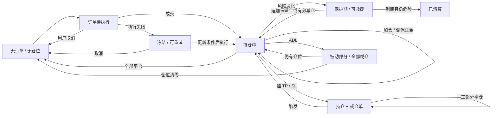

# FX100 用户常用路径与交叉组合测试设计

> 日期：2026-08-02  
> 状态：设计初稿，待产品 / 测试 / 合约联合评审  
> 需求来源：[业务测试用例详情（11 个模块、459 条用例）](../../Docs/Gordon-Notion需求文档归档/2026-07-31_业务测试用例详情（配合业务总览使用）.md)
> 设计方法：[用例设计方法 §四 用户行为场景](../standards/06-用例设计方法.md)  
> 被测基线：`fx100-contracts@release/v0.3.1`，部署 `base_sepolia_v0.3.1_260729`

## 一、结论先行

现有需求账本对单模块、公式、边界和真实测试函数的覆盖已经很深；本轮不再重复证明单点公式，而是补齐用户实际会连续执行的操作链。

首批建议建设 **12 条 P0 主旅程 + 18 条 P1 分支旅程**，覆盖以下高频行为：

1. 开仓后部分平仓、继续加仓、再全平。
2. 开仓后提取保证金，进入风险区，再追加保证金救援。
3. 限价单创建、改单、撤单、触发成交及成交后的止盈止损。
4. 手工减仓与已有 TP/SL 同时存在时的数量联动。
5. 同账户跨 ETH/WBTC 持仓、独立减仓与资金隔离。
6. 持仓跨时间累积资金费后再加仓、减仓或平仓。
7. Gasless / Relay / 子账户模式下创建、更新、取消和防重放。
8. Oracle、Sequencer 或 keeper 短暂异常后的可理解反馈与恢复执行。
9. 清算保护期内救援、保护期到期后的清算与账本闭环。
10. LP 存取款与交易者盈亏、费用、ADL 风险状态的联动。

场景组合采用“**高频主路径 + pairwise 成对覆盖 + 少量三因子高风险组合**”，不做全排列。数值公式继续引用既有 UT / IT 用例；本设计只验证多步状态连续性、用户可见结果和跨模块不变量。

## 二、现有覆盖诊断

| 现有需求模块 | 单点覆盖强项 | 本轮应补的交叉关系 |
|---|---|---|
| 开仓与仓位管理 | 多空、加减仓、部分/全部平仓、token/USD 模式 | 连续加仓→减仓→再加仓；手工减仓与挂单数量联动；平仓后立即反向开仓 |
| 杠杆与保证金 | 100x 边界、提取/追加、三阶段扣减 | 用户先提取再遇价格波动；失败后修正金额重试；风险提示与可操作额度一致 |
| 清算与 ADL | 阈值、保护期、救援、ADL 状态机 | 保护期内多种救援动作交叉；Oracle 异常期间不可清算、恢复后继续；多个市场共同推高风险 |
| Funding | 费率、累积、收付与 LP 路由 | 持仓跨时间后加仓/部分平仓/全平；多空和多市场同时存在时分别结算 |
| 手续费与执行费 | 收取、分账、补贴与领取 | 普通/补贴/Gasless 模式切换；改单使订单从豁免变非豁免；取消退款闭环 |
| LP | 存款、提款、NAV、多人隔离 | 交易盈亏发生在提款等待期；多个 LP 同周期请求；风险状态下提款结果 |
| 订单类型 | 7 种主 OrderType + ADL、改单、取消、冻结 | 市价开平四象限；四类触发单多空边界；部分平仓后剩余 TP/SL；触发同时用户撤单；失败后重试 |
| Oracle | stale、deviation、sequencer、secondary | Oracle 异常与下单/平仓/清算/ADL 交叉；恢复后的幂等执行与提示清除 |
| 动态价差/冲击 | improve/worsen、封顶、负 spread 方案 | 连续交易改变 skew 后下一笔价格变化；跨方向交易由恶化转改善 |
| USDC 精度 | 脱锚、min/max、token 模式 | 脱锚时追加/提取保证金、费用折算、清算与页面美元值同步 |
| Gasless / 子账户 | 授权、nonce、批量、费用 | 授权额度消耗中夹杂创建/改单/撤单；过期后续签；同一签名重放与批量部分失败 |

### 2.1 本轮不重复的内容

- E2E 不作为资金费、点差、手续费底层公式的唯一权威；但 Funding 的用户可见 Factor/EMA/Clamp、结算动作和取整方向需按 [S08](scenarios/S08-Funding计提结算与边界.md) 做双源验证，逐 token 守恒仍以 fork IT / ledger 为准。
- 不重新扫描一般配置的 `阈值±1`；这些属于 UT / IT 的边界矩阵。订单触发价和 `acceptablePrice` 是用户可见语义，例外纳入 [S07](scenarios/S07-订单类型全矩阵.md) 的一最小单位边界。
- 不把 long/short、ETH/WBTC、普通/Relay 等全部做笛卡尔积。
- 不以“订单已从列表消失”作为成功依据；必须确认成交、取消或冻结的真实终态。

## 三、用户模型与优先级

| 用户类型 | 典型目标 | 操作频率 | 场景优先级 |
|---|---|---:|---|
| 新用户 / 轻度交易者 | 首次开仓、查看持仓、部分/全部平仓 | 高 | P0 |
| 活跃交易者 | 加仓、减仓、保证金调整、TP/SL、改单 | 很高 | P0 |
| 多市场交易者 | ETH/WBTC 同时持仓、对冲、独立平仓 | 中高 | P0/P1 |
| Gasless 用户 | Relay 创建/更新/取消，关注实际 USDC 扣费 | 高（新功能） | P0 |
| 子账户 / 批量用户 | 授权、批量交易、防重放、权限到期 | 中 | P1 |
| 高杠杆用户 | 接近清算、保护期内救援、失败后重试 | 中但高风险 | P0 |
| LP 用户 | 存款、等待、提款、NAV 变化 | 中 | P1 |
| Keeper / 风控运营 | 清算、ADL、Oracle 恢复 | 用户不直接操作但影响重大 | P0/P1 |

## 四、用户旅程状态模型

每条用户旅程必须至少核对：

- 订单状态与仓位状态是否一致。
- 页面反馈、交易事件、合约读数是否指向同一种终态。
- 用户、OrderVault、PositionVault、LPVault、费用接收方的资金变化是否守恒。
- 中途失败后重试是否幂等，不重复扣费、不重复建仓、不消费两次 nonce。
- 多市场、多方向或多个订单并存时，非目标对象是否保持不变。

## 五、组合维度与取样策略

### 5.1 组合维度

| 维度 | 代表值 |
|---|---|
| 入口模式 | 普通钱包 / Gasless Relay / 子账户 Relay |
| 订单类型 | MarketIncrease / MarketDecrease / LimitIncrease / StopIncrease / LimitDecrease / StopLossDecrease / Liquidation；二级 ADL |
| 仓位阶段 | 无仓 / 首次开仓 / 已有同向仓 / 已有反向仓 / 风险仓 |
| 操作 | 创建 / 更新 / 取消 / 加仓 / 减仓 / 调保证金 / 全平 |
| 方向与市场 | ETH long / ETH short / WBTC long / WBTC short |
| 价格状态 | 平稳 / 有利 / 不利 / 改善 skew / 恶化 skew |
| 时间状态 | 同块 / 持有 1 天 / 持有 30 天 / 授权或订单临近过期 |
| 依赖状态 | 正常 / keeper 延迟 / Oracle stale / Sequencer down / 恢复期 |
| 资金状态 | 余额充足 / 刚好足够 / 不足 / USDC 脱锚 |
| 风险状态 | 健康 / 危险区 / 保护期 / 可清算 / ADL 开启 |

### 5.2 必须覆盖的成对关系

1. 入口模式 × 操作：普通、Relay、子账户至少各覆盖创建和取消；Relay 额外覆盖改单。
2. 订单类型 × 终态：成交、用户取消、冻结三种语义至少各有代表用例。
3. 仓位阶段 × 操作：首次开仓、同向加仓、部分减仓、全平、反向重开。
4. 时间状态 × 结算：持有时间分别与加仓、部分平仓、全平组合。
5. 依赖状态 × 资金操作：Oracle/keeper 异常时不得重复扣款；恢复后只执行一次。
6. 市场 × 隔离：操作 ETH 时 WBTC 不变，操作 WBTC 时 ETH 不变。
7. 风险状态 × 救援动作：追加保证金、部分减仓、全平分别与保护期组合。

一般旅程继续使用 pairwise，不做全排列；但订单类型专项必须执行 SCN-069 的 24 个触发边界数据集和 SCN-070 的 8 个市价可接受价数据集。

### 5.3 必须保留的三因子高风险组合

- 高杠杆 × 资金费累积 × 价格不利：验证救援与清算边界。
- Relay × 执行费补贴 × 改单：验证从豁免变为非豁免后的补费与失败语义。
- TP/SL × 手工部分平仓 × 价格触发：验证剩余数量与防止过度减仓。
- 多市场 × 共享 LP × 两市场同向盈利：验证 LP 累计义务与风险比率。
- Oracle stale × 可清算仓 × 恢复：验证期间不错误清算、恢复后不重复执行。
- 子账户 × 批量混合操作 × 授权额度临界：验证计数、nonce 和原子性。

## 六、P0 主旅程（首批必须实现）

| ID | 用户目标与操作链 | 交叉模块 | 核心核对点 | 建议层 |
|---|---|---|---|---|
| E2E-LEDG-001 | 首次市价开多 → 查看持仓 → 部分平 50% → 全平 | ORD+POS+EXEC+FEE+LEDG | 每步订单终态唯一；仓位/OI按比例变化；最终无仓；全程资金守恒 | E2E + fork IT |
| E2E-LEDG-002 | 开空 → 同向加仓 → 提取一部分保证金 → 全平 | POS+FEE+FUND+RISK | 加仓后均价/规模正确；可提额度与链上闸门一致；结算不丢 funding | E2E + fork IT |
| E2E-LEDG-003 | 开仓 → 提取保证金进入危险区 → 追加保证金救援 → 平仓 | POS+LIQ+RISK+PREC | 风险提示及时；不足救援失败但不改仓；足额救援后不可清算 | 域专用 fork + E2E |
| E2E-ORD-001 | 挂限价开仓 → 修改触发价/规模 → 价格未到前取消 | ORD+GAS+LEDG | 更新字段唯一生效；取消后抵押和执行费正确退回；不生成仓位 | E2E |
| E2E-ORD-002 | 挂限价开仓 → 触发成交 → 挂 TP+SL → TP 成交 | ORD+POS+EXEC+FEE | 开仓与减仓单关联正确；TP 后仓位变化；SL 剩余数量/状态符合产品规则 | E2E + IT |
| E2E-ORD-003 | 持仓 + TP/SL → 手工部分平仓 → 剩余订单触发 | ORD+POS+RISK | 不得过度减仓；剩余减仓单数量正确或按规则取消；最终状态一致 | E2E + IT |
| E2E-MKT-001 | 同账户开 ETH long + WBTC long → 平 ETH → 加 WBTC | MKT+POS+FUND+LEDG | ETH 操作不改 WBTC 字段/OI/funding 基准；共享 LP 变化可解释 | fork IT |
| E2E-FUND-001 | 开仓 → 持有 1 天 → 加仓 → 再持有 → 部分平仓 → 全平 | FUND+POS+FEE+LEDG | 每段 funding 分开结算；加仓前后基准重对齐；无重复计费；正式执行矩阵见 SCN-073～080 | 域专用 fork + E2E |
| E2E-RELAY-001 | Gasless 创建市价单 → Relay 执行 → 用户全平 | RELAY+GAS+ORD+POS+FEE | Relayer 垫付与 USDC 收回闭环；多退执行费只退一次；用户净扣款可解释 | E2E + fork IT |
| E2E-RELAY-002 | Gasless 限价单 → 改大规模从豁免变非豁免 → 补费 → 取消 | RELAY+GAS+ORD | 不补费时明确失败且订单不变；补费后更新；取消退款不重复 | fork IT |
| E2E-ORA-001 | 创建订单后 Oracle stale → 执行失败/冻结 → 价格恢复 → 重试成交 | ORA+ORD+POS | 异常期间不建仓、不重复扣款；恢复后只成交一次；错误提示清除 | 域专用 fork + E2E |
| E2E-LIQ-001 | 高杠杆仓进入保护期 → 用户追加保证金救援 → keeper 再检查 | LIQ+POS+ORA+RISK | 保护期内 keeper 被阻止；救援成功后到期也不可清算；账本守恒 | 域专用 fork + E2E |

## 七、P1 分支旅程

| ID | 分支场景 | 主要交叉模块 | 关键风险 |
|---|---|---|---|
| E2E-LEDG-004 | 全平后立即反向开仓 | POS+ORD+EXEC | 旧仓字段、funding 基准和 OI 不得污染新方向 |
| E2E-LEDG-005 | 连续五轮开仓/部分平仓/全平，操作比例不同 | POS+LEDG+FEE | 累积舍入、残留仓位、费用重复计算 |
| E2E-POS-001 | 追加保证金后立即提取同额 | POS+RISK+FUND | 往返后只保留真实费用/funding，不能凭空增减 |
| E2E-POS-002 | 提取保证金失败 → 改为较小金额重试 | POS+RISK | 首次失败必须无状态变化，重试只执行一次 |
| E2E-ORD-004 | 限价单触发同时用户提交取消 | ORD+KEEPER | 最终只能是成交或取消之一，不能双退款/双执行 |
| E2E-ORD-005 | 价格保护失败导致冻结 → 用户更新 acceptablePrice → 重试 | ORD+EXEC+ORA | 冻结区别于取消；资产仍锁定；重试不创建第二份订单 |
| E2E-ORD-006 | 市价单 keeper 延迟，过期前取消失败、过期后取消成功 | ORD+GAS | 时间边界、用户反馈、退款闭环 |
| E2E-MKT-002 | ETH long + WBTC short 对冲，分别部分平仓 | MKT+POS+LEDG | 市场与方向双重隔离；共享 LP 净变化可解释 |
| E2E-MKT-003 | 两市场同时盈利并依次平仓 | MKT+RISK+LP | LP 累计支付、全局净义务比率、第二次平仓能力 |
| E2E-FUND-002 | 多空双方持仓，持有后先平付款方再平收款方 | FUND+POS+LP | 付款/收款/LP claimable 三方闭环，顺序不改变总守恒 |
| E2E-PREC-001 | USDC 轻微脱锚 → 提取保证金被拒 → 追加后成功 | PREC+POS+LIQ | 页面美元值与合约 min 价一致，边界反馈正确 |
| E2E-PREC-002 | token 模式开仓 → USD 模式部分平仓 → token 模式全平 | PREC+POS+ORD | 两种计价模式切换无残留；全平精确清零 |
| E2E-RELAY-003 | 子账户授权 3 次：创建、改单、撤单刚好耗尽 | SUB+RELAY+ORD | 每个动作计数口径；第 4 次拒绝；nonce 单调增加 |
| E2E-RELAY-004 | 授权过期 → 操作失败 → 主账户续签 → 原业务重试 | SUB+RELAY | 过期签名不可复用；续签后仅新 nonce 生效 |
| E2E-RELAY-005 | 批量创建+取消，最后一笔超授权额度 | SUB+RELAY+ORD | 明确批次原子/部分成功语义；不得出现计数和实际动作不一致 |
| E2E-ORA-002 | Sequencer 恢复但仍在宽限期 → 操作失败 → 宽限期后成功 | ORA+ORD | 恢复不等于立即可交易；失败期间资产不重复移动 |
| E2E-LIQ-002 | 保护期内部分减仓不足 → 再次足额减仓救援 | LIQ+POS+EXEC | 首次取消/失败无副作用；第二次达到阈值后风险解除 |
| E2E-LP-001 | LP 存款 → 交易者盈利 → LP 发起提款 → 等待期内再发生亏损 → claim | LP+POS+LEDG | claim 按规定时点 NAV；其他 LP 份额不受污染；资金守恒 |

## 八、P2 专项与容量场景

| ID | 场景 | 目的 |
|---|---|---|
| E2E-CAP-001 | 同一触发价堆积大量限价单后集中成交 | 验证 keeper 吞吐、顺序、公平性和失败重试 |
| E2E-CAP-002 | 多账户同时救援与清算 | 验证清算踩踏、Oracle 报价时效和状态竞争 |
| E2E-CAP-003 | 多 LP 同 epoch 密集存取款 | 验证份额、锁定、批量 claim 和舍入累计 |
| E2E-CAP-004 | 多市场同时盈利导致全局风险超限并触发 ADL | 验证全局比率、目标方向选择和减仓后回落 |
| E2E-FAULT-001 | Oracle stale + Sequencer down + keeper 重启 | 验证多依赖故障的分诊、恢复顺序和幂等性 |

容量场景需单独立项，不与常规发布回归混跑。

## 九、每条场景的统一核对框架

正式拆入 `cases/e2e/` 时，每条用例按六字段标准展开，并至少包含以下证据：

| 类型 | 必查内容 | 证据 |
|---|---|---|
| 页面状态 | 订单列表、持仓面板、可用余额、错误/冻结/恢复提示 | 关键步骤截图 |
| 订单状态 | order key、类型、规模、触发价、执行费、最终状态 | 合约读数 + 事件 |
| 仓位状态 | sizeUsd、sizeTokens、collateral、方向、funding 基准 | 合约读数 |
| 市场状态 | 双向 OI、claimable fee/funding、风险比率 | 合约读数 / CSV |
| 资金状态 | trader、OrderVault、PositionVault、LPVault、FeeHandler Delta | 账本 CSV，守恒 T0 |
| 执行证据 | txHash、block、事件、keeper/relay 执行主体 | 交易回执 |
| 隔离性 | 非目标市场、非目标方向、其他账户状态不变 | before/after 对照 |
| 幂等性 | 重试后不重复扣款、不重复执行、不重复消费 nonce | 事件计数 + Delta |

### 9.1 失败语义必须分开断言

| 失败类型 | 订单 | 资金 | 用户反馈 |
|---|---|---|---|
| 显式拒绝 / revert | 不创建或原状态不变 | 不移动 | 显示可修正原因 |
| 静默取消 | 删除订单 | 按规则退款 | 显示已取消及原因 |
| 冻结 | 保留冻结订单 | 资产继续锁定 | 显示需更新/取消 |
| BLOCKED（依赖故障） | 不把环境问题算产品失败 | 不应出现重复扣款 | 标记依赖及可重试条件 |

## 十、执行环境分工

| 场景类型 | 首选环境 | 原因 |
|---|---|---|
| 普通开仓、加减仓、多市场、Relay 真实资金流 | 共享 Tenderly fork | 验证真实部署参数与真实交易 Delta |
| Funding 时间推进、清算、ADL、可控 Oracle | 域专用 anvil fork | 可推进时间、控制价格并每例快照回滚 |
| 页面旅程、提示、移动端、钱包交互 | E2E 浏览器 + fork 后端 | 双源核对页面与链上状态 |
| 精确公式、阈值、舍入 | 现有 Foundry UT/IT | 快速、确定性，不在 E2E 重证 |
| 大规模并发与集中触发 | 独立容量环境 | 避免污染发布回归和共享 fork |

## 十一、首批实施顺序

### 批次 A：日常交易闭环（发布冒烟）

1. `E2E-LEDG-001`
2. `E2E-LEDG-002`
3. `E2E-ORD-001`
4. `E2E-ORD-002`
5. `E2E-MKT-001`

### 批次 B：高风险资金与恢复

1. `E2E-LEDG-003`
2. `E2E-FUND-001`
3. `E2E-ORA-001`
4. `E2E-LIQ-001`

### 批次 C：新入口与授权

1. `E2E-RELAY-001`
2. `E2E-RELAY-002`
3. `E2E-RELAY-003`
4. `E2E-RELAY-004`

建议发布门槛：批次 A 全量必跑；改动涉及资金费、Oracle、清算时追加批次 B；改动涉及 Gasless / Relay / Subaccount 时追加批次 C。

## 十二、评审待定项

1. 手工部分平仓后，已有 TP/SL 的剩余规模是自动缩减、保持原值但执行时封顶，还是自动取消重建；需产品给出唯一规则。
2. 限价单触发与用户取消竞争时，页面应如何表达最终赢家以及失败交易；需前端确认。
3. Relay 批量请求中单笔失败时，产品语义是整批原子回滚还是允许部分成功；需合约/产品确认。
4. Oracle stale / deviation / Sequencer 故障按当前权威口径应 Revert 并保持原订单/资金，价格保护不可满足才进入 Frozen；若实际部署行为不同，按 SCN-071 记录为基线差异/缺陷。恢复后是自动还是用户手动重试，页面交互仍需确认。
5. USDC 脱锚时页面“保证金、杠杆、可提金额、清算价”是否全部使用合约 min 价口径；需前端逐字段确认。
6. LP 提款等待期内 NAV 的锁定/结算时点需要与当前实现和用户文案再核对。
7. 负 Dynamic Spread 改造落地前后，清算/ADL 执行价格隔离规则不同；相关组合用例需以功能开关或版本拆分。

---

本稿通过评审后，下一步按域拆为 `cases/e2e/LEDG.md`、`ORD.md`、`RELAY.md`、`ORA.md`、`LIQ.md` 等正式六字段用例；每个主旅程保留 1 条 happy path，并从本稿 P1 表选择 2～4 条真实高价值分支，不继续扩成全排列。
