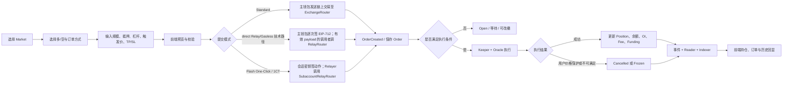

# v0.3.2 Trade 功能总览

## 1. Trade 的范围

Trade 是用户围绕永续仓位完成“选市场—建仓—管理风险—退出—查看结果”的完整链路。它不等于单一的 `createOrder` 接口。

| 功能域 | 用户目标 | 合约核心职责 | 前端核心职责 |
|---|---|---|---|
| Market | 选择交易标的并了解市场状态 | 提供市场配置、OI、流动性、价格与风险参数 | 展示市场、行情、最大杠杆、Funding、可用性 |
| Order | 表达开仓、加仓、减仓或平仓意图 | 保存订单字段、校验权限与参数、管理生命周期 | 构造正确 payload，展示预览并完成签名 |
| Position | 持有并管理多/空仓位 | 维护 size、collateral、entry、funding、PnL 和 OI | 展示仓位并提供平仓、保证金和杠杆操作 |
| Pricing | 给订单计算可执行价格 | Oracle 价格 + price impact + dynamic spread + acceptablePrice 校验 | 展示参考价、预估执行价、价格影响和滑点保护 |
| Fee | 收取交易与执行成本 | 计算 position fee、borrowing/funding、execution/relay 等资金项 | 下单前说明 Pay、费用和预计可得 |
| Risk | 防止坏账并处置危险仓位 | 清算、保护期、ADL、上限、最小抵押与 OI 风控 | 显示清算价、风险状态、保护状态和处置结果 |
| Oracle/Keeper | 提供价格并执行可执行订单 | 验证价格时间窗和触发条件，由 Keeper 调用执行 | 显示 pending/executed/cancelled/frozen，而非假定立即成交 |
| Standard / Flash One-Click | 产品只向用户暴露两种模式；实现层保留 Standard、direct Relay 和 1CT 三条技术提交路径 | `ExchangeRouter`、`RelayRouter` 或 `SubaccountRelayRouter` 验证请求，并最终进入同一订单系统 | 管理模式偏好、钱包/会话签名、Relay task、费用和切换恢复；direct Relay 卡片当前隐藏 |

## 2. 参与者

| 参与者 | 职责 |
|---|---|
| Trader | 创建、更新、取消订单，管理自己的仓位 |
| ExchangeRouter | Standard 路径入口，转移资金并创建/更新/取消订单 |
| RelayRouter | 直接 Relay/Gasless 路径入口；验证主钱包逐次 EIP-712 请求和 Relay Fee |
| SubaccountRelayRouter | Flash One-Click/1CT 路径入口；验证主账户授权、命名 `slot`、会话动作签名、有效期、计数和 Relay Fee |
| OrderHandler | 保存、执行、取消或冻结订单 |
| Relay caller / Relayer | 提交有效的 Relay EIP-712 payload、支付交易 Gas，非补贴订单还要先垫 WNT execution fee；合约未限定必须是白名单 Keeper |
| Order/Liquidation/ADL Keeper | 带 Oracle 数据调用订单执行、清算或 ADL；与 Relay caller 是不同阶段和职责 |
| Oracle | 提供带时间窗的 min/max price |
| Reader | 为前端和测试提供订单、仓位、市场等权威读取 |
| Indexer/API | 把事件转为页面订单历史和市场数据；它不是链上事实源 |

## 3. Trade 总流程

## 4. v0.3.2 对 Trade 的关键变化

1. Dynamic Spread 改为 `int256`，允许负值，并新增每市场/方向 MIN/MAX clamp。
2. 普通交易可使用负点差；Liquidation/ADL 对负点差按 0 处理。
3. Funding 现金流改为仓位实际应用 Funding 时结算。
4. 减仓实际校验 `minOutputAmount`，并修复完整平仓取整与剩余成本 USD 单位。
5. Relay feeToken 必须等于全局 `COLLATERAL_TOKEN`。
6. 子账户改为最多 4 个命名槽位，EIP-712 授权包含 `slot`。
7. Claimable Collateral 机制移除；前端和后台不得继续调用。
8. 减仓事件输出结构发生变化，前端/索引器需要适配。

与上述协议变化同时存在的 CURRENT 前端/Keeper 事实，必须单独记录：

- 1CT 会话私钥由浏览器随机生成，不是主钱包签名派生；`Stay connected` 默认开启。授权策略是 90 天，每次续期以链上已用数加 1,000,000 作为新累计上限；旧的 1 小时离开/闲置锁已停用。
- 模式持久化默认值是 `1ct`，但实际 Relay family gate 还要求环境开关、支持链和非零 `RelayRouter`；当前 gate 未单独检查 `SubaccountRelayRouter`，1CT 必须额外验证目标地址。旧的 `flash` 持久化值仍可能形成无卡片选中的僵尸状态。默认偏好不等于功能可用。
- Terms/Privacy 在连接钱包时披露，1CT 风险确认是按 owner 和版本保存的独立 `personal_sign`。当前建连弹窗仍强制 Terms/Privacy 勾选，Settings 又可在未检查 consent 时先生成 key/签 approval；这是实现与最终分层需求的差异。
- 合约对 1CT create、update、cancel 和 batch 统一使用 `SUBACCOUNT_ORDER_ACTION`，当前不能按动作类型分别授权。
- 四个命名槽位不会因过期或 `removeSubaccount` 自动释放；只有 `removeSlot` 释放容量。当前没有 `revokeAll`，前端 Disconnect 又走主钱包直调 `removeSubaccount`，不能宣称“一键撤销全部/释放槽位”。
- v0.3.2 合约的 `SubaccountApproval` 已包含 `slot`，但 CURRENT SDK/前端/Keeper 仍按无 `slot` 旧结构签名与编码；修复前 1CT 功能层记 `GAP`，版本前端准入另保持 `NOT_READY`。
- Relay 非补贴 create/update 由实际 caller 先垫 WNT Execution Fee，并把完整垫付款纳入 Relay Fee；订单以后执行/取消的多余部分可用原生币/WNT 退给用户。总账不得把这笔 execution fee 重复计费，也不得假设以 USDC 自动退款。
- v0.3.2 Relay/1CT 的 6 位 USDC Max 统一按 `B>C+U ? B−C−U : 0`：`C` 是当次 signed `maxFeeAmount`，`U=1 USDC=1_000_000 raw` 是额外钱包预留。cap 命中 0.5U 下限时，余额必须严格大于 1.5U 才有正 Max；等于仍为 0。CURRENT 固定 raw reserve 也会作用到 Standard/未来非 6 位 payToken，属于作用域边界；Switch Standard 不自动提交，手填金额保持，Max/百分比派生金额会按新模式重算。
- Relay task 只有 `pending → submitted → executed/failed`；`executed` 只表示 Relay Router 交易回执成功，不表示新建订单已成交。市价/条件单仍由后续 Order Keeper 生命周期处理，前端本地 timeout 也不能覆盖服务端或链上状态。

三条提交路径、前端切换、1CT 会话、Relay Fee、动作覆盖和当前实现 GAP 统一见 [Standard-Relay-Flash-OneClick-(v0.3.2).md](Standard-Relay-Flash-OneClick-(v0.3.2).md)。

## 5. 功能验收原则

- 页面显示正确不代表合约账本正确；合约执行成功也不代表页面体验正确。
- 每笔关键交易至少对齐：页面输入 → payload → Order → 执行事件 → Reader → 余额/OI → 页面最终显示。
- `Created`、`Executed`、`Cancelled`、`Frozen` 必须分别验证，不能只测成功成交。
- 所有价格与金额必须注明精度和单位，特别区分 token amount、USD 1e30、USDC 1e6 和比例 1e30/1e18。
- Mock 合成市场的名称、symbol、index token 和 decimals 是测试环境 fixture，不代表固定资产语义。测试必须从 CURRENT 部署清单或 Reader 运行时读取；不得因为某次命名含 BTC 就固定使用 BTC 业务假设或 `1e8` 精度。
