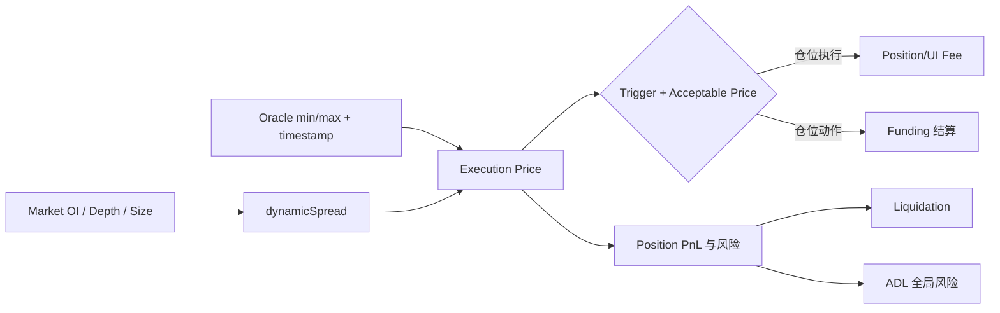

# v0.3.2 Fee 与 Oracle（兼容入口）

> 历史文件名保留，避免现有引用失效。Funding、Liquidation、ADL 和 dynamicSpread 已拆成独立主文档；本文件只维护 Fee、Oracle、跨域关系与导航。参数值必须从 [`Docs/contract-releases/CURRENT.json`](../../../../Docs/contract-releases/CURRENT.json) 对应部署运行时读取。

## 1. 功能域关系

| 功能域 | 解决的问题 | 触发者/时点 | 主文档 |
|---|---|---|---|
| Fee | 一笔交易支付和分配哪些成本 | 创建或执行订单 | 本文 §3 |
| dynamicSpread | OI、深度和规模如何修正成交价 | 仓位执行时合约计算 | [dynamicSpread-(v0.3.2).md](dynamicSpread-(v0.3.2).md) |
| Funding | 多空长期失衡如何转移持仓成本 | 更新指数；仓位动作结算 | [Funding-(v0.3.2).md](Funding-(v0.3.2).md) |
| Liquidation | 危险仓位何时强制全平 | Liquidation Keeper | [Liquidation-(v0.3.2).md](Liquidation-(v0.3.2).md) |
| ADL | 全局偿付压力过大时如何降风险 | ADL Keeper | [ADL-(v0.3.2).md](ADL-(v0.3.2).md) |
| Oracle | 触发、定价、费用换算和风险判断使用什么价格 | Oracle Provider + Keeper | 本文 §7 |



## 2. Trade 价格链路

```text
Oracle Price.Props {min, max}
→ 按 orderType、isLong、Increase/Decrease 选择价格侧
→ OI、深度、规模计算 price impact 与 skew impact
→ 有符号 dynamicSpread + MIN/MAX clamp
→ executionPrice
→ triggerPrice 校验（条件单）
→ acceptablePrice 校验
```

必须区分：

- Oracle Price 是外部价格区间输入。
- Trigger Price 只决定条件单是否进入执行校验，不保证成交。
- Execution Price 是定价链计算出的实际价格。
- Acceptable Price 是用户允许的最差成交边界。
- Mark/Display Price 是页面展示值，不能自动视为合约使用的价格侧。
- Price Impact/dynamicSpread 体现在成交价和 PnL，不是单独扣除的 token fee。

完整 signed、clamp、特殊订单和边界规则见 [dynamicSpread 主文档](dynamicSpread-(v0.3.2).md)。

## 3. Fee 功能

### 3.1 分类与边界

| 费用/资金项 | 发生时点 | 计费基础 | 支付/接收 | Order 是否存金额 |
|---|---|---|---|---|
| Position Fee | Increase/Decrease 执行 | `sizeDeltaUsd × positionFeeFactor` | 从抵押/输出扣除并分账 | 否 |
| Open/Close Fee | Position Fee 的业务名称 | Increase/Decrease size | 同 Position Fee | 否 |
| Liquidation Fee | 真正执行清算 | 清算全仓 sizeInUsd | 从清算结算资金扣除并分账 | 否 |
| UI Fee | 非零 `uiFeeReceiver` 的订单执行 | sizeDeltaUsd | UI receiver | 只存 receiver |
| Execution Fee | 创建用户订单时预存 | Keeper gas 规则 | Keeper 与退款接收方 | 是，`executionFee` |
| Relay Fee | Flash/Relay 请求 | gas、倍率与 Oracle 换算 | account → Relay caller | 否，属于 RelayParams |
| Funding Fee | 随时间累计，仓位动作应用 | per-size 指数快照差 | Position ↔ 协议 claimable / Market Vault | 否，Position 存快照 |
| Referral/Pro Discount | Position Fee 计算时 | tier/referral 配置 | 降低用户费、产生 affiliate reward | 否 |
| Price Impact/dynamicSpread | 仓位执行时 | OI、深度、规模、方向 | 体现在 executionPrice/PnL | 不是 fee |

v0.3.2 当前 Position 数据与 `PositionFees` 结算结构包含 Funding，不应因仓库中存在 borrowing 预留 keys 就把 Borrowing Fee 写入本版本实际总账断言。

### 3.2 Position / Open / Close Fee

```text
positionFeeUsd = floor(sizeDeltaUsd × positionFeeFactor / 1e30)
positionFeeAmount = floor(positionFeeUsd / collateralTokenPrice.min)
netPositionFee = positionFeeAmount - totalDiscountAmount
```

断言规则：

1. Increase 对应 Open，Decrease/Liquidation 的普通仓位费对应 Close；事件统一记录 Position Fee 分解。
2. `positionFeeFactor` 由 `balanceWasImproved` 选择，不能从 final dynamicSpread 正负反推。
3. token 金额换算使用 collateral price 的风险侧；精确舍入以合约实现为准。
4. Pro 与 Referral 按合约优先级处理，不能简单相加。
5. discount 与 affiliate reward 的合计不得超过原始 Position Fee。
6. USD-size Increase 中 spread 通常不改 fee 基数；token-size Increase 会因执行价改变 resolved `sizeDeltaUsd`，从而改变 fee 金额。

测试覆盖最小/普通/大 size、改善/恶化档、单价/双价、无折扣/Pro/Referral/组合、100% 与越界，并核对事件、抵押差分、Pool 和 receiver。

### 3.3 Liquidation Fee 摘要

- 清算判定：计预计 Close Fee 与正负 Funding，不计 Liquidation Fee。
- 清算执行：计 Close Fee、Liquidation Fee 与实际 Funding。
- 清算内部订单 `uiFeeReceiver=0`、`executionFee=0`。

这里仅保留跨费用模块的导航摘要，不复制公式。判定、执行、精确取整、分账、未支付差额与 insolvent 早退边界的唯一主定义见 [Liquidation 主文档](Liquidation-(v0.3.2).md)。

### 3.4 UI Fee

```text
uiFeeUsd = floor(sizeDeltaUsd × uiFeeReceiverFactor / 1e30)
uiFeeAmount = floor(uiFeeUsd / collateralTokenPrice.min)
```

`uiFeeReceiver=address(0)` 时为 0。测试核对 receiver、费率上限、费用事件、Position/Vault 差分和接收方余额，不能只看页面汇总。

### 3.5 Execution Fee

- 属于 `Order.Numbers.executionFee`，用于后续 Order Keeper 的执行 gas；它与 Position、Liquidation、Funding 的计算独立，但在 Relay family 的资金流中会被纳入 Relay Fee 换算。
- Standard 创建/更新由用户向 OrderVault 预存 WNT；Relay family 的非补贴 create/update 由 Relay caller 先垫 WNT，再把这笔完整垫付款纳入本次 `nativeFee`，以 feeToken 向 account 收回。
- 订单执行、冻结、Keeper 错误取消或 auto-cancel 时，实际 Keeper 按 gas 获得 Execution Fee；用户主动 `cancelOrder` 则由合约把 `order.account` 作为该费用接收者。Relay cancel caller 通过 Relay Fee 补偿代发 gas，不会因此接收 Order 的取消 Execution Fee。多余 WNT 解包为原生币，先给 callback 处理，未处理再发给 refund receiver。
- Execute 的 refund receiver 是 `order.receiver`；Cancel 优先使用非零 `cancellationReceiver`，否则回退到 `receiver`。CURRENT Relay create 设置 receiver=用户、cancellationReceiver=0、callback=0，因此超额最终以原生币退给用户，不退给 Relay caller，也不是 USDC 退款。
- Update 若进入 execution-fee subsidy 分支，OrderHandler 会把旧 fee 与本次实际收到的 WNT 直接发给 receiver；Relay helper 在该分支不会按 `executionFeeIncrease` 垫入 WNT。这条路径必须与正常执行/取消的 Keeper 实耗退款分开断言。
- 覆盖不足、恰好、超额、补贴，以及 execute、用户 cancel、auto-cancel、失败/frozen；逐项核对 Keeper、用户、callback、OrderVault 和页面 Pay。

### 3.6 Relay Fee

- 只属于 Relay/Gasless 与 Flash One-Click/1CT 请求；Standard 路径不产生。
- `feeToken` 必须等于全局 `COLLATERAL_TOKEN`。
- 两类 Relay Router 的外部 relay 函数都没有 `onlyKeeper`。任何持有有效签名 payload 的 caller 都可广播，实际 `msg.sender` 支付链上 gas 并接收 Relay Fee；签名、domain/chainId、deadline、nonce/count、业务校验和 cap 才是权限边界。
- `maxFeeAmount` 是授权上限，不是固定收费。合约只拉取实际 `feeAmount`，不存在先扣 max 后退差额。
- 实际值按下列关系计算，并由合约逐步向上取整：

```text
relayGasLimit = actualGas + RELAY_BASE_GAS + calldataGas
nativeFee = ceil(relayGasLimit × tx.gasprice × RELAY_FEE_MULTIPLIER_FACTOR)
          + relayExecutionFee
feeAmount = ceil(nativeFee × WNT.max / feeToken.min)
```

- 必须同时满足 `feeAmount <= maxFeeAmount`、非零 `MAX_RELAY_SWAP_WNT_CAP` 对 nativeFee 的上限，以及 calldata 不超过 50,000 bytes。
- CURRENT 前端展示估算采用约 4 KB calldata、1.2 倍和 0.01 USDC 最小值；签名 cap 采用 50 KB、3 倍、0.5 USDC 最小值，并有 25 USDC 绝对上限。签名前会重新报价。Shared gate 把 loading、unavailable、insufficient 都标记为 blocked，但 Update 与多个 close/margin 类入口消费 gate 的方式不同，存在全阻断和仅 insufficient 阻断两套行为；必须分别留证，不能只验证一个表单。
- 超过 25 USDC 时底层抛专用 cap 错误，但当前刷新层把该错误折叠为 `unavailable`，可能丢失专用提示和 Switch Standard 动作。
- v0.3.2 Relay/1CT 的 6 位 USDC Max 唯一公式为 `B>C+U ? B−C−U : 0`，其中 `U=1 USDC=1_000_000 raw`：signed cap 与额外 U 是两级预留。cap 命中 0.5U floor 时，正 Max 的最低余额门是严格大于 1.5U；`C+U−1/= /+1 raw` 必须逐点验证。Standard 仍被固定减 raw、结果为 0 时按钮无反馈、未来非 6 位 pay/fee token 的单位错配，均作为当前作用域/交互 GAP 留证。
- “Switch to Standard” 只切模式、不自动提交；手工字段保持，仍选中的 Max/百分比按 Standard 可用额重算。入口当前主要只在 confirmed insufficient 分支出现，报价不可用/cap 分支需另行核对。
- Relay Fee 不能与 Order executionFee 混成两个用户扣款：非补贴 Relay create/update 时，完整 execution-fee 垫付款已经包含在 `nativeFee` 内；后续 Order Keeper 结算后的原生币/WNT 退款是另一笔流入。
- v0.3.2 的子账户专属 USD 上限键当前未接入收费路径；全局 WNT cap 只能在非零时限制单次 native fee，不能替代 1CT 专属保护。
- Relay create/update 还需单测非空 callback + 大额 execution fee；当前 `shouldCapMaxExecutionFee=false` 是独立于 Relay Fee 的已知安全 GAP。

完整字段与边界见 [02-订单类型与交易流程.md](02-订单类型与交易流程.md#5-relay-fee-流程与功能点)；两种产品模式、三条技术提交路径、签名主体、切换和任务状态见 [Standard-Relay-Flash-OneClick-(v0.3.2).md](Standard-Relay-Flash-OneClick-(v0.3.2).md)。

### 3.7 Fee 总账

Standard 与 Relay family 必须使用不同现金流视角，不能用一条无条件相加公式：

```text
共同的仓位结算项
= 净 Position Fee
 + UI Fee
 + Liquidation Fee（仅清算执行）
 + 实际应付 Funding - 实际应收 Funding
 ± PnL / 释放抵押 / 输入抵押

Standard 额外现金流
= 创建/更新时原生币或 WNT Execution Fee 预存
 - 执行/取消后退回用户的原生币或 WNT
（净额才是 Keeper 实耗及相关处理成本）

Relay family 额外现金流
= RelayFeePaid 对 feeToken 的实际扣款
 - 后续订单执行/取消退给用户的原生币或 WNT
（RelayFeePaid 已包含非补贴路径的完整 Execution Fee 垫付款，不再重复加 Order.executionFee）
```

Relay Fee 不是“Execution Fee 净实耗”的同币种最终结算：用户先以 feeToken 补偿 caller 的完整垫资，日后多余部分可能以原生币/WNT退给用户。因此同时核对 feeToken、WNT 和 native 三套余额，不能只看单一 USDC 净差。

同时核对 Fee Receiver、Pool/MarketVault、PositionVault、OrderVault、Keeper、实际 Relay caller、callback、Affiliate、UI Receiver 和用户的对应变化。若资不抵债，应使用实际支付额与不足事件，不得拿理论 fee 强行配平余额。

## 4. Funding 导航

Funding 的市场指数、3600 秒连续衰减 skew EMA、正负 per-size、仓位快照、应付向上/应收向下舍入、协议 claimable/Market Vault 净额路由、影响数据和边界统一维护在 [Funding-(v0.3.2).md](Funding-(v0.3.2).md)。

本文件只保留两个跨域提醒：

- Funding event 的 `positionPaysLp` 是观察值，不代表逐仓 Vault 已转账。
- 清算/ADL/普通仓位动作会结算 Funding，但各自的可执行条件和终态不同。

## 5. Liquidation 导航

Grace 等号、清算成交价、remaining collateral 三条件、判定/执行费用差异、Keeper/前端清算价和账本统一维护在 [Liquidation-(v0.3.2).md](Liquidation-(v0.3.2).md)。

## 6. ADL 导航

启停双阈值、secondary Oracle、目标 side 正 PnL、内部 MarketDecrease、严格风险改善和原子回滚统一维护在 [ADL-(v0.3.2).md](ADL-(v0.3.2).md)。

## 7. Oracle 功能

### 7.1 作用

合约使用 `Price.Props {min,max}` 及 Oracle 最小/最大时间戳。Oracle 参与 Trigger、Execution Price、acceptable price、collateral/Fee/Funding 换算、Liquidation/ADL，以及 Relay Fee 的 WNT/feeToken 换算。

### 7.2 Trigger 方向性选价

| OrderType | long 条件 | short 条件 |
|---|---|---|
| LimitIncrease | `price.max <= trigger` | `price.min >= trigger` |
| StopIncrease | `price.max >= trigger` | `price.min <= trigger` |
| LimitDecrease / TP | `price.min >= trigger` | `price.max <= trigger` |
| StopLossDecrease / SL | `price.min <= trigger` | `price.max >= trigger` |
| Market / Liquidation | 不做 trigger 校验 | 不做 trigger 校验 |

### 7.3 Acceptable Price 四象限

| 动作 | 方向 | 成交条件 |
|---|---|---|
| Increase | long | `executionPrice <= acceptablePrice` |
| Increase | short | `executionPrice >= acceptablePrice` |
| Decrease | long | `executionPrice >= acceptablePrice` |
| Decrease | short | `executionPrice <= acceptablePrice` |

每象限覆盖有利、`E=A`、最小不利越界。Trigger 已满足但 acceptable price 失败时不能成交；失败路径可能取消或冻结，按 OrderType 保存可解释终态。

### 7.4 时间与故障

覆盖：

- `min=max` 与 `min<max`。
- timestamp 过旧、过新、不覆盖订单或 ADL 状态时间窗。
- Provider 未配置、价格缺失、零值、异常区间。
- Sequencer/RPC 暂停、Keeper 无法取得或提交报告。
- 恢复后 Open/Frozen 订单重试，不得重复创建或重复结算。
- 页面行情时间、预览时间、Order `updatedAtTime`、Oracle timestamp 和执行区块同时留证。

### 7.5 Mock Oracle 与精度

- Mock Oracle 是受控测试工具，不代表生产 Provider 已通过。
- Mock index token 不固定为 BTC；symbol、地址、decimals 运行时读取。
- index token 8/18 decimals 与 Oracle precision 是两个维度；至少各跑一组经济规模等价数据。
- 推价后读取链上实际 price 与 timestamp，不能只保存脚本输入。
- 用例结束恢复 Oracle、STABLE_PRICE、点差/OI 等共享 fixture。

## 8. 跨域证据

一笔关键交易至少保存：环境与版本、数据集、页面输入/预览、实际 payload、交易哈希/orderKey、Oracle min/max/timestamp、事件、Reader、Position/OI/Vault/账户余额差分和页面终态。

以下证据不能互相替代：

- Fee 单元测试不代表前端费用预览正确。
- Keeper 成功不代表 OrderType、Trigger 或钱包流程正确。
- 页面显示 Funding 不代表逐仓资金流正确。
- 页面显示清算不代表 Fee、Funding 和残值守恒。
- ADL 主类型显示 MarketDecrease 不代表可以丢失 secondary identity。
- Mock Oracle 边界通过不代表生产 Provider 与故障恢复已覆盖。

## 9. 对应用例入口

| 功能域 | 主要用例 |
|---|---|
| Position/UI/Execution Fee | CT/XT-OPEN、CLOSE、TPSL 与 fee 账本断言 |
| Relay Fee | CT-RELAY-001～009、XT-RELAY-010 |
| dynamicSpread | CT-PRICE-001～004、XT-PRICE-005、FT-PRICE-006 |
| Funding | CT-FUND-001/002 |
| Liquidation | XT-LIQ-001、XT-LIQ-003、CT-LIQ-FEE-005、CT-LIQ-REF-006、FT-LIQ-005、XT-PROT-LIQ-010、XT-PROT-RACE-011 |
| ADL | XT-ADL-001、CT-ADL-004 |
| Oracle/Acceptable Price | XT-ORD-LI-001/002、XT-ORD-SI-001/002、XT-ORD-LD-001/002、XT-ORD-SL-001/002、XT-ORD-MI-002、XT-PRICE-005 |

详细步骤只在 [Trade & Order 测试用例矩阵](Trade-测试用例矩阵.md) 维护；功能文档只说明规则、影响面、边界和用例映射。
