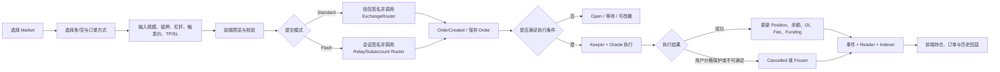

# v0.3.2 Trade 功能总览

## 1. Trade 的范围

Trade 是用户围绕永续仓位完成“选市场—建仓—管理风险—退出—查看结果”的完整链路。它不等于单一的 `createOrder` 接口。

| 功能域 | 用户目标 | 合约核心职责 | 前端核心职责 |
|---|---|---|---|
| Market | 选择交易标的并了解市场状态 | 提供市场配置、OI、流动性、价格与风险参数 | 展示市场、行情、最大杠杆、Funding、可用性 |
| Order | 表达开仓、加仓、减仓或平仓意图 | 保存订单字段、校验权限与参数、管理生命周期 | 构造正确 payload，展示预览并完成签名 |
| Position | 持有并管理多/空仓位 | 维护 size、collateral、entry、funding、PnL 和 OI | 展示仓位并提供平仓、保证金和杠杆操作 |
| Pricing | 给订单计算可执行价格 | Oracle 价格 + price impact + dynamic spread + acceptablePrice 校验 | 展示参考价、预估执行价、价格影响和滑点保护 |
| Fee | 收取交易与执行成本 | 计算 position fee、borrowing/funding、execution/relay 等资金项 | 下单前说明 Pay、费用和预计可得 |
| Risk | 防止坏账并处置危险仓位 | 清算、保护期、ADL、上限、最小抵押与 OI 风控 | 显示清算价、风险状态、保护状态和处置结果 |
| Oracle/Keeper | 提供价格并执行可执行订单 | 验证价格时间窗和触发条件，由 Keeper 调用执行 | 显示 pending/executed/cancelled/frozen，而非假定立即成交 |
| Standard/Flash | 提供两种签名与发送路径 | Router 或 Relay/Subaccount 验证并创建相同经济含义的订单 | 管理钱包签名、会话授权、Relay 状态及模式切换 |

## 2. 参与者

| 参与者 | 职责 |
|---|---|
| Trader | 创建、更新、取消订单，管理自己的仓位 |
| ExchangeRouter | Standard 路径入口，转移资金并创建/更新/取消订单 |
| Relay/Subaccount Router | Flash 路径入口，验证 EIP-712、子账户槽位和 Relay fee |
| OrderHandler | 保存、执行、取消或冻结订单 |
| Keeper | 带 Oracle 数据调用订单执行、清算或 ADL |
| Oracle | 提供带时间窗的 min/max price |
| Reader | 为前端和测试提供订单、仓位、市场等权威读取 |
| Indexer/API | 把事件转为页面订单历史和市场数据；它不是链上事实源 |

## 3. Trade 总流程

## 4. v0.3.2 对 Trade 的关键变化

1. Dynamic Spread 改为 `int256`，允许负值，并新增每市场/方向 MIN/MAX clamp。
2. 普通交易可使用负点差；Liquidation/ADL 对负点差按 0 处理。
3. Funding 现金流改为仓位实际应用 Funding 时结算。
4. 减仓实际校验 `minOutputAmount`，并修复完整平仓取整与剩余成本 USD 单位。
5. Relay feeToken 必须等于全局 `COLLATERAL_TOKEN`。
6. 子账户改为最多 4 个命名槽位，EIP-712 授权包含 `slot`。
7. Claimable Collateral 机制移除；前端和后台不得继续调用。
8. 减仓事件输出结构发生变化，前端/索引器需要适配。

## 5. 功能验收原则

- 页面显示正确不代表合约账本正确；合约执行成功也不代表页面体验正确。
- 每笔关键交易至少对齐：页面输入 → payload → Order → 执行事件 → Reader → 余额/OI → 页面最终显示。
- `Created`、`Executed`、`Cancelled`、`Frozen` 必须分别验证，不能只测成功成交。
- 所有价格与金额必须注明精度和单位，特别区分 token amount、USD 1e30、USDC 1e6 和比例 1e30/1e18。
- Mock 合成市场的名称、symbol、index token 和 decimals 是测试环境 fixture，不代表固定资产语义。测试必须从 CURRENT 部署清单或 Reader 运行时读取；不得因为某次命名含 BTC 就固定使用 BTC 业务假设或 `1e8` 精度。
