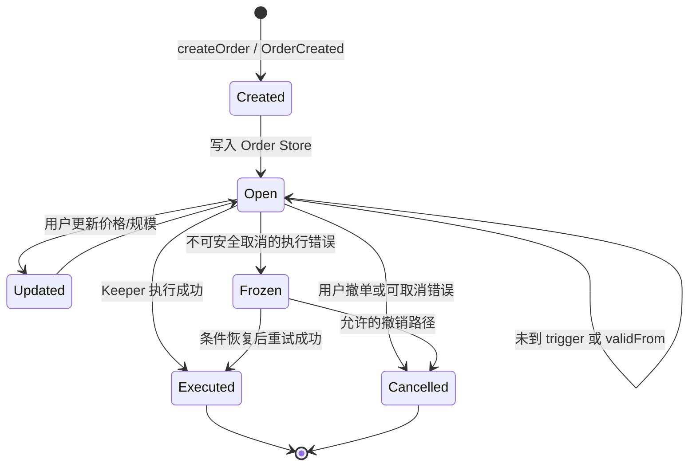
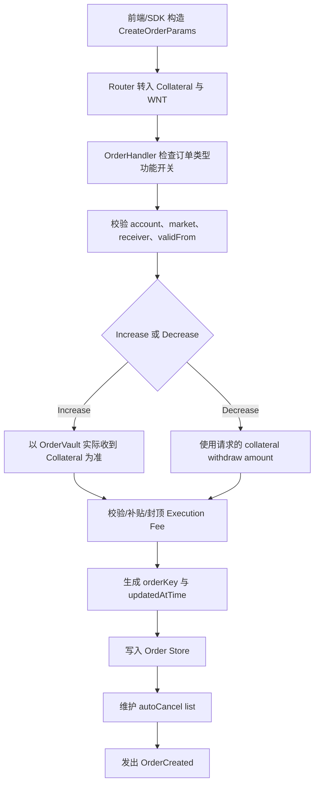

# v0.3.2 Order 字段与状态

> 源码权威定义：`src/order/Order.sol`。前端提交参数还需结合 `IBaseOrderUtils.CreateOrderParams`；本表描述落入 Order Store 后的核心字段。

## 1. 地址字段

| 字段 | 业务含义 | 前端来源/表现 | 必测点 |
|---|---|---|---|
| `account` | 订单及仓位所有者 | Standard 通常为钱包；Flash 为主账户 | 不得因 Relay sender 改成中继地址 |
| `receiver` | 订单输出资产接收地址 | 通常为用户指定接收方 | 平仓到账地址正确，不能与 account 无意混淆 |
| `cancellationReceiver` | 取消时资金返还地址 | 通常由前端设为用户地址 | Cancelled 后退款地址和金额正确 |
| `callbackContract` | 执行后回调合约 | 普通用户单通常为空 | 非法回调、gas 上限及有/无回调分支 |
| `uiFeeReceiver` | UI fee 接收方 | 产品配置 | 为空与非空时费用路由正确 |

## 2. 数值字段

| 字段 | 业务含义/单位 | 使用规则 | 前端要求与测试点 |
|---|---|---|---|
| `marketIndex` | 市场编号 | 必须对应有效市场 | 页面市场、URL、payload、Reader 四者一致 |
| `orderType` | 7 种合约订单枚举 | 决定开/减仓、触发和执行逻辑 | 页面文案与链上枚举一致，编辑跨价不得静默错型 |
| `sizeDelta` | 仓位规模变化量 | `isSizeDeltaUsd` 决定 USD 或 token 口径 | 单位切换经济含义不变；精度与取整正确 |
| `initialCollateralDeltaAmount` | Increase 时投入抵押；Decrease 时提取抵押 | token 原始精度 | 不能把 token amount 当 USD；余额差分正确 |
| `triggerPrice` | 非市价单触发价 | Limit/Stop/TP/SL 使用 | 多空和开/减仓四类方向条件正确 |
| `acceptablePrice` | 用户可接受的最差成交价 | 与实际 executionPrice 比较 | 四象限等号成交、不利越界取消/冻结；哨兵规范 |
| `executionFee` | Keeper 执行费 | 创建时预存，执行/取消时结算 | 页面 Pay 展示、退款和 Keeper 收款正确 |
| `callbackGasLimit` | 回调 gas 上限 | 有 callback 时使用 | 上限校验；无 callback 不产生错误费用 |
| `minOutputAmount` | Decrease 最小输出，按 USD 校验 | v0.3.2 实际生效 | 低/等/高三点；失败不得造成资金损失 |
| `updatedAtTime` | 最近创建/更新时间 | Oracle 时间窗与订单时效相关 | 创建/编辑后更新正确，事件和 Store 一致 |
| `validFromTime` | 最早可执行时间 | 非市价单到时前不可执行 | 边界前/等于/后；页面不得提前显示 Executed |

## 3. 标志字段

| 字段 | 含义 | 必测点 |
|---|---|---|
| `isLong` | 多仓或空仓方向 | 多空开仓、减仓、触发条件、acceptablePrice 方向均一致 |
| `isFrozen` | 订单是否冻结 | Frozen 不得误显示 Cancelled；恢复执行/撤销路径明确 |
| `autoCancel` | 相关仓位结束时是否自动撤销 | TP/SL 兄弟单及残单随仓位结束正确清理 |
| `isSizeDeltaUsd` | sizeDelta 是否为 USD 口径 | USD/Token Mode 换算、精度和完整平仓边界 |

## 4. 类型字段

合约原生 `OrderType`：

| 值 | 名称 | 含义 |
|---:|---|---|
| 0 | `MarketIncrease` | 当前市场价开仓或加仓 |
| 1 | `LimitIncrease` | 达到更有利限价时开仓 |
| 2 | `MarketDecrease` | 当前市场价减仓或平仓 |
| 3 | `LimitDecrease` | 达到目标价减仓，通常对应 TP |
| 4 | `StopLossDecrease` | 达到止损价减仓，通常对应 SL |
| 5 | `Liquidation` | 满足清算条件时强制减仓/平仓 |
| 6 | `StopIncrease` | 突破/破位后开仓 |

`SecondaryOrderType` 只有 `None` 和 `Adl`。因此 ADL 是风险处置执行上下文，不应在前端被描述为用户主动创建的第八种普通订单。

## 5. 生命周期状态

Order.sol 只保存 `isFrozen`，页面常见的 Open/Executed/Cancelled 等状态由 Store 是否仍存在、事件和索引结果共同派生。



前端必须区分：

- **Open**：仍在等待条件或 Keeper。
- **Executed**：订单已实际改变仓位/资金。
- **Cancelled**：订单结束并按规则退款。
- **Frozen**：订单仍存在，资金可能仍被占用，需要恢复或处理。
- **Pending/Submitted**：前端或 Relay 的过程态，不能长期覆盖链上真实终态。

## 6. 与 Relay fee 字段的边界

Relay fee **不是 `Order.Props` 字段，也不保存在 Order Store 中**。它属于 Flash/Relay 调用外层的 `RelayParams.fee`：

| 字段 | 含义 |
|---|---|
| `feeToken` | 支付 Relay fee 的代币；v0.3.2 必须等于全局 `COLLATERAL_TOKEN` |
| `maxFeeAmount` | 用户允许支付的 Relay fee 上限 |

因此核对订单字段时，不应在 Order 中寻找 Relay fee；应从 Relay 请求、`RelayFeePaid` 事件和账户/Relay 地址余额差分核对。完整流程与测试边界见 [02-订单类型与交易流程.md](02-订单类型与交易流程.md#5-relay-fee-流程与功能点)。

## 7. CreateOrderParams 与最终 Order 的映射

前端提交的是 `IBaseOrderUtils.CreateOrderParams`，合约校验和归一化后才生成 `Order.Props`。测试不能只比较前端请求，也不能假设请求值一定原样写入 Store。

### 7.1 请求结构

```text
CreateOrderParams
├─ addresses
│  ├─ receiver
│  ├─ cancellationReceiver
│  ├─ callbackContract
│  └─ uiFeeReceiver
├─ numbers
│  ├─ marketIndex
│  ├─ sizeDelta
│  ├─ initialCollateralDeltaAmount
│  ├─ triggerPrice
│  ├─ acceptablePrice
│  ├─ executionFee
│  ├─ callbackGasLimit
│  ├─ minOutputAmount
│  └─ validFromTime
├─ orderType
├─ isLong
├─ autoCancel
├─ isSizeDeltaUsd
├─ referralCode
└─ dataList
```

### 7.2 请求到 Store 的转换规则

| 请求字段 | 最终保存位置 | 是否原样保存 | 转换或校验规则 |
|---|---|---:|---|
| 调用上下文中的 account | `addresses.account` | 通常是 | Standard 为实际账户；Flash/子账户路径仍应保存主账户经济归属，不是 Relay sender |
| `addresses.*` | `order.addresses.*` | 是 | receiver 必须有效；cancellationReceiver 不能是 OrderVault |
| `numbers.marketIndex` | `numbers.marketIndex` | 是 | 必须是有效 Position Market |
| `numbers.sizeDelta` | `numbers.sizeDelta` | 是 | 必须结合 `isSizeDeltaUsd` 才有完整单位含义 |
| `initialCollateralDeltaAmount` | 同名字段 | 分类型 | Increase 取 OrderVault 实际 `recordTransferIn`；Decrease 取请求值 |
| `triggerPrice` | 同名字段 | 是 | Market 通常不使用；条件单执行时按方向校验 |
| `acceptablePrice` | 同名字段 | 是 | 执行时按 Increase/Decrease × long/short 四象限验证 |
| 请求 `executionFee` | `numbers.executionFee` | 不保证 | 以实际转入 WNT、补贴规则、最低费用和封顶结果为准；多余部分可能退款 |
| `callbackGasLimit` | 同名字段 | 是 | 创建时校验全局 callback gas 限制 |
| `minOutputAmount` | 同名字段 | 是 | Decrease 按 USD 1e30 口径验证；不是 collateral token 原始数量 |
| `validFromTime` | 同名字段 | 是 | Market Order 必须为 0，否则 `UnexpectedValidFromTime` |
| `orderType/isLong/autoCancel/isSizeDeltaUsd` | Order type/flags | 是 | 类型还决定是否允许用户创建和字段语义 |
| `referralCode` | ReferralStorage | 不进入 Order.Props | 创建时为 account 设置 referral code，需单独从 referral 状态/事件核对 |
| `dataList` | `order._dataList` | 是 | 扩展字段；需按使用方约定解释，不能被前端任意污染 |
| 创建时间 | `updatedAtTime` | 合约生成 | `order.touch()` 使用创建区块时间，不由前端传入 |
| `isFrozen` | `flags.isFrozen` | 合约生成 | 新订单默认 false；执行错误冻结后才变为 true |

### 7.3 创建流程



## 8. 字段在不同订单类型中的使用规则

标记：`必`=业务必需；`0`=应为 0 或不参与；`选`=按功能使用；`系统`=协议内部生成。

| 字段 | MarketIncrease | LimitIncrease | StopIncrease | MarketDecrease | LimitDecrease | StopLossDecrease | Liquidation |
|---|---:|---:|---:|---:|---:|---:|---:|
| `marketIndex` | 必 | 必 | 必 | 必 | 必 | 必 | 必 |
| `sizeDelta` | 必 | 必 | 必 | 必 | 必 | 必 | 全仓/系统 |
| `initialCollateralDeltaAmount` | 实际转入 | 实际转入 | 实际转入 | 选：提取抵押 | 选 | 选 | 系统 |
| `triggerPrice` | 0 | 必 | 必 | 0 | 必 | 必 | 0 |
| `acceptablePrice` | 必 | 必 | 必 | 必 | 必 | 必 | 系统哨兵 |
| `executionFee` | 必/可补贴 | 必/可补贴 | 必/可补贴 | 必/可补贴 | 必/可补贴 | 必/可补贴 | 0 |
| `minOutputAmount` | 0 | 0 | 0 | 选/建议设置 | 选/建议设置 | 选/建议设置 | 系统 |
| `validFromTime` | 0 | 选 | 选 | 0 | 选 | 选 | 0 |
| `autoCancel` | 通常 false | 通常 false | 通常 false | 选 | TP 常用 true | SL 常用 true | 系统 |
| `isSizeDeltaUsd` | 选 | 选 | 选 | 选 | 选 | 选 | true |
| `isLong` | 必 | 必 | 必 | 必须匹配仓位 | 必须匹配仓位 | 必须匹配仓位 | 系统匹配 |

注意：

- Liquidation 不能通过普通用户 `createOrder` 创建；用户可创建的类型只包括 Market/Limit/Stop Increase 和 Market/Limit/StopLoss Decrease。
- Market Order 的 `validFromTime` 非零会直接失败，不是“忽略该字段”。
- Market Order 的 `triggerPrice` 虽不参与触发，前端仍应规范传 0，避免页面、事件和历史产生误导数据。
- `acceptablePrice` 对 Market Order 同样重要，Market 不等于无滑点保护。

## 9. UpdateOrder 可修改字段

Market Order 不允许更新；非 Market Order 才进入 Update 流程。

| 字段 | 可更新 | 更新规则/风险 |
|---|---:|---|
| `sizeDelta` | 是 | 必须同时核对 `isSizeDeltaUsd`，避免单位改变但数值未换算 |
| `isSizeDeltaUsd` | 是 | USD↔Token 切换必须保持用户可理解的经济含义 |
| `triggerPrice` | 是 | 跨越当前价格后仍不得静默错标 Limit/Stop 类型 |
| `acceptablePrice` | 是 | 必须按方向重算；Reduce-only 哨兵不能被破坏 |
| `minOutputAmount` | 是 | Decrease 为 USD 1e30；更新后重新校验实际输出 |
| `validFromTime` | 是 | 更新后不得提前执行 |
| `autoCancel` | 是 | 同步维护 autoCancel list 和 callback gas 总量 |
| `executionFee` | 可追加 | 冻结订单费用可能减少；更新可补充 WNT，合约重新校验/封顶/退款 |
| `isFrozen` | 合约重置 | 更新时设为 false，之后执行失败可能再次冻结 |
| `orderType` | 否 | 前端跨价编辑不得假装类型自动改变；需要换型时应明确取消重建 |
| `marketIndex/isLong/account/receiver` | 否 | 这些字段定义订单归属和经济方向，不允许 Update 偷换 |

Update 后应核对 `updatedAtTime`、OrderUpdated 事件、Store 全字段、autoCancel list、executionFee 余额及页面显示。

## 10. 字段单位与精度

| 字段 | 单位/精度 | 常见错误 |
|---|---|---|
| `sizeDelta` | `isSizeDeltaUsd=true` 时 USD 1e30；否则按 index token decimals | 把 Mock Token 固定当 8 位或 18 位 |
| `initialCollateralDeltaAmount` | collateral token 原始 decimals，例如 MockUSDC 可能为 6 位 | 当成 USD 1e30；Increase 只看请求值不看实际转入 |
| `triggerPrice` | 合约价格精度，由 Oracle/SDK 规则转换 | 直接使用页面小数字符串或 index token decimals |
| `acceptablePrice` | 同价格精度 | long/short 或 increase/decrease 方向反转；哨兵错误 |
| `executionFee` | WNT 原始单位 | 与 Relay fee、Position Fee 混淆 |
| `minOutputAmount` | Decrease 校验使用 USD 1e30 | 误传 USDC 1e6 数量 |
| `updatedAtTime/validFromTime` | Unix 秒 | 使用毫秒时间戳导致订单长期不可执行 |
| `callbackGasLimit` | gas units | 当成 wei 或费用金额 |

Mock 合成市场的 token、symbol 和 decimals 必须运行时读取；Order 测试需至少覆盖 index token 8 位和 18 位两类数据集。

## 11. Order 与 Leverage 的关系

`Order.Props` 没有 `leverage` 字段。前端杠杆是由仓位规模和有效保证金表达的业务值：

```text
leverage ≈ sizeInUsd / effectiveCollateralUsd
```

前端选择 2x、10x、Max 等杠杆时，最终转换为 `sizeDelta`、投入/提取 collateral 及相关预览参数。测试应验证转换结果，而不是在 Order 中寻找 leverage：

- 开仓杠杆改变时，size/collateral 组合正确。
- 调整杠杆可能通过保证金调整或仓位动作完成，不一定生成相同 OrderType。
- Fee、Funding、PnL 会影响有效保证金和风险杠杆，但不直接修改 Order 字段。
- 页面杠杆、Reader Position、清算价与最终账本必须使用同一口径。

## 12. 状态判定与证据来源

页面状态不是 Order struct 中的单一枚举。正确判定需要组合证据：

| 页面/业务状态 | Order Store | `isFrozen` | 关键事件 | 仓位/资金含义 |
|---|---|---:|---|---|
| Submitted | 可能尚未写入 | 不确定 | 钱包/Relay 过程态 | 不能当成链上订单已创建 |
| Created/Open | 存在 | false | OrderCreated/可能 OrderUpdated | 等待 trigger、validFrom 或 Keeper |
| Frozen | 存在 | true | OrderFrozen | 订单与部分资金仍保留，需重试/更新/撤销 |
| Executed | 不再存在 | — | OrderExecuted | 仓位/余额/OI 已按执行结果变化 |
| Cancelled | 不再存在 | — | OrderCancelled | 未执行经济动作，按规则退款 |
| AutoCancelled | 不再存在 | — | 取消事件/原因 | 关联仓位结束后自动清理 |

Indexer/API 可以用于页面回显，但不是唯一事实源。测试的权威顺序应为：交易回执与事件 → Order Store/Reader → Position/余额/OI → Indexer/API → 页面。

## 13. 前端字段展示要求

| 前端区域 | 至少展示/使用 | 核对要求 |
|---|---|---|
| 下单表单 | market、direction、type、size、collateral、trigger、TP/SL | 与最终 CreateOrderParams 一致 |
| Trade Details | execution price、acceptable price、fees、pay/receive、liquidation price | 单位清楚，费用不混算，预览可追溯 |
| Open Orders | type、direction、size、trigger、acceptable price、created/valid time、status | 与 Store 和事件一致，不能跨市场串值 |
| Edit Order | 可修改字段及修改后预览 | 不展示不可修改字段为可编辑；更新后全字段重核 |
| Position | size、collateral、entry、leverage、PnL、Funding、liquidation price | 来自 Position/Reader，不从历史 Order 猜测 |
| Order History | type、最终状态、执行/取消原因、实际价格和规模 | 适配 v0.3.2 事件，不依赖已删除字段 |

## 14. Order 字段测试最小集

1. 每种用户可创建 OrderType 至少一条成功创建和成功执行。
2. long/short × Increase/Decrease 的 acceptablePrice 四象限。
3. Trigger 前一单位、等号、后一单位；validFrom T−1/T/T+1。
4. USD/Token size 两种模式，并覆盖 8/18 位 Mock index token。
5. Increase 实际转入 collateral 与请求值差异；Decrease 提取 collateral。
6. executionFee 不足、恰好、超额、补贴、封顶和退款。
7. minOutputAmount 的实际输出−1、等号、+1。
8. autoCancel false/true，以及仓位结束后的残单处理。
9. callback 为空/非空、gas limit 边界和回调失败。
10. Create、Update、Cancel、Execute、Freeze、Retry 全生命周期。
11. Standard 与 Flash 的 account/sender、Order 字段和费用差异。
12. 页面、payload、事件、Store、Reader、Position、余额和历史逐字段一致。
