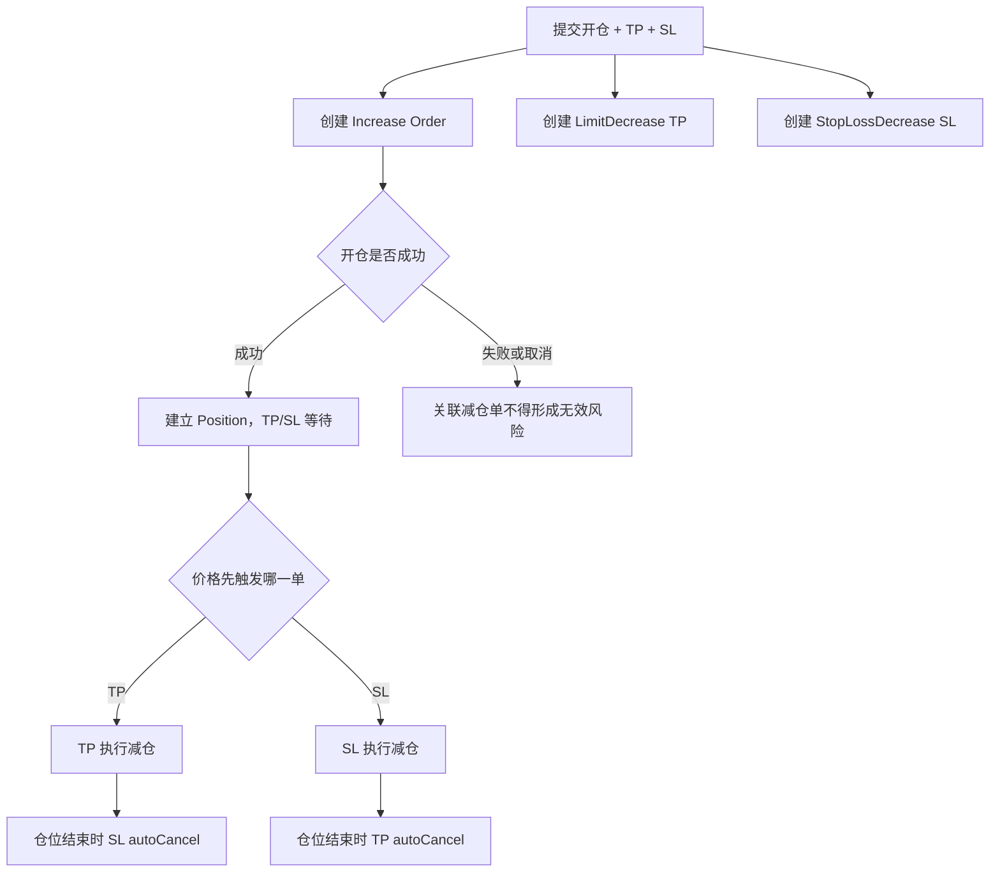
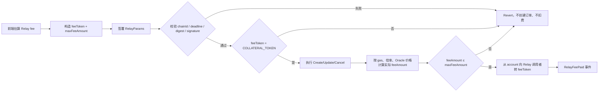

# v0.3.2 订单类型与交易流程

## 1. 用户概念与合约订单的映射

| 前端功能 | 开/减仓 | 合约 OrderType | 触发逻辑 |
|---|---|---|---|
| Market 开多/开空/加仓 | Increase | `MarketIncrease` | 无 trigger；尽快由 Keeper 执行 |
| Limit 开多 | Increase long | `LimitIncrease` | Oracle max ≤ triggerPrice |
| Limit 开空 | Increase short | `LimitIncrease` | Oracle min ≥ triggerPrice |
| 突破追多 | Increase long | `StopIncrease` | Oracle max ≥ triggerPrice |
| 破位追空 | Increase short | `StopIncrease` | Oracle min ≤ triggerPrice |
| Market 部分/全部平仓 | Decrease | `MarketDecrease` | 无 trigger；尽快执行 |
| 多头 TP | Decrease long | `LimitDecrease` | Oracle min ≥ triggerPrice |
| 空头 TP | Decrease short | `LimitDecrease` | Oracle max ≤ triggerPrice |
| 多头 SL | Decrease long | `StopLossDecrease` | Oracle min ≤ triggerPrice |
| 空头 SL | Decrease short | `StopLossDecrease` | Oracle max ≥ triggerPrice |
| 清算 | Decrease | `Liquidation` | 仓位满足可清算条件 |
| ADL | Decrease + secondary | 原订单上下文 + `Adl` | 满足 ADL 条件，由 ADL Keeper 执行 |

### 1.1 订单类型测试子模块

订单类型必须单独形成一组测试，不以“某条交易脚本执行成功”代替类型覆盖。每种类型至少验证：创建参数、触发前状态、边界触发、执行价格、订单终态、仓位/余额变化和前端显示名称。

| 类型测试 ID | 前端业务类型 | 合约类型 | 方向数据集 | 核心测试目的 |
|---|---|---|---|---|
| OT-01 | Market 开仓/加仓 | `MarketIncrease` | long、short | 无 trigger；acceptablePrice 四象限；成功、滑点取消和冻结语义 |
| OT-02 | Limit 开仓 | `LimitIncrease` | long、short | 更有利价格触发；触发前保持 Open；触发后仍需满足 acceptablePrice |
| OT-03 | Stop/突破开仓 | `StopIncrease` | long、short | 突破/破位方向正确；不得被前端错标为 Limit |
| OT-04 | Market 减仓/平仓 | `MarketDecrease` | long、short；部分、全部 | Reduce-only；`minOutputAmount`；完整平仓取整和资金账本 |
| OT-05 | Take Profit | `LimitDecrease` | long、short | TP 方向、触发边界、超量截断、兄弟单 autoCancel |
| OT-06 | Stop Loss | `StopLossDecrease` | long、short | SL 方向、acceptablePrice、Frozen/重试、兄弟单 autoCancel |
| OT-07 | Liquidation | `Liquidation` | long、short | 可清算判定、负点差归零、手续费档位、残值和历史类型 |
| OT-08 | ADL 风险处置 | `SecondaryOrderType.Adl` | long、short | ADL 条件、选仓、负点差归零；不得显示为用户普通平仓 |

### 1.2 订单类型通用断言

每一个 OT 数据集都必须核对：

1. 页面选中的业务类型与最终 payload 的 `orderType` 一致。
2. `isLong`、`sizeDelta`、`isSizeDeltaUsd`、`triggerPrice`、`acceptablePrice`、`validFromTime` 与用例数据一致。
3. 触发条件未满足时订单仍存在，仓位和用户余额不发生错误变化。
4. 触发条件等号成立时，按该类型规定的 Oracle min/max 边界判断。
5. 触发成立但 acceptablePrice 不满足时，终态和原因符合合约规则。
6. 执行成功后 Order Store、事件、Reader、Position、OI 和余额差分一致。
7. Open Orders、Order History 和交易通知显示同一个订单类型，不允许类型错标。
8. 编辑订单跨越当前价时，不得在用户不知情的情况下改变订单类型或触发语义。

### 1.3 订单类型最小组合矩阵

| 维度 | 必须覆盖的值 |
|---|---|
| 仓位方向 | long、short |
| 仓位动作 | increase、decrease |
| 执行方式 | market、limit、stop、liquidation、ADL |
| 价格边界 | 未达到、差 1 最小单位、等于、越过 1 最小单位 |
| acceptablePrice | 等号、最小有利偏差、最小不利越界 |
| 订单操作 | create、update、cancel、execute、freeze、retry、autoCancel |
| 提交模式 | Standard、Flash/Relay |
| 规模口径 | USD、Token；Mock Token 按运行时 decimals |
| 仓位结果 | 新开、加仓、部分减仓、全部平仓、无仓位变化 |

## 2. Market 与 Limit 的区别

| 项目 | Market | Limit/Stop |
|---|---|---|
| 用户意图 | 尽快成交 | 到指定市场条件后再成交 |
| `triggerPrice` | 不作为触发条件 | 必填且决定方向条件 |
| `validFromTime` | 不阻塞市场单 | 到达前禁止执行 |
| `acceptablePrice` | 必须有价格保护 | 同样必须满足；触发不代表一定成交 |
| 未执行时表现 | 应短暂等待 Keeper | 可以长期 Open，并允许改撤 |
| 主要风险 | 滑点、价格影响、Keeper/Oracle 延迟 | 条件方向错误、跨价改型、触发后 acceptablePrice 不可满足 |

## 3. TP/SL 的本质

TP/SL 不是单独的仓位字段，而是围绕已有或即将创建的仓位生成的 Reduce-only Decrease Orders：

- TP 通常映射为 `LimitDecrease`。
- SL 映射为 `StopLossDecrease`。
- 开仓附带 TP/SL 时，前端可能在一个用户动作中批量创建主订单和两个减仓订单。
- TP/SL 的 size 应与目标仓位语义一致；加仓、部分减仓、全部平仓后必须明确残单如何处理。
- `autoCancel=true` 时，仓位结束后相关残单应被自动清理。

## 4. Standard 与 Flash 流程

### Standard

用户钱包直接签名并调用 ExchangeRouter。每个创建、更新或取消动作通常需要钱包确认。

### Flash / One-Click

主账户先建立带命名 `slot` 的子账户授权；之后 Relay/Subaccount 路径验证 EIP-712、授权有效期、action count 和 feeToken，再由中继发送交易。

两种路径的交易经济含义应一致；允许差异仅包括签名体验、交易发送者、Relay fee、子账户计数和异步任务状态。

## 5. Relay fee 流程与功能点

Relay fee 属于 Flash/One-Click 请求，不属于订单本身。请求通过 `RelayParams.fee` 携带：

| 字段 | 合约规则 | 前端要求 |
|---|---|---|
| `feeToken` | 必须等于 DataStore 的全局 `COLLATERAL_TOKEN`；未配置时 `EmptyToken`，不一致时 `UnexpectedRelayFeeToken` | 固定使用当前部署的抵押品代币，不允许用户选择其他 fee token |
| `maxFeeAmount` | 实际计算的 `feeAmount` 不得超过上限，否则 `InsufficientRelayFee` | 报价后设置用户可接受上限，并在签名前展示最大值 |

支付流程：

实际费用以 gas 使用量、基础 gas、calldata gas、`RELAY_FEE_MULTIPLIER_FACTOR`、额外 relay execution fee，以及 WNT/feeToken 的 Oracle 价格换算，并向上取整。`MAX_RELAY_SWAP_WNT_CAP` 非零时还需满足 native fee 上限。

Relay fee 必测功能点：

1. `COLLATERAL_TOKEN` 未配置：调用回退，不创建/更新/取消订单，不扣 fee。
2. `feeToken = COLLATERAL_TOKEN`：请求成功，事件和双方余额差分等于实际 `feeAmount`。
3. `feeToken` 为其他 token 或零地址：明确回退且不扣 fee。
4. 实际 fee 等于 `maxFeeAmount`：成功；高于上限最小单位：回退。
5. Relay fee 排除地址：不扣费，并核对订单业务动作仍按规则执行。
6. native fee 为 0：允许事件记录 feeAmount=0，不应错误转账。
7. gas multiplier 为 0 时按 1e30 默认倍率处理；非零时按配置计算。
8. 超过 `MAX_RELAY_SWAP_WNT_CAP` 或 calldata 超过 50,000 bytes：回退且业务动作原子失败。
9. Oracle 价格 min/max 选取和向上取整正确，不能只断言“余额减少”。
10. Standard 与 Flash 同参数交易：仓位经济结果一致；Relay fee 只能出现在 Flash 路径。

## 6. 创建、更新、取消、执行与冻结

1. **创建**：校验 feature flag、市场、参数、权限、资金与 execution fee，写入 Order Store 并发出 OrderCreated。
2. **更新**：只能修改允许字段；更新时间应变化；不得破坏 orderType、acceptablePrice 哨兵或 Reduce-only 语义。
3. **取消**：校验所有权及功能开关，删除订单并按规则返还资金/执行费。
4. **执行**：Keeper 提交 Oracle 数据；检查 validFrom、trigger、acceptablePrice、市场和仓位约束，再更新仓位与账本。
5. **冻结**：对不应直接取消、需要后续重试的错误保留订单并标记 frozen；页面必须给用户明确状态。

## 7. 必测边界

- Trigger 前一最小单位、等于、后一最小单位。
- AcceptablePrice 等号和最小不利越界。
- validFrom 前、等于、后。
- 多/空 × Increase/Decrease 四象限。
- 创建后修改规模、修改价格跨越现价、取消、冻结后重试。
- TP/SL 合法方向、反向、相等、0、超精度。
- 部分平仓后 TP/SL 超量、全平后残单、清算/ADL 后残单。
