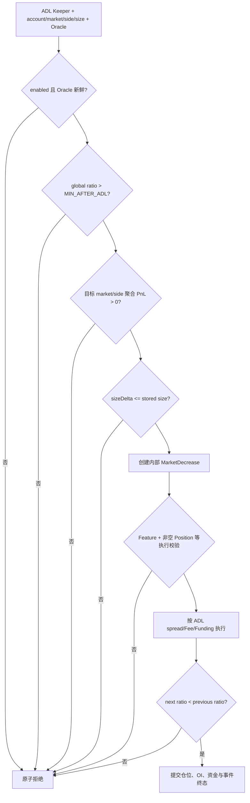

# v0.3.2 ADL 完整功能、影响数据与边界

> 版本基线只认 [`Docs/contract-releases/CURRENT.json`](../../../../Docs/contract-releases/CURRENT.json)。ADL 是协议级风险处置，不是用户订单或清算的别名；前端和事件必须保留 `SecondaryOrderType.Adl` 身份。

## 1. 范围与核心结论

ADL（Auto-Deleveraging）在全局正 PnL 净义务相对池价值过高时，强制减少某个盈利方向的仓位，以降低协议偿付压力。

v0.3.2 的关键规则：

1. 先根据全局净义务比例开启/关闭 ADL 状态；只有运行时满足 `MAX_PNL_FACTOR_FOR_ADL > MIN_PNL_FACTOR_AFTER_ADL`，两套阈值才形成正常滞回区间。
2. 执行前再次确认 ADL 已开启、主 Oracle 报告不早于最新 ADL 状态时间、secondary-price 全局比例仍超过执行阈值。
3. 合约只要求目标 `marketIndex/isLong` 方向按**当前 primary price** 计算的市场聚合 PnL 为正；没有在链上按单仓利润或仓位大小排序。
4. 内部创建 `MarketDecrease + SecondaryOrderType.Adl`，不允许负 dynamicSpread。
5. 执行后全局净义务比例必须严格小于执行前，否则 `InvalidAdl`，整笔交易原子回滚。

## 2. 定义与职责边界

| 路径 | 触发原因 | 发起者 | 订单身份 | 最终约束 |
|---|---|---|---|---|
| 用户 Decrease | 用户主动减仓/止盈止损 | 用户/Relay + Order Keeper | 普通 Decrease | 用户参数和仓位校验 |
| Liquidation | 单个仓位抵押不足/杠杆越界 | Liquidation Keeper | `OrderType.Liquidation` | 满足可清算条件并全平 |
| ADL | 全局净义务比例过高 | ADL Keeper | MarketDecrease + `SecondaryOrderType.Adl` | 执行后全局比例严格下降 |

ADL Keeper 选择 `account/marketIndex/isLong/sizeDeltaUsd` 并提供 Oracle。合约不保证 Keeper 按“最盈利用户优先”或“最大仓位优先”排序，因此候选策略必须由 Keeper 测试单独覆盖；链上测试负责验证权限、门槛、规模、实际处置和严格改善。

## 3. 输入、状态与内部订单

### 3.1 全局净义务比例

对每个市场，使用 ADL secondary price 计算：

```text
marketNetObligation = max(longPnl, 0) + max(shortPnl, 0)
globalNetObligation = Σ marketNetObligation
globalPoolUsd = 首个市场 Vault.totalAssets
              × 首个市场 collateral secondary price.min

globalNetObligationRatio =
  globalPoolUsd == 0 ? 0 : globalNetObligation / globalPoolUsd
```

比例使用 1e30 精度。`getPnl(..., maximize=true)` 对 long 取 index secondary `price.max`、对 short 取 `price.min`，即分子按放大盈利义务的方向选价；分母固定取 collateral secondary `price.min`。只累计正 PnL 义务；负 PnL 不用来抵消另一方向或另一市场的正义务。

secondary price 优先使用已配置的 Chainlink feed 单价（`min=max`）；没有 feed 时才读 recorded price。`isADLStart` 只改变 recorded-price 的年龄校验，不改变 long/short 的选价方向。

### 3.2 ADL 状态启停

`updateAdlState` 的阈值具有状态依赖：

| 当前状态 | 使用阈值 | 价格语义 | 结果 |
|---|---|---|---|
| disabled | `MAX_PNL_FACTOR_FOR_ADL` | ADL start secondary price | ratio 严格大于阈值才开启 |
| enabled | `MIN_PNL_FACTOR_AFTER_ADL` | ongoing ADL secondary price | ratio 不再严格大于阈值时关闭 |

若计算出的 `shouldEnableAdl` 与当前状态相同，调用回退 `AdlStateUnchanged`；状态真正变化时写 `isAdlEnabled`、`latestAdlAt=block.timestamp` 并发 `AdlStateUpdated`。该事件只含 ratio、threshold、`shouldEnableAdl`；`latestAdlAt` 需要另读状态。

当且仅当 `MAX_PNL_FACTOR_FOR_ADL > MIN_PNL_FACTOR_AFTER_ADL` 时，这形成启停滞回区间。配置层只分别校验两值不超过 100%，没有校验二者的交叉顺序；测试必须运行时读取并核对顺序，等于或反转应标为配置风险，不能继续写“存在滞回”。

### 3.3 Oracle 新鲜度

三个动作的 Oracle 与权限语义不同：

- `refreshLatestRecordedPrices(oracleParams)` 没有 Keeper 角色限制，任何地址都可调用，但报告仍必须通过 provider/signature/timestamp 等 Oracle 校验；它只刷新 recorded price。
- `updateAdlState()` 无 Oracle 参数，受 `ADL_KEEPER` 限制；标准 recorded-price 链路是先单独 refresh，再单独 update，不能当作一笔调用。
- ADL start（disabled→enabled）读取 recorded price 时不检查 `MAX_RECORDED_PRICE_AGE`；ongoing/update-disable 与 execute ratio 才检查。配置 Chainlink feed 时直接使用 feed 单价并绕过 recorded-price 分支。
- refresh、update、execute 三条 ADL 入口都没有调用 `oracle.validateSequencerUp()`；Sequencer down 不是这三条路径的链上必然拒绝条件，必须由运行环境/运维策略另行约束。

此外，`executeAdl` 的 primary Oracle 报告要求：

```text
oracle.maxTimestamp >= latestAdlAt
```

严格小于时回退。这个时间门槛与 secondary recorded-price age 是两套独立校验。

### 3.4 内部 ADL Order

| 字段 | 值/语义 |
|---|---|
| `orderType` | `MarketDecrease` |
| `secondaryOrderType` | 执行上下文中的 `Adl`，不存入普通 Order 主类型字段 |
| `sizeDelta` | Keeper 指定 `sizeDeltaUsd`，不得大于仓位 sizeInUsd |
| `isSizeDeltaUsd` | true |
| `triggerPrice` | 0 |
| `acceptablePrice` | long 为 0，short 为 `uint256.max` |
| `initialCollateralDeltaAmount` | 0 |
| `executionFee` | 0 |
| `uiFeeReceiver` | `address(0)` |
| `autoCancel` / `isFrozen` | false |
| `updatedAtTime` | `oracle.minTimestamp` |

## 4. 执行规则与流程

### 4.1 执行前门槛

ADL Keeper 调用后按顺序验证：

1. 调用者具有 `ADL_KEEPER`、primary Oracle 报告有效并通过全局重入保护；此路径不做 Sequencer-up 校验。
2. `isAdlEnabled == true`。
3. Oracle timestamp 不早于 `latestAdlAt`。
4. 当前全局比例严格 `>` `MIN_PNL_FACTOR_AFTER_ADL`；等号返回 `AdlNotRequired`。
5. 用本次 `withOraclePrices` 设置的**当前 primary index price**计算目标 market/side 聚合 PnL，必须 `> 0`；等于或小于 0 返回 `AdlPnlNotPositive`。这与第 4 条 secondary-price 全局 ratio 不是同一价格口径。
6. 创建内部单时读取 Position，但只先检查 `sizeDeltaUsd > position.sizeInUsd`：空仓且 size>0 返回 `InvalidSizeDeltaForAdl`；空仓且 size=0 可继续。
7. execute-ADL feature 未关闭。
8. 进入 Decrease 执行链后才做非空 Position 等基础校验；空仓 size=0 在这里返回 `EmptyPosition`。

注意第 5 条不是单个 account position 的利润排名校验。合约注释也明确没有因 gas 成本验证 ADL 的仓位利润/规模执行顺序。

### 4.2 成交、费用与 Funding

ADL 复用 MarketDecrease 执行链，但 `secondaryOrderType=Adl`：

- `allowNegativeSpread=false`，effective minimum spread 至少为 0；正 spread 仍生效。
- 按 Decrease 成交价结算 PnL。
- 计算仓位已有正/负 Funding；solvent 时完整结算，full-insolvent 时 negative 只按 actual paid，并在部分减仓成功后更新快照。
- 足额支付路径收取适用的 Position/Close Fee；`uiFeeReceiver=0`，不收 UI Fee。
- ADL 不是 Liquidation order，不收 Liquidation Fee。
- 只有 full close 的 Liquidation/ADL 才允许走资不抵债关闭特例；部分 ADL 不应借此绕过不足成本校验。

资金结算的关键顺序和分支必须单独断言：

1. 正 PnL 先由 Market Vault 转入 PositionVault。
2. 再结算 Funding；negative 侧以实际已支付额为准，positive/negative 净额决定 Funding claimable 或 Market Vault→PositionVault 转账。
3. Funding 阶段会按**实际已付 negative**与 positive 的净额立即更新 Funding claimable 或触发 Market Vault→PositionVault；若 actual<expected，才额外发 `InsufficientFundingFeePayment`。
4. 随后支付负 PnL，再支付 Position/Close Fee。Position/Close Fee 只有整包足额支付时才进入 Pool/对应 claimable。
5. full ADL 在 Funding、PnL 或 Fee 任一阶段仍有未付成本时可进入 insolvent early return；每种成功早退都发理论 `PositionFeesInfo` 和 `InsolventClose(step)`，但只有 Funding 不足分支必有 `InsufficientFundingFeePayment`。最终 `PositionFeesCollected` 的费用字段可能被清零，不能无条件断言“Close Fee 已收取”。
6. partial ADL 遇到不足必须回退，不能使用 full-close 特例。

### 4.3 执行后严格改善

订单执行后重新计算：

```text
nextGlobalNetObligationRatio < previousGlobalNetObligationRatio
```

若 `next >= previous`，回退 `InvalidAdl(next, previous)`。由于整个调用在同一交易中，内部 Order 创建、仓位变化、OI、费用、Vault 转账和此前发出的日志全部回滚；失败证据应保存 revert/trace 与前后状态，不能期待保留 `OrderCreated` 或 `PositionDecrease`。

### 4.4 流程图



## 5. 以 ADL 为核心影响的数据

### 5.1 状态更新阶段

| 数据 | 变化 |
|---|---|
| `isAdlEnabled` | 在启停阈值跨越时切换 |
| `latestAdlAt` | 状态切换时更新 |
| secondary recorded prices | 经 Oracle 刷新路径更新 |
| `AdlStateUpdated` | 记录 ratio、threshold、`shouldEnableAdl`；不含 `latestAdlAt` |

状态更新本身不应改变任一 Position、OI 或 Vault 余额。

### 5.2 仓位执行阶段

| 数据 | 变化 |
|---|---|
| 目标 Position sizeInUsd/sizeInTokens | 部分减少或全平删除 |
| collateral / realized PnL / output | 按 ADL 成交价和成本结算 |
| long/short OI 与累计开仓成本 | 按实际减仓规模减少 |
| dynamicSpread / executionPrice | final spread 最低 0，写 PositionDecrease 事件 |
| Funding 快照与资金 | solvent 时应用累计 Funding；full-insolvent 时 positive 计入、negative 按 actual paid；部分仓更新快照，全平删除 |
| Position/Close Fee | 足额路径按规模和 `balanceWasImproved` 档位计；insolvent full ADL 可能早退/清零；无 Liquidation/UI Fee |
| Market/Position Vault、claimable、用户余额 | 按 PnL、Funding、费用和输出变化 |
| global net obligation ratio | 成功时必须严格下降 |
| 内部 Order 与 secondary type | 只有成功交易的 `OrderExecuted.secondaryOrderType=Adl` 能最终证明 ADL 身份 |

### 5.3 间接影响

- full close 后清理该 Position 的 auto-cancel TP/SL；部分 ADL 后仍需校验剩余 TP/SL 规模是否可执行。
- OI 变化会影响后续 dynamicSpread、Funding skew 和清算风险。
- 前端 Position、History、通知和统计应显示独立 ADL 身份；用户没有“提交 ADL”按钮。
- ADL 可能结算正/负 Funding，从而让最终用户输出与单看 PnL 的预期不同。

### 5.4 Reader 与事件证据

- `OrderCreated` 和 `PositionDecrease` 只体现主类型 `MarketDecrease`，没有 secondary type；协议也没有独立 `AdlExecuted` 事件。
- 成功交易唯一的 ADL 执行身份标记是 `OrderExecuted.secondaryOrderType=Adl`，必须用同一 `orderKey` 关联 `OrderCreated`、Position/Fee/Funding 事件。
- 内部 Order 在同一交易执行前已从 Store 删除，成功后 Reader 不能再读取该订单；订单字段必须从事件链留存。
- `Reader.getAdlState` 返回第二项是根据当前价格重新计算的 `shouldEnableAdl`，不是 DataStore 中已存储的 `isAdlEnabled`。测试需另读 stored bool，并分别命名。
- `InvalidAdl` 等整笔回退不会留下上述业务日志；失败只用 revert/trace 和前后状态举证。

### 5.5 明确不应混淆

- ADL enabled 不代表任意仓位都能执行；仍需新鲜 Oracle、执行阈值、目标 side 正 PnL、规模和 post-ratio 改善。
- ratio 等于阈值不算 exceeded；post ratio 等于 previous 不算改善。
- `balanceWasImproved` 是交易 OI 失衡费档信号，不是 ADL 的全局净义务改善判据。
- ADL 不是 Liquidation，不使用单仓 remaining collateral 三条件，也不收 Liquidation Fee。
- refresh recorded prices、update ADL state、execute ADL 是三个不同动作，不能合并成一个 PASS；其中 refresh permissionless，后两者才要求 `ADL_KEEPER`。

## 6. 合约、Keeper 与前端一致性

### 6.1 合约事实源

- 状态启停、内部订单、新鲜度：[`AdlUtils.sol`](../../../../Github/fx100-contracts@release-v0.3.2/src/adl/AdlUtils.sol)。
- 权限、执行前门槛、secondary type 与 post-ratio：[`AdlHandler.sol`](../../../../Github/fx100-contracts@release-v0.3.2/src/exchange/AdlHandler.sol)。
- 全局比例：[`MarketUtils.sol`](../../../../Github/fx100-contracts@release-v0.3.2/src/market/MarketUtils.sol) `getNetObligation` / `getGlobalNetObligationRatio`。
- 成交与负 spread 下限：[`PositionUtils.sol`](../../../../Github/fx100-contracts@release-v0.3.2/src/position/PositionUtils.sol)。
- 风控集成参考：[`RiskControl.t.sol`](../../../../Github/fx100-contracts@release-v0.3.2/test/integration/RiskControl.t.sol)、[`PositionPricing.t.sol`](../../../../Github/fx100-contracts@release-v0.3.2/test/integration/PositionPricing.t.sol)。

### 6.2 Keeper

权限边界：`updateAdlState`、`executeAdl` 要求 `ADL_KEEPER`；`refreshLatestRecordedPrices` permissionless，但仍须合法 Oracle 报告。`updateAdlState()` 无 Oracle 参数；**仅在未配置 Chainlink feed、依赖 recorded price 时**，Keeper/Driver 才需明确执行“refresh tx → update tx”并处理两笔之间价格和状态变化。feed 路径可直接 update，不要求先 refresh。

Keeper 的业务责任包括：监测全局比例、刷新价格、选择目标 market/side/position 和 size、控制重试及避免重复处置。由于链上不校验利润排序，Keeper 测试应证明选择策略可解释、不会选择错误方向或超过仓位规模，并在失败后重新读取状态而不是盲目重放旧参数。三条合约入口都不校验 Sequencer，Keeper 必须有明确的 Sequencer-down 停止/恢复策略。

当前 Keeper 能力必须与合约能力分开：

- `auto` 策略按 PnL 排序候选，但提交 `sizeDeltaUsd=position.sizeInUsd`，即 full ADL；合约不会自动把它 clamp 成“刚好改善”的部分规模。
- `riskBased` 与 `scheduled` 仍是返回空候选的 stub。
- 因此 partial ADL 只能作为合约直调/Driver 用例，不能标成现有 Keeper E2E 已覆盖。
- `auto.ts` 顶部“合约会 clamp 到所需规模”的注释与实际实现不符，应登记为 Keeper 代码待修项，而非测试预期。

最终是否成功仍以链上严格改善检查为准。Keeper 本地“预计比例会下降”不能代替执行后合约值。

### 6.3 前端

前端没有用户发起 ADL 的操作，但需要消费结果：

- History/Position activity 显示 `ADL`，不得显示为用户 Market Close 或 Liquidation。
- 部分 ADL 后展示剩余仓位、实际成交价、实现 PnL、Fee、Funding 和新杠杆。
- full ADL 后移除仓位并处理 TP/SL 状态。
- 通知中说明这是协议风险处置，不暗示用户主动操作。
- 索引器尚未同步时使用 Pending/Refreshing 状态，不提前显示不可逆终态。

## 7. 边界值设计

| 组 | 边界/等价类 | 期望 |
|---|---|---|
| 启用阈值 | ratio=maxStart−1/= /+1 | 只有严格大于时从 disabled 开启 |
| 阈值配置关系 | maxStart>minAfter、=、< | 仅 `>` 是正常滞回；等于/反转虽可分别通过 ≤100% 校验，但必须报配置风险并记录实际启停行为 |
| 关闭阈值 | ratio=minAfter−1/= /+1 | enabled 时不再严格大于即关闭；只有阈值顺序正确时才称滞回 |
| 状态不变 | shouldEnable == current | `AdlStateUnchanged`，状态/时间不变 |
| 执行阈值 | ratio=minAfter−1/= /+1 | 仅 +1 可继续，等号 `AdlNotRequired` |
| 池价值 | poolUsd=0 | ratio=0，不能错误开启/执行 ADL |
| Oracle 时间 | maxTimestamp=latestAdlAt−1/= /+1 | execute 的 −1 拒绝；等号和 +1 进入后续验证 |
| Secondary 来源/年龄 | recorded 新鲜/过期 × start/ongoing；feed 有/无 | start recorded 不查 max age；ongoing 查；feed 路径绕过 recorded age |
| Oracle 双价 | secondary min=max / min<max | long 分子取 max、short 分子取 min、pool 分母取 collateral min；执行目标 PnL 改用 primary |
| Sequencer | up/down | 三个 ADL 入口链上行为不因 Sequencer 状态自动拒绝；核对 Keeper 运维停机策略 |
| 方向 PnL | market/side PnL=−1/0/+1 | 仅正值继续 |
| 目标仓位 | 空仓 size>0、空仓 size=0、方向不符、存在 | 依次覆盖 `InvalidSizeDeltaForAdl`、创建后 `EmptyPosition`、相应方向拒绝与成功路径；失败无状态/日志污染 |
| 规模 | 0、最小可实现单位、部分、等于全仓、全仓+1 | 超额明确拒绝；0 最终不能满足严格改善并应全量回滚 |
| dynamicSpread | raw<0、=0、>0 | final=0、0、正；正点差不被清零 |
| post ratio | next=previous−1、=、+1 | 仅严格更小成功；等于/更大 `InvalidAdl` 且全回滚 |
| long/short | 两方向独立正 PnL fixture | 选价、OI、PnL 与 ratio 方向正确 |
| Funding | pending negative/zero/positive × solvent/insolvent | solvent 结清；insolvent negative 保存 expected/actual 差，资金方向和 Vault/claimable 守恒 |
| 费用 | improved/not improved × 足额/不足 | 足额时 Close Fee 档正确；不足 full 允许早退且 collected 可清零；Liquidation/UI Fee 为 0 |
| 资不抵债 | partial/full × Funding/PnL/Fee 不足 | 仅 full ADL 可在相应阶段走特殊关闭；partial 必须回退 |
| Feature/角色 | disabled、无 ADL_KEEPER、正确角色、permissionless refresh | execute/update 权限与 refresh 权限分开验证 |
| Keeper 策略 | auto/riskBased/scheduled、partial/full | auto 当前只提交 full；后两者空候选；partial 只算 Driver/合约覆盖 |
| 连续执行 | 多仓位依次 ADL 直到阈值以下 | 每笔严格改善；到阈值后下一笔拒绝并可关闭状态 |

## 8. 测试用例与断言

| 用例 | 覆盖 |
|---|---|
| `XT-ADL-001` | 满足/不满足 ADL 条件、内部订单和前端身份 |
| `CT-ADL-004` | raw 负值时 final floor-at-0、执行价、PnL/OI/事件 |
| `SCN-B32-01` 数据集⑦ | 普通 Decrease、Liquidation、ADL 同 raw 的隔离 |
| `CT-BASE-008` | ADL/Liquidation/Order 等 Keeper 角色边界 |

每个成功数据集至少保存：stored `isAdlEnabled`、Reader 重算 `shouldEnableAdl`、ratio/threshold/latestAdlAt、secondary Oracle 来源与选价、primary 目标 side 聚合 PnL、目标 Position、size、事件中的 orderKey 与 `OrderExecuted.secondaryOrderType`、execution price/final spread、PnL/Funding/Fee、Position/OI/Vault 前后值和 post ratio。成功后不要尝试从 Reader 读取已删除的内部订单。失败尤其是 `InvalidAdl` 必须保存 revert/trace、无业务日志和所有状态前后相等证据。

## 9. 已知缺口与完成条件

- 现有原子用例需要补足启停双阈值、Oracle 时间等号、目标 side PnL 三点、size=0/超额、post-ratio 等号和连续多仓处置。
- Keeper 的目标选择排序没有合约强制保证，需单独保存选择依据和候选快照。
- 当前 auto 只提交 full ADL，riskBased/scheduled 尚未实现，partial ADL 只能标为 Driver/合约覆盖；`auto.ts` 的 clamp 注释需修正。
- 合约 ADL 入口不做 Sequencer 校验，Keeper/运维停机策略必须单独覆盖。
- 前端/索引器必须以 secondary type 识别 ADL，不能只根据主 `MarketDecrease` 类型分类。
- 完成标准是“状态、门槛、仓位、资金、风险比例、页面身份”六类证据一致。

相关文档：[`dynamicSpread-(v0.3.2).md`](dynamicSpread-(v0.3.2).md)、[`Funding-(v0.3.2).md`](Funding-(v0.3.2).md)、[`Liquidation-(v0.3.2).md`](Liquidation-(v0.3.2).md)、[`03-Fee-Funding-清算-ADL-Oracle.md`](03-Fee-Funding-清算-ADL-Oracle.md)。
