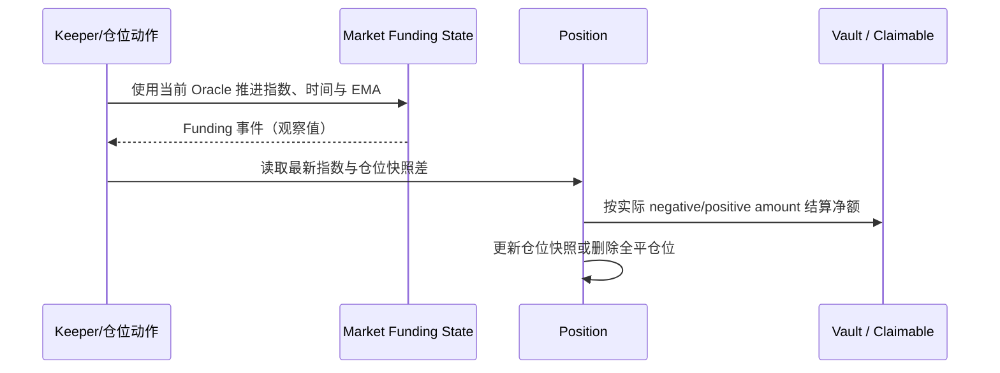

# v0.3.2 Funding 完整功能、影响数据与边界

> 版本基线只认 [`Docs/contract-releases/CURRENT.json`](../../../../Docs/contract-releases/CURRENT.json)。本文将 Funding 的“市场指数累计”和“仓位资金结算”拆开说明；二者不能用同一条余额断言代替。

## 1. 范围与核心结论

本文覆盖 v0.3.2 Funding 从参数、市场累计、Reader 预估、仓位结算、LP/协议资金路由、领取、事件到前端展示的完整生命周期。Funding 用于把长期多空 OI 失衡转化为持仓成本或收益，核心行为是：

1. 市场更新只推进 long/short 的正、负 per-size 指数、更新时间和 skew EMA，不立即遍历仓位转账。
2. Increase、Decrease、Liquidation、ADL 等真实仓位动作，才根据“市场最新指数 − 仓位快照”计算该仓位本次应付/应收。
3. 应付方向向上取整，应收方向向下取整；两者使用不同 collateral price 侧。
4. 实际资金流按 `negativeFundingFeeAmount` 与 `positiveFundingFeeAmount` 的净额路由，而不是把市场事件中的 `positionPaysLp` 当成结算金额。
5. Funding 会改变仓位净值和清算状态，但它不是价格 PnL，也不是固定整点直接扣款。

## 2. 定义与职责边界

| 层 | 负责什么 | 不负责什么 |
|---|---|---|
| 合约市场状态 | 按 OI、价格、时间和配置推进四个 per-size 指数与 EMA | 不在更新时逐仓产生现金流 |
| 合约仓位动作 | 按仓位快照差算应付/应收，结算净额并更新快照 | 不追溯收取首仓建立前的 Funding |
| Keeper | 为订单执行提供有效 Oracle，并使成功仓位动作顺带更新 Funding | v0.3.2 没有独立 Funding-update Keeper worker/入口；不在本地决定最终逐仓结算额 |
| Reader | 读取 next funding、仓位待结算 fee 和快照 | 预估不等于实际 Vault 转账证据 |
| 前端 | 区分费率、累计应付、累计应收和已实现记录 | 不得把应收 Funding 混成价格 PnL 或统一显示为正向扣费 |
| 测试 | 分别验证指数、仓位快照、事件与 Vault/claimable 资金流 | 不能只看到 Funding event 就声称资金已结算 |

## 3. 输入、状态与单位

### 3.1 市场输入

| 输入 | 口径 |
|---|---|
| long/short OI in tokens | 当前市场两侧 token 数量 |
| index token midpoint | 将 OI token 换成 USD 后计算 skew |
| collateral midpoint | 只用于 `Funding.positionPaysLp` 观察值，不参与四个 per-size delta |
| collateral min/max | 逐仓 negative/positive token 换算分别使用 min/max |
| `fundingUpdatedAt` | 与当前区块时间形成累计时长 `dt` |
| `fundingSkewEma` | 时间常数为 3600 秒的连续指数衰减 signed skew EMA 状态 |
| floor/base/min/max Funding factor | 每市场 signed 1e30 配置 |

### 3.2 持久化状态

每个市场、每个方向分别维护：

- `negativeFundingFeePerSize(marketIndex, isLong)`：该方向累计应付指数。
- `positiveFundingFeePerSize(marketIndex, isLong)`：该方向累计应收指数。
- `fundingUpdatedAt(marketIndex)`。
- `fundingSkewEma(marketIndex)`。

每个 Position 保存自己所属方向的 negative/positive per-size 快照。新仓位写入当前指数，因此不会承担开仓前历史 Funding。

### 3.3 更新入口与时序

v0.3.2 的主执行入口在 `ExecuteOrderUtils`：订单通过基础校验和 trigger 校验后，先用本次 Oracle 调 `updateFundingState`，再处理 Increase/Decrease/Liquidation/ADL 的仓位逻辑。

```text
Order execution
→ 读取 MarketPrices
→ 更新 Funding 指数 / timestamp / EMA
→ 计算仓位相对最新指数的待付与待收
→ 处理仓位、Funding 资金流和快照
```

因此：

- Funding 按“有订单实际执行时”惰性推进，不是合约自动每秒转账，也没有逐仓定时循环。
- Reader `getMarketInfo/getPositionInfo` 会在 view 中虚拟加入“从上次更新时间到当前”的 next delta，用于页面预估，但不会写状态。
- 若后续仓位处理回退，前面的 Funding 状态更新也随整笔交易回滚；不能出现“订单失败但指数已永久推进”的半状态。
- 同市场同区块/相邻交易的顺序会改变 `dt`、OI 和下一笔预估，测试必须记录交易顺序。

## 4. 公式与执行流程

以下用 `W = 1e18`、`F = 1e30`。

### 4.1 OI 与 skew EMA

```text
longOIUsd  = longOIInTokens  × indexMidPrice
shortOIUsd = shortOIInTokens × indexMidPrice
totalOIUsd = longOIUsd + shortOIUsd

rawSkew = (longOIUsd - shortOIUsd) × W / totalOIUsd
dt = block.timestamp - fundingUpdatedAt
```

`sampleInterval=3600` 是指数衰减时间常数，不是每 3600 秒才离散采样。首次非零 OI 更新直接初始化：`lastTime=now`、`lastValue=lastEmaValue=rawSkew`，本次 factor 使用当前 rawSkew。后续更新在时刻 `t` 的真实递推为：

```text
dt = t - old.lastTime
alpha = exp(-dt / 3600)
emaBeforeNew = old.lastValue × (1-alpha)
             + old.lastEmaValue × alpha

save:
  lastEmaValue = emaBeforeNew
  lastValue = currentRawSkew
  lastTime = t

本次 factorSkew = emaBeforeNew
```

也就是说，本次新 rawSkew 主要影响下一时间段；同一时刻读取的是更新前轨迹演进到 `t` 的 EMA。`dt > 41×3600` 时实现直接收敛到旧 `lastValue`。所有运算都有定点整数舍入，3599/3600/3601 只是连续曲线上的相邻核对点，不是“采样开关”。

若 total OI 为 0，内部 next result 为全零；但外层 `updateFundingState` 仍把 `fundingUpdatedAt` 写为当前时间、把 `fundingSkewEma` 写为零值，并发 `Funding(0,0,0)`。四个 per-size 不变且不发 per-size updated event；如果更新前 EMA 非零，本次会将其清零。测试不能只断言“不除零/无现金流”。

### 4.2 long/short factor

```text
longFactor = clamp(
  fundingFloorFactor + fundingBaseFactor × skew / W,
  minFundingFactorPerSecond,
  maxFundingFactorPerSecond
)

shortFactor = clamp(
  -fundingBaseFactor × skew / W,
  minFundingFactorPerSecond,
  maxFundingFactorPerSecond
)
```

factor 为正时，该方向增加 negative（应付）指数；factor 为负时，按绝对值增加 positive（应收）指数。long 和 short 可以因 floor、clamp 和舍入形成不完全对称结果。

### 4.3 per-size 指数增量

合约按该方向 `OIUsd × abs(factor) × dt` 形成总理论 Funding，再除以该方向 OI in tokens 转成 per-token-size 指数。这里的 USD OI 只使用 index token midpoint；四个 per-size delta 不使用 collateral price。只对 OI 大于 0 的方向更新对应指数。

`Funding` 事件中的 `positionPaysLp` 是 long/short 理论增量合计后按 collateral midpoint 换算的**观察值**。逐仓结算存在独立舍入，因此该值不能作为 Vault 实际转账断言。

### 4.4 仓位应付/应收

```text
negativeDiff = latestNegativePerSize - positionNegativeSnapshot
positiveDiff = latestPositivePerSize - positionPositiveSnapshot

negativeAmount = ceil(
  positionSizeInTokens × negativeDiff /
  (F × collateralPrice.min)
)

positiveAmount = floor(
  positionSizeInTokens × positiveDiff /
  (F × collateralPrice.max)
)
```

应付向上取整，防止用户反复用小额仓位动作逃避最小费用；应收向下取整，避免多付。低 decimals 或高币价抵押物下，最小 1 token-unit 舍入会更明显，必须使用真实 token decimals 测试。

### 4.5 指数更新与现金结算



资金净额规则：

| 比较 | 资金动作 |
|---|---|
| `negative > positive` | 差额增加该市场 collateral token 的 `claimable funding fee` |
| `positive > negative` | 差额从 Market Vault 转入 PositionVault，成为仓位结算可用资金 |
| `negative == positive` | 无净资金流 |

### 4.6 各仓位动作的结算语义

| 动作 | 结算基数与快照 |
|---|---|
| 首次开仓 | 先把 Position 两个快照初始化为当前市场指数，历史应付/应收为 0 |
| 已有仓位加仓 | 用**加仓前整个 Position 的 sizeInTokens**结清旧累计，再增加规模并把新快照写到最新指数 |
| 纯保证金动作（sizeDelta=0） | 仍可结清现有仓位累计 Funding；spread/size 为 0，但 Funding 不是天然为 0 |
| 部分减仓 | 用**减仓前整个 Position**结清截至本次的累计 Funding，不是只按减仓比例收费；剩余仓位写最新快照 |
| 全平 / Liquidation / full ADL | 偿付充分时结清现有累计 Funding；Liquidation/full ADL 的 insolvent 路径中 positive 计入、negative 仅按 actual paid，保存 expected−actual 后仍可删除 Position 和快照 |
| partial ADL / TP/SL | 与普通部分 Decrease 相同结清旧累计；再保存剩余仓位快照 |

这意味着“部分平 25% 就只结算 25% Funding”是错误预期。Funding 的计费规模来自已有 Position，Position/Close Fee 的规模才来自本次 `sizeDeltaUsd`。

### 4.7 协议 Funding Fee 领取生命周期

当仓位结算为 `negative > positive` 时，实际差额先形成协议可领取 Funding fee：

```text
claimableFeeAmountKey(marketIndex, collateralToken, FUNDING_FEE_TYPE)
```

对应 token 留在 PositionVault。随后：

1. `FeeHandler.claimFees` 将该 market/token/type 的 claimable 清零并从 PositionVault 转入 FeeHandler 的 available fee。
2. `FEE_KEEPER` 调 `withdrawFees`，将 available fee 转给配置的 `FEE_RECEIVER`；若 receiver 支持 reward splitter callback，则走其分配逻辑。

这笔 token 不会在 settle 时直接转入 Market Vault，也不能在不知道 `FEE_RECEIVER` 配置时断言最终归 LP。它是协议费用领取路径，不是用户“领取正 Funding”；用户正 Funding 在仓位动作时进入 collateral/output 结算。

## 5. 以 Funding 为核心影响的数据

### 5.1 直接影响

| 数据 | 影响 |
|---|---|
| 四个 per-size 指数 | 每市场 × long/short × positive/negative 独立累计 |
| `fundingUpdatedAt`、skew EMA | 决定下次累计时长与平滑后的 skew |
| Position 两个快照 | 首仓、加仓、部分减仓后更新；全平后随仓位删除 |
| `negativeFundingFeeAmount` / `positiveFundingFeeAmount` | 费用结构先给出理论/expected token 金额；insolvent 时 negative 的实际结算额是 `amountPaidInCollateralToken`，可能小于 expected，最终 Collected 的 negative 字段也可能清零 |
| claimable funding fee | `negative>positive` 时按实际差额形成协议可领取金额；最终去向由 `FEE_RECEIVER` 配置决定 |
| Market Vault / PositionVault 余额 | 仓位净应收时由 Market Vault 支付差额 |
| 事件与 History | 市场 Funding、PositionFees、仓位动作中的金额与方向 |

### 5.2 间接影响

| 数据 | 因果链 |
|---|---|
| remaining collateral / receive amount | 应付减少可用抵押与输出，应收增加可用资金 |
| 清算状态 | 待结算正 Funding 增加 remaining collateral；负 Funding 进入预计成本 |
| 加仓/减仓可执行性 | Funding 结算后可能影响最小抵押、杠杆和资不抵债路径 |
| 用户净收益 | 价格 PnL 与 Funding 分项相加，但必须分别展示和取证 |
| 后续费率 | 仓位动作改变 OI，进而改变后续 skew EMA 输入和 factor |
| 前端仓位与历史 | 待付/待收、APR/每秒因子、已实现 Funding 的符号和刷新时点 |

### 5.3 明确不应混淆

- Funding 不改变本次 Oracle 报告或 dynamicSpread 公式；OI 是二者的共同输入，仓位动作后才形成未来传导。
- 市场 Funding 更新本身不应改变单个 Position collateral、Market Vault、PositionVault 或 claimable 余额。
- `positionPaysLp` 不是逐仓现金结算凭证。
- positive Funding 不应写成负费用再依赖 UI 取绝对值；方向、符号和金额应独立保存。
- Funding Fee 与 Position Fee、Liquidation Fee、Execution Fee、Relay Fee 是不同费用域。

## 6. 合约、Keeper 与前端一致性

### 6.1 合约事实源

- 指数、EMA、factor 和事件：[`MarketUtils.sol`](../../../../Github/fx100-contracts@release-v0.3.2/src/market/MarketUtils.sol) `updateFundingState` / `getNextFundingAmountPerSize`。
- 实际净额路由：同文件 `settleFundingFees`。
- 仓位金额与舍入：同文件 `getFundingAmount`，以及 [`PositionPricingUtils.sol`](../../../../Github/fx100-contracts@release-v0.3.2/src/pricing/PositionPricingUtils.sol) `getFundingFees`。
- Increase/Decrease 结算入口：[`IncreasePositionUtils.sol`](../../../../Github/fx100-contracts@release-v0.3.2/src/position/IncreasePositionUtils.sol)、[`DecreasePositionCollateralUtils.sol`](../../../../Github/fx100-contracts@release-v0.3.2/src/position/DecreasePositionCollateralUtils.sol)。
- 更新顺序：[`ExecuteOrderUtils.sol`](../../../../Github/fx100-contracts@release-v0.3.2/src/order/ExecuteOrderUtils.sol)。
- Reader 预估：[`ReaderUtils.sol`](../../../../Github/fx100-contracts@release-v0.3.2/src/reader/ReaderUtils.sol)、[`ReaderPositionUtils.sol`](../../../../Github/fx100-contracts@release-v0.3.2/src/reader/ReaderPositionUtils.sol)。
- 协议领取：[`FeeUtils.sol`](../../../../Github/fx100-contracts@release-v0.3.2/src/fee/FeeUtils.sol)、[`FeeHandler.sol`](../../../../Github/fx100-contracts@release-v0.3.2/src/fee/FeeHandler.sol)。

### 6.2 Keeper

v0.3.2 没有可由 Keeper 单独调用的 Funding-update worker/入口；仓库中名称含 funding 的 Keeper 逻辑主要是 Relay wallet 的 WNT 补资，不是持仓 Funding。持久化 Funding 只在成功订单执行链中、处理仓位前更新，若后续失败则整笔回滚。最终 per-size、舍入和净资金流都由合约计算；测试应保存执行区块时间与同一份 Oracle，不能用本地“年化费率 × 时间”估算替代精确断言。

### 6.3 前端

前端至少应区分并显示：

1. long/short 当前或预计 Funding rate，明确谁支付、谁获得。
2. 当前仓位 pending negative 与 pending positive Funding。
3. 下单/调仓预览中的预计本次 Funding 与执行后的实际结算。
4. Funding History 的方向、token 数量、USD 换算、交易和时间。
5. Funding-only 导致风险状态变化时的仓位净值和清算提示。

运行核对必须比较 SDK Reader 数据、页面格式化值和链上事件。市场页面的“费率”正确不代表仓位页面的“待结算金额”或 Vault 资金流正确。

### 6.4 Reader 与事件证据

完整功能至少涉及：

| 证据 | 用途 |
|---|---|
| `Funding` | long/short factor 与观察性 `positionPaysLp` |
| `NegativeFundingFeePerSizeUpdated` / `PositiveFundingFeePerSizeUpdated` | 每方向 delta 和累计 value |
| `PositionFeesCollected` / `PositionFeesInfo` | 仓位理论/实际 Funding 分解，后者覆盖破产早退信息 |
| `InsufficientFundingFeePayment` | negative expected 与 actual paid |
| `ClaimableFeeAmountUpdated`（FUNDING type） | 协议可领取 Funding fee 增量 |
| `FeesClaimed` / FeeHandler available 事件 | claimable → FeeHandler → receiver 生命周期 |
| Reader MarketInfo | base funding、next delta、两侧 factor/EMA 预估 |
| Reader PositionInfo | 当前仓位 pending negative/positive 预估 |

静态核对发现 `ReaderPositionUtils` 对所有 Position 都固定加 `.long × 2`：链上实际只按仓位方向的 long/short next delta 各应用一次。因此 long 预估会成为 **2 倍 next-long**，short 预估则是**错用 long 且再乘 2**。必须用受控不对称 Funding 数据分别跑 long/short 的 Reader→实际执行差分；运行证据前按一致性 `GAP` 管理，不直接宣判 FAIL。

## 7. 边界值设计

| 组 | 边界/等价类 | 期望 |
|---|---|---|
| 零 OI | long=0、short=0；前态 EMA 为 0/非零 | per-size 不变、不发 per-size event、不产生逐仓现金流；timestamp 更新、EMA 写零并发 `Funding(0,0,0)` |
| 单边 OI | long>0/short=0；反向镜像 | 只有有 OI 方向产生 per-size 增量，factor 符号正确 |
| 平衡 OI | long=short | raw skew=0；long 仍可能受 floor factor 影响 |
| skew | 接近 −W、0、接近 +W | EMA 与 signed factor 不丢符号 |
| EMA 时间 | dt=0、1、3599、3600、3601、>41×3600 | 按连续 `alpha=exp(-dt/3600)` 与整数舍入复算；3600 不是离散开关，超长间隔收敛到旧 lastValue |
| factor clamp | raw=min−1/min/min+1、max−1/max/max+1 | clamp 等号语义正确 |
| 首次 EMA | `lastTime=0` | 用当前 skew 初始化，不把未初始化历史当成完整 1 小时样本 |
| 首仓 | 市场已有非零累计指数后开仓 | 本次历史 Funding=0，快照写最新值 |
| 应付最小值 | 理论金额在 0 与 1 token-unit 之间 | negative 向上为 1 |
| 应收最小值 | 理论金额在 0 与 1 token-unit 之间 | positive 向下为 0 |
| 价格侧 | collateral min<max | 应付用 min，应收用 max |
| 净额路由 | negative>positive、=、< | claimable 增、无流、Vault→PositionVault |
| 仓位动作 | 加仓、保证金调整、部分减仓、全平、TP/SL、Liquidation、ADL | 旧累计先结算；快照和仓位终态一致 |
| 部分减仓比例 | 25%/50%/99% | 累计 Funding 按减仓前全仓结清，剩余仓位仅保留最新快照 |
| 资不抵债 | collateral 不足覆盖 negative Funding；普通/全平 Liquidation/full ADL | 记录 expected/actual、未支付差额与早退 step；协议没有独立坏账/insurance ledger，不得把差额命名为已入账坏账 |
| Funding-only 清算 | 价格/PnL 不变，只推进时间 | 待付 Funding 可使仓位跨清算边界；待收方向相反 |
| token decimals | 6/8/18 位 collateral/index token | token amount 与 USD 换算无固定 18 位假设 |
| 市场隔离 | 两个 market 独立更新 | 指数、EMA、时间、claimable 不串市场 |
| 失败原子性 | Funding 已在内部执行中更新、后续仓位校验回退 | 指数、timestamp、EMA、Position、余额全部回滚 |
| Reader 方向 | long/short next delta 明显不对称 | 两方向 preview 分别等于执行期望，不得固定复用 long delta |
| 协议领取 | claimable=0/1/普通值，重复 claim，非/正确 FEE_KEEPER withdraw | claim 清零与转账守恒；重复不多领；withdraw 权限正确 |

所有时间和配置边界应在独立 snapshot 上执行，避免前一组更新 `fundingUpdatedAt` 或 EMA 污染后一组。

## 8. 测试用例与断言

| 用例 | 覆盖 |
|---|---|
| `CT-FUND-001` | OI 失衡后推进时间，只更新指数/观察状态，不提前逐仓结算 |
| `CT-FUND-002` | 加仓、部分减仓、全平时按快照差结算及净额路由 |
| `SCN-B32-08` 数据集① | v0.3.1 存量仓位升级后按 v0.3.2 时点和资金路径结算 |
| `XT-LIQ-001` / `XT-LIQ-003` | 清算判定和执行中的正负 Funding |
| `XT-ADL-001` / `CT-ADL-004` | ADL 仓位动作中的 Funding 快照与账本 |

每个数据集至少断言：

- 更新前后 long/short OI、Oracle、时间、raw skew、EMA 和两侧 factor。
- 四个 per-size 指数的前值、增量和后值。
- Position 正/负快照、理论 amount、实际应用 amount 与舍入。
- claimable、Market Vault、PositionVault、用户输出和 collateral 的守恒关系。
- Funding/PositionFees/PositionIncrease 或 PositionDecrease 事件与 Reader。
- 页面 pending/settled Funding、History 与交易状态（FT/XT）。

## 9. 已知缺口与完成条件

- 现有 `CT-FUND-001/002` 是主干，但还需补足 EMA 连续衰减/零 OI 清零副作用、最小舍入、部分减仓全仓结算、Reader long/short 方向、未支付差额与 insolvent step、协议领取、失败原子性、Funding-only 清算和多市场隔离的数据集。
- 当前 Reader 对 long 与 short 都存在 next Funding 方向/倍数 GAP；必须分别保存运行差分。
- 当前 Keeper 没有独立 Funding updater，不能把 Relay wallet WNT funding 逻辑算作持仓 Funding 覆盖。
- 不能用市场 `Funding` 事件中的理论观察值替代逐仓余额差分。
- 不能把旧前端/SDK 中遗留的通用 funding 配置字段自动视为 v0.3.2 的 floor/base/EMA 口径；运行时读取与 Reader 对账后才可判 PASS。
- 完成标准是“指数、快照、金额、资金流、页面”五类证据一致。

相关文档：[`Liquidation-(v0.3.2).md`](Liquidation-(v0.3.2).md)、[`ADL-(v0.3.2).md`](ADL-(v0.3.2).md)、[`03-Fee-Funding-清算-ADL-Oracle.md`](03-Fee-Funding-清算-ADL-Oracle.md)。
