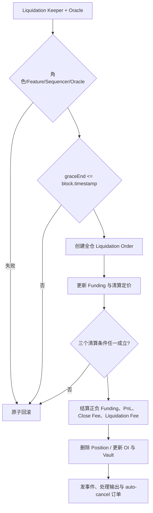

# v0.3.2 Liquidation（清算）完整功能、影响数据与边界

> 版本基线只认 [`Docs/contract-releases/CURRENT.json`](../../../../Docs/contract-releases/CURRENT.json)。链上没有持久化的“清算价格”字段；最终事实是执行区块、同一 Oracle 报告下的 `isPositionLiquidatable` 判定和清算交易结果。

## 1. 范围与核心结论

本文覆盖 v0.3.2 清算保护生成、风险发现、Reader/Keeper 预检、链上最终判定、Keeper 执行、内部订单、费用/资金瀑布、insolvent 早退、关联订单、事件和前端终态的完整生命周期。Liquidation 是由授权 Keeper 对危险仓位执行的强制全平，不是用户普通 MarketDecrease，也不是 ADL。

v0.3.2 清算用例必须把三个阶段分开：

1. **风险估算**：前端或 Keeper 可以给出近似清算价/候选仓位，只用于提示和筛选。
2. **Reader/Keeper 预检**：基于已持久化状态缩小候选集；当前参数与 Funding 时点均存在已知差异，不能称为执行等价判定。
3. **链上最终判定与执行**：订单执行先更新 Funding，再按清算专用成交价、capped full-close PnL、Close Fee、正负 Funding 和抵押物价格计算 remaining collateral；判定通过后全平，再计入 Liquidation Fee，处理实际 PnL、Funding、费用、残值、未支付差额和关联订单。

关键差异：清算判定**不计 Liquidation Fee**，执行结算**计 Liquidation Fee**；清算不允许负 dynamicSpread，但正点差仍生效。

## 2. 定义与职责边界

| 路径 | 发起者 | 目的 | 订单标识 | 负 dynamicSpread |
|---|---|---|---|---|
| 用户普通平仓 | 用户/Relay + Order Keeper | 主动减少仓位 | Market/Limit/Stop Decrease | 允许 |
| Liquidation | Liquidation Keeper | 强制全平危险仓位 | `OrderType.Liquidation` | 不允许，final 下限 0 |
| ADL | ADL Keeper | 降低全局偿付压力 | MarketDecrease + `SecondaryOrderType.Adl` | 不允许，final 下限 0 |

Keeper 负责候选发现、Oracle 报告和交易广播；是否真的可清算、最终价格和账本由执行交易中的合约判定决定。前端 estimated liquidation price 与 Reader 结果都只能用于提示/预检，不能代替链上最终判定。

## 3. 前置、内部订单与状态

### 3.1 Keeper 与 Oracle 前置

清算入口要求：

- 调用者具有 Liquidation Keeper 权限。
- 清算功能未被 feature key 关闭。
- Oracle 报告有效，Sequencer 为 up，价格与时间规则通过。
- 目标 Position 存在且 `marketIndex/isLong/account` 匹配。
- 保护期已经结束。

任何一步失败都应原子回滚，不得留下内部订单、仓位/OI/余额变化或“已清算”前端终态。

### 3.2 Grace 保护期

Grace 只在**新 Position 首次建立**时写入：

```text
graceStart = 首次成功 Increase 的 block.timestamp
tier = referralStorage.referrerTiers(account)
duration = LIQUIDATION_GRACE_PERIOD_BASE(marketIndex)
         × LIQUIDATION_GRACE_PERIOD_TIER_MULTIPLIER(tier)
         / 1e18
graceEnd = graceStart + duration
```

已有 Position 的加仓、减仓、保证金调整、页面刷新和 Oracle 更新不重置 `graceStart/graceEnd`；配置或 tier 之后改变也不应回写存量 Position。全平删除仓位后再次开仓属于新 Position，应按新执行时点和当时配置重新生成 Grace。

合约拒绝条件为：

```text
position.graceEnd > block.timestamp
```

因此：

| 时间点 | 结果 |
|---|---|
| `graceEnd - 1` | 仍受保护，拒绝创建清算单 |
| `graceEnd` | 保护结束，允许进入后续可清算判定 |
| `graceEnd + 1` | 允许进入后续判定 |

“允许进入判定”不等于“一定清算成功”；仓位仍必须满足风险条件。

### 3.3 内部 Liquidation Order

清算入口临时创建一个全仓 USD 模式 Decrease：

| 字段 | 值/语义 |
|---|---|
| `orderType` | `Liquidation` |
| `sizeDelta` | 当前 `position.sizeInUsd` |
| `isSizeDeltaUsd` | `true` |
| `triggerPrice` | `0` |
| `acceptablePrice` | long 为 0，short 为 `uint256.max` |
| `initialCollateralDeltaAmount` | 0 |
| `executionFee` | 0 |
| `uiFeeReceiver` | `address(0)` |
| `autoCancel` / `isFrozen` | false |
| `updatedAtTime` | 当前区块时间 |

它会发出订单创建与执行相关事件，但本质仍是清算执行链的内部载体，不应在前端显示成用户主动创建的普通订单。

### 3.4 完整状态生命周期

```text
首次开仓并写 Grace
→ 保护中（风险可变化，但清算入口被时间闸拦截）
→ Grace 到期（没有独立链上“到期交易”）
→ Keeper 候选发现 / Reader 持久化状态预检
→ 清算交易再次校验并原子执行
→ Position 删除、OI/资金/订单更新
→ 索引器与前端归类为 Liquidated
```

合约不保存 `safe / near / liquidatable / liquidating / liquidated` 状态枚举。保护是否到期由时间派生；Reader 可给出基于持久化状态的预检 bool，最终可清算由执行时 bool 决定；已清算由 Position 消失加 `orderType=Liquidation` 的事件链证明。

## 4. 公式与执行流程

### 4.1 清算成交价

合约构造全仓 Liquidation Decrease 后调用与 Decrease 相同的定价链，但：

```text
allowNegativeSpread = false
effectiveMinDynamicSpread = max(configuredMin, 0)
```

因此 raw spread 为负时 final 至少为 0；raw 为正时仍可造成不利成交价。long 清算按 sell 路径使用 `oracle.min × (1-d)` 向下取整；short 清算按 buy 路径使用 `oracle.max × (1+d)` 向上取整。

清算计算使用 execution price 得到全仓 `positionPnlUsd`，而不是只拿页面 Mark Price 或单一 Oracle midpoint 比较。必须区分：

```text
uncappedPositionPnlUsd = 裸 full-close PnL
positionPnlUsd = 风险判定实际使用值
```

裸正 PnL 会先按 `MAX_PNL_FACTOR_FOR_TRADERS` 对市场 pool PnL 的 cap 比例缩放；负 PnL 不走该正收益 cap。remaining collateral 使用 **capped `positionPnlUsd`**，事件/结果中还应留存 uncapped 值，不能直接把 `sizeTokens×executionPrice−sizeUsd` 当作最终正 PnL。

### 4.2 remaining collateral

判定阶段：

```text
collateralUsd = collateralAmount × collateralTokenPrice.min

collateralCostUsd = (
  closePositionFeeAmount
  - applicableDiscountAmount
  + negativeFundingFeeAmount
) × collateralTokenPrice.min

positiveFundingFeeUsd = positiveFundingFeeAmount × collateralTokenPrice.min

remainingCollateralUsd =
  collateralUsd
  + capped positionPnlUsd(at liquidation execution price)
  + positiveFundingFeeUsd
  - collateralCostUsd
```

判定调用设置 `uiFeeReceiver=0`、`isLiquidation=false`，所以不计 UI Fee 和 Liquidation Fee。费用具体分解以 `PositionFees` 返回值为准，测试不能用页面汇总数倒推。

### 4.3 三个可清算条件

```text
minCollateralUsdForLeverage =
  floor(position.sizeInUsd
        × minCollateralFactorForLiquidation / 1e30)
```

链上 Liquidation 以 `shouldValidateMinCollateralUsd=true` 调用，并按以下顺序命中即返回：

1. 启用最小抵押校验且 `remainingCollateralUsd < MIN_COLLATERAL_USD`。
2. `remainingCollateralUsd <= 0`。
3. `remainingCollateralUsd < minCollateralUsdForLeverage`。

等号规则不同：条件 1 和 3 使用严格 `<`，等号本身不由该条件触发；条件 2 使用 `<=`，等于 0 可清算。reason 的可观察顺序不能当成三个完全独立分支：

- `MIN_COLLATERAL_USD > 0` 时，remaining=0 或负值会先命中条件 1，reason 是 `min collateral`。
- `MIN_COLLATERAL_USD = 0` 时，负值仍先命中条件 1；remaining=0 才能独立命中条件 2。
- 设计条件 3 时，remaining 必须同时不低于全局 MIN 且大于 0。

因此测试既要断言最终 bool，也要按配置断言首个命中的 reason。

### 4.4 Liquidation Fee

实际执行阶段才计算：

```text
liquidationFeeUsd = floor(position.sizeInUsd
                          × liquidationFeeFactor / 1e30)
liquidationFeeAmount = ceil(liquidationFeeUsd / collateralTokenPrice.min)

feeReceiverAmount =
  floor(liquidationFeeAmount
        × LIQUIDATION_FEE_RECEIVER_FACTOR / 1e30)

feeAmountForPool = positionFeeAmountForPool
                 + liquidationFeeAmount
                 - feeReceiverAmount
```

偿付足够时，pool 部分从 PositionVault 转入 Market Vault，receiver 部分增加 `LIQUIDATION_FEE_TYPE` claimable；余数归入 pool 部分。其余成本与 Close Fee、Funding、PnL、抵押物共同进入清算结算。清算判定不因 Liquidation Fee 而提前触线，但执行后的用户残值会受它影响。insolvent 早退时费用整包可能不进入 claimable；此时不能断言“计算出 Liquidation Fee 就一定完成分账”。

### 4.5 执行顺序



## 5. 以 Liquidation 为核心影响的数据

### 5.1 直接影响

| 数据 | 清算成功后的变化 |
|---|---|
| Position | full close，size/collateral 清零并从 Store 删除 |
| long/short OI USD 与 tokens | 按全仓规模减少 |
| dynamicSpread / executionPrice | 按清算专用负值下限和价格侧计算并写 PositionDecrease 事件 |
| realized/uncapped PnL | 按全仓成交价结算 |
| Funding | 偿付充分时应付/应收结清；insolvent 时 positive 计入、negative 只按 actual paid 路由并记录差额；仓位删除后无快照残留 |
| Close/Liquidation Fee | 偿付充分时计费、分账并写费用事件；insolvent 早退时按实际事件与支付额处理；内部 Liquidation 的 `uiFeeReceiver=0`，UI Fee 必为 0 |
| PositionVault / Market Vault / claimable / receiver | 按 PnL、Funding、费用和实际可支付额变化 |
| output/residual collateral | 可支付给用户的剩余金额；资不抵债时可能为 0 |
| 内部 Order 与事件 | OrderCreated、执行/移除、PositionFees、PositionDecrease 等形成清算证据链 |

### 5.2 间接影响

- 全平后自动取消该 positionKey 下登记为 auto-cancel 的 TP/SL 订单，并退回相应执行费。
- 市场 OI、累计开仓成本和池风险改变，进而影响后续 dynamicSpread、Funding 和 ADL 比例。
- 前端仓位行消失，风险状态转为 `Liquidated`，History 不得标成用户 Market Close 或 ADL。
- 清算竞争中，一笔成功后后续请求应因 Position 不存在或不再满足条件失败，不得重复扣费。

### 5.3 相关但不直接影响

- `graceStart/graceEnd` 是清算前置，不由本次 dynamicSpread 或 Liquidation Fee 修改。
- 页面 liquidation price、Keeper 候选价是派生提示，不是合约存储状态。
- Trigger Price/acceptable price 不用于给清算设置用户滑点；内部值为无门槛极值。
- v0.3.2 没有 insurance/insuranceTreasury 自动补足，也没有统一坏账/债务 ledger。Funding、负 PnL、Fee 三个不足 step 的实际资金处理不同；经济承担只能根据该 step 的 expected/actual、Vault/claimable/receiver/用户余额差推断，不能一概写成“缺口由 LP 承担”或“进入保险金库”。
- 清算内部订单 `executionFee=0`，Liquidation Keeper 链上不从该订单获得 execution fee，也不分 Liquidation Fee；接收方份额走协议 claimable 路径。

### 5.4 资不抵债早退的证据差异

清算 full close 允许在成本无法足额支付时走 `InsolventClose` 早退。需要按早退阶段区分 Funding、负 PnL 和 Fee 的实际支付：

- `PositionFeesInfo` 承载早退前计算出的**理论 fee struct**，不是实际已收凭证；源码明确提示 insolvent 时其中 funding/fee-for-pool 可能不准确。
- `PositionFeesCollected` 在 insolvent 早退时使用 empty fees：negative Funding、普通费和 Liquidation Fee 可能清零，只保留 positive Funding 与 latest indices 等必要信息。
- 费用未付全时，已经扣到 PositionVault 的部分可能不增加对应 claimable 键。
- `InsufficientFundingFeePayment` 要保存 expected 与 actual paid。
- 因此 `PositionVault 余额差 = claimable 增量` 在早退路径不一定成立，必须结合 `InsufficientFundingFeePayment`、`InsolventClose(step)`、claimable、两个 Vault、receiver 与用户余额做完整资金差分。

## 6. 合约、Keeper 与前端一致性

### 6.1 合约事实源

- 入口、权限、Oracle 和执行链：[`LiquidationHandler.sol`](../../../../Github/fx100-contracts@release-v0.3.2/src/exchange/LiquidationHandler.sol)。
- Grace 与内部订单：[`LiquidationUtils.sol`](../../../../Github/fx100-contracts@release-v0.3.2/src/liquidation/LiquidationUtils.sol)。
- 清算成交价、remaining collateral 与三条件：[`PositionUtils.sol`](../../../../Github/fx100-contracts@release-v0.3.2/src/position/PositionUtils.sol) `isPositionLiquidatable`。
- 实际费用和账本：[`PositionPricingUtils.sol`](../../../../Github/fx100-contracts@release-v0.3.2/src/pricing/PositionPricingUtils.sol)、[`DecreasePositionCollateralUtils.sol`](../../../../Github/fx100-contracts@release-v0.3.2/src/position/DecreasePositionCollateralUtils.sol)。
- 全平、OI、事件：[`DecreasePositionUtils.sol`](../../../../Github/fx100-contracts@release-v0.3.2/src/position/DecreasePositionUtils.sol)。

本文以 v0.3.2 源码和运行时配置为测试主口径；历史公式材料如与本文或源码存在差异，以源码与本文件列出的分支/取整规则为准。

### 6.2 Keeper 是否有“清算价格公式”

Keeper 可以用当前 shortfall 与 `sizeInTokens` 做线性近似，建立候选清算价格索引；该近似不会在每个候选价重新完整计算 dynamicSpread、Fee、Funding 和舍入，所以不是最终清算公式。

当前 Keeper 在广播前使用 Reader 做预检，但它不是执行等价公式：

1. Keeper 的三条 Reader 调用传 `shouldValidateMinCollateralUsd=false, forLiquidation=true`，而链上 Liquidation 实际传 `true,true`。只因全局 `MIN_COLLATERAL_USD` 触线的仓位可能被 Keeper false-negative/ack-drop。
2. `Reader.isPositionLiquidatable` 直接读取已持久化 Funding 指数，没有虚拟加入 `getNextFundingAmountPerSize`；实际订单执行先更新 Funding 再判定。同一 Oracle 下也可能因此发生预检与执行差异。

所以测试要分别记录“候选价/近似状态”“Reader 持久化状态预检”和“链上最终结果”，并构造上述两类差异数据集；最终以执行交易的链上判定为准。

### 6.3 前端清算价

前端目标口径：estimated liquidation price 是求解或近似一个未来价格，使 remaining collateral 触及阈值；必须明确标注“预计”，并纳入当前 position、collateral price、capped PnL、Close Fee、正负 Funding、清算专用 dynamicSpread 和 min collateral factor。

但当前 SDK/页面仍存在静态 GAP，不能写成已满足上述口径：

- SDK 清算价硬编码 `balanceWasImproved=false` 估 Close Fee，并使用遗留 price-impact/max-impact 模型，而非 v0.3.2 Liquidation dynamicSpread。
- SDK 调用虽然上游算出 positive Funding，却未把它传入清算价求解；同时混入本版本实际结算尚未接入的 pending Borrowing。
- 页面 `Liquidatable` 由 `netValue<=0` 或 mark price 跨越本地 estimated price 推导，不是 Reader bool；调杠杆 fallback 仍是 `entry×(1±1/leverage)`。

因此当前 UI 只能标为本地估算/GAP，不能声称展示“Reader 判定可清算”。由于输入会随 Oracle、OI、时间和配置变化，前端价格也不能承诺为固定触发点。目标页面状态至少区分：

- 安全；
- 接近风险；
- 已触线但仍在 Grace；
- Grace 已结束且 Reader 判定可清算；
- 清算中/交易待确认；
- 已清算；
- 用户普通平仓；
- ADL。

### 6.4 事件、Reader 与索引器

v0.3.2 没有单独名为 `Liquidated` 的核心事件。成功身份应由同一 `orderKey/positionKey` 的事件链确定：

1. `OrderCreated`：内部 `orderType=Liquidation` 和全仓字段。
2. Funding per-size / `Funding`：本次执行前的市场 Funding 更新。
3. `PositionFeesCollected` 始终发出；insolvent 早退还会额外发理论 `PositionFeesInfo` 与 `InsolventClose`，并与实际不足/余额事件交叉核对。
4. `PositionDecrease`：`orderType=Liquidation`、full size、executionPrice、dynamicSpread、PnL 和 collateral delta。
5. `OrderExecuted`：只含 key/account/secondaryOrderType，不含主 `orderType`；Liquidation 身份必须用同一 orderKey 关联 `OrderCreated.orderType` 与 `PositionDecrease.orderType`。随后核对 full close 的 auto-cancel 订单事件。
6. Position Reader/Store 已空、OI 与 Vault/claimable/用户余额完成差分。

失败交易会整体回滚，内部 `OrderCreated` 日志也不会保留。前端不能在只看到 Keeper 广播或 pending tx 时提前写永久“已清算”；重组/失败后应恢复派生状态。

## 7. 边界值设计

| 组 | 边界/等价类 | 期望 |
|---|---|---|
| Grace | `T=graceEnd−1/graceEnd/graceEnd+1` | 仅 T−1 因保护期拒绝；等号已结束 |
| Grace 生成 | base=0/普通值、tier multiplier=0/1e18/>1e18 | 新仓 duration 公式正确；0 代表无时间保护，不是默认 15 分钟 |
| Grace 生命周期 | 首仓、加仓、减仓、调保证金、全平重开、配置/tier 后改 | 仅首仓和重开生成；存量动作/后改不重置 |
| 权限 | 无角色/正确 Keeper | Unauthorized；正确角色进入后续验证 |
| Feature | enabled/disabled | disabled 原子拒绝，不留内部订单 |
| Sequencer | up/down | down 拒绝且无状态变化 |
| Oracle | stale/future/missing/min=max/min<max | 非法拒绝；合法双价按正确价格侧 |
| MIN_COLLATERAL | remaining=min−1/min/min+1；MIN=0/>0 | 低于触发、等号不由条件 1 触发；按顺序核对 reason，MIN>0 时 0/负值先命中条件 1 |
| 零净值 | remaining=−1/0/+1 × MIN=0/>0 | bool 对 −1/0 为 true；只有 MIN=0 且 remaining=0 时可独立观察条件 2 reason |
| 杠杆阈值 | remaining=leverageMin−1/= /+1 | 低于触发；等号不触发 |
| long/short | 镜像危险仓 | long 用 min/sell，short 用 max/buy；PnL 与结果镜像可解释 |
| dynamicSpread | effectiveMin=max(configuredMin,0)；effectiveMax=max(configuredMax,effectiveMin)；raw 在两边界的 −1/=/+1 | final=clamp(raw,effectiveMin,effectiveMax)；只有 effectiveMin=0 时负 raw 才落 0，正 raw 仍可能受 min/max clamp |
| Funding | negative、0、positive；solvent/insolvent | 应付降低 remaining、应收提高 remaining；solvent 执行结清，insolvent negative 只按 actual paid 并记录 expected−actual |
| Fee | improved/not improved、factor=0/>0 | Close Fee 档位正确；Liquidation Fee 只在执行计入 |
| collateral 脱锚 | min<max 与不同 decimals | remaining、应付/应收和 fee amount 使用规定价格侧 |
| 资不抵债 | 刚好够成本、差 1 token-unit、严重不足；分别命中 funding/pnl/fees 早退 | 清算全平仍可完成适用路径；Info 只作理论结构，实际用 Insufficient/Collected/InsolventClose 与余额差取证，不虚构坏账 ledger |
| TP/SL | 0、1、最大允许 auto-cancel 订单 | 清算后全部按列表取消且执行费处理正确 |
| 并发 | 两个 Keeper 同时清同仓 | 最多一笔成功，不能双重结算 |
| 原子性 | 创建内部单后在链上最终判定失败 | 整笔交易回滚，Order/Position/OI/Vault 不变 |
| 事件身份 | 偿付型、funding/pnl/fees 早退 | 都由 Liquidation orderType + PositionDecrease 识别；费用事件类型按路径不同 |

## 8. 测试用例与断言

| 用例 | 覆盖 |
|---|---|
| `XT-LIQ-001` | 未达、等于、越过清算条件；long/short、内部订单与前端身份 |
| `XT-LIQ-003` | `balanceWasImproved` 两档、负 spread floor-at-0 和账本 |
| `FT-LIQ-005` | Grace、待清算、已清算页面状态与 History |
| `XT-PROT-LIQ-010` | 保护期到期后链上可清算状态 |
| `XT-PROT-RACE-011` | 用户操作、保护到期和 Keeper 清算竞争 |
| `SCN-B32-01` 数据集⑦ | 普通 Decrease、Liquidation、ADL 的同 raw 负点差隔离 |

每个成功数据集至少保存：Position 与 OI 前态、Grace、Oracle、配置、Keeper 参数、Reader 持久化状态预检三项数值、链上最终判定、内部 orderKey、执行价/final spread、capped/uncapped PnL、Funding、费用、Vault/claimable/receiver/用户余额、auto-cancel 订单和页面终态。失败数据集保存 revert 原因及全状态不变证据。

## 9. 已知缺口与完成条件

- 不允许用前端、Keeper 或 Reader 单一“清算价/预检”代替执行时三条件；当前 Reader/Keeper 的 MIN_COLLATERAL 参数和 next Funding 均与链上最终路径有差异。
- 当前前端清算价未完整纳入 v0.3.2 dynamicSpread、positive Funding 和实际 Fee 口径，页面 Liquidatable 也不是 Reader bool；运行前按 GAP 管理。
- Grace 生成/不重置/重开、正负 Funding、Liquidation Fee 判定/执行差异、资不抵债早退、事件身份和并发幂等都必须有独立数据集。
- 清算 negative spread floor-at-0 应以真实 `OrderType.Liquidation` 的 `PositionDecrease` 事件为证，通用执行价 Reader 不足以证明。
- 完成标准是“判定、执行、资金、关联订单、页面”五类终态一致。

相关文档：[`dynamicSpread-(v0.3.2).md`](dynamicSpread-(v0.3.2).md)、[`Funding-(v0.3.2).md`](Funding-(v0.3.2).md)、[`ADL-(v0.3.2).md`](ADL-(v0.3.2).md)、[`03-Fee-Funding-清算-ADL-Oracle.md`](03-Fee-Funding-清算-ADL-Oracle.md)。
